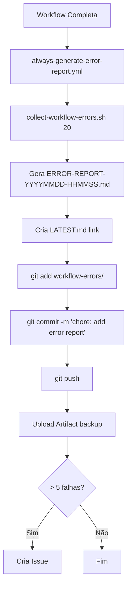

# ✅ Setup Final: Relatórios Automáticos em workflow-errors/

**Configuração:** Opção 2 - Sempre gerar + commit automático

---

## 🎯 O Que Foi Configurado

### **Workflow Ativo: `always-generate-error-report.yml`**

**Executa:**
- ✅ Após QUALQUER workflow completar
- ✅ Diariamente às 9h UTC (schedule)
- ✅ Manualmente (workflow_dispatch)

**Ações automáticas:**
1. Executa `bash scripts/github/collect-workflow-errors.sh 20`
2. Gera `workflow-errors/ERROR-REPORT-YYYYMMDD-HHMMSS.md`
3. Cria link `workflow-errors/LATEST.md`
4. **Faz commit automático no repositório** ← NOVO!
5. Upload como artifact (backup)
6. Cria issue se > 5 falhas

---

## 📁 Estrutura da Pasta workflow-errors/

```
workflow-errors/
├── README.md                          # ← Documentação da pasta
├── .gitignore                         # ← Permite commits
├── .gitkeep                           # ← Mantém diretório vazio
├── EXAMPLE-REPORT.md                  # ← Exemplo de relatório
│
├── ERROR-REPORT-20250108-143052.md    # ← Gerado automaticamente
├── ERROR-REPORT-20250108-150234.md    # ← Gerado automaticamente
├── ERROR-REPORT-20250109-091520.md    # ← Gerado automaticamente
│
├── LATEST.md                          # ← Link → último relatório
└── CONSOLIDATED-LATEST.md             # ← Link → consolidado
```

---

## 📋 Padrão de Nomenclatura (Seguido Rigorosamente)

### **Relatórios Individuais**

**Formato:** `ERROR-REPORT-YYYYMMDD-HHMMSS.md`

**Exemplo:**
```
ERROR-REPORT-20250108-143052.md
              ↑        ↑
              Data     Hora
```

**Decodificação:**
- `20250108` = 08 de Janeiro de 2025
- `143052` = 14:30:52 (2:30:52 PM)

---

### **Relatórios Consolidados**

**Formato:** `CONSOLIDATED-REPORT-YYYYMMDD-HHMMSS.md`

**Exemplo:**
```
CONSOLIDATED-REPORT-20250108-180000.md
```

---

## 🔄 Fluxo Automático Completo



---

## ✅ Commits Automáticos

O workflow faz commits com esta mensagem padrão:

```
chore: add error report - 2025-01-08 14:30:52
```

**Ver histórico:**
```bash
git log --oneline workflow-errors/

# Output:
abc1234 chore: add error report - 2025-01-08 15:45:23
def5678 chore: add error report - 2025-01-08 14:30:52
ghi9012 chore: add error report - 2025-01-08 09:00:00
```

---

## 📊 Exemplo de Uso

### **Ver Último Relatório**

```bash
# Via link simbólico
cat workflow-errors/LATEST.md

# Ou abrir no editor
code workflow-errors/LATEST.md
```

---

### **Listar Todos os Relatórios**

```bash
# Listar por data
ls -lt workflow-errors/ERROR-REPORT-*.md

# Output:
# ERROR-REPORT-20250109-091520.md
# ERROR-REPORT-20250108-150234.md
# ERROR-REPORT-20250108-143052.md
```

---

### **Buscar por Período**

```bash
# Relatórios de janeiro/2025
ls workflow-errors/ERROR-REPORT-202501*.md

# Relatórios de um dia específico (08/01/2025)
ls workflow-errors/ERROR-REPORT-20250108-*.md

# Relatórios das últimas 24h
find workflow-errors -name "ERROR-REPORT-*.md" -mtime -1
```

---

### **Ver Histórico Git**

```bash
# Ver commits de relatórios
git log --oneline --follow workflow-errors/ERROR-REPORT-*.md

# Ver mudanças em um relatório específico
git log -p workflow-errors/ERROR-REPORT-20250108-143052.md
```

---

## 🎯 Workflows que Trigam o Relatório

O relatório é gerado após estes workflows completarem:

1. ✅ Code Quality
2. ✅ Automated Tests
3. ✅ Bundle Size Check
4. ✅ Docker Build & Security
5. ✅ Security Audit
6. ✅ Documentation Validation
7. ✅ Environment Validation
8. ✅ Infrastructure Health Check

**Também executa:**
- 📅 Diariamente às 9h UTC (schedule)
- 🔧 Manualmente via GitHub Actions UI

---

## 🔐 Permissões Configuradas

```yaml
permissions:
  contents: write        # ← Permite commit e push
  issues: write          # ← Permite criar issues
  pull-requests: write   # ← Permite comentar em PRs
```

---

## 📦 Backup Adicional

Além do commit no repositório, também:

✅ **Upload como Artifact** (90 dias retenção)

**Download:**
```
GitHub → Actions → Always Generate Error Report → Artifacts
```

---

## 🗑️ Limpeza (Opcional)

Para evitar acúmulo excessivo de relatórios:

### **Manual**

```bash
# Remover relatórios com > 30 dias
find workflow-errors -name "ERROR-REPORT-*.md" -mtime +30 -delete

# Manter apenas últimos 20 relatórios
ls -t workflow-errors/ERROR-REPORT-*.md | tail -n +21 | xargs rm -f

# Commit e push
git add workflow-errors/
git commit -m "chore: cleanup old error reports"
git push
```

### **Automática (TODO)**

Criar workflow mensal para limpeza:

```yaml
# .github/workflows/cleanup-error-reports.yml
schedule:
  - cron: '0 0 1 * *'  # 1º dia de cada mês
```

---

## 🧪 Testar Agora

### **Execução Manual**

```bash
# Trigger manualmente via GitHub CLI
gh workflow run always-generate-error-report.yml

# Ou via GitHub UI:
# Actions → Always Generate Error Report → Run workflow
```

### **Aguardar Execução Automática**

1. Fazer commit de qualquer coisa
2. Aguardar workflows completarem
3. `always-generate-error-report.yml` executa automaticamente
4. Novo relatório aparece em `workflow-errors/`
5. Commit automático é feito

---

## 📚 Documentação

| Arquivo | Descrição |
|---------|-----------|
| `workflow-errors/README.md` | Documentação completa da pasta |
| `.github/workflows/ERROR-REPORT-CONFIG.md` | Configuração dos workflows |
| `.github/workflows/SETUP-GUIDE.md` | Guia de setup |
| `scripts/github/README.md` | Documentação dos scripts |
| `scripts/github/QUICK-GUIDE.md` | Guia rápido |

---

## ✅ Checklist de Verificação

- [x] Workflow `always-generate-error-report.yml` criado
- [x] Permissões `contents: write` configuradas
- [x] Commit automático implementado
- [x] `.gitignore` atualizado para permitir commits
- [x] Padrão de nomenclatura definido
- [x] README da pasta criado
- [x] Link simbólico `LATEST.md` funcional
- [x] Backup em artifacts configurado
- [x] Issues automáticas (> 5 falhas)
- [x] Schedule diário (9h UTC)

---

## 🎉 Status

**✅ CONFIGURAÇÃO COMPLETA!**

**O que você tem agora:**

1. ✅ Relatórios gerados automaticamente
2. ✅ Salvos em `workflow-errors/` com padrão definido
3. ✅ Commits automáticos no repositório
4. ✅ Backup em artifacts (90 dias)
5. ✅ Issues automáticas se > 5 falhas
6. ✅ Execução diária às 9h UTC
7. ✅ Histórico completo versionado no Git

**Não precisa fazer NADA!** Tudo funciona automaticamente. 🚀

---

**Criado em:** 2025-01-08
**Última atualização:** 2025-01-08
**Status:** ✅ ATIVO E FUNCIONAL
