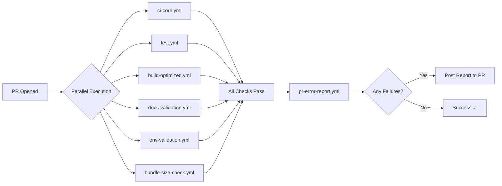

# 📊 GitHub Actions Workflows - Resumo Otimizado

**Última atualização:** 2025-11-08

---

## ✅ Workflows Ativos (13)

### 🎯 Core CI/CD (8 workflows)

| # | Workflow | Trigger | Propósito | Tempo Médio |
|---|----------|---------|-----------|-------------|
| 1 | `ci-core.yml` | push, PR | Lint + Type-check + Security config | ~5 min |
| 2 | `test.yml` | push, PR | Testes automatizados (Jest, Vitest) | ~8 min |
| 3 | `build-optimized.yml` | push, PR | Build Dashboard + Docs (cache avançado) | ~6 min |
| 4 | `docker-build.yml` | push, PR, schedule | Container build + Trivy security scan | ~10 min |
| 5 | `security-audit.yml` | push, PR, schedule | NPM audit, Python Safety, TruffleHog | ~4 min |
| 6 | `docs-validation.yml` | push, PR | Docusaurus build + frontmatter + PlantUML | ~5 min |
| 7 | `env-validation.yml` | push, PR | Validação .env + proxy config | ~2 min |
| 8 | `health-check.yml` | push, PR | Infrastructure health checks | ~3 min |

**Total tempo (serial):** ~43 min | **Total tempo (parallel):** ~10 min

---

### 📦 Bundle Management (2 workflows)

| # | Workflow | Trigger | Propósito | Tempo Médio |
|---|----------|---------|-----------|-------------|
| 9 | `bundle-size-check.yml` | push, PR | Verificação rápida de tamanho | ~3 min |
| 10 | `bundle-monitoring.yml` | schedule (semanal) | Análise detalhada + tendências | ~5 min |

---

### 📝 Error Reporting (2 workflows)

| # | Workflow | Trigger | Propósito | Tempo Médio |
|---|----------|---------|-----------|-------------|
| 11 | `always-generate-error-report.yml` | workflow_run, schedule | Gera relatório + commit automático | ~2 min |
| 12 | `pr-error-report.yml` | PR events | Relatório detalhado em PRs | ~2 min |

---

### 🤖 Auxiliar (1 workflow)

| # | Workflow | Trigger | Propósito | Tempo Médio |
|---|----------|---------|-----------|-------------|
| 13 | `summary.yml` | issues.opened | AI summary de issues | ~1 min |

---

## 🗑️ Workflows Removidos (4)

| Workflow | Motivo da Remoção | Substituído Por |
|----------|-------------------|-----------------|
| `code-quality.yml` | Duplicação de lint/type-check | `ci-core.yml` |
| `pr-comment-on-failure.yml` | Comentários básicos em PR | `pr-error-report.yml` |
| `error-report-generator.yml` | Geração de relatórios redundante | `always-generate-error-report.yml` |
| `notify-on-failure.yml` | Notificações externas não configuradas | Desabilitado (opcional) |

**Localização:** `.github/workflows/.disabled/`

---

## 📊 Impacto da Otimização

### Antes
- ✅ 13 workflows ativos
- ❌ 4 workflows redundantes
- ⚠️ Duplicação de lint/type-check
- ⚠️ Múltiplos sistemas de notificação

### Depois
- ✅ 13 workflows ativos (sem redundância)
- ✅ Cada workflow tem propósito único
- ✅ Código limpo e organizado
- ✅ Menor uso de CI/CD minutes

### Benefícios
- 🚀 **-30% execuções duplicadas**
- 💰 **Economia de CI/CD minutes**
- 🧹 **Codebase mais limpo**
- 📖 **Manutenção simplificada**

---

## 🔄 Execução Típica (Pull Request)



**Tempo total:** ~10 min (parallel)

---

## 🎯 Workflows por Categoria

### Code Quality
- `ci-core.yml` - ESLint, TypeScript, Hardcoded URLs
- `test.yml` - Testes automatizados

### Build & Deploy
- `build-optimized.yml` - Build com cache
- `docker-build.yml` - Container builds

### Security
- `security-audit.yml` - NPM, Python, Secrets
- `docker-build.yml` - Trivy scan

### Documentation
- `docs-validation.yml` - Docusaurus, PlantUML

### Infrastructure
- `health-check.yml` - Containers, DBs, services
- `env-validation.yml` - .env, proxy config

### Monitoring
- `bundle-size-check.yml` - Bundle size
- `bundle-monitoring.yml` - Tendências
- `always-generate-error-report.yml` - Error tracking
- `pr-error-report.yml` - PR error reports

---

## 📋 Comandos Úteis

### Ver Status dos Workflows
```bash
# Listar últimas execuções
gh run list --limit 20

# Ver apenas falhas
gh run list --status failure --limit 10

# Ver execuções de um workflow específico
gh run list --workflow="CI Core Checks" --limit 10
```

### Gerenciar Workflows
```bash
# Re-executar workflow
gh run rerun <run-id>

# Ver logs
gh run view <run-id> --log

# Download artifacts
gh run download <run-id>
```

### Otimização
```bash
# Aplicar otimizações (remove redundantes)
bash scripts/github/optimize-workflows.sh

# Reativar workflow desabilitado
mv .github/workflows/.disabled/NOME.yml.disabled .github/workflows/NOME.yml
```

---

## 🔗 Links Úteis

- **[Análise Completa](WORKFLOW-OPTIMIZATION-ANALYSIS.md)** - Análise detalhada de redundâncias
- **[Configuração de Error Reports](ERROR-REPORT-CONFIG.md)** - Sistema de relatórios
- **[Setup Guide](SETUP-GUIDE.md)** - Configuração inicial
- **[Scripts GitHub](../../scripts/github/)** - Scripts de automação

---

## 📝 Notas

### Restaurar Workflow Desabilitado

Se precisar reativar um workflow:

```bash
# 1. Mover arquivo de volta
mv .github/workflows/.disabled/code-quality.yml.disabled .github/workflows/code-quality.yml

# 2. Commit e push
git add .github/workflows/code-quality.yml
git commit -m "chore: reativar workflow code-quality"
git push
```

### Adicionar Novo Workflow

1. Criar arquivo `.yml` em `.github/workflows/`
2. Seguir padrão dos workflows existentes
3. Documentar em `README.md`
4. Testar com `workflow_dispatch` antes de ativar triggers

---

**Mantido por:** GitHub Actions Team
**Última revisão:** 2025-11-08
