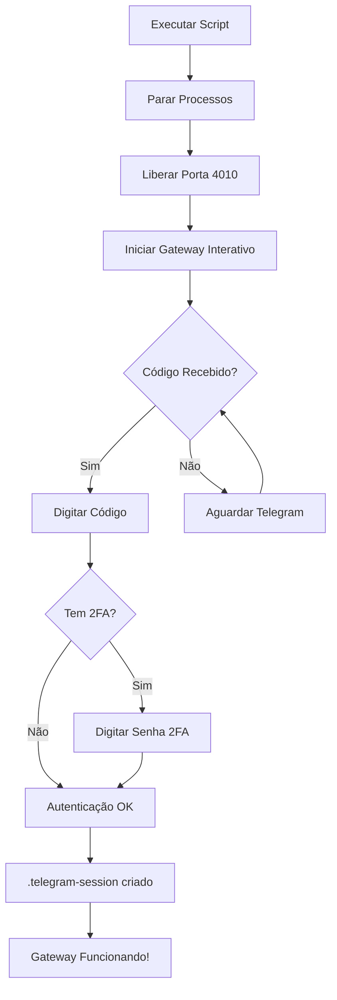

# 🔐 Como Autenticar Telegram MTProto (GramJS)

**Data:** 2025-11-02  
**Status:** Pronto para autenticação

---

## 🚀 **EXECUTAR AGORA**

```bash
bash /home/marce/Projetos/TradingSystem/scripts/setup/authenticate-telegram-mtproto.sh
```

---

## 📋 **O QUE VAI ACONTECER**

### 1. Preparação (Automática)
- ✅ Para processos antigos do Gateway
- ✅ Libera porta 4010
- ✅ Verifica variáveis de ambiente (.env)

### 2. Autenticação (INTERATIVA - VOCÊ PARTICIPA!)

**Terminal mostrará:**
```
[TelegramClient] Authenticating with phone: +5567991908000
Please enter the code you received: _____
```

**VOCÊ DEVE:**
1. 📱 Abrir app do Telegram (móvel ou desktop)
2. 📨 Encontrar mensagem com código de 5 dígitos
3. ⌨️  Digitar código no terminal
4. ✅ Pressionar ENTER

**Exemplo de mensagem do Telegram:**
```
Telegram code: 12345

You can also automatically copy the code by tap
```

### 3. Se Tiver 2FA (Opcional)

**Terminal mostrará:**
```
Please enter your 2FA password (if enabled): _____
```

**VOCÊ DEVE:**
1. ⌨️  Digitar sua senha de dois fatores
2. ✅ Pressionar ENTER

### 4. Sucesso! 🎉

**Terminal mostrará:**
```
[TelegramClient] Authentication successful
[TelegramClient] Session saved to file
[TelegramClient] Successfully connected and authenticated
Telegram Gateway API started
```

**Arquivo criado:**
```
/home/marce/Projetos/TradingSystem/backend/api/telegram-gateway/.telegram-session
```

✅ **Autenticação completa!**

---

## 🎯 **APÓS AUTENTICAÇÃO**

### Parar Gateway (Ctrl+C)

Pressione `Ctrl+C` no terminal para parar o Gateway.

### Iniciar em Background

Agora pode rodar em background (sem pedir código):

```bash
cd /home/marce/Projetos/TradingSystem/backend/api/telegram-gateway
TELEGRAM_GATEWAY_PORT=4010 npm run dev &
```

**OU via Docker Compose (se preferir):**
```bash
# Criar compose para o Gateway (futuro)
docker compose up -d telegram-gateway
```

---

## ✅ **VALIDAR QUE FUNCIONOU**

### 1. Testar Health
```bash
curl http://localhost:4010/health | jq
```

**Resultado esperado:**
```json
{
  "status": "healthy",
  "service": "telegram-gateway-api"
}
```

### 2. Testar Sincronização
```bash
API_KEY="bbf913dad93ae879f1fbbec4490303a2c0d49be1d717342a64173a192f99f1a1"

curl -X POST \
  -H "X-API-Key: $API_KEY" \
  -H "Content-Type: application/json" \
  -d '{"limit": 10}' \
  http://localhost:4005/sync-messages | jq
```

**Resultado esperado:**
```json
{
  "success": true,
  "message": "10 mensagem(ns) sincronizada(s) de 1 canal(is)",
  "data": {
    "totalMessagesSynced": 10,
    "channelsSynced": [
      {
        "channelId": "-1001649127710",
        "messagesSynced": 10,
        "latestMessageId": 123456
      }
    ]
  }
}
```

✅ **Mensagens REAIS do Telegram sendo sincronizadas!**

### 3. Testar no Dashboard

```bash
# Abrir no navegador Windows
http://localhost:3103/tp-capital

# Clicar em "Checar Mensagens"
# Deve mostrar sucesso e número de mensagens sincronizadas
```

---

## ⚠️ **TROUBLESHOOTING**

### Problema: "TELEGRAM_API_ID not configured"

**Solução:**
```bash
# Editar .env
nano /home/marce/Projetos/TradingSystem/.env

# Verificar se há duplicatas
grep "TELEGRAM_API_ID" .env

# Deve ter APENAS uma linha:
# TELEGRAM_API_ID=23522437
```

### Problema: "Porta 4010 em uso"

**Solução:**
```bash
sudo lsof -ti:4010 | xargs sudo kill -9
```

### Problema: "Phone number invalid"

**Solução:**
Verificar formato do número no `.env`:
```bash
TELEGRAM_PHONE_NUMBER=+5567991908000  # ✅ Correto (com + e código do país)
TELEGRAM_PHONE_NUMBER=67991908000     # ❌ Errado (sem +)
```

### Problema: "Session expired"

**Solução:**
```bash
# Deletar session antiga
rm /home/marce/Projetos/TradingSystem/backend/api/telegram-gateway/.telegram-session

# Rodar script novamente
bash scripts/setup/authenticate-telegram-mtproto.sh
```

### Problema: "Flood wait" (muitas tentativas)

**Solução:**
Aguardar o tempo indicado pelo Telegram (geralmente 5-30 minutos) antes de tentar novamente.

---

## 📁 **ARQUIVOS IMPORTANTES**

| Arquivo | Descrição | Commitar? |
|---------|-----------|-----------|
| `.env` | Credenciais (API_ID, API_HASH, PHONE) | ❌ NÃO |
| `.telegram-session` | Session autenticada | ❌ NÃO |
| `TelegramClientService.js` | Código MTProto | ✅ SIM |
| `authenticate-telegram-mtproto.sh` | Script de autenticação | ✅ SIM |

---

## 🎯 **RESUMO DO PROCESSO**



---

## 🎉 **RESULTADO FINAL**

Após executar o script com sucesso:

```
✅ Telegram Gateway autenticado
✅ Arquivo .telegram-session criado
✅ Próximas execuções automáticas (sem código)
✅ MTProto funcionando 100%
✅ Mensagens REAIS sendo sincronizadas
✅ PRODUÇÃO READY! 🚀
```

---

**Execute agora:**

```bash
bash /home/marce/Projetos/TradingSystem/scripts/setup/authenticate-telegram-mtproto.sh
```

**Tempo estimado:** 2-3 minutos

**Última Atualização:** 2025-11-02 03:30 UTC

