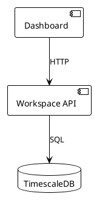
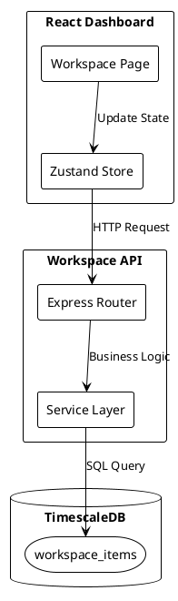
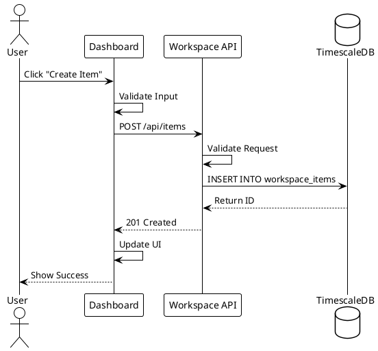

```plantuml
@startuml
Alice -> Bob: Hello
@enduml
\```
````

**File Reference:**
```markdown
import Diagram from '@site/static/diagrams/workspace-architecture.puml';

<Diagram />
```

# 📚 Documentation Contribution Guide

**TradingSystem Documentation Standards and Workflow**

> Part of Phase 1.6 - Documentation Consolidation (Improvement Plan v1.0)

## 📋 Table of Contents

- [Overview](#overview)
- [Documentation Structure](#documentation-structure)
- [Content Standards](#content-standards)
- [Frontmatter Requirements](#frontmatter-requirements)
- [File Naming Conventions](#file-naming-conventions)
- [Writing Style Guide](#writing-style-guide)
- [Code Examples](#code-examples)
- [PlantUML Diagrams](#plantuml-diagrams)
- [Link Validation](#link-validation)
- [Review Process](#review-process)
- [Common Patterns](#common-patterns)
- [Troubleshooting](#troubleshooting)

---

## Overview

TradingSystem uses **Docusaurus v3** for comprehensive documentation. All documentation lives under `docs/content/` and follows strict standards for quality, consistency, and maintainability.

### Key Principles

1. **Single Source of Truth** - Canonical content lives in `docs/content/`
2. **MDX Format** - Markdown with JSX components support
3. **Strict Frontmatter** - All files require complete YAML metadata
4. **PlantUML Diagrams** - Architecture/design docs must include diagrams
5. **Link Validation** - All links verified before merge
6. **Governance** - Quality standards enforced via governance framework

---

## Documentation Structure

```
docs/
├── content/                      # 📚 ALL DOCUMENTATION CONTENT
│   ├── apps/                     # Application documentation
│   │   ├── workspace/           # Workspace app (Port 3200)
│   │   ├── tp-capital/          # TP Capital app (Port 4005)
│   │   └── order-manager/       # Order Manager (planned)
│   ├── api/                      # API specifications
│   │   ├── overview.mdx
│   │   ├── workspace.mdx        # Redocusaurus integration
│   │   └── documentation-api.mdx
│   ├── frontend/                 # Frontend documentation
│   │   ├── architecture/        # Architecture docs
│   │   ├── design-system/       # UI components, tokens
│   │   ├── guidelines/          # Style guide, accessibility
│   │   ├── engineering/         # Code conventions, testing
│   │   └── features/            # Feature implementation guides
│   ├── database/                 # Database documentation
│   │   ├── overview.mdx
│   │   ├── schema.mdx
│   │   ├── migrations.mdx
│   │   └── retention-backup.mdx
│   ├── tools/                    # Development tools
│   │   ├── docker/
│   │   ├── security-config/
│   │   ├── monitoring/
│   │   └── development/
│   ├── sdd/                      # Software design documents
│   │   ├── schemas/             # Data schemas
│   │   ├── events/              # Event specifications
│   │   ├── flows/               # Process flows
│   │   └── api-specs/           # Detailed API specs
│   ├── prd/                      # Product requirements
│   │   ├── products/            # Per-product PRDs
│   │   └── features/            # Feature briefs
│   ├── reference/                # Templates & standards
│   │   ├── templates/           # Document templates
│   │   ├── adrs/                # Architecture Decision Records
│   │   └── standards/           # Coding standards
│   └── diagrams/                 # PlantUML diagrams
│       ├── architecture/
│       ├── database/
│       └── sequence/
│
├── governance/                   # Documentation governance
│   ├── controls/                 # Quality controls
│   │   ├── VALIDATION-GUIDE.md
│   │   └── REVIEW-CHECKLIST.md
│   └── policies/                 # Documentation policies
│
├── migration/                    # Migration artifacts
│   └── history/                  # Migration history
│
└── src/                          # Docusaurus source code
    ├── components/               # Custom React components
    ├── css/                      # Custom styling
    └── pages/                    # Custom pages
```

---

## Content Standards

### File Types by Domain

| Domain | Purpose | Location | Format |
|--------|---------|----------|--------|
| **Apps** | Application docs | `content/apps/` | `.mdx` |
| **API** | API specifications | `content/api/` | `.mdx` + OpenAPI |
| **Frontend** | UI components, design | `content/frontend/` | `.mdx` |
| **Database** | Schemas, migrations | `content/database/` | `.mdx` |
| **Tools** | Development tools | `content/tools/` | `.mdx` |
| **SDD** | Design documents | `content/sdd/` | `.mdx` |
| **PRD** | Product requirements | `content/prd/` | `.mdx` |
| **Reference** | Templates, ADRs | `content/reference/` | `.mdx` |
| **Diagrams** | PlantUML diagrams | `content/diagrams/` | `.puml` + `.mdx` |

### Document Types

1. **Guide** - How-to guides (e.g., "How to Deploy Workspace API")
2. **Reference** - API reference, configuration options
3. **Tutorial** - Step-by-step learning content
4. **Explanation** - Conceptual documentation (architecture, design decisions)
5. **Index** - Navigation pages (overview, table of contents)
6. **ADR** - Architecture Decision Records
7. **RFC** - Request for Comments
8. **PRD** - Product Requirements Document

---

## Frontmatter Requirements

**CRITICAL:** All documentation files MUST include complete YAML frontmatter.

### Required Fields

```yaml
---
title: Document Title                # Clear, descriptive title
sidebar_position: 1                  # Navigation order (1-100)
tags: [tag1, tag2, tag3]            # Relevant tags (3-5 recommended)
domain: apps                         # Domain category
type: guide                          # Document type
summary: Brief description of content # 1-2 sentence summary
status: active                       # Document status
last_review: "2025-11-11"           # ISO 8601 date (YYYY-MM-DD)
---
```

### Field Specifications

| Field | Type | Values | Description |
|-------|------|--------|-------------|
| `title` | string | Any | Document title (required) |
| `sidebar_position` | number | 1-100 | Navigation order (lower = higher) |
| `tags` | array | Any | Searchable tags (3-5 recommended) |
| `domain` | enum | `apps`, `api`, `frontend`, `database`, `tools`, `sdd`, `prd`, `reference` | Content domain |
| `type` | enum | `guide`, `reference`, `tutorial`, `explanation`, `index`, `adr`, `rfc`, `prd` | Document type |
| `summary` | string | Max 200 chars | Brief description |
| `status` | enum | `active`, `draft`, `deprecated`, `archived` | Document lifecycle status |
| `last_review` | date | ISO 8601 | Last review date (YYYY-MM-DD) |

### Optional Fields

```yaml
authors: [username1, username2]      # Contributors
related: [path/to/doc1, path/to/doc2] # Related documents
keywords: [keyword1, keyword2]       # SEO keywords (optional)
hide_table_of_contents: false        # Hide TOC (default: false)
```

### Examples

**Guide:**
```yaml
---
title: Deploy Workspace API to Production
sidebar_position: 3
tags: [deployment, workspace, docker, production]
domain: apps
type: guide
summary: Complete guide for deploying Workspace API to production using Docker Compose
status: active
last_review: "2025-11-11"
---
```

**ADR:**
```yaml
---
title: ADR-009 - TP Capital Database Selection (Neon vs TimescaleDB)
sidebar_position: 9
tags: [adr, database, architecture, tp-capital]
domain: reference
type: adr
summary: Decision to use Neon PostgreSQL for TP Capital instead of TimescaleDB
status: active
last_review: "2025-11-05"
---
```

**API Reference:**
```yaml
---
title: Workspace API Reference
sidebar_position: 1
tags: [api, workspace, reference, openapi]
domain: api
type: reference
summary: REST API documentation for Workspace service (Port 3200)
status: active
last_review: "2025-11-11"
---
```

---

## File Naming Conventions

### Rules

1. **Lowercase only** - No uppercase letters
2. **Hyphens for spaces** - `my-document.mdx` (not `my_document.mdx`)
3. **Descriptive names** - Clear intent without reading content
4. **Avoid abbreviations** - Use full words (`deployment-guide.mdx` not `deploy-guide.mdx`)
5. **Consistent prefixes** - ADRs: `001-title.md`, PRDs: `prd-feature-name.mdx`

### Examples

✅ **Good:**
- `deployment-guide.mdx`
- `api-reference.mdx`
- `001-database-selection.md`
- `workspace-architecture.mdx`
- `test-coverage-guide.mdx`

❌ **Bad:**
- `DeploymentGuide.mdx` (uppercase)
- `api_reference.mdx` (underscore)
- `deploy.mdx` (too vague)
- `ADR-1.md` (inconsistent numbering)
- `ws-arch.mdx` (abbreviations)

---

## Writing Style Guide

### Voice and Tone

- **Active voice** - "Deploy the service" (not "The service is deployed")
- **Present tense** - "The API returns..." (not "The API will return...")
- **Second person** - "You can configure..." (not "One can configure...")
- **Imperative for instructions** - "Run the command" (not "You should run...")

### Structure

1. **Start with context** - Why is this important?
2. **Prerequisites** - What do readers need first?
3. **Step-by-step** - Clear, numbered instructions
4. **Examples** - Show, don't just tell
5. **Troubleshooting** - Common issues and solutions
6. **Next steps** - What to do after

### Formatting

**Headings:**
```markdown
# Main Title (H1 - only one per document)
## Section (H2)
### Subsection (H3)
#### Detail (H4)
```

**Emphasis:**
- **Bold** for UI elements, buttons, field names
- *Italic* for emphasis
- `Code` for commands, variables, file names

**Lists:**
- Unordered lists for items without sequence
- Ordered lists for sequential steps
- Consistent punctuation (either all sentences or all fragments)

**Code Blocks:**
````markdown
```bash
# Include language identifier
npm run start
```

```typescript
// Add comments for clarity
const config = {
  port: 3200
};
```
````

### Admonitions

Docusaurus supports special callout boxes:

```markdown
:::note
Standard information note
:::

:::tip
Helpful tip or best practice
:::

:::info
Additional information
:::

:::caution
Warning about potential issues
:::

:::danger
Critical warning about dangerous operations
:::
```

---

## Code Examples

### Best Practices

1. **Complete examples** - Include imports, setup, teardown
2. **Syntax highlighting** - Always specify language
3. **Comments** - Explain non-obvious code
4. **Real-world** - Use actual project patterns
5. **Tested** - Verify examples work
6. **Minimal** - Only include relevant code

### Example Patterns

**Good Example:**
````markdown
```typescript
import { createWorkspaceItem } from '@/services/workspace';

// Create a new workspace item
const newItem = await createWorkspaceItem({
  title: 'My Task',
  status: 'todo',
  priority: 'high'
});

console.log('Created item:', newItem.id);
```
````

**With Explanation:**
````markdown
```typescript
// 1. Import the service function
import { createWorkspaceItem } from '@/services/workspace';

// 2. Prepare item data
const itemData = {
  title: 'My Task',        // Required: item title
  status: 'todo',          // Required: initial status
  priority: 'high'         // Optional: priority level
};

// 3. Create item (async operation)
try {
  const newItem = await createWorkspaceItem(itemData);
  console.log('✅ Created item:', newItem.id);
} catch (error) {
  console.error('❌ Failed to create item:', error);
}
```
````

### Multi-language Examples

````markdown
<Tabs groupId="language">
  <TabItem value="bash" label="Bash">
    ```bash
    npm run start
    ```
  </TabItem>

  <TabItem value="powershell" label="PowerShell">
    ```powershell
    npm run start
    ```
  </TabItem>
</Tabs>
````

---

## PlantUML Diagrams

**REQUIRED** for architecture/design documents (ADRs, RFCs, Technical Specs).

### Diagram Types

1. **Component Diagram** - System components and relationships
2. **Sequence Diagram** - Interactions over time
3. **State Diagram** - State transitions
4. **Class Diagram** - Data models and relationships
5. **Deployment Diagram** - Infrastructure and deployment

### File Organization

**Source Files** (`.puml`):
```
docs/content/diagrams/
├── architecture/
│   ├── workspace-architecture.puml
│   └── tp-capital-architecture.puml
├── database/
│   ├── workspace-schema.puml
│   └── tp-capital-schema.puml
└── sequence/
    ├── order-execution-flow.puml
    └── data-capture-flow.puml
```

**Rendered in Documents** (`.mdx`):
```markdown
## Architecture Diagram



### Example: Component Diagram



### Example: Sequence Diagram



### Rendering in Docusaurus

Docusaurus automatically renders PlantUML diagrams via plugin. Both inline and file references are supported:

**Inline:**
````markdown


---

## Link Validation

### Running Validation

```bash
# Navigate to docs directory
cd docs

# Run link validation
npm run docs:links

# Output format
✅ Internal links: 245 valid, 0 broken
✅ External links: 87 valid, 3 broken
⚠️  Anchors: 12 missing targets
```

### Link Types

**Internal Links (Relative):**
```markdown
<!-- Good: Relative path from current file -->
[Workspace API](../api/workspace.mdx)
[Design System](../frontend/design-system/overview.mdx)

<!-- Bad: Absolute path -->
[Workspace API](/docs/content/api/workspace.mdx)
```

**External Links (Absolute):**
```markdown
<!-- Always use HTTPS -->
[GitHub Repository](https://github.com/marcelofinamorvieira/TradingSystem)
[Docusaurus Docs](https://docusaurus.io/)
```

**Anchor Links:**
```markdown
<!-- Link to heading in same document -->
[See Prerequisites](#prerequisites)

<!-- Link to heading in other document -->
[API Authentication](../api/overview.mdx#authentication)
```

### Common Issues

**Broken Internal Links:**
- File moved/renamed → Update all references
- Incorrect relative path → Check `../` depth
- Missing file extension → Add `.mdx` or `.md`

**Broken External Links:**
- HTTP instead of HTTPS → Update to HTTPS
- Dead link → Replace or remove
- Redirect → Update to final URL

**Missing Anchors:**
- Heading renamed → Update anchor references
- Heading removed → Remove or update link
- Typo in anchor → Fix casing/spelling

---

## Review Process

### Pre-commit Checklist

- [ ] Frontmatter complete and valid
- [ ] File naming follows conventions
- [ ] Writing style consistent
- [ ] Code examples tested
- [ ] PlantUML diagrams included (if applicable)
- [ ] Links validated
- [ ] Grammar and spelling checked
- [ ] Images optimized (< 500KB)

### Governance Validation

Run validation suite before commit:

```bash
# From project root
bash governance/controls/validate-all.sh

# Expected output
✅ Frontmatter validation: PASS
✅ Link validation: PASS
✅ Code example validation: PASS
✅ PlantUML syntax: PASS
```

### Review Criteria

**Content Quality:**
- Clear and concise
- Technically accurate
- Complete information
- Appropriate detail level

**Structure:**
- Logical organization
- Proper heading hierarchy
- Consistent formatting
- Good navigation

**Standards Compliance:**
- Frontmatter complete
- File naming correct
- Links valid
- Diagrams included (if required)

### Approval Process

1. **Self-review** - Check against pre-commit checklist
2. **Automated validation** - Run governance scripts
3. **Peer review** - Get feedback from team member
4. **Documentation lead approval** - Final sign-off

---

## Common Patterns

### API Documentation Pattern

```yaml
---
title: {Service Name} API Reference
sidebar_position: {number}
tags: [api, {service}, reference]
domain: api
type: reference
summary: REST API documentation for {Service} service
status: active
last_review: "{date}"
---

# {Service Name} API

## Overview

Brief description of the API.

## Base URL

\```
http://localhost:{port}
\```

## Authentication

How to authenticate.

## Endpoints

### List Items

\```http
GET /api/items
\```

**Response:**
\```json
{
  "items": [...]
}
\```

## Error Handling

Common errors and solutions.
```

### Architecture Document Pattern

```yaml
---
title: {Component Name} Architecture
sidebar_position: {number}
tags: [architecture, {component}]
domain: reference
type: explanation
summary: Architecture overview for {Component}
status: active
last_review: "{date}"
---

# {Component Name} Architecture

## Context

Why this component exists.

## Architecture Diagram

\```plantuml
@startuml
' Component diagram here
@enduml
\```

## Components

### Component 1

Description and responsibilities.

## Data Flow

How data moves through the system.

## Technology Stack

Technologies used.

## Design Decisions

Key architectural decisions.
```

### Troubleshooting Guide Pattern

```yaml
---
title: {Feature} Troubleshooting Guide
sidebar_position: {number}
tags: [troubleshooting, {feature}]
domain: tools
type: guide
summary: Common issues and solutions for {Feature}
status: active
last_review: "{date}"
---

# {Feature} Troubleshooting

## Problem 1: {Title}

**Symptoms:**
- Symptom 1
- Symptom 2

**Cause:**
Explanation of root cause.

**Solution:**
\```bash
# Commands to fix
\```

## Problem 2: {Title}

[Same pattern]
```

---

## Troubleshooting

### Docusaurus Build Fails

**Problem:** `npm run docs:build` fails

**Solutions:**
```bash
# 1. Clear cache
npm run docs:clear

# 2. Reinstall dependencies
cd docs
rm -rf node_modules package-lock.json
npm install

# 3. Check for syntax errors
npm run docs:typecheck

# 4. Validate all frontmatter
bash governance/controls/validate-frontmatter.sh
```

### PlantUML Diagrams Not Rendering

**Problem:** Diagrams show as plain text

**Solutions:**
```bash
# 1. Verify plugin installed
cd docs
npm list @docusaurus/plugin-plantuml

# 2. Check syntax
# Ensure @startuml and @enduml present

# 3. Rebuild with clean cache
npm run docs:clear
npm run docs:build
```

### Links Validation Fails

**Problem:** `npm run docs:links` shows errors

**Solutions:**
```bash
# 1. Check relative paths
# Verify ../depth from current file

# 2. Update moved files
# Find all references to moved file
grep -r "old-filename.mdx" docs/content/

# 3. Fix external links
# Test in browser first
```

### Frontmatter Errors

**Problem:** Validation script reports missing fields

**Solutions:**
```bash
# 1. Check required fields
# title, sidebar_position, tags, domain, type, summary, status, last_review

# 2. Validate YAML syntax
# Use online validator: yamllint.com

# 3. Check date format
# Must be ISO 8601: "YYYY-MM-DD" (with quotes)
```

---

## Quick Reference

### Essential Commands

```bash
# Development
npm run docs:start        # Local dev server (port 3400)
npm run docs:build        # Production build
npm run docs:clear        # Clear cache

# Validation
npm run docs:links        # Validate links
npm run docs:typecheck    # TypeScript check
bash governance/controls/validate-all.sh  # Full validation

# Analysis
bash scripts/docs/analyze-docs-health.sh  # Health report
```

### File Templates

**Location:** `docs/content/reference/templates/`

- `template-guide.mdx` - Guide template
- `template-api.mdx` - API reference template
- `template-adr.md` - ADR template
- `template-prd.mdx` - PRD template

### Key Documentation

- **Standards:** `governance/controls/VALIDATION-GUIDE.md`
- **Review Process:** `governance/controls/REVIEW-CHECKLIST.md`
- **Quick Wins:** `docs/content/reference/quick-wins-index.mdx`
- **PlantUML Guide:** `docs/content/diagrams/plantuml-guide.mdx`

---

**Last Updated:** 2025-11-11
**Version:** 1.0 (Phase 1.6 Implementation)
**Maintainer:** TradingSystem Documentation Team

For questions or feedback, see [docs/README.md](README.md) or create an issue.
