```plantuml
@startuml api-access-patterns
!theme blueprint

actor Developer
participant "Browser" as browser
participant "Vite Dev Server\n(Dev Container)" as vite
participant "Traefik Gateway\n(Docker)" as traefik
participant "Workspace API\n(Docker)" as api
database "PostgreSQL\n(Docker)" as db

' Pattern 1: Development (Hot Reload)
Developer -> vite : npm run dev
vite -> browser : http://localhost:5173
browser -> vite : GET /api/workspace/items
vite -> api : Proxy → workspace-api:3200/api/items
api -> db : SQL Query
db --> api : Results
api --> vite : JSON Response
vite --> browser : Display

' Pattern 2: Production (via Gateway)
browser -> traefik : http://localhost:9080/api/workspace/items
traefik -> api : Route → workspace-api:3200/api/items
api -> db : SQL Query
db --> api : Results
api --> traefik : JSON Response
traefik --> browser : Display

@enduml
```

# Dev Container Documentation - Implementation Plan

**Date:** 2025-11-12 23:30:00
**Status:** 📋 Planning
**Priority:** High
**Estimated Effort:** 2-3 days

---

## 🎯 Executive Summary

**Current State:** Dev Container is functional but documentation is scattered and incomplete.

**Goal:** Create comprehensive, centralized documentation covering:
1. Dev Container architecture and rationale
2. API access patterns (embedded services vs external)
3. Gateway routing and proxy configuration
4. Development workflows and best practices
5. Governance policies for development environment

---

## 📊 Gap Analysis

### ✅ What We Have

**Existing Documentation:**
1. `.devcontainer/README.md` - Basic setup guide
2. `.devcontainer/MIGRATION-GUIDE.md` - Migration from old setup
3. `.devcontainer/REBUILD-GUIDE.md` - Rebuild instructions
4. `CLAUDE.md` - Active Services & Ports section
5. `README.md` - Getting Started section
6. `docs/ARCHITECTURE-REVIEW-2025-11-12.md` - Architecture review (just created)

**Partial Coverage:**
- ✅ Basic Dev Container features
- ✅ Installation steps
- ✅ Tool versions
- ✅ VS Code extensions
- ✅ Port mapping (recently updated)

### ❌ What's Missing

**Critical Gaps:**

1. **Dev Container Architecture Documentation**
   - Why we use Dev Container (rationale)
   - Architecture diagram (container layers)
   - Network topology (container ↔ host ↔ Docker-in-Docker)
   - Volume mounts and persistence strategy
   - Performance considerations

2. **Embedded Services vs External APIs**
   - Which services run inside Dev Container
   - Which services run in external Docker Compose stacks
   - Communication patterns between them
   - When to use Docker-in-Docker vs external Docker

3. **API Access Patterns**
   - Browser → Gateway (Port 9080)
   - Dev Container → Internal APIs (container networking)
   - Vite Proxy configuration explained
   - CORS and authentication flow
   - Environment variable precedence

4. **Gateway & Proxy Architecture**
   - Traefik service discovery mechanism
   - Docker labels explained
   - Path rewriting rules
   - Middleware chain
   - Priority system
   - Health checks

5. **Development Workflows**
   - Daily workflow (start → develop → test → commit)
   - Debugging inside container
   - Hot reload configuration
   - Testing embedded services
   - Port conflict resolution
   - Restarting services

6. **Governance & Policies**
   - Mandatory use of Dev Container for all developers
   - When to modify devcontainer.json
   - Environment variable management policy
   - Secret handling in Dev Container
   - Pre-commit hooks and CI alignment

7. **Troubleshooting Guide**
   - Common issues and solutions
   - Port conflicts
   - Container rebuild scenarios
   - Network connectivity issues
   - Permission problems

8. **Security Considerations**
   - Docker socket access (why we need it)
   - Secrets management in .env
   - Network isolation
   - Container escape prevention

---

## 📁 Documentation Structure (Proposed)

### Level 1: High-Level Overview

**Location:** `docs/content/tools/dev-container/overview.mdx`

**Content:**
- What is the Dev Container
- Why we use it (benefits)
- Quick start (5-minute setup)
- Architecture diagram
- Link to detailed guides

**Audience:** New developers, Product Managers

---

### Level 2: Architecture Documentation

**Location:** `docs/content/tools/dev-container/architecture.mdx`

**Content:**
- Container layers (base image → tools → extensions)
- Network architecture (container ↔ host ↔ Docker networks)
- Volume mounts (workspace, docker socket, node_modules)
- Process tree (init → docker → node → services)
- PlantUML diagrams

**Audience:** Senior developers, DevOps, Architects

---

### Level 3: API Access Patterns

**Location:** `docs/content/tools/dev-container/api-access.mdx`

**Content:**
- Embedded services (running inside Dev Container)
  - Dashboard UI (Vite dev server)
  - Direct Node.js development
- External services (Docker Compose stacks)
  - Workspace API
  - TP Capital API
  - Telegram Gateway
  - Documentation services
- Access methods:
  - Browser → http://localhost:9080 (via Traefik Gateway)
  - Dev Container → http://workspace-api:3200 (container networking)
  - Vite Proxy → backend services (development hot reload)
- Authentication flows
- Environment variable configuration

**Audience:** Frontend developers, Backend developers

---

### Level 4: Gateway & Proxy Guide

**Location:** `docs/content/tools/dev-container/gateway-proxy.mdx`

**Content:**
- Traefik Gateway architecture
- Service discovery (Docker labels)
- Routing rules and priorities
- Path rewriting explained
- Vite Proxy configuration
- Middleware chain (CORS, Rate Limit, Compression)
- Health checks
- Debugging proxy issues

**Audience:** Full-stack developers, DevOps

---

### Level 5: Development Workflows

**Location:** `docs/content/tools/dev-container/workflows.mdx`

**Content:**
- Daily development workflow
- Starting services (which to start, in what order)
- Hot reload setup (Vite, Nodemon)
- Debugging techniques
- Testing locally
- Committing changes
- Handling conflicts
- Rebuilding container (when needed)

**Audience:** All developers

---

### Level 6: Troubleshooting

**Location:** `docs/content/tools/dev-container/troubleshooting.mdx`

**Content:**
- Common issues matrix
- Port conflicts resolution
- Network connectivity problems
- Permission errors
- Container won't start
- Services not accessible
- Hot reload not working
- Docker-in-Docker issues
- Diagnostic commands
- When to rebuild vs restart

**Audience:** All developers

---

### Level 7: Governance & Policies

**Location:** `governance/policies/dev-container-policy.md`

**Content:**
- Mandatory use of Dev Container
- Who can modify devcontainer.json (approval required)
- Environment variable management
  - What goes in .env.example
  - What goes in .env (local overrides)
  - Never commit .env
- Secret handling
  - Use .env for local secrets
  - Never hardcode secrets
  - Rotate secrets regularly
- Pre-commit hooks (mandatory)
- CI/CD alignment
- Version pinning policy (Node.js, Python, Docker)

**Audience:** All developers, Team leads

---

### Level 8: Security Guide

**Location:** `governance/controls/dev-container-security.md`

**Content:**
- Docker socket access (risks and mitigation)
- Container escape prevention
- Network isolation
- Secrets management
- .env file security
- Docker-in-Docker security
- Volume mount permissions
- Least privilege principle

**Audience:** Security team, DevOps, Senior developers

---

## 🎨 Diagrams Needed

### 1. Dev Container Architecture (PlantUML)

**File:** `docs/content/assets/diagrams/source/tools/dev-container-architecture.puml`

**Content:**


---

### 2. Network Topology (PlantUML)

**File:** `docs/content/assets/diagrams/source/tools/dev-container-network.puml`

**Content:**
```plantuml
@startuml dev-container-network
!theme blueprint

' Networks
cloud "Host Network" {
  [Browser] : Port 9080
}

node "Dev Container Network" {
  [Vite Dev Server] : Port 5173
  [VS Code Server] : Port 8080
}

cloud "Docker Networks" {
  node "tradingsystem_backend" {
    [workspace-api]
    [tp-capital-api]
    [telegram-api]
  }

  node "tradingsystem_frontend" {
    [Traefik Gateway] : Port 9080
    [docs-hub]
  }
}

' Connections
[Browser] --> [Traefik Gateway] : http://localhost:9080
[Vite Dev Server] --> [workspace-api] : Proxy
[Vite Dev Server] --> [Traefik Gateway] : Proxy
[Traefik Gateway] --> [workspace-api] : Route
[Traefik Gateway] --> [tp-capital-api] : Route
[Traefik Gateway] --> [telegram-api] : Route

@enduml
```

---

### 3. API Access Patterns (PlantUML)

**File:** `docs/content/assets/diagrams/source/tools/api-access-patterns.puml`

**Content:**


---

## 📝 Implementation Plan

### Phase 1: High-Level Documentation (Day 1 - 8 hours)

**Tasks:**
1. ✅ Create `docs/content/tools/dev-container/overview.mdx`
   - What is Dev Container
   - Why we use it
   - Quick start
   - Architecture overview
   - Link to detailed guides

2. ✅ Create `docs/content/tools/dev-container/architecture.mdx`
   - Container layers
   - Network topology
   - Volume mounts
   - PlantUML diagrams

3. ✅ Create PlantUML diagrams:
   - `dev-container-architecture.puml`
   - `dev-container-network.puml`
   - `api-access-patterns.puml`

**Deliverables:**
- 3 documentation pages
- 3 PlantUML diagrams
- Updated navigation in Docusaurus

---

### Phase 2: API & Gateway Documentation (Day 2 - 8 hours)

**Tasks:**
1. ✅ Create `docs/content/tools/dev-container/api-access.mdx`
   - Embedded vs external services
   - Access patterns
   - Authentication flows
   - Environment variables

2. ✅ Create `docs/content/tools/dev-container/gateway-proxy.mdx`
   - Traefik Gateway explained
   - Vite Proxy configuration
   - Routing rules
   - Middleware chain
   - Debugging

3. ✅ Update `docs/content/api/overview.mdx`
   - Add Dev Container section
   - Link to new guides

**Deliverables:**
- 2 documentation pages
- Updated API overview

---

### Phase 3: Workflows & Troubleshooting (Day 3 Morning - 4 hours)

**Tasks:**
1. ✅ Create `docs/content/tools/dev-container/workflows.mdx`
   - Daily workflow
   - Starting services
   - Debugging
   - Testing
   - Committing

2. ✅ Create `docs/content/tools/dev-container/troubleshooting.mdx`
   - Common issues
   - Diagnostic commands
   - Resolution steps
   - When to rebuild

**Deliverables:**
- 2 documentation pages

---

### Phase 4: Governance & Security (Day 3 Afternoon - 4 hours)

**Tasks:**
1. ✅ Create `governance/policies/dev-container-policy.md`
   - Mandatory use policy
   - Modification approval process
   - Environment variable policy
   - Secret handling
   - Pre-commit hooks
   - CI/CD alignment

2. ✅ Create `governance/controls/dev-container-security.md`
   - Docker socket risks
   - Container escape prevention
   - Network isolation
   - Secrets management
   - Security checklist

3. ✅ Update `governance/controls/PRE-DEPLOY-CHECKLIST.md`
   - Add Dev Container validation steps

**Deliverables:**
- 2 governance documents
- Updated pre-deploy checklist

---

### Phase 5: Integration & Review (Day 3 End - 1 hour)

**Tasks:**
1. ✅ Update `.devcontainer/README.md`
   - Add links to new documentation
   - Simplify to "Getting Started" only
   - Point to docs for details

2. ✅ Update `CLAUDE.md`
   - Add Dev Container section
   - Link to new guides

3. ✅ Update `README.md`
   - Add Dev Container quick link
   - Update Getting Started

4. ✅ Create ADR (Architecture Decision Record)
   - `docs/content/reference/adrs/0XX-dev-container-adoption.mdx`
   - Why Dev Container
   - Alternatives considered
   - Decision rationale

**Deliverables:**
- Updated root documentation
- ADR created
- Documentation review completed

---

## ✅ Acceptance Criteria

### Documentation Quality

- [ ] All pages have YAML frontmatter
- [ ] All pages have table of contents
- [ ] All pages have "See Also" sections
- [ ] All code examples are tested
- [ ] All diagrams render correctly
- [ ] All links work (no 404s)
- [ ] Mobile responsive (Docusaurus default)

### Content Completeness

- [ ] New developer can set up in <15 minutes
- [ ] All common issues documented
- [ ] Security concerns addressed
- [ ] Governance policies clear
- [ ] API access patterns explained
- [ ] Troubleshooting guides complete

### Governance Alignment

- [ ] Policy document approved by team
- [ ] Security controls documented
- [ ] Pre-deploy checklist updated
- [ ] CI/CD alignment verified
- [ ] ADR reviewed and approved

---

## 📊 Success Metrics

**Before Documentation:**
- Time to setup: ~60 minutes (trial and error)
- Questions per week: ~15
- Port conflict issues: ~5/week
- Environment variable confusion: ~8/week

**After Documentation (Expected):**
- Time to setup: <15 minutes (guided)
- Questions per week: <3
- Port conflict issues: <1/week
- Environment variable confusion: <2/week

---

## 🔗 Related Documentation

**Existing:**
- [Architecture Review](../ARCHITECTURE-REVIEW-2025-11-12.md)
- [Telegram Integration](../.devcontainer/TELEGRAM-INTEGRATION-COMPLETE.md)
- [CLAUDE.md](../CLAUDE.md)
- [README.md](../README.md)

**To Create:**
- Dev Container Overview
- Dev Container Architecture
- API Access Patterns
- Gateway & Proxy Guide
- Development Workflows
- Troubleshooting Guide
- Governance Policy
- Security Controls

---

## 🎯 Next Steps

1. **Review this plan** with team
2. **Approve scope** and timeline
3. **Assign tasks** (can be parallelized)
4. **Execute Phase 1** (Day 1)
5. **Daily reviews** after each phase
6. **Final approval** before publishing

---

**Created:** 2025-11-12 23:30:00
**Estimated Completion:** 2025-11-15 (3 days)
**Priority:** High
**Status:** 📋 Ready for Approval
