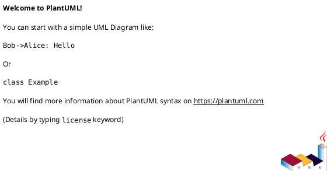
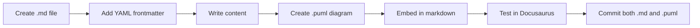

# TradingSystem Documentation Standard

**Status**: Official Standard
**Version**: 2.2.0
**Last Updated**: 2025-10-17
**Applies To**: All technical documentation in the TradingSystem project

**Note**: Aligned with TradingSystem Architecture v2.1

---

## 🎯 Overview

This document defines the **official standard** for creating technical documentation in the TradingSystem project. All documentation MUST follow these guidelines to ensure consistency, maintainability, and automatic rendering in Docusaurus.

## 📋 Core Requirements

### 1. YAML Frontmatter (REQUIRED)

Every documentation file MUST include YAML frontmatter with these fields:

```yaml
---
title: Document Title
sidebar_position: 1
tags: [category, topic, keywords]
domain: frontend | backend | ops | shared
type: guide | reference | adr | prd | rfc | runbook
summary: Brief one-line description
status: draft | active | deprecated
last_review: YYYY-MM-DD
---
```

**Field Descriptions**:

-   `title`: Human-readable document title
-   `sidebar_position`: Order in sidebar (1, 2, 3...)
-   `tags`: Searchable keywords (array)
-   `domain`: Which domain this doc belongs to
-   `type`: Document classification
-   `summary`: One-sentence description for AI/search
-   `status`: Current document status
-   `last_review`: Last review date (ISO format)

### 2. PlantUML Diagrams (REQUIRED for Architecture/Design Docs)

All architecture, design, and technical specification documents MUST include PlantUML diagrams.

#### 2.1 Diagram Requirements

**✅ REQUIRED**: Include both raw `.puml` source AND embedded rendering

**Structure**:

````markdown
## Architecture Diagram

### Source Code

Download: [`feature-name-architecture.puml`](./diagrams/feature-name-architecture.puml)

### Rendered Diagram


````

#### 2.2 When to Include Diagrams

| Document Type                      | Diagrams Required           | Types                           |
| ---------------------------------- | --------------------------- | ------------------------------- |
| ADR (Architecture Decision Record) | ✅ Yes                      | Component, Sequence, Deployment |
| PRD (Product Requirements)         | ⚠️ Optional but recommended | Use Case, State, Sequence       |
| RFC (Technical Proposal)           | ✅ Yes                      | Component, Class, Sequence      |
| Guide (Implementation)             | ⚠️ If applicable            | Sequence, Activity, State       |
| Runbook (Operations)               | ⚠️ If applicable            | Deployment, Network             |
| API Reference                      | ❌ No                       | N/A                             |

#### 2.3 Diagram Types by Use Case

Choose the appropriate PlantUML diagram type:

| Use Case            | Diagram Type       | When to Use                                 |
| ------------------- | ------------------ | ------------------------------------------- |
| System architecture | Component Diagram  | Show services, dependencies, boundaries     |
| Data flow           | Sequence Diagram   | Show step-by-step message flow              |
| State management    | State Diagram      | Show state transitions and events           |
| Domain model        | Class Diagram      | Show entities, value objects, relationships |
| Deployment topology | Deployment Diagram | Show servers, containers, processes         |
| User interaction    | Use Case Diagram   | Show actors and system interactions         |
| Process flow        | Activity Diagram   | Show decision points and parallel flows     |

#### 2.4 Diagram Quality Standards

**MUST**:

-   ✅ Include title with `title` keyword
-   ✅ Use descriptive names for components/actors
-   ✅ Add notes for complex parts
-   ✅ Use consistent naming with codebase
-   ✅ Include latency/performance annotations where relevant

**SHOULD**:

-   ✅ Use colors to categorize (skinparam)
-   ✅ Keep diagrams focused (single responsibility)
-   ✅ Use proper UML notation
-   ✅ Include legend if using custom symbols

**MUST NOT**:

-   ❌ Create diagrams wider than 1200px
-   ❌ Use more than 15 components per diagram
-   ❌ Nest more than 3 levels deep

### 3. File Organization

```
docs/context/
├── <domain>/                    # frontend, backend, ops, shared
│   ├── architecture/
│   │   ├── decisions/          # ADRs
│   │   │   ├── adr-NNNN-title.md
│   │   │   └── diagrams/       # PlantUML sources (.puml)
│   │   ├── overview.md
│   │   └── diagrams/           # Shared architecture diagrams
│   ├── features/
│   │   ├── feature-name.md
│   │   └── diagrams/           # Feature-specific diagrams
│   ├── guides/
│   │   ├── guide-name.md
│   │   └── diagrams/
│   └── references/
│       └── api-reference.md
```

**Naming Convention**:

-   Documents: `kebab-case.md`
-   Diagrams: `feature-name-diagram-type.puml`
-   Examples:
    -   `banco-ideias-component-architecture.puml`
    -   `order-execution-sequence.puml`
    -   `connection-state-machine.puml`

## 📐 Document Templates

### Template: ADR with PlantUML

```markdown
---
title: ADR-0001 - Use LowDB for MVP Data Storage
sidebar_position: 1
tags: [adr, database, architecture]
domain: backend
type: adr
summary: Decision to use LowDB JSON file storage for MVP instead of PostgreSQL
status: active
last_review: 2025-10-11
---

# ADR-0001: Use LowDB for MVP Data Storage

## Status

✅ **Accepted** - 2025-09-15

## Context

We need a data storage solution for the Idea Bank and Documentation API...

## Decision

We will use LowDB for the MVP phase...

## Architecture Impact

### Component Diagram - Source

Download: [`lowdb-architecture.puml`](./diagrams/lowdb-architecture.puml)

### Component Diagram - Rendered

\`\`\`plantuml
@startuml
title LowDB Architecture - TradingSystem MVP

component "Idea Bank API" as IBA
component "Documentation API" as DA
database "ideas.json\n(LowDB)" as IDEASDB
database "docs.json\n(LowDB)" as DOCSDB

IBA --> IDEASDB : Read/Write
DA --> DOCSDB : Read/Write

note right of IDEASDB
File-based JSON storage
In-memory caching
Atomic writes
end note
@enduml
\`\`\`

## Consequences

**Positive**:

-   ✅ Zero setup time
-   ✅ No database server needed
    ...

**Negative**:

-   ❌ Not suitable for production scale
    ...

## Migration Path

See: [Migration to PostgreSQL](../data/migrations/lowdb-to-postgresql.md)
```

### Template: PRD with PlantUML

```markdown
---
title: PRD - Banco de Ideias
sidebar_position: 1
tags: [prd, product, features]
domain: shared
type: prd
summary: Product requirements for the Idea Bank feature
status: active
last_review: 2025-10-11
---

# PRD: Banco de Ideias

## Overview

The Idea Bank is a centralized system for managing...

## User Stories

### US-001: Create Idea

**As a** developer
**I want to** submit improvement ideas
**So that** they can be tracked and prioritized

#### Interaction Flow - Source

Download: [`banco-ideias-create-sequence.puml`](./diagrams/banco-ideias-create-sequence.puml)

#### Interaction Flow - Rendered

\`\`\`plantuml
@startuml
title Create Idea - User Flow

actor Developer
participant "Dashboard UI" as UI
participant "Idea Bank API" as API
database "LowDB" as DB

Developer -> UI: Click "Add Idea"
UI -> UI: Show form
Developer -> UI: Fill form & Submit
UI -> API: POST /ideas
API -> API: Validate data
API -> DB: Write idea
DB --> API: OK
API --> UI: 201 Created
UI --> Developer: Show success
@enduml
\`\`\`

## Technical Requirements

...
```

### Template: Guide with PlantUML

```markdown
---
title: Guide - Implementing Customizable Pages
sidebar_position: 1
tags: [guide, frontend, tutorial]
domain: frontend
type: guide
summary: Step-by-step guide for implementing customizable layout pages
status: active
last_review: 2025-10-11
---

# Guide: Implementing Customizable Pages

## Overview

This guide shows how to create pages with drag-and-drop layouts...

## Architecture Overview - Source

Download: [`customizable-layout-architecture.puml`](./diagrams/customizable-layout-architecture.puml)

## Architecture Overview - Rendered

\`\`\`plantuml
@startuml
title Customizable Page Layout Architecture

package "Page Component" {
[EscopoPageNew]
[BancoIdeiasPageNew]
}

package "Layout System" {
[CustomizablePageLayout]
[DraggableGridLayout]
[LayoutControls]
}

package "UI Components" {
[CollapsibleCard]
}

package "State Management" {
[useLayoutStore]
}

[EscopoPageNew] --> [CustomizablePageLayout]
[CustomizablePageLayout] --> [DraggableGridLayout]
[CustomizablePageLayout] --> [LayoutControls]
[DraggableGridLayout] --> [CollapsibleCard]
[CustomizablePageLayout] --> [useLayoutStore]
@enduml
\`\`\`

## Step-by-Step Implementation

...
```

## 🔍 Automated Validation Workflow

### Overview

Documentation quality is enforced through automated validation at multiple stages:

1. **Pre-commit Hook** (Local) - Validates staged files before commit
2. **GitHub Actions** (CI/CD) - Validates all documentation on PRs and daily
3. **Manual Validation** (Developer) - Run anytime during development

### 1. Pre-commit Hook (Husky)

**When it runs**: Before every `git commit`

**What it validates**:

-   ✅ YAML frontmatter in staged markdown files
-   ✅ All 8 required fields present (title, sidebar_position, tags, domain, type, summary, status, last_review)
-   ✅ Field types correct (string, int, list)
-   ✅ Domain values valid (frontend, backend, ops, shared)
-   ✅ Type values valid (guide, reference, adr, prd, rfc, runbook, overview, index, glossary, template, feature)
-   ✅ Status values valid (draft, active, deprecated)
-   ✅ Date format correct (YYYY-MM-DD)

**Performance**: Validates only staged files (~1-2 seconds for typical commit)

**How to use**:

```bash
# Normal workflow - validation runs automatically
git add docs/context/frontend/guides/my-guide.md
git commit -m "docs: add implementation guide"
# → Frontmatter validation runs automatically
# → Commit succeeds if validation passes
# → Commit blocked if validation fails

# Bypass validation (NOT RECOMMENDED)
git commit --no-verify -m "docs: emergency fix"
```

**Setup** (one-time):

```bash
# Install Husky and dependencies
npm install

# Husky hooks are automatically installed via 'prepare' script
# Verify installation:
ls -la .husky/pre-commit
```

**Common Issues**:

**Issue**: "python3: command not found"

-   **Solution**: Install Python 3.11+ and ensure it's in PATH
-   **Verify**: `python3 --version`

**Issue**: "Missing required field: title"

-   **Solution**: Add complete frontmatter to your markdown file
-   **Template**: See section "Core Requirements" above

**Issue**: "Invalid domain 'Frontend'"

-   **Solution**: Use lowercase: `domain: frontend` (not `Frontend`)
-   **Allowed values**: frontend, backend, ops, shared

### 2. GitHub Actions (CI/CD)

**When it runs**:

-   On pull requests (validates changed files)
-   On push to main/develop (validates all files)
-   Daily at 3 AM UTC (comprehensive validation)

**What it validates**:

-   Same as pre-commit hook (frontmatter fields)
-   Plus: Document freshness (flags files >90 days old)
-   Plus: Cross-file consistency checks

**Workflow file**: `.github/workflows/docs-quality.yml` (if exists) or integrated into `docs-link-validation.yml`

**How to access results**:

-   View in GitHub Actions UI
-   Check PR comments for validation feedback
-   Download JSON artifacts for detailed analysis

### 3. Manual Validation (Developer)

**When to use**:

-   Before creating PR (catch issues early)
-   After bulk documentation updates
-   When troubleshooting validation failures

**Commands**:

```bash
# Validate all documentation
python3 scripts/docs/validate-frontmatter.py \
  --docs-dir ./docs/context ./docs \
  --verbose

# Validate specific directory
python3 scripts/docs/validate-frontmatter.py \
  --docs-dir ./docs/context/frontend \
  --verbose

# Generate JSON report
python3 scripts/docs/validate-frontmatter.py \
  --docs-dir ./docs/context \
  --output ./docs/reports/frontmatter-validation-local.json

# Check for outdated documents (>90 days)
python3 scripts/docs/validate-frontmatter.py \
  --docs-dir ./docs/context \
  --threshold-days 90 \
  --verbose

# Validate only staged files (same as pre-commit)
bash scripts/docs/validate-frontmatter-staged.sh
```

**Output format**:

```
=== Frontmatter Validation Summary ===
Total files scanned: 195
Files with frontmatter: 195
Files missing frontmatter: 0
Files with incomplete frontmatter: 0
Outdated documents (> 90 days): 0

✅ All files passed validation
```

### Validation Rules Reference

**Required Fields** (all mandatory):

| Field              | Type    | Validation              | Example                                   |
| ------------------ | ------- | ----------------------- | ----------------------------------------- |
| `title`            | string  | Non-empty               | "Dark Mode Implementation Guide"          |
| `sidebar_position` | integer | Non-negative            | 1, 2, 3...                                |
| `tags`             | array   | Non-empty list          | ["frontend", "ui", "dark-mode"]           |
| `domain`           | string  | Must be in allowed list | "frontend"                                |
| `type`             | string  | Must be in allowed list | "guide"                                   |
| `summary`          | string  | Non-empty, one sentence | "Complete dark mode implementation guide" |
| `status`           | string  | Must be in allowed list | "active"                                  |
| `last_review`      | string  | YYYY-MM-DD format       | "2025-10-18"                              |

**Allowed Values**:

**domain** (4 values):

-   `frontend` - React dashboard, UI components, frontend architecture
-   `backend` - APIs, services, data schemas, backend architecture
-   `ops` - Deployment, monitoring, infrastructure, runbooks
-   `shared` - Product specs, templates, diagrams, cross-cutting concerns

**type** (11 values):

-   `guide` - Implementation guides, tutorials, how-tos
-   `reference` - API references, technical references, glossaries
-   `adr` - Architecture Decision Records
-   `prd` - Product Requirements Documents
-   `rfc` - Request for Comments (technical proposals)
-   `runbook` - Operational runbooks, incident procedures
-   `overview` - High-level overviews, summaries
-   `index` - Index/catalog pages (README.md files)
-   `glossary` - Terminology definitions
-   `template` - Document templates
-   `feature` - Feature specifications

**status** (3 values):

-   `draft` - Work in progress, not ready for use
-   `active` - Current and maintained
-   `deprecated` - Outdated, kept for reference only

### Validation Error Examples

**Error: Missing required field**

```
❌ docs/context/frontend/guides/my-guide.md
   Missing required field: last_review
```

**Fix**: Add `last_review: 2025-10-18` to frontmatter

---

**Error: Invalid domain**

```
❌ docs/context/backend/api/my-api.md
   Invalid domain 'Backend'. Allowed: frontend, backend, ops, shared
```

**Fix**: Use lowercase: `domain: backend`

---

**Error: Invalid type**

```
❌ docs/context/frontend/guides/tutorial.md
   Invalid type 'tutorial'. Allowed: guide, reference, adr, prd, rfc, runbook, overview, index, glossary, template, feature
```

**Fix**: Use `type: guide` (tutorials are guides)

---

**Error: Invalid date format**

```
❌ docs/context/backend/guides/setup.md
   Invalid date format '10/18/2025'. Expected: YYYY-MM-DD
```

**Fix**: Use ISO format: `last_review: 2025-10-18`

---

**Error: Invalid field type**

```
❌ docs/context/ops/runbooks/deploy.md
   Field sidebar_position should be int, got string
```

**Fix**: Remove quotes: `sidebar_position: 1` (not `"1"`)

### Bypassing Validation (Emergency Only)

**When to bypass**:

-   ⚠️ Emergency hotfix (critical production issue)
-   ⚠️ Temporary documentation (will be fixed in follow-up PR)
-   ⚠️ Known false positive (report issue to maintainers)

**How to bypass**:

```bash
git commit --no-verify -m "docs: emergency fix"
```

**⚠️ WARNING**: Bypassing validation should be rare. All bypassed commits must be fixed in follow-up PRs.

### Integration with Other Tools

**Pre-commit Hook** (This Phase):

-   Validates frontmatter in staged files
-   Runs before commit
-   Fast feedback (<2 seconds)

**Link Validation Workflow** (Phase 8):

-   Validates documentation links
-   Runs on PRs and daily
-   Complementary to frontmatter validation

**Monthly Audit** (Phase 10):

-   Comprehensive validation including freshness
-   Generates trend reports
-   Creates issues for outdated documents

**Documentation Health Dashboard** (Phase 14):

-   Visualizes validation metrics
-   Shows trends over time
-   Highlights problematic files

### Best Practices

**✅ DO:**

-   Run manual validation before creating PR
-   Fix validation errors immediately (don't bypass)
-   Update `last_review` when making content changes
-   Use correct domain/type values from allowed lists
-   Keep frontmatter complete and accurate

**❌ DON'T:**

-   Bypass validation without good reason
-   Use uppercase in domain/type values
-   Use custom domain/type values not in allowed lists
-   Forget to update `last_review` date
-   Leave frontmatter incomplete

## 🔧 Tooling & Workflow

### VS Code Setup

**Required Extensions**:

-   PlantUML (jebbs.plantuml) - For `.puml` file editing with live preview
-   Markdown All in One - For markdown editing

**Recommended Settings** (`.vscode/settings.json`):

```json
{
    "plantuml.server": "https://www.plantuml.com/plantuml",
    "plantuml.render": "PlantUMLServer",
    "markdown.extension.toc.levels": "2..4"
}
```

### Documentation Workflow



**Commands**:

```bash
# 1. Start Docusaurus dev server
cd docs/docusaurus && npm run start -- --port 3004 --host 0.0.0.0

# 2. Edit documentation
# - Create/edit .md files in docs/context/
# - Create/edit .puml files in docs/context/<domain>/diagrams/

# 3. Preview changes
# - Open http://localhost:3004
# - PlantUML diagrams render automatically

# 4. Build for production
npm run build

# 5. Commit
git add docs/
git commit -m "docs: add feature documentation with PlantUML diagrams"
```

**Note**: Dashboard runs on port 3103 (configured in manifest.json)

**Note**: Docusaurus reads from `/docs/context/` (configured in docusaurus.config.ts)

**Note**: PlantUML plugin: `@akebifiky/remark-simple-plantuml`

**Note**: Mermaid support: `@docusaurus/theme-mermaid`

## ✅ Documentation Checklist

Before marking documentation as "complete", verify:

-   [ ] YAML frontmatter complete with all required fields (validated by pre-commit hook)
-   [ ] Document follows appropriate template (ADR/PRD/Guide)
-   [ ] PlantUML diagrams included (if applicable)
-   [ ] Both `.puml` source and embedded rendering present
-   [ ] Diagrams render correctly in Docusaurus
-   [ ] All links working (internal and external)
-   [ ] Code examples tested and working
-   [ ] Spelling and grammar checked
-   [ ] Tags appropriate and searchable
-   [ ] `last_review` date current

## 📊 Quality Metrics

Good documentation should meet these criteria:

| Metric         | Target                           | How to Measure           |
| -------------- | -------------------------------- | ------------------------ |
| Completeness   | 100% fields filled               | Check YAML frontmatter   |
| Visual content | ≥1 diagram for architecture docs | Count PlantUML blocks    |
| Freshness      | Reviewed within 90 days          | Check `last_review` date |
| Searchability  | ≥3 relevant tags                 | Check tags array         |
| Link health    | 0 broken links                   | Run Docusaurus build     |

## 🚫 Anti-Patterns

**DON'T**:

-   ❌ Create documentation without diagrams for architecture decisions
-   ❌ Include only rendered images without source `.puml` files
-   ❌ Skip YAML frontmatter
-   ❌ Use outdated diagram formats (draw.io, images without source)
-   ❌ Create mega-diagrams (>15 components)
-   ❌ Forget to update `last_review` date

**DO**:

-   ✅ Keep diagrams version-controlled as text (`.puml`)
-   ✅ Update diagrams when architecture changes
-   ✅ Use PlantUML standard notation
-   ✅ Include both source and rendered versions
-   ✅ Test rendering in Docusaurus before committing

## 📚 Reference Materials

### PlantUML Resources

-   [Official PlantUML Guide](https://plantuml.com/guide)
-   [PlantUML Cheat Sheet](https://plantuml.com/cheat-sheet)
-   [TradingSystem PlantUML Guide](context/shared/diagrams/plantuml-guide.md)
-   [Diagram Examples](context/shared/diagrams/README.md)

### Documentation Examples

-   [ADR-0001: LowDB](context/backend/architecture/decisions/0001-use-lowdb-for-mvp.md)
-   [Banco de Ideias PRD](context/shared/product/prd/pt/banco-ideias-prd.md)
-   [Customizable Layout Guide](context/frontend/guides/implementing-customizable-pages.md)

### Docusaurus Resources

-   [Docusaurus Documentation](https://docusaurus.io/docs)
-   [MDX Documentation](https://mdxjs.com/)
-   [Remark PlantUML Plugin](https://www.npmjs.com/package/@akebifiky/remark-simple-plantuml)

## 🔄 Review & Maintenance

### Quarterly Review Process

Every quarter, documentation owners should:

1. **Review all docs** in their domain
2. **Update `last_review` dates**
3. **Verify diagrams** still accurate
4. **Fix broken links**
5. **Update deprecated content**
6. **Archive obsolete docs**

### Ownership

| Domain         | Owner           | Review Cycle |
| -------------- | --------------- | ------------ |
| Frontend       | Frontend Team   | Quarterly    |
| Backend        | Backend Team    | Quarterly    |
| Operations     | DevOps Team     | Monthly      |
| Shared/Product | Product Manager | Quarterly    |

## 📝 Version History

| Version | Date       | Changes                                                                                  |
| ------- | ---------- | ---------------------------------------------------------------------------------------- |
| 2.2.0   | 2025-10-18 | Added automated validation workflow section (pre-commit hooks, CI/CD, manual validation) |
| 2.1.0   | 2025-10-17 | Restored from archive, updated ports, added frontmatter, aligned with v2.1 architecture  |
| 1.0.0   | 2025-10-11 | Initial standard: YAML frontmatter + PlantUML requirements                               |

---

**This is a living document. Propose changes via pull request to `docs/DOCUMENTATION-STANDARD.md`**

