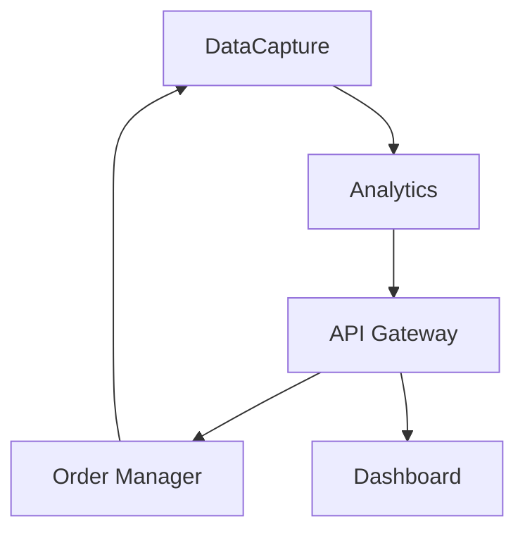

# Technical Specification - TradingSystem

**Version:** 2.0
**Author:** Marcelo Terra
**Last Updated:** January 2025
**Status:** Active

---

## ⚠️ CRITICAL: NATIVE WINDOWS DEPLOYMENT ONLY

**THIS SYSTEM MUST RUN NATIVELY ON WINDOWS. DOCKER IS NOT SUPPORTED.**

All services must run as native Windows processes or Windows Services. Container-based deployment is explicitly prohibited due to:
- ProfitDLL Windows-native requirements
- Latency constraints (< 500ms end-to-end)
- High-frequency disk I/O requirements
- Maximum resource utilization needs

---

## 1. System Overview

TradingSystem is a **microservices-based trading platform** built on **Clean Architecture** and **Domain-Driven Design** principles, designed for **native Windows execution** with emphasis on **low latency**, **reliability**, and **extensibility**.

### 1.1 Architecture Principles

- **Clean Architecture:** Layered design (Domain → Application → Infrastructure → Presentation)
- **Domain-Driven Design:** Aggregates, Value Objects, Domain Events
- **Microservices:** Independent services with single responsibility
- **Event-Driven:** Asynchronous communication via WebSocket + HTTP
- **Local-First:** Zero cloud dependencies, 100% on-premise
- **Native Deployment:** All services run as Windows processes/services (NO DOCKER)

### 1.2 Technology Stack

| Layer | Technology | Version | Purpose |
|-------|------------|---------|---------|
| **Backend Services** | C# (.NET) | 8.0 | DataCapture, OrderManager |
| **Analytics** | Python | 3.11+ | ML Pipeline, Feature Engineering |
| **API Layer** | FastAPI | 0.108+ | API Gateway, REST endpoints |
| **Frontend** | React | 18.2 | Dashboard, Visualization |
| **Data Storage** | Parquet (PyArrow) | 14.0+ | Time-series data |
| **Messaging** | WebSocket | - | Real-time data streams |
| **Monitoring** | Prometheus + Grafana | Latest | Observability |
| **Orchestration** | Windows Services | Native | Service management |
| **Process Manager** | PowerShell Scripts | 5.1+ | Startup/shutdown automation |

---

## 2. System Architecture

### 2.1 High-Level Components

```
┌─────────────────┐
│   ProfitDLL     │ (External)
│  Market Data    │
└────────┬────────┘
         │
         ▼
┌─────────────────┐
│  DataCapture    │ (C# Service)
│  - Callbacks    │
│  - WebSocket TX │
└────────┬────────┘
         │ WebSocket (9001)
         ▼
┌─────────────────┐
│ Analytics       │ (Python Service)
│  - ML Pipeline  │
│  - Signals      │
└────────┬────────┘
         │ HTTP REST
         ▼
┌─────────────────┐
│  API Gateway    │ (FastAPI)
│  - Routing      │
│  - Validation   │
└────────┬────────┘
         │
    ┌────┴────┐
    ▼         ▼
┌────────┐ ┌──────────┐
│ Order  │ │Dashboard │
│Manager │ │ (React)  │
└────────┘ └──────────┘
```

### 2.2 Service Responsibilities

#### DataCapture Service (C#)
- **Purpose:** Capture market data from ProfitDLL
- **Responsibilities:**
  - Initialize and manage ProfitDLL connection
  - Handle callbacks (state, trade, book, order)
  - Serialize data to JSON
  - Publish to WebSocket
  - Manage reconnection logic

#### Analytics Pipeline (Python)
- **Purpose:** Process data and generate signals
- **Responsibilities:**
  - Consume WebSocket data stream
  - Feature engineering (aggressor flow, volatility, etc.)
  - ML model training and inference
  - Signal generation with confidence scores
  - Store processed data in Parquet

#### API Gateway (FastAPI)
- **Purpose:** Central API for all services
- **Responsibilities:**
  - Expose REST endpoints
  - Route requests to appropriate services
  - Validate input/output
  - Rate limiting and auth
  - Aggregate responses

#### Order Manager (C#)
- **Purpose:** Execute orders and manage risk
- **Responsibilities:**
  - Receive order requests from Gateway
  - Apply risk checks (limits, hours, position size)
  - Execute orders via ProfitDLL
  - Track order lifecycle
  - Update position states

#### Dashboard (React)
- **Purpose:** User interface and monitoring
- **Responsibilities:**
  - Display real-time signals
  - Show positions and P&L
  - Visualize performance metrics
  - Provide manual controls (kill switch)
  - System health monitoring

---

## 3. Data Flow

### 3.1 Market Data Flow

```
1. ProfitDLL Callback (C#)
   ↓ [Serialize to JSON]
2. WebSocket Publish
   ↓ [ws://localhost:9001]
3. Analytics Consumer (Python)
   ↓ [Feature Engineering]
4. Parquet Storage
   ↓ [ML Model]
5. Signal Generation
```

### 3.2 Order Execution Flow

```
1. Signal Generated (Python)
   ↓ [HTTP POST /api/v1/signals]
2. API Gateway (FastAPI)
   ↓ [Validate & Route]
3. Order Manager (C#)
   ↓ [Risk Checks]
4. ProfitDLL SendOrder
   ↓ [Callback]
5. Position Update
   ↓ [Notify Dashboard]
6. Real-time Display
```

### 3.3 Risk Management Flow

```
1. Order Request
   ↓
2. Risk Engine Checks:
   - Daily loss limit
   - Position size limit
   - Trading hours
   - Connection health
   ↓
3. Decision: APPROVE / REJECT
   ↓
4. If APPROVE → Execute
   If REJECT → Log & Notify
```

---

## 4. Domain Model (DDD)

### 4.1 Aggregates

#### OrderAggregate
- **Root Entity:** `Order`
- **Value Objects:** `Price`, `Quantity`, `OrderId`
- **Domain Events:** `OrderPlacedEvent`, `OrderFilledEvent`, `OrderCanceledEvent`
- **Invariants:**
  - Quantity > 0
  - Price > 0 (or -1 for market orders)
  - Valid symbol format

#### TradeAggregate
- **Root Entity:** `Trade`
- **Value Objects:** `Symbol`, `Price`, `Volume`, `Timestamp`
- **Domain Events:** `TradeReceivedEvent`
- **Invariants:**
  - Timestamp > previous trade
  - Price within circuit breaker limits

#### PositionAggregate
- **Root Entity:** `Position`
- **Value Objects:** `Symbol`, `Quantity`, `AvgPrice`
- **Domain Events:** `PositionOpenedEvent`, `PositionClosedEvent`, `PositionUpdatedEvent`
- **Invariants:**
  - Net quantity = buy_qty - sell_qty
  - P&L calculation consistency

### 4.2 Value Objects

```csharp
// Price Value Object
public record Price
{
    private readonly decimal _value;

    public Price(decimal value)
    {
        if (value < 0 && value != -1) // -1 = market order
            throw new InvalidPriceException();
        _value = value;
    }

    public decimal Value => _value;
    public bool IsMarketOrder => _value == -1;
}

// Symbol Value Object
public record Symbol
{
    private readonly string _ticker;
    private readonly string _exchange;

    public Symbol(string ticker, string exchange)
    {
        if (string.IsNullOrWhiteSpace(ticker))
            throw new InvalidSymbolException();
        _ticker = ticker.ToUpper();
        _exchange = exchange.ToUpper();
    }

    public string Ticker => _ticker;
    public string Exchange => _exchange;
    public string FullSymbol => $"{_ticker}:{_exchange}";
}
```

### 4.3 Domain Events

```csharp
public record OrderFilledEvent : IDomainEvent
{
    public Guid OrderId { get; init; }
    public Symbol Symbol { get; init; }
    public Price ExecutionPrice { get; init; }
    public Quantity FilledQuantity { get; init; }
    public DateTime Timestamp { get; init; }
}

public record SignalGeneratedEvent : IDomainEvent
{
    public Guid SignalId { get; init; }
    public Symbol Symbol { get; init; }
    public SignalDirection Direction { get; init; }
    public double Confidence { get; init; }
    public Dictionary<string, double> Features { get; init; }
    public DateTime Timestamp { get; init; }
}
```

---

## 5. Machine Learning Architecture

### 5.1 Cause-and-Effect Model

**Concept:** Identify relationships between market conditions (causes) and price movements (effects).

**Implementation:**

```python
class CauseEffectModel:
    def __init__(self):
        self.model = SGDClassifier(
            loss='log',
            learning_rate='adaptive',
            eta0=0.01,
            max_iter=1000
        )
        self.feature_scaler = StandardScaler()

    def extract_features(self, trades: pl.DataFrame) -> np.ndarray:
        """Extract cause features from trade data"""
        features = pl.DataFrame({
            'aggressor_flow': self._calc_aggressor_flow(trades),
            'volatility_roll': trades['price'].rolling_std(window=100),
            'volume_anomaly': trades['volume'] / trades['volume'].rolling_mean(window=100),
            'book_delta': trades['ask_qty'].sum() - trades['bid_qty'].sum(),
            'price_momentum': trades['price'].pct_change(periods=10)
        })
        return features.to_numpy()

    def predict_signal(self, features: np.ndarray) -> Tuple[str, float]:
        """Generate trading signal"""
        features_scaled = self.feature_scaler.transform(features.reshape(1, -1))
        proba = self.model.predict_proba(features_scaled)[0]

        if proba[1] > 0.65:  # BUY threshold
            return ("BUY", proba[1])
        elif proba[0] > 0.65:  # SELL threshold
            return ("SELL", proba[0])
        else:
            return ("HOLD", max(proba))
```

### 5.2 Feature Engineering

**Core Features:**

| Feature | Calculation | Purpose |
|---------|-------------|---------|
| `aggressor_flow` | Σ(aggressor_buy - aggressor_sell) | Buying/selling pressure |
| `volatility_roll` | StdDev(price, window=100) | Market uncertainty |
| `volume_anomaly` | volume / MA(volume, 100) | Unusual activity |
| `book_delta` | ask_qty - bid_qty | Order book imbalance |
| `price_momentum` | (price_t - price_t-10) / price_t-10 | Trend direction |

**Window-Based Processing:**
- Rolling window: 100 ticks (configurable)
- Update frequency: Every tick
- Feature lag: 1 tick (prevent look-ahead bias)

### 5.3 Incremental Learning

```python
def update_model(self, X_new: np.ndarray, y_true: np.ndarray):
    """Update model with new observations"""
    # Partial fit (online learning)
    self.model.partial_fit(X_new, y_true, classes=[0, 1, 2])

    # Track performance
    y_pred = self.model.predict(X_new)
    accuracy = accuracy_score(y_true, y_pred)

    # Log metrics
    logger.info(f"Model updated | Accuracy: {accuracy:.3f}")
```

---

## 6. Communication Protocols

### 6.1 WebSocket (Market Data)

**Configuration:**
- **URL:** `ws://localhost:9001`
- **Protocol:** JSON over WebSocket
- **Buffer:** 10,000 messages (FIFO)
- **Reconnection:** Every 5 seconds

**Message Format:**
```json
{
  "type": "trade",
  "symbol": "WINZ25",
  "price": 127850.0,
  "volume": 5,
  "aggressor": "B",
  "timestamp": 1704459615123
}
```

### 6.2 HTTP REST (Commands)

**Endpoints:**

| Method | Endpoint | Purpose | Auth |
|--------|----------|---------|------|
| POST | `/api/v1/signals` | Submit signal | API Key |
| GET | `/api/v1/signals/latest` | Get recent signals | API Key |
| POST | `/api/v1/execute` | Execute order | API Key |
| GET | `/api/v1/positions` | Get positions | API Key |
| POST | `/api/v1/risk/kill-switch` | Emergency stop | API Key |

**Authentication:**
```http
POST /api/v1/execute
X-API-Key: your-api-key-here
Content-Type: application/json

{
  "symbol": "WINZ25",
  "side": "BUY",
  "quantity": 1,
  "price": 127850.0
}
```

---

## 7. Data Storage

### 7.1 Parquet Structure

```
data/parquet/
├── WINZ25/
│   ├── 2025-01-04/
│   │   ├── trades.parquet
│   │   ├── features.parquet
│   │   └── signals.parquet
│   └── 2025-01-05/
│       └── ...
└── PETR4/
    └── ...
```

**Schema (trades.parquet):**
```python
schema = pa.schema([
    ('timestamp', pa.timestamp('ms')),
    ('symbol', pa.string()),
    ('price', pa.float64()),
    ('volume', pa.int32()),
    ('aggressor', pa.string()),
    ('trade_id', pa.int64())
])
```

### 7.2 Logging (JSONL)

```
data/logs/
├── datacapture/
│   └── 2025-01-04.jsonl
├── analytics/
│   └── 2025-01-04.jsonl
└── ordermanager/
    └── 2025-01-04.jsonl
```

**Log Entry Format:**
```json
{
  "timestamp": "2025-01-04T10:30:15.123Z",
  "level": "INFO",
  "service": "analytics",
  "message": "Signal generated",
  "context": {
    "symbol": "WINZ25",
    "direction": "BUY",
    "confidence": 0.78
  }
}
```

---

## 8. Observability

### 8.1 Metrics (Prometheus)

**DataCapture Metrics:**
- `datacapture_ticks_received_total` - Total ticks received
- `datacapture_websocket_latency_ms` - WebSocket publish latency
- `datacapture_connection_status` - Connection health (0/1)

**Analytics Metrics:**
- `analytics_signals_generated_total` - Total signals
- `analytics_model_accuracy` - Model hit rate
- `analytics_processing_latency_ms` - Feature → signal time

**OrderManager Metrics:**
- `orders_executed_total` - Total orders executed
- `orders_rejected_total` - Orders rejected by risk
- `position_pnl_realized` - Realized P&L

### 8.2 Dashboards (Grafana)

**System Health Dashboard:**
- Service status (up/down)
- Latency graphs (P50, P95, P99)
- Error rates
- Resource usage (CPU, RAM)

**Trading Performance Dashboard:**
- Hit rate over time
- Cumulative P&L
- Drawdown chart
- Win/loss ratio

---

## 9. Security Architecture

### 9.1 Credential Management

```csharp
// Encrypted storage
public class SecureCredentialStore
{
    private readonly IDataProtectionProvider _protection;

    public void StoreCredential(string key, string value)
    {
        var protector = _protection.CreateProtector("Credentials");
        var encrypted = protector.Protect(value);
        // Store encrypted value
    }

    public string GetCredential(string key)
    {
        var protector = _protection.CreateProtector("Credentials");
        // Retrieve and decrypt
    }
}
```

### 9.2 Audit Trail

Every action logged with:
- **Who:** User/Service ID
- **What:** Action performed
- **When:** Timestamp (UTC)
- **Why:** Justification/reason
- **Result:** Success/failure

**Example:**
```json
{
  "actor": "OrderManager",
  "action": "ORDER_EXECUTED",
  "timestamp": "2025-01-04T10:30:15.123Z",
  "details": {
    "order_id": "ORD-123",
    "symbol": "WINZ25",
    "side": "BUY",
    "quantity": 1,
    "price": 127850.0
  },
  "result": "SUCCESS"
}
```

---

## 10. Deployment Architecture

### 10.1 Native Windows Deployment

**All services run as native Windows processes or Windows Services:**

```powershell
# Service Processes
TradingSystem.DataCapture.exe     # Port: None (internal)
python src/main.py                 # Analytics - Port: 9001
uvicorn src.main:app              # Gateway - Port: 8000
TradingSystem.OrderManager.exe    # Port: 5055
npm run dev                        # Dashboard - Port: 5173
prometheus.exe                     # Monitoring - Port: 9090
grafana-server.exe                # Dashboards - Port: 3000
```

**Windows Services Configuration:**

| Service Name | Executable | Startup Type | Recovery |
|--------------|------------|--------------|----------|
| TradingSystem-DataCapture | DataCapture.exe | Automatic | Restart on failure |
| TradingSystem-Analytics | python.exe | Automatic | Restart on failure |
| TradingSystem-Gateway | uvicorn.exe | Automatic | Restart on failure |
| TradingSystem-OrderManager | OrderManager.exe | Automatic | Restart on failure |
| TradingSystem-Dashboard | node.exe | Manual | Restart on failure |

### 10.2 Service Dependencies



**Startup Order:**
1. Analytics (WebSocket server) - Port 9001
2. DataCapture (connects to Analytics)
3. API Gateway - Port 8000
4. Order Manager - Port 5055
5. Dashboard - Port 5173

**Why Native Windows Services:**
- Direct hardware access (no virtualization overhead)
- Windows Event Log integration
- Auto-recovery on failure
- Better resource management
- Process priority control
- CPU affinity settings

---

## Appendix

### A. Technology Decisions

- **Why C# for DataCapture?** Native P/Invoke for ProfitDLL, high performance
- **Why Python for Analytics?** Rich ML ecosystem (scikit-learn, Polars)
- **Why Parquet?** Columnar storage, high compression, fast queries
- **Why FastAPI?** Async, auto docs, type hints
- **Why Native Windows (No Docker)?**
  - ProfitDLL is Windows-native 64-bit DLL
  - Docker adds 10-50ms latency (unacceptable for < 500ms requirement)
  - Direct NVMe/SSD access ~30% faster than Docker volumes
  - Docker Desktop overhead (1-2GB RAM) reduces trading resources
  - Native Windows Services more reliable for 24/7 operations

### B. Performance Targets

| Metric | Target | Current |
|--------|--------|---------|
| End-to-end latency | < 500ms | TBD |
| Data throughput | 10K msg/s | TBD |
| ML inference | < 50ms | TBD |
| Order execution | < 200ms | TBD |

### C. References

- [Product Vision](../product/vision.md)
- [Business Requirements](../product/business-requirements.md)
- [ProfitDLL Integration](../integrations/profitdll-integration.md)
- [API Specification](../api/gateway-api.yaml)
