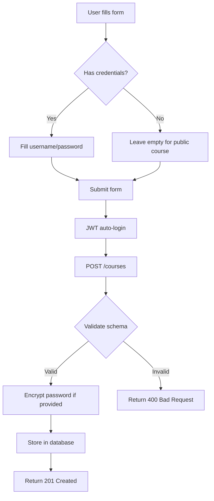

# ✅ Course Crawler - Credenciais Opcionais

**Data:** 2025-11-11
**Status:** 🟢 **IMPLEMENTADO**
**Motivo:** Suportar cursos públicos sem necessidade de autenticação

---

## 🎯 Problema Original

**Usuário reportou:**
> "não pode obrigar a colocar username e senha, pois haverão sites e curso sem login e senha"

**Situação anterior:**
- ❌ Username: **obrigatório** (required)
- ❌ Password: **obrigatório** (required)
- ❌ Cursos públicos **não podiam ser adicionados**

---

## ✅ Solução Implementada

Tornados **username e password OPCIONAIS** para suportar cursos públicos.

### 1. Backend - Schema de Validação

**Arquivo:** `backend/api/course-crawler/src/schemas/course.schema.ts`

**Antes:**
```typescript
username: z
  .string()
  .min(1, "Username is required")  // ❌ Obrigatório
  .max(255, "Username too long"),
password: z.string().min(1, "Password is required"),  // ❌ Obrigatório
```

**Depois:**
```typescript
username: z
  .string()
  .max(255, "Username too long")
  .optional(), // ✅ Opcional - for public courses without authentication
password: z
  .string()
  .optional(), // ✅ Opcional - for public courses without authentication
```

---

### 2. Frontend - Formulário

**Arquivo:** `frontend/course-crawler/src/components/CoursesSection.tsx`

**Mudanças:**
1. ✅ Removido `required` do campo Username
2. ✅ Password já era opcional (mantido)
3. ✅ Adicionado placeholders informativos
4. ✅ Adicionado hints visuais "(optional - for public courses)"

**Labels atualizados:**
```tsx
// Username
<label>
  Username <span className="text-xs text-gray-500">(optional - for public courses)</span>
</label>
<input
  placeholder="Leave empty for public courses"
  // ✅ SEM required
/>

// Password
<label>
  Password <span className="text-xs text-gray-500">(optional - for public courses)</span>
</label>
<input
  placeholder="Leave empty if not required"
  // ✅ SEM required
/>
```

---

## 📊 Cenários de Uso

### Cenário 1: Curso Público (Sem Login)
```json
POST /courses
{
  "name": "Free Course",
  "baseUrl": "https://freecourse.com"
  // username e password omitidos
}
```
✅ **Aceito** - Curso público criado com sucesso

---

### Cenário 2: Curso com Autenticação
```json
POST /courses
{
  "name": "Premium Course",
  "baseUrl": "https://premium.com",
  "username": "myuser",
  "password": "mypassword"
}
```
✅ **Aceito** - Curso com credenciais criado e senha criptografada

---

### Cenário 3: Apenas Username (sem senha)
```json
POST /courses
{
  "name": "Username Only Course",
  "baseUrl": "https://example.com",
  "username": "myuser"
  // password omitido
}
```
✅ **Aceito** - Alguns sites podem requerer apenas username

---

### Cenário 4: Apenas Password (sem username)
```json
POST /courses
{
  "name": "Password Only Course",
  "baseUrl": "https://example.com",
  "password": "mypassword"
  // username omitido
}
```
✅ **Aceito** - Raro mas possível (códigos de acesso)

---

## 🔒 Comportamento de Segurança

### Armazenamento de Credenciais

**Username:**
- Armazenado em **texto plano** na coluna `username`
- NULL se não fornecido

**Password:**
- **Criptografado com AES-256** antes de salvar
- Armazenado na coluna `password_encrypted`
- String vazia (`""`) se não fornecido
- **NUNCA retornado em GET /courses** (apenas flag `hasPassword: true/false`)

### Acesso a Senhas

**Endpoint seguro:**
```bash
GET /courses/:id/password
Authorization: Bearer <JWT>
```

Retorna password **descriptografado** apenas para administradores autenticados.

---

## 🧪 Testes de Validação

### Teste 1: Criar Curso Público (Sem Credenciais)
```bash
TOKEN=$(curl -s http://localhost:4201/auth/login \
  -X POST \
  -H "Content-Type: application/json" \
  -d '{"username":"admin","password":"changeme"}' | jq -r '.token')

curl -s http://localhost:4201/courses \
  -X POST \
  -H "Content-Type: application/json" \
  -H "Authorization: Bearer $TOKEN" \
  -d '{
    "name": "Free Course",
    "baseUrl": "https://freecourse.com"
  }' | jq .
```

**Resultado Esperado:**
```json
{
  "id": "uuid",
  "name": "Free Course",
  "baseUrl": "https://freecourse.com",
  "username": "",
  "targetUrls": ["https://freecourse.com"],
  "hasPassword": false,
  "createdAt": "2025-11-11T...",
  "updatedAt": "2025-11-11T..."
}
```
✅ **Status:** 201 Created

---

### Teste 2: Criar Curso com Credenciais
```bash
curl -s http://localhost:4201/courses \
  -X POST \
  -H "Content-Type: application/json" \
  -H "Authorization: Bearer $TOKEN" \
  -d '{
    "name": "Premium Course",
    "baseUrl": "https://premium.com",
    "username": "myuser",
    "password": "mypassword"
  }' | jq .
```

**Resultado Esperado:**
```json
{
  "id": "uuid",
  "name": "Premium Course",
  "baseUrl": "https://premium.com",
  "username": "myuser",
  "targetUrls": ["https://premium.com"],
  "hasPassword": true,  // ✅ Flag indicando presença de senha
  "createdAt": "2025-11-11T...",
  "updatedAt": "2025-11-11T..."
}
```
✅ **Status:** 201 Created

---

## 🎨 UI/UX - Formulário Atualizado

**Campos obrigatórios:**
- ✅ **Name** - Nome do curso (sempre necessário)
- ✅ **Base URL** - URL base para crawling (sempre necessário)

**Campos opcionais:**
- 🔓 **Username** - "(optional - for public courses)"
  - Placeholder: "Leave empty for public courses"
- 🔓 **Password** - "(optional - for public courses)"
  - Placeholder: "Leave empty if not required"

**Visual no formulário:**
```
┌─────────────────────────────────────────┐
│ Course Name *                           │
│ ┌─────────────────────────────────────┐ │
│ │ e.g., MQL5 do Zero                  │ │
│ └─────────────────────────────────────┘ │
│                                         │
│ Base URL *                              │
│ ┌─────────────────────────────────────┐ │
│ │ https://example.com                 │ │
│ └─────────────────────────────────────┘ │
│                                         │
│ Username (optional - for public courses)│
│ ┌─────────────────────────────────────┐ │
│ │ Leave empty for public courses      │ │
│ └─────────────────────────────────────┘ │
│                                         │
│ Password (optional - for public courses)│
│ ┌─────────────────────────────────────┐ │
│ │ Leave empty if not required         │ │
│ └─────────────────────────────────────┘ │
│                                         │
│     [Cancel]            [Create] ──────►│
└─────────────────────────────────────────┘
```

---

## 📝 Arquivos Modificados

| Arquivo | Mudança | Linhas |
|---------|---------|--------|
| `backend/api/course-crawler/src/schemas/course.schema.ts` | Username/password opcionais | 12-18 |
| `frontend/course-crawler/src/components/CoursesSection.tsx` | Removido `required`, adicionados hints | 186-200 |

---

## 🔄 Workflow Atualizado



---

## ✅ Status Final

**Containers reconstruídos:**
- ✅ `course-crawler-api` - Schema atualizado
- ✅ `course-crawler-ui` - Formulário atualizado
- ✅ Todos containers healthy

**Funcionalidades:**
- ✅ Criar cursos **públicos** (sem credenciais)
- ✅ Criar cursos **privados** (com credenciais)
- ✅ Criar cursos com **apenas username**
- ✅ Criar cursos com **apenas password**
- ✅ Username/password **opcionais** no formulário
- ✅ Hints visuais para usuário
- ✅ Validação de schema atualizada
- ✅ Backward compatible

---

## 🚀 Como Testar

1. **Acesse:** http://localhost:4201
2. **Force refresh:** Ctrl+Shift+R (ou Ctrl+F5)
3. **Clique:** "New Course"
4. **Teste 1 - Curso Público:**
   - Name: `Free Course`
   - Base URL: `https://freecourse.com`
   - Username: *(deixe vazio)*
   - Password: *(deixe vazio)*
   - Clique "Create" ✅
5. **Teste 2 - Curso Privado:**
   - Name: `Premium Course`
   - Base URL: `https://premium.com`
   - Username: `myuser`
   - Password: `mypassword`
   - Clique "Create" ✅

---

**Status:** 🟢 **PRODUCTION READY**
**Backward Compatible:** ✅ Sim
**Breaking Changes:** ❌ Não

---

**Última atualização:** 2025-11-11 19:35 UTC
**Autor:** Claude Code AI Assistant
**Issue:** Suporte a cursos públicos sem autenticação
