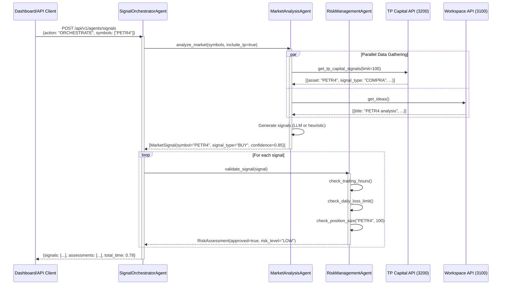
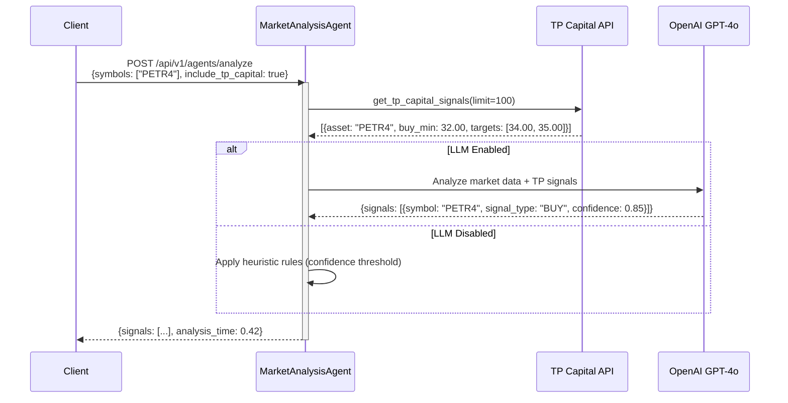
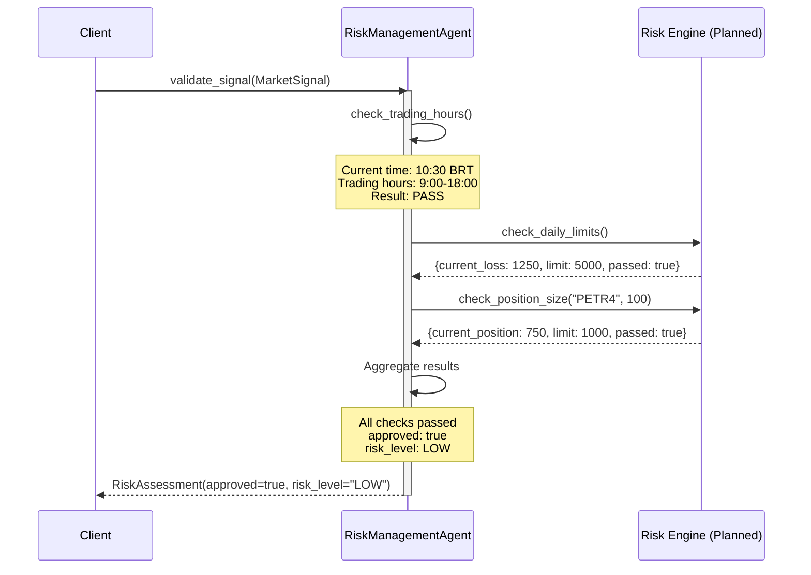
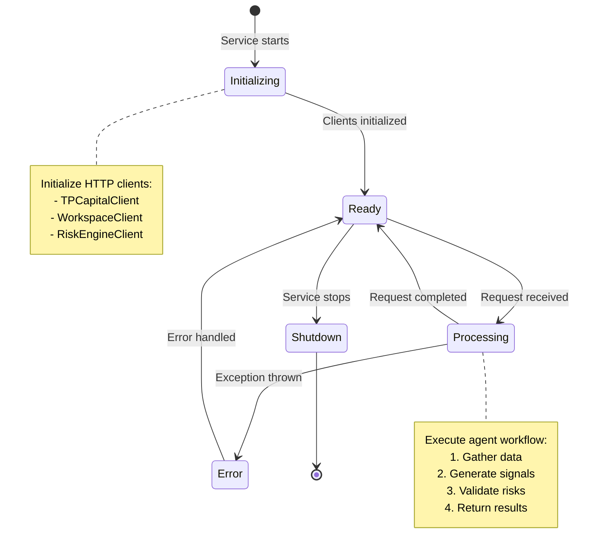
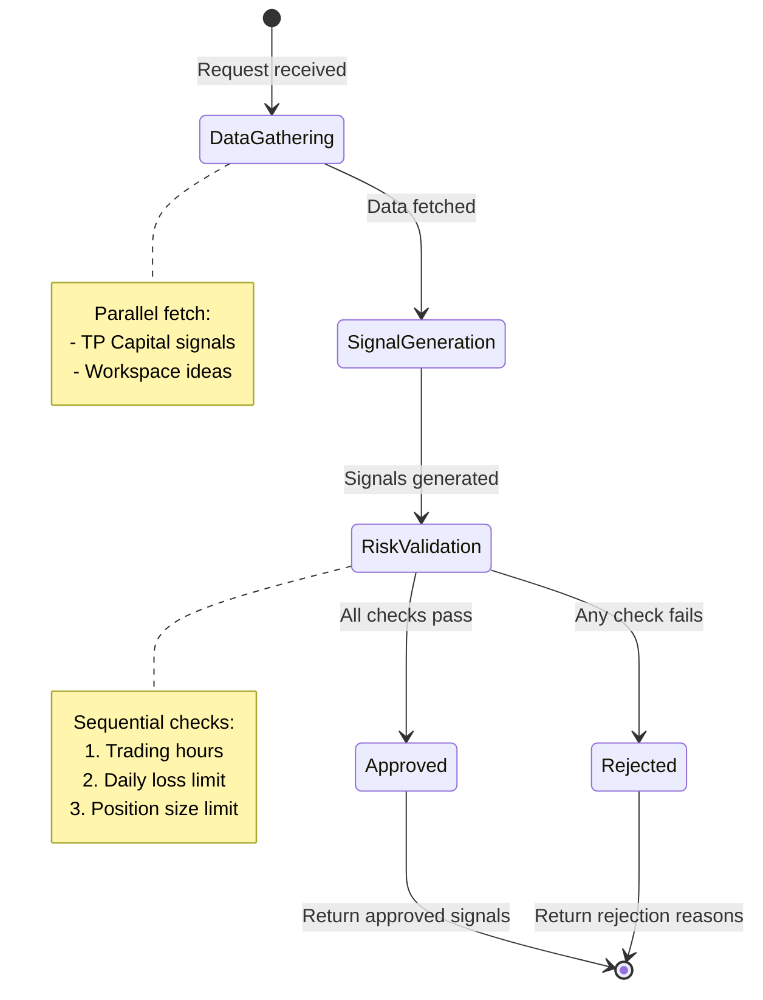
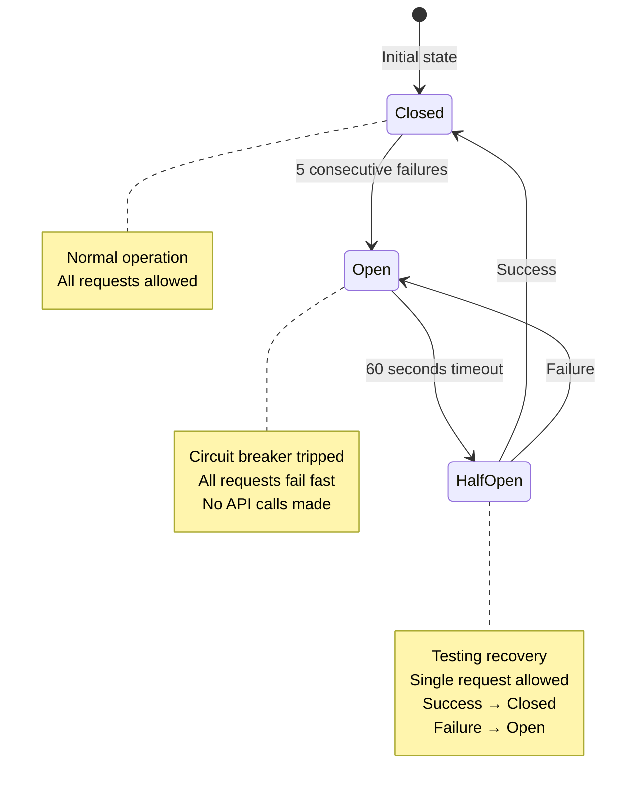

## Overview

Agno Agents execute in coordinated workflows orchestrated by the SignalOrchestratorAgent. This page documents the execution flows, state transitions, and interaction patterns.

## Sequence Diagrams

### Full Orchestration Flow (ORCHESTRATE Action)



---

### Market Analysis Flow (ANALYZE Action)



---

### Risk Validation Flow (VALIDATE Action)



## State Transitions

### Agent Lifecycle States



### Signal Processing States



### Circuit Breaker States



**Configuration**:
- Failure threshold: 5 consecutive failures
- Timeout: 60 seconds before HALF_OPEN
- Metrics: `agent_errors_total{error_type="CircuitBreakerError"}`

## Decision Trees

### Market Analysis Decision Tree

```
Market Analysis Request
├─ LLM Enabled?
│  ├─ Yes → Invoke OpenAI GPT-4o
│  │  ├─ Success → Parse LLM response
│  │  └─ Failure → Apply fallback heuristics
│  └─ No → Apply fallback heuristics
│
├─ Fallback Heuristics:
│  ├─ TP Capital signals available?
│  │  ├─ Yes → Convert TP signals to MarketSignal format
│  │  │  └─ Extract: symbol, signal_type, confidence, price, size
│  │  └─ No → Generate HOLD signals for all symbols
│  │     └─ Confidence: 0.5 (neutral)
│
└─ Return: List[MarketSignal]
```

### Risk Validation Decision Tree

```
Risk Validation Request
├─ Check Trading Hours
│  ├─ Current time in 9:00-18:00 BRT? → PASS
│  └─ Outside hours? → FAIL (reject signal)
│
├─ Check Daily Loss Limit (if trading hours pass)
│  ├─ Current loss < daily limit? → PASS
│  └─ Limit exceeded? → FAIL (reject signal)
│
├─ Check Position Size (if daily loss pass)
│  ├─ Current position + order size &lt;= limit? → PASS
│  └─ Would exceed limit? → FAIL (reject signal)
│
└─ Final Decision:
   ├─ All checks PASS → approved: true, risk_level: LOW
   └─ Any check FAIL → approved: false, risk_level: HIGH
```

## Error Handling Flows

### Retry Flow (Exponential Backoff)

```
API Request
├─ Attempt 1 (immediate)
│  ├─ Success → Return result
│  └─ Failure → Wait 500ms
│
├─ Attempt 2 (after 500ms)
│  ├─ Success → Return result
│  └─ Failure → Wait 1500ms
│
├─ Attempt 3 (after 1500ms)
│  ├─ Success → Return result
│  └─ Failure → Wait 3000ms
│
├─ Attempt 4 (after 3000ms)
│  ├─ Success → Return result
│  └─ Failure → Raise exception
│
└─ Max attempts reached → Log error, track metric, return empty result
```

**Configuration**:
- Strategy: Exponential backoff (500ms, 1500ms, 3000ms)
- Max attempts: 4 (configurable via `RETRY_MAX_ATTEMPTS`)
- Applied to: All HTTP requests (TP Capital, Workspace, Risk Engine)

### Circuit Breaker Flow

```
API Request
├─ Circuit Breaker State?
│  ├─ CLOSED → Execute request
│  │  ├─ Success → Return result, reset failure count
│  │  └─ Failure → Increment failure count
│  │     ├─ Count < 5 → Return error
│  │     └─ Count &gt;= 5 → Open circuit, start 60s timer
│  │
│  ├─ OPEN → Fail fast (CircuitBreakerError)
│  │  └─ After 60s → Transition to HALF_OPEN
│  │
│  └─ HALF_OPEN → Execute single test request
│     ├─ Success → Close circuit, resume normal operation
│     └─ Failure → Reopen circuit, restart 60s timer
```

## Related Documentation

- [Agent Overview](/agents/agno-agents) - Agent responsibilities and interactions
- [Agent Prompts](./prompts) - Prompt templates
- [MCP Integration](./mcp) - MCP capabilities
- [Agent Tests](./tests) - Test suite
- Monitoring guidance (migration pending)
