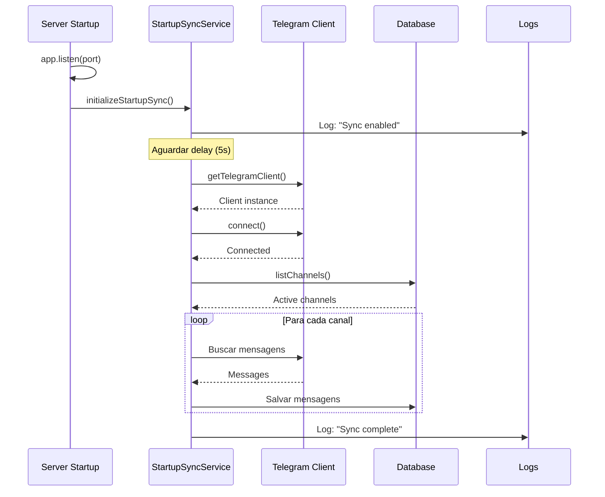

# Sincronização Automática no Startup

## 📋 Visão Geral

O Telegram Gateway agora **sincroniza automaticamente** as últimas mensagens de todos os canais monitorados sempre que o serviço é iniciado. Isso garante que o banco de dados local esteja sempre atualizado com os canais sendo monitorados.

## 🎯 Benefícios

- ✅ **Sempre atualizado**: Database sincronizado com os canais ao iniciar
- ✅ **Recuperação automática**: Mensagens perdidas são recuperadas após reiniciar
- ✅ **Sem intervenção manual**: Não precisa clicar em "Checar Mensagens"
- ✅ **Configurável**: Controle total via variáveis de ambiente
- ✅ **Não bloqueante**: Erros não impedem o servidor de iniciar

## ⚙️ Configuração

### Variáveis de Ambiente

Adicione ao `.env` do projeto:

```bash
# ========================================
# Telegram Gateway - Startup Sync
# ========================================

# Habilitar/desabilitar sincronização automática no startup
# Valores: true | false
# Padrão: true
TELEGRAM_GATEWAY_SYNC_ON_STARTUP=true

# Delay antes de iniciar sincronização (em milissegundos)
# Aguarda estabilização do servidor e conexão com Telegram
# Valores: 0 - 60000 (0 a 60 segundos)
# Padrão: 5000 (5 segundos)
TELEGRAM_GATEWAY_STARTUP_SYNC_DELAY=5000

# Número máximo de mensagens a sincronizar por canal
# Valores: 1 - 1000
# Padrão: 500
TELEGRAM_GATEWAY_STARTUP_SYNC_LIMIT=500

# Número de canais processados em paralelo
# Valores: 1 - 10
# Padrão: 3
TELEGRAM_GATEWAY_STARTUP_SYNC_CONCURRENCY=3
```

### Configurações Recomendadas

#### Produção (Alta Performance)
```bash
TELEGRAM_GATEWAY_SYNC_ON_STARTUP=true
TELEGRAM_GATEWAY_STARTUP_SYNC_DELAY=10000    # 10s - aguardar estabilização
TELEGRAM_GATEWAY_STARTUP_SYNC_LIMIT=1000     # Máximo de mensagens
TELEGRAM_GATEWAY_STARTUP_SYNC_CONCURRENCY=5  # Mais paralelo
```

#### Desenvolvimento (Rápido)
```bash
TELEGRAM_GATEWAY_SYNC_ON_STARTUP=true
TELEGRAM_GATEWAY_STARTUP_SYNC_DELAY=3000     # 3s - startup rápido
TELEGRAM_GATEWAY_STARTUP_SYNC_LIMIT=100      # Menos mensagens
TELEGRAM_GATEWAY_STARTUP_SYNC_CONCURRENCY=2  # Menos paralelismo
```

#### Desabilitado (Testes)
```bash
TELEGRAM_GATEWAY_SYNC_ON_STARTUP=false
```

## 🚀 Como Funciona

### Fluxo de Execução



### Processo Detalhado

1. **Servidor inicia** (porta 4010)
2. **Aguarda delay** (padrão: 5 segundos)
   - Permite estabilização do servidor
   - Aguarda conexão com Telegram
3. **Conecta ao Telegram** via TelegramClientService
4. **Busca canais ativos** no banco de dados
5. **Sincroniza em paralelo** (padrão: 3 canais simultâneos)
6. **Salva mensagens** no TimescaleDB
7. **Registra logs detalhados** de todo o processo

## 📊 Logs e Monitoramento

### Logs de Sucesso

```json
{
  "level": "info",
  "msg": "[StartupSync] Startup synchronization enabled - will run after delay",
  "delay": 5000,
  "limit": 500,
  "concurrency": 3
}

{
  "level": "info",
  "msg": "[StartupSync] Telegram client connected successfully"
}

{
  "level": "info",
  "msg": "[StartupSync] Active channels found - starting sync",
  "channelCount": 3,
  "channels": ["@canal1", "@canal2", "@canal3"],
  "limit": 500
}

{
  "level": "info",
  "msg": "[StartupSync] ✅ Startup synchronization completed successfully",
  "totalMessagesSynced": 245,
  "totalMessagesSaved": 245,
  "channelsSynced": 3,
  "durationMs": 3876,
  "durationSeconds": "3.88"
}
```

### Logs de Erro

```json
{
  "level": "error",
  "msg": "[StartupSync] ❌ Startup synchronization failed",
  "err": {
    "message": "Session file not found",
    "stack": "..."
  }
}

{
  "level": "error",
  "msg": "[StartupSync] Session error - may need to re-authenticate with Telegram"
}
```

### Visualizar Logs

```bash
# Logs em tempo real
tail -f logs/telegram-gateway-mtproto.log

# Filtrar apenas startup sync
tail -f logs/telegram-gateway-mtproto.log | grep "StartupSync"

# Contar mensagens sincronizadas
grep "StartupSync.*completed" logs/telegram-gateway-mtproto.log | jq '.totalMessagesSynced'
```

## 🧪 Testando

### Teste Manual

1. **Desabilite o sync temporariamente**:
   ```bash
   echo "TELEGRAM_GATEWAY_SYNC_ON_STARTUP=false" >> .env
   ```

2. **Inicie o serviço**:
   ```bash
   bash START-GATEWAY-MTPROTO.sh
   ```

3. **Verifique logs** - não deve haver sync:
   ```bash
   tail -f logs/telegram-gateway-mtproto.log | grep "StartupSync"
   # Deve mostrar: "Startup synchronization disabled"
   ```

4. **Re-habilite e reinicie**:
   ```bash
   sed -i 's/TELEGRAM_GATEWAY_SYNC_ON_STARTUP=false/TELEGRAM_GATEWAY_SYNC_ON_STARTUP=true/' .env
   bash START-GATEWAY-MTPROTO.sh
   ```

5. **Verifique que sync ocorreu**:
   ```bash
   tail -100 logs/telegram-gateway-mtproto.log | grep "StartupSync.*completed"
   ```

### Teste de Performance

Medir tempo de sincronização:

```bash
# Buscar última sincronização nos logs
grep "StartupSync.*completed" logs/telegram-gateway-mtproto.log | tail -1 | jq '{totalMessages: .totalMessagesSynced, duration: .durationSeconds, channels: .channelsSynced}'
```

Exemplo de resultado:
```json
{
  "totalMessages": 245,
  "duration": "3.88",
  "channels": 3
}
```

## ❌ Problemas Comuns

### Sync não executa

**Sintoma**: Logs não mostram mensagens de `[StartupSync]`

**Causas possíveis**:
- `TELEGRAM_GATEWAY_SYNC_ON_STARTUP=false`
- Delay muito longo
- Serviço não está iniciando corretamente

**Solução**:
```bash
# Verificar configuração
grep "TELEGRAM_GATEWAY_SYNC_ON_STARTUP" .env

# Verificar logs de startup
tail -50 logs/telegram-gateway-mtproto.log | grep -E "started|StartupSync"
```

### Erro de sessão

**Sintoma**: `Session error - may need to re-authenticate`

**Causa**: Arquivo de sessão MTProto não existe ou está corrompido

**Solução**:
```bash
cd apps/telegram-gateway
bash authenticate-interactive.sh
```

### Nenhum canal ativo

**Sintoma**: `No active channels found - sync skipped`

**Causa**: Nenhum canal está marcado como ativo no banco

**Solução**:
```bash
# Listar canais
curl http://localhost:4010/api/channels

# Ativar um canal
curl -X PUT http://localhost:4010/api/channels/{id} \
  -H "Content-Type: application/json" \
  -d '{"isActive": true}'
```

### Timeout ou lentidão

**Sintoma**: Sync demora mais de 1 minuto

**Causas possíveis**:
- Muitos canais ativos
- Limite muito alto
- Concorrência muito baixa

**Solução**: Ajustar configurações
```bash
# Reduzir limite por canal
TELEGRAM_GATEWAY_STARTUP_SYNC_LIMIT=200

# Aumentar paralelismo
TELEGRAM_GATEWAY_STARTUP_SYNC_CONCURRENCY=5
```

## 🔧 Desabilitando Temporariamente

Para desabilitar sem remover do código:

```bash
# Adicionar ao .env
TELEGRAM_GATEWAY_SYNC_ON_STARTUP=false

# Reiniciar serviço
bash START-GATEWAY-MTPROTO.sh
```

Os logs mostrarão:
```
[StartupSync] Startup synchronization disabled (TELEGRAM_GATEWAY_SYNC_ON_STARTUP=false)
```

## 📈 Métricas

### Prometheus Metrics

O serviço de sync expõe métricas via `/metrics`:

- `telegram_gateway_startup_sync_duration_seconds` - Duração total do sync
- `telegram_gateway_startup_sync_messages_total` - Total de mensagens sincronizadas
- `telegram_gateway_startup_sync_channels_total` - Total de canais sincronizados
- `telegram_gateway_startup_sync_errors_total` - Total de erros no sync

### Exemplo de Query

```promql
# Duração média do startup sync (última hora)
avg_over_time(telegram_gateway_startup_sync_duration_seconds[1h])

# Taxa de sucesso
rate(telegram_gateway_startup_sync_messages_total[5m])
```

## 📚 Referências

- [MessageSyncService](/apps/telegram-gateway/services/message-sync-service)
- [TelegramClientService](/apps/telegram-gateway/services/telegram-client-service)
- [Canais Monitorados](/apps/telegram-gateway/channels)
- [Troubleshooting Geral](/tools/troubleshooting/telegram-gateway-sync)

## 🔄 Histórico de Alterações

### v1.0.0 (2025-11-04)
- ✨ Implementação inicial do startup sync
- ✅ Configuração via variáveis de ambiente
- ✅ Logs detalhados e estruturados
- ✅ Tratamento de erros não bloqueante
- ✅ Suporte a múltiplos canais em paralelo

