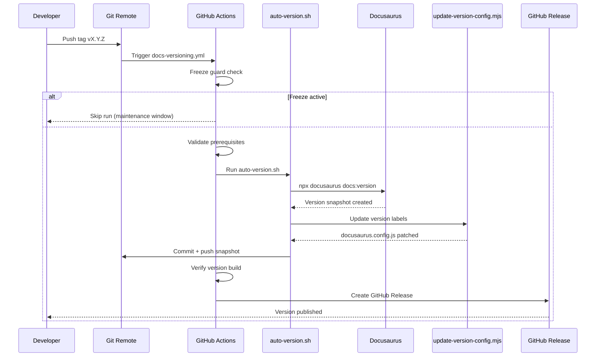

<!-- AUTO-GENERATED from governance source. Do not edit in docs/content. -->

# Documentation Versioning Automation

## 1. Overview

Automated documentation versioning keeps TradingSystem Docs consistent, validated, and release-ready with minimal manual effort. The GitHub Actions workflow combines validation, snapshotting, configuration updates, and release publishing into a single repeatable pipeline. Use automation for planned releases when CI/CD is available; fall back to manual steps only for emergencies or deep troubleshooting.

**Benefits**
- Enforces validation gates before a version ships
- Eliminates manual edits to `docusaurus.config.js`
- Generates auditable reports for each version
- Integrates directly with release tags and GitHub Releases

**When to use automation**
- Regular release cadence
- Coordinated product launches
- Any scenario where consistency and traceability are critical

**When to use manual versioning**
- Hotfixes during incidents
- Local experimentation or troubleshooting
- When CI/CD infrastructure is unavailable

## 2. Automated Workflow

### 2.1 Trigger Mechanism

- **Tag push**: Creating and pushing a semantic version tag (`v1.0.0`, `v2.1.0`, etc.) automatically starts the workflow.
- **Manual trigger**: Dispatch `docs-versioning.yml` from the GitHub Actions UI and provide the semantic version number.
- **Tag format**: Must match `v[0-9]+.[0-9]+.[0-9]+`.

Example:

```bash
git tag v1.0.0
git push origin v1.0.0
```

### 2.2 Workflow Steps

1. **Freeze Guard**  
   Checks `FREEZE-NOTICE.md` for an active maintenance freeze. Downstream jobs run only when the freeze is inactive.

2. **Validate Prerequisites**  
   Extracts the version number, validates semantic format, runs frontmatter validation (schema v2), executes the maintenance audit (`--ci-mode --ci-threshold 5`), and performs the full `npm run docs:check` suite.

3. **Create Version**  
   Executes `scripts/docs/auto-version.sh` to create the Docusaurus snapshot, update labels via `update-version-config.mjs`, generate a version report, and commit the changes back to `main`.

4. **Verify Version**  
   Confirms the new version exists in `versions.json`, verifies the `versioned_docs` and `versioned_sidebars` artifacts, counts MDX files, performs a production build, and spot-checks version routing using the live dev server.

5. **Create Release Notes**  
   Extracts the matching section from `CHANGELOG.md`, downloads workflow artifacts, creates a GitHub Release (`gh release create`), and uploads the version report plus the build artifact.

### 2.3 Workflow Diagram



## 3. Auto-Version Script

### 3.1 Script Overview

- **Location**: `scripts/docs/auto-version.sh`
- **Language**: Bash with optional Node.js helpers
- **Purpose**: Automate validation, snapshot creation, configuration updates, commits, and reporting

### 3.2 Command-Line Usage

```bash
# Basic run (manual review)
bash scripts/docs/auto-version.sh --version 1.0.0

# CI / GitHub Actions usage
bash scripts/docs/auto-version.sh --version 1.0.0 --auto-commit

# Dry-run (no writes)
bash scripts/docs/auto-version.sh --version 1.0.0 --dry-run

# Skip validation (not recommended)
bash scripts/docs/auto-version.sh --version 1.0.0 --skip-validation
```

### 3.3 Validation Steps

1. **Version Format** – Enforces semantic versioning `X.Y.Z`. Rejects prefixes (`v1.0.0`), short forms (`1.0`), and pre-release tags (`1.0.0-beta`).
2. **Version Existence** – Checks `versions.json` for duplicates. Exits with code `2` in CI mode or prompts interactively when run locally.
3. **Git Status** – Requires a clean working tree to guarantee the snapshot comes from a consistent state.
4. **Frontmatter Validation** – Executes `validate-frontmatter.py --schema v2 --docs-dir ./docs/content` to guarantee metadata quality.
5. **Maintenance Audit** – Runs `maintenance-audit.sh --ci-mode --ci-threshold 5`, enforcing a stricter threshold for release readiness.
6. **Build Validation** – Runs the complete `npm run docs:check` pipeline (`auto`, `validate-generated`, `lint`, `typecheck`, `test`, `build`).

### 3.4 Version Creation Process

1. **Create Snapshot** – Executes `npx docusaurus docs:version X.Y.Z`, generating `versioned_docs/`, `versioned_sidebars/`, and updating `versions.json`.
2. **Update Configuration** – Invokes `scripts/docs/update-version-config.mjs` to rewrite the `versions` block in `docusaurus.config.js` with fresh labels and paths.
3. **Verify Snapshot** – Ensures directories exist, counts MDX files, and performs a production build to confirm the version is deployable.
4. **Commit Changes** – Generates a conventional commit message, stages artifacts, and either commits for local review or commits + pushes (`--auto-commit`) in CI.

### 3.5 Version Report

- **Output**: `docs/reports/version-X.Y.Z-YYYYMMDD-HHMMSS.md`
- **Contents**:
  - Version metadata (time, commit, workflow)
  - Validation results and build duration
  - Artifact checklist (versions.json, versioned docs, sidebars, config)
  - Next steps and communication checklist

## 4. Version Label Logic

### 4.1 Label Generation Rules

- **Latest Stable**: `"X.Y.Z (Stable) ✅"` with `path: ''` (root) and `banner: 'none'`.
- **Previous Versions**: `"X.Y.Z"` with `path: 'vX.Y.Z'` and `banner: 'none'`.
- **Current (Unreleased)**: `"Next (Unreleased) 🚧"` with `path: 'next'` and `banner: 'unreleased'`.

### 4.2 Version Type Determination

- **First Version**: `versions.json` empty. New version becomes the stable root.
- **Major / Minor**: New version supersedes the previous root. The old stable moves to a versioned path.
- **Patch**: New version is added under `vX.Y.Z` without changing the stable root, enabling multiple LTS patch tracks.

### 4.3 Configuration Update Process

1. Read `versions.json` to determine the version list.
2. Identify the version type (first, major, minor, patch) and the current stable root.
3. Generate the canonical `versions` block with the correct labels and paths.
4. Replace the block in `docusaurus.config.js` via `update-version-config.mjs`.
5. Validate syntax with `node --check` before workflow completion.

## 5. Integration with Manual Process

### 5.1 When to Use Automated Versioning

- ✅ Planned releases with validated content
- ✅ Coordinated product or feature launches
- ✅ Scenarios needing consistent reproducibility

### 5.2 When to Use Manual Versioning

- ✅ Emergency hotfixes where CI/CD is blocked
- ✅ Local experimentation or validation troubleshooting
- ✅ Script or workflow debugging

### 5.3 Manual Procedure Reference

Follow the manual steps documented in [`VERSIONING-GUIDE.md`](/governance/versioning-guide) when automation is unavailable. The automated script implements the same 10-step process programmatically and can be executed locally for preview (`--dry-run`) or manual commits (`--auto-commit` omitted).

## 6. Troubleshooting

### 6.1 Workflow Failures

- **Validation fails in `validate-prerequisites`**
  - Check job logs for frontmatter or maintenance audit errors.
  - Resolve MDX metadata issues, stale documents, or lint failures.

- **Version already exists**
  - `auto-version.sh` exits with code `2`.
  - Confirm if version is intentional. Remove the existing version if overwrite is desired.

- **Commit or push rejected**
  - Ensure `contents: write` permissions are enabled.
  - Verify branch protection rules allow `github-actions[bot]` commits.
  - Resolve merge conflicts manually if multiple runs overlap.

- **Build fails after snapshot**
  - Inspect `verify-version` logs for build errors.
  - Roll back the commit (or delete the tag) and fix the content issues.

### 6.2 Script Failures

- **Invalid version format**
  - Ensure the version flag uses `X.Y.Z` (no `v` prefix).

- **Dirty working tree**
  - Commit or stash local changes before running the script.

- **Validation skipped inadvertently**
  - Remove `--skip-validation` unless debugging. Automation never sets it.

- **Configuration update errors**
  - If `update-version-config.mjs` fails, run `node --check docs/docusaurus.config.js`.
  - Manually reset the file (`git checkout -- docs/docusaurus.config.js`) and re-run the script.

### 6.3 Rollback Procedure

1. **Revert commit**  
   ```bash
   git revert <commit-sha>
   git push origin main
   ```

2. **Manual cleanup (before push)**  
   ```bash
   rm -rf docs/versioned_docs/version-X.Y.Z
   rm docs/versioned_sidebars/version-X.Y.Z-sidebars.json
   # Remove the version entry from docs/versions.json manually
   git checkout docs/docusaurus.config.js
   ```

3. **Verify post-rollback build**  
   ```bash
   cd docs
   npm run docs:build
   ```

## 7. Best Practices

### 7.1 Pre-Release Checklist

- [ ] All planned content merged
- [ ] CHANGELOG updated with release notes
- [ ] Frontmatter validation passes locally
- [ ] Maintenance audit health score within threshold
- [ ] Stakeholder sign-off complete
- [ ] Freeze window cleared

### 7.2 Version Naming

- **Major** (`X.0.0`): Breaking changes or major feature sets
- **Minor** (`X.Y.0`): Backward-compatible enhancements
- **Patch** (`X.Y.Z`): Bug fixes or documentation corrections

### 7.3 Release Timing

- Schedule releases during low-traffic periods
- Avoid overlapping with infrastructure freezes
- Coordinate announcements with marketing and operations

### 7.4 Communication

- Announce in DocsOps or release Slack channels
- Update internal knowledge bases or runbooks
- Link GitHub Release notes in stakeholder updates

## 8. Monitoring & Metrics

### 8.1 Metrics to Track

1. **Versioning success rate** – Percentage of successful workflow runs.
2. **Validation failure rate** – Frequency of frontmatter or audit failures.
3. **Build duration** – Track `npm run docs:build` runtime for performance regressions.
4. **Active version count** – Maintain ≤3 stable versions to control maintenance effort.

### 8.2 Alerts

- Automatic issue creation on workflow failure (planned enhancement).
- Investigate build durations exceeding 10 minutes.
- Review deprecation policy when more than four stable versions exist.

## 9. Related Documentation

- [`VERSIONING-GUIDE.md`](/governance/versioning-guide) – Manual versioning process.
- [`CI-CD-INTEGRATION.md`](/governance/ci-cd-integration) – Overview of documentation workflows.
- [`VALIDATION-GUIDE.md`](/governance/validation-guide) – Frontmatter and maintenance validation.
- Workflow source: `.github/workflows/docs-versioning.yml`
- Automation scripts: `scripts/docs/auto-version.sh`, `scripts/docs/update-version-config.mjs`

## 10. Appendix

### 10.1 Command Reference

**Automated versioning**

```bash
# Tag-driven
git tag vX.Y.Z
git push origin vX.Y.Z

# Manual dispatch via GitHub UI
# Actions → docs-versioning → Run workflow → Enter X.Y.Z
```

**Local automation with manual review**

```bash
cd /home/marce/Projetos/TradingSystem
bash scripts/docs/auto-version.sh --version X.Y.Z
git diff
git push origin main
```

**Validation helpers**

```bash
python scripts/docs/validate-frontmatter.py --schema v2 --docs-dir ./docs/content
bash scripts/docs/maintenance-audit.sh --ci-mode --ci-threshold 5
cd docs && npm run docs:check
```

**Rollback commands**

```bash
git revert <commit-sha>
git push origin main

rm -rf docs/versioned_docs/version-X.Y.Z
rm docs/versioned_sidebars/version-X.Y.Z-sidebars.json
git checkout docs/docusaurus.config.js
```

### 10.2 Version Report Example

```markdown
# Documentation Version Report: 1.0.0

**Created**: 2025-11-03 14:30:00 UTC  
**Commit**: abc123def456  
**Workflow**: docs-versioning.yml  
**Trigger**: Tag push v1.0.0

## Summary

- ✅ Version created successfully
- ✅ Validations passed (frontmatter, audit, build)
- ✅ Build duration: 75s
- ✅ Files versioned: 199

## Validation Results

- Frontmatter: passed
- Maintenance audit: passed
- Docs build: passed

## Artifacts

- versions.json
- versioned_docs/version-1.0.0/
- versioned_sidebars/version-1.0.0-sidebars.json
- docusaurus.config.js

## Next Steps

1. Push commit to `main`
2. Publish GitHub Release `v1.0.0`
3. Notify stakeholders (#docsops)
4. Monitor production deployment
```
