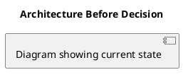
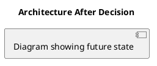

## Template

> Use this template to document significant architecture decisions. Save ADRs under `backend/architecture/decisions/` or `frontend/architecture/decisions/`.

### ADR Header

**ADR ID**: ADR-XXXX

**Title**: [Decision Title - e.g., "Use TimescaleDB for Time-Series Data"]

**Status**: [Proposed | Accepted | Deprecated | Superseded]

**Date**: YYYY-MM-DD

**Authors**: [Name(s)]

**Reviewers**: [Name(s)]

### Context

**Background**: [What is the situation and problem we're addressing?]

**Constraints**: [What limitations or requirements must we work within?]

**Assumptions**: [What are we assuming to be true?]

**Problem Statement**: [Clear statement of the problem this decision solves]

### Decision

**We will**: [Clear present-tense statement of the decision]

**Rationale**: [Why this decision was made]

**Key Factors**:

1. [Factor 1 - e.g., Performance requirements]
2. [Factor 2 - e.g., Team expertise]
3. [Factor 3 - e.g., Cost considerations]

### Options Considered

#### Option 1: [Option Name]

**Description**: [Brief description]

**Pros**:

- ✅ [Advantage 1]
- ✅ [Advantage 2]

**Cons**:

- ❌ [Disadvantage 1]
- ❌ [Disadvantage 2]

**Decision**: [Chosen | Rejected]

---

#### Option 2: [Option Name]

**Description**: [Brief description]

**Pros**:

- ✅ [Advantage 1]

**Cons**:

- ❌ [Disadvantage 1]

**Decision**: [Chosen | Rejected]

---

#### Option 3: [Option Name]

[Continue with additional options...]

### Architecture Impact

**Before** (optional - include diagram):

**After** (optional - include diagram):

**Components Affected**:

- [Component 1]: [How it's affected]
- [Component 2]: [How it's affected]

**Integration Points**:

- [Integration 1]: [Changes required]
- [Integration 2]: [Changes required]

### Consequences

**Positive**:

- ✅ [Benefit 1]
- ✅ [Benefit 2]

**Negative**:

- ⚠️ [Trade-off 1]
- ⚠️ [Trade-off 2]

**Risks**:

- 🔴 [Risk 1]: [Mitigation strategy]
- 🟡 [Risk 2]: [Mitigation strategy]

**Technical Debt**:

- [Debt item 1]: [Plan to address]
- [Debt item 2]: [Plan to address]

### Implementation Notes

**Required Changes**:

1. [Change 1 - e.g., Update database schema]
2. [Change 2 - e.g., Modify API endpoints]
3. [Change 3 - e.g., Update frontend components]

**Migration Path**:

1. [Step 1 - e.g., Deploy new service version]
2. [Step 2 - e.g., Migrate data]
3. [Step 3 - e.g., Update clients]

**Timeline**: [Estimated implementation time]

### Metrics & Monitoring

**Success Criteria**:

- [Metric 1]: [Target value]
- [Metric 2]: [Target value]

**Monitoring**:

- [What to monitor]
- [Alert thresholds]
- [Dashboard links]

### Rollback Strategy

**If Decision Proves Problematic**:

1. [Rollback step 1]
2. [Rollback step 2]
3. [Rollback step 3]

**Rollback Triggers**:

- [Trigger 1 - e.g., Performance degradation &gt;20%]
- [Trigger 2 - e.g., Error rate &gt;5%]

### References

**Related ADRs**:

- Link to previous or follow-up ADRs (e.g., ``../../reference/adrs/ADR-0001``) and describe the relationship.

**Related Documentation**:

- PRD reference (e.g., product feature document).
- Technical specification in the SDD catalogue.
- Implementation guide describing rollout details.

**External References**:

- [Link to external resource]
- [Link to vendor documentation]

### Approval

| Role | Name | Date | Status |
|------|------|------|--------|
| Tech Lead | [Name] | YYYY-MM-DD | ✅ Approved |
| Product Manager | [Name] | YYYY-MM-DD | ✅ Approved |
| Security | [Name] | YYYY-MM-DD | ✅ Approved |
| DevOps | [Name] | YYYY-MM-DD | ✅ Approved |

### Change Log

| Date | Author | Changes |
|------|--------|----------|
| YYYY-MM-DD | [Name] | Initial draft |
| YYYY-MM-DD | [Name] | Added architecture diagrams |
| YYYY-MM-DD | [Name] | Approved after review |

---

**Example Usage**: Use this template for ADRs like "ADR-0001: Use LowDB for MVP Storage", "ADR-0002: Introduce Kestra for Orchestration", "ADR-0003: Choose TimescaleDB over PostgreSQL".
