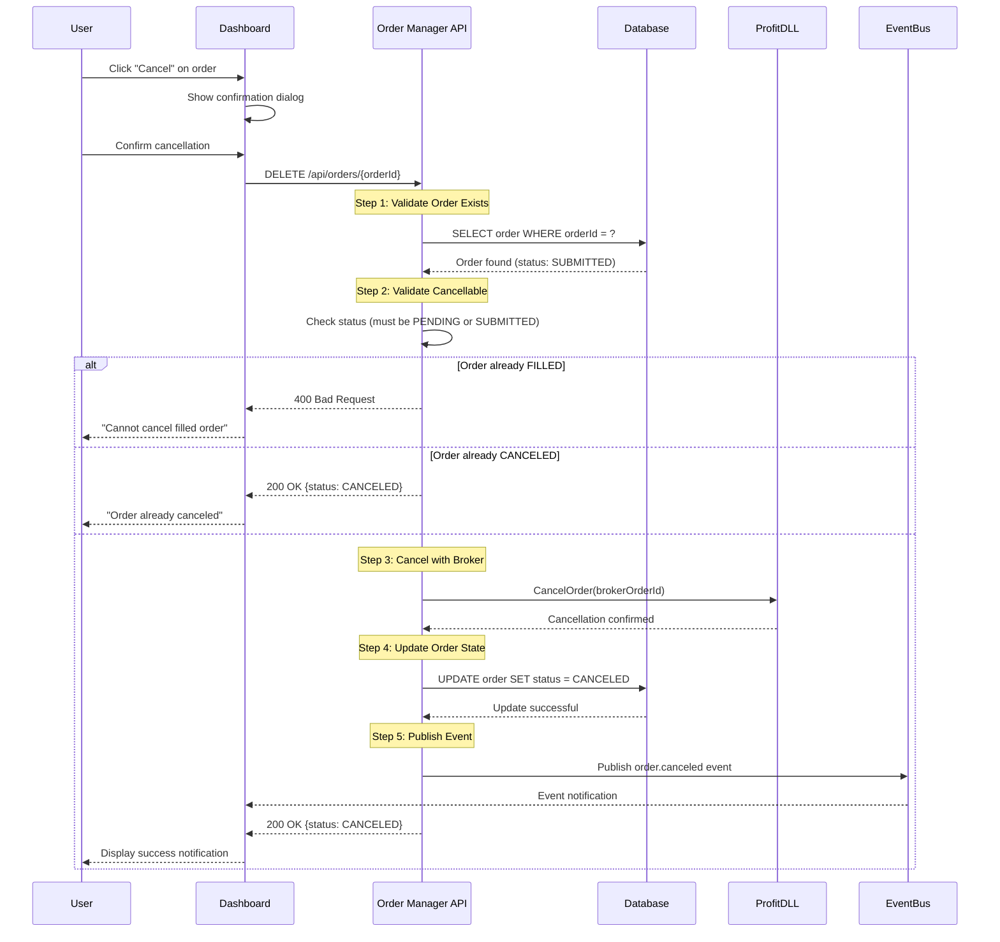

## Overview

The Cancel Order flow describes the sequence for canceling a pending or submitted order, including validation, broker cancellation, state updates, and notifications.

**Flow Name**: Cancel Order  
**Version**: v1  
**Status**: Specification (implementation pending)  
**Trigger**: User cancels order via Dashboard or API client

## Flow Diagram

## Steps

### Step 1: Validate Order Exists

**Responsibility**: Order Manager API  
**Duration**: &lt;50ms

**Actions**
1. Extract `orderId` from URL
2. Query database `SELECT * FROM orders WHERE orderId = ?`
3. If not found, return 404 Not Found

### Step 2: Validate Cancellable

**Responsibility**: Order Manager API  
**Duration**: &lt;10ms

**Checks**
- Status must be `PENDING`, `SUBMITTED`, or `PARTIALLY_FILLED`
- `FILLED` orders not cancellable
- `CANCELED` and `REJECTED` treated as idempotent success
- Authorize user (future authentication)

### Step 3: Cancel with Broker

**Responsibility**: Order Manager API + ProfitDLL  
**Duration**: &lt;200ms p95

**Actions**
- If status `PENDING`, skip broker call (not yet submitted)
- If `SUBMITTED` or `PARTIALLY_FILLED`, call ProfitDLL `CancelOrder`
- Retry up to 3 times on failure (exponential backoff)
- On confirmed cancellation, proceed to update state

### Step 4: Update Order State

**Responsibility**: Order Manager API  
**Duration**: &lt;50ms

**Actions**
- Update database `status = CANCELED`, set `canceledAt`, `updatedAt`
- Persist remaining quantity and fills
- Update positions to reflect released quantity
- Log cancellation to audit trail

### Step 5: Publish Event

**Responsibility**: Order Manager API  
**Duration**: &lt;50ms

**Actions**
- Publish `order.canceled` event with payload `{orderId, status, canceledAt, reason}`
- Return 200 OK response
- Dashboard updates list based on event or response

## State Changes

**Valid Transitions**
- PENDING → CANCELED
- SUBMITTED → CANCELED
- PARTIALLY_FILLED → CANCELED (remaining quantity)
- FAILED → CANCELED (after retries exhausted)

**Invalid Transitions**
- FILLED → CANCELED (reject with 400)
- REJECTED → CANCELED (idempotent success)

**Field Updates**
- `status`: Set to `CANCELED`
- `canceledAt`: Current timestamp
- `updatedAt`: Current timestamp
- `fills`: Preserved
- `filledQuantity`: Preserved

## Notifications

**Dashboard**
- Toast: "Order ORD-XXXX canceled successfully"
- Remove from active list or mark as canceled
- Refresh position summaries

**Event Consumers**
- Audit service logs cancellation
- Analytics updates cancellation metrics
- Monitoring increments `order_manager_orders_total{status="CANCELED"}`

**Alerts**
- High cancellation rate (&gt;20% in 1 hour) triggers alert
- Kill switch activation cancels all orders and alerts operators

## Idempotency

- Canceling already-canceled order returns 200 OK with existing state
- Repeated cancellation attempts safe (idempotent endpoint)
- Protects against client retries and network retries

## Performance Considerations

- End-to-end latency target: &lt;200ms p95
- Broker cancellation: &lt;200ms p95
- Database update: &lt;50ms
- Support 100 concurrent cancellations
- Handle race condition with fills using optimistic locking

## Related Documentation

- [Order Schema](../../domain/schemas/v1/order)
- [Order Canceled Event](../../events/v1/order-canceled)
- [Place Order Flow](./place-order)
- [Order Manager API](../../api/order-manager)
- [State Machine Diagram](/diagrams) (when migrated)
