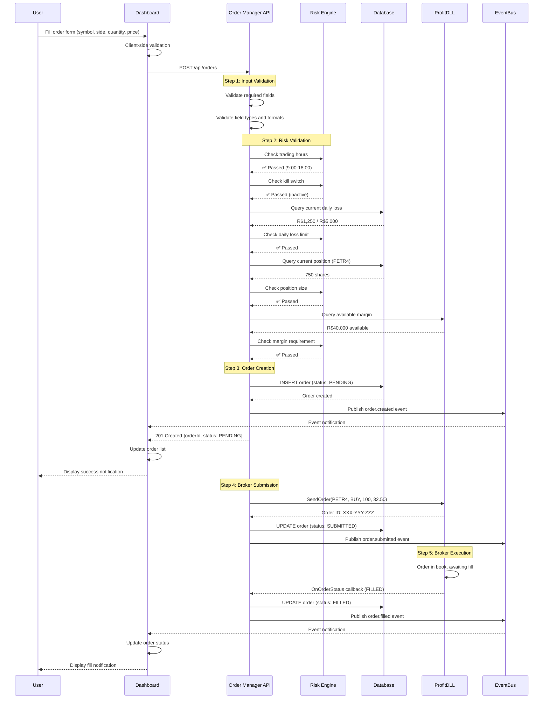

## Overview

The Place Order flow describes the complete sequence for creating and submitting a trading order through TradingSystem, from initial request to broker submission.

**Flow Name**: Place Order  
**Version**: v1  
**Status**: Specification (implementation pending)  
**Trigger**: User submits order via Dashboard or API client

## Flow Diagram

## Steps

### Step 1: Input Validation

**Responsibility**: Order Manager API  
**Duration**: &lt;10ms

**Validations**

1. Validate required fields present: `symbol`, `side`, `type`, `quantity`
2. Validate field types: `quantity` is integer, `price` is decimal
3. Validate enums: `side` in [BUY, SELL], `type` in [MARKET, LIMIT, STOP, STOP_LIMIT]
4. Validate conditional fields: `price` required for LIMIT, `stopPrice` required for STOP
5. Validate ranges: `quantity` > 0, `price` > 0

**Success**: Proceed to Step 2  
**Failure**: Return 400 Bad Request with validation errors

### Step 2: Risk Validation

**Responsibility**: Risk Engine (within Order Manager)  
**Duration**: &lt;100ms p95

**Risk Checks (in sequence)**

1. **Trading Hours**: Reject if current time outside configured hours
2. **Kill Switch**: Reject if kill switch active
3. **Daily Loss Limit**: Reject if `currentDailyLoss &gt;= dailyLossLimit`
4. **Position Size Limit**: Reject if `currentPosition + orderQuantity > maxPositionSize[symbol]`
5. **Margin Requirement**: Reject if insufficient margin from broker

**Success**: All checks pass, proceed to Step 3  
**Failure**: Return 403 Forbidden with specific rejection reason

### Step 3: Order Creation

**Responsibility**: Order Manager API  
**Duration**: &lt;50ms

**Actions**

1. Generate `orderId` (format `ORD-YYYYMMDD-NNN`)
2. Set status to `PENDING`
3. Apply timestamps `createdAt` and `updatedAt`
4. Check idempotency key and return existing order if duplicate
5. Insert order into database
6. Publish `order.created` event
7. Return 201 Created response

**Success**: Order created, event published, proceed to Step 4  
**Failure**: Return 500 Internal Server Error if database or event bus fails

### Step 4: Broker Submission

**Responsibility**: Order Manager API + ProfitDLL  
**Duration**: &lt;500ms p95

**Actions**

1. Call ProfitDLL `SendOrder`
2. Await broker acknowledgment (timeout 5 seconds)
3. Receive broker order ID
4. Update order status to `SUBMITTED`
5. Persist broker order ID
6. Publish `order.submitted` event

**Success**: Order submitted, proceed to Step 5  
**Failure**: Set status to `FAILED`, capture error context, retry up to 3 times, and publish `order.failed` if retries are exhausted (transitioning to `REJECTED`)

### Step 5: Broker Execution

**Responsibility**: ProfitDLL + Broker  
**Duration**: Variable (market driven)

**Actions**

1. Broker places order in book
2. ProfitDLL emits status callbacks
3. Update order status to `PARTIALLY_FILLED` or `FILLED`
4. Record fills (quantity, price, timestamp)
5. Publish corresponding events (`order.filled`, etc.)
6. Update positions and audit log

**Success**: Order reaches terminal state  
**Failure**: Handle `CANCELED`, `REJECTED`, `FAILED`, or `EXPIRED` outcomes

## Validations

**Pre-Conditions**

- User authenticated (future)
- Order Manager service healthy
- ProfitDLL connection active
- Database accessible
- Event bus available (degrades gracefully)

**Post-Conditions**

- Order persisted with status `PENDING` or `SUBMITTED`
- `order.created` event published
- Client receives confirmation
- Risk checks logged to audit trail

**Invariants**

- Order ID unique
- Status transitions follow state machine
- Risk checks recorded (pass or fail)
- Timestamps increase monotonically

## Error Scenarios

### Scenario 1: Risk Check Failure

- Input validation passes
- Risk validation fails (e.g., daily loss limit)
- Order not persisted
- API returns 403 Forbidden with reason

### Scenario 2: Database Failure

- Risk checks pass
- Database insert fails
- Order not created
- API returns 500 Internal Server Error

### Scenario 3: Event Bus Failure

- Order created successfully
- Event publication fails
- Error logged, API returns 201 Created
- Event lost (acceptable for MVP)

### Scenario 4: ProfitDLL Disconnected

- Order created (status `PENDING`)
- Broker submission fails
- Status updated to `FAILED` then retried
- After retries, publish `order.failed`, set status `REJECTED`, and surface reason to client

### Scenario 5: Time-in-Force Expiration

- Order remains `SUBMITTED` without fills past `timeInForce`
- Broker or scheduler triggers expiration
- Status transitions to `EXPIRED`
- Publish `order.canceled` (if broker cancels) or future `order.expired` event once defined

## Performance Considerations

- Total latency target: &lt;500ms p95 (Steps 1-4)
- Input validation: &lt;10ms
- Risk validation: &lt;100ms p95
- Order creation: &lt;50ms
- Broker submission: &lt;500ms p95
- Support 100 concurrent order placements
- Use database transactions for consistency

## Related Documentation

- [Order Schema](../../domain/schemas/v1/order.mdx)
- [Risk Rule Schema](../../domain/schemas/v1/risk-rule.mdx)
- [Order Created Event](../../events/v1/order-created.mdx)
- [Order Failed Event](../../events/v1/order-failed.mdx)
- [Cancel Order Flow](cancel-order.mdx)
- [Order Manager API](https://github.com/marceloterra1983/TradingSystem/blob/main/docs/content/sdd/api/order-manager)
- [State Machine Diagram](/diagrams) (when migrated)
