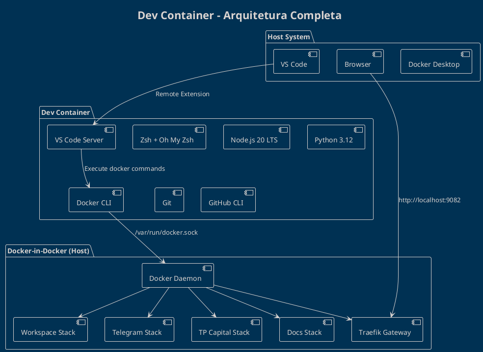

# Dev Container - Arquitetura

## 🎯 Visão Geral Arquitetural

O Dev Container é uma **arquitetura em camadas** que combina:
1. **Base Image** - Ubuntu 22.04 LTS
2. **Runtime Layer** - Node.js, Python, Docker CLI
3. **Tools Layer** - Git, Zsh, direnv, etc
4. **VS Code Integration** - VS Code Server + Extensions

```
┌─────────────────────────────────────────────────────────┐
│  Host System (Windows/Mac/Linux)                        │
│  ├─> Docker Desktop                                     │
│  ├─> VS Code (UI)                                       │
│  └─> Browser (http://localhost:9082)                    │
└─────────────────────────────────────────────────────────┘
         ↓ Docker Remote API
┌─────────────────────────────────────────────────────────┐
│  Dev Container (Docker Container)                       │
│  ├─> VS Code Server                                     │
│  ├─> Zsh shell (default)                                │
│  ├─> Node.js 20 LTS                                     │
│  ├─> Python 3.12                                        │
│  ├─> Docker CLI (connected to host daemon)              │
│  └─> Git + GitHub CLI                                   │
└─────────────────────────────────────────────────────────┘
         ↓ Docker socket (/var/run/docker.sock)
┌─────────────────────────────────────────────────────────┐
│  Docker Daemon (Host)                                   │
│  ├─> Traefik Gateway (9082, 9083)                       │
│  ├─> Dashboard UI (3103)                                │
│  ├─> Backend APIs (3200, 4005, 4010)                    │
│  ├─> Databases (PostgreSQL, TimescaleDB, Redis)         │
│  └─> Monitoring (Prometheus, Grafana)                   │
└─────────────────────────────────────────────────────────┘
```

## 📦 Container Layers (Image Build)

### Layer 1: Base Image

**Image:** `mcr.microsoft.com/devcontainers/base:jammy`

**Inclui:**
- ✅ Ubuntu 22.04 LTS (Jammy)
- ✅ Common dev tools (curl, wget, ca-certificates)
- ✅ Non-root user (`vscode`)
- ✅ Sudo access configured

**Dockerfile:**
```dockerfile
FROM mcr.microsoft.com/devcontainers/base:jammy

# Usa usuário root para instalação
USER root
```

### Layer 2: System Packages

**Installed via apt:**
```dockerfile
RUN apt-get update && apt-get install -y \
    git \
    curl \
    wget \
    jq \
    ca-certificates \
    gnupg \
    lsb-release \
    build-essential \
    python3-pip \
    python3-venv \
    && rm -rf /var/lib/apt/lists/*
```

**Propósito:**
- `git` - Controle de versão
- `curl/wget` - Download de arquivos
- `jq` - Processar JSON na linha de comando
- `build-essential` - Compiladores C/C++ (para pacotes nativos npm/pip)
- `python3-pip/venv` - Python package management

### Layer 3: Docker CLI

**Instalação:**
```dockerfile
# Adicionar Docker repository
RUN curl -fsSL https://download.docker.com/linux/ubuntu/gpg | gpg --dearmor -o /usr/share/keyrings/docker-archive-keyring.gpg

RUN echo \
  "deb [arch=$(dpkg --print-architecture) signed-by=/usr/share/keyrings/docker-archive-keyring.gpg] https://download.docker.com/linux/ubuntu \
  $(lsb_release -cs) stable" | tee /etc/apt/sources.list.d/docker.list > /dev/null

RUN apt-get update && apt-get install -y docker-ce-cli
```

**Importante:**
- ⚠️ **Apenas Docker CLI** é instalado (não o daemon)
- ⚠️ Docker daemon **roda no host** (Docker Desktop)
- ✅ CLI se conecta via socket mount: `/var/run/docker.sock:/var/run/docker.sock`

### Layer 4: Node.js (via nvm)

**Instalação:**
```dockerfile
# Install nvm
RUN curl -o- https://raw.githubusercontent.com/nvm-sh/nvm/v0.39.0/install.sh | bash

# Install Node.js 20 LTS
RUN bash -c "source ~/.nvm/nvm.sh && nvm install 20 && nvm use 20 && nvm alias default 20"

# Install global packages
RUN npm install -g npm@latest pnpm@latest
```

**Versão:** Node.js 20.x LTS (atualizado automaticamente para última minor/patch)

**Pacotes Globais:**
- `npm` - Gerenciador de pacotes (latest)
- `pnpm` - Alternativa rápida ao npm

### Layer 5: Python (via pyenv)

**Instalação:**
```dockerfile
# Install pyenv dependencies
RUN apt-get update && apt-get install -y \
    make \
    libssl-dev \
    zlib1g-dev \
    libbz2-dev \
    libreadline-dev \
    libsqlite3-dev \
    llvm \
    libncursesw5-dev \
    xz-utils \
    tk-dev \
    libxml2-dev \
    libxmlsec1-dev \
    libffi-dev \
    liblzma-dev

# Install pyenv
RUN curl https://pyenv.run | bash

# Install Python 3.12
RUN bash -c "export PATH=\"$HOME/.pyenv/bin:$PATH\" && eval \"\$(pyenv init -)\" && pyenv install 3.12 && pyenv global 3.12"
```

**Versão:** Python 3.12.x (latest stable)

### Layer 6: Shell (Zsh + Oh My Zsh)

**Instalação:**
```dockerfile
# Install Zsh
RUN apt-get install -y zsh

# Install Oh My Zsh
RUN sh -c "$(curl -fsSL https://raw.githubusercontent.com/ohmyzsh/ohmyzsh/master/tools/install.sh)" "" --unattended

# Install Powerlevel10k theme
RUN git clone --depth=1 https://github.com/romkatv/powerlevel10k.git ${ZSH_CUSTOM:-$HOME/.oh-my-zsh/custom}/themes/powerlevel10k

# Set Zsh as default shell
RUN chsh -s $(which zsh) vscode
```

**Plugins Habilitados:**
- `git` - Git aliases e prompt info
- `docker` - Docker completion
- `docker-compose` - Docker Compose completion
- `npm` - NPM completion
- `node` - Node.js version in prompt

### Layer 7: Additional Tools

**direnv (Auto-activation):**
```dockerfile
RUN curl -sfL https://direnv.net/install.sh | bash
RUN echo 'eval "$(direnv hook zsh)"' >> ~/.zshrc
```

**GitHub CLI:**
```dockerfile
RUN curl -fsSL https://cli.github.com/packages/githubcli-archive-keyring.gpg | dd of=/usr/share/keyrings/githubcli-archive-keyring.gpg
RUN echo "deb [arch=$(dpkg --print-architecture) signed-by=/usr/share/keyrings/githubcli-archive-keyring.gpg] https://cli.github.com/packages stable main" | tee /etc/apt/sources.list.d/github-cli.list > /dev/null
RUN apt-get update && apt-get install gh -y
```

### Layer 8: VS Code Server

**Instalado automaticamente** pelo VS Code Remote Extension:
- ✅ VS Code Server binary
- ✅ Extensions specified in `devcontainer.json`
- ✅ Settings synchronized

**Não precisa configurar manualmente!**

## 🌐 Network Architecture

### Dev Container Network

O Dev Container está conectado a **múltiplas redes Docker**:

```
┌─────────────────────────────────────────────────────────┐
│  Dev Container                                          │
│  ├─> eth0: bridge (default Docker network)             │
│  ├─> tradingsystem_backend (custom network)            │
│  └─> tradingsystem_frontend (custom network)           │
└─────────────────────────────────────────────────────────┘
```

**Configuração (`devcontainer.json`):**
```json
{
  "runArgs": [
    "--network=tradingsystem_backend",
    "--network=tradingsystem_frontend"
  ]
}
```

### Network Access Patterns

#### 1. Browser → Host Ports (Port Forwarding)

```
Browser → http://localhost:9082
         ↓ (forwarded by Docker)
Host Port 9082 → Container Port 9082 (Traefik Gateway)
```

**Como funciona:**
- Docker Desktop **mapeia portas** do container para o host
- `-p 9082:9080` → Porta 9082 no host → Porta 9080 no container
- Browser acessa `localhost:9082` (host)

#### 2. Dev Container → Docker Containers (Container Networking)

```
Dev Container → workspace-api:3200
              ↓ (via tradingsystem_backend network)
Workspace API Container (3200)
```

**Como funciona:**
- Containers na **mesma rede** podem se comunicar pelo **nome do serviço**
- DNS interno do Docker resolve `workspace-api` → IP do container
- Sem necessidade de `localhost` ou IPs hardcoded

#### 3. Dev Container → Docker Daemon (Socket Mount)

```
Dev Container → docker ps
              ↓ (/var/run/docker.sock mount)
Host Docker Daemon → Lista containers do host
```

**Como funciona:**
- Docker socket **montado** do host para o container
- Dev Container CLI **se conecta** ao daemon do host
- Commands executados **afetam o host** (não o container)

## 💾 Volume Mounts

### Workspace Mount (Bind Mount)

```json
{
  "workspaceFolder": "/workspace",
  "workspaceMount": "source=${localWorkspaceFolder},target=/workspace,type=bind"
}
```

**Propósito:**
- ✅ Código-fonte sincronizado entre host e container
- ✅ Alterações no host **refletem imediatamente** no container
- ✅ Git operations afetam diretório do host
- ✅ Persistência de código fora do container

**Diretório:**
- Host: `/home/marce/Projetos/TradingSystem`
- Container: `/workspace`

### Docker Socket Mount (Bind Mount)

```json
{
  "mounts": [
    "source=/var/run/docker.sock,target=/var/run/docker.sock,type=bind"
  ]
}
```

**Propósito:**
- ✅ Dev Container pode **gerenciar containers do host**
- ✅ `docker compose up/down` afetam host
- ✅ `docker ps` lista containers do host
- ⚠️ **Segurança:** Container tem acesso privilegiado ao Docker daemon

### Node Modules Cache (Named Volume)

```json
{
  "mounts": [
    "source=tradingsystem-node-modules,target=/workspace/node_modules,type=volume"
  ]
}
```

**Propósito:**
- ✅ `node_modules` **não sincronizado** com host (performance)
- ✅ Instalações npm **persistem** entre rebuilds
- ✅ Evita conflitos com host OS (Windows vs Linux binaries)
- ⚠️ Rebuild do container **preserva** node_modules

**Named Volume:** `tradingsystem-node-modules` (gerenciado pelo Docker)

### Python Virtual Environment (Named Volume)

```json
{
  "mounts": [
    "source=tradingsystem-python-venv,target=/workspace/.venv,type=volume"
  ]
}
```

**Propósito:**
- ✅ Virtual environment **isolado** do host
- ✅ Pacotes pip **persistem** entre rebuilds
- ✅ direnv ativa automaticamente ao `cd /workspace`

## 🔄 Process Tree

### Init System

**PID 1:** `/bin/sh -c while sleep 1000; do :; done`

**Propósito:**
- ✅ Container não sai quando shell é fechado
- ✅ VS Code Server pode reiniciar sem matar container
- ✅ Background processes podem rodar

### VS Code Server

**PID 150-200** (aproximadamente): `node /vscode-server/bin/[version]/server.js`

**Propósito:**
- ✅ Comunica com VS Code UI (no host)
- ✅ Executa extensions dentro do container
- ✅ Gerencia terminal integrado

### User Shell (Zsh)

**PID varia**: `/bin/zsh` (quando terminal é aberto)

**Propósito:**
- ✅ Shell interativo do desenvolvedor
- ✅ Executa commands (`npm`, `docker`, `git`, etc)
- ✅ Múltiplos terminais = múltiplos processos Zsh

### Docker CLI Calls

**Exemplo:** `docker compose up -d workspace-api`

**Processo:**
1. Zsh shell executa `docker` binary
2. Docker CLI se conecta ao daemon via `/var/run/docker.sock`
3. Daemon (no host) cria container `workspace-api`
4. Container aparece em `docker ps` (executado no host)

**Importante:**
- ⚠️ Docker CLI roda **dentro do Dev Container**
- ⚠️ Docker daemon roda **no host**
- ✅ Resultado: Container criado **no host** (não dentro do Dev Container)

## 🔐 Security Considerations

### Docker Socket Access (Root Equivalent)

**Risco:**
```bash
# Dentro do Dev Container (com Docker socket)
docker run --rm -v /:/host -it alpine chroot /host /bin/bash
# Agora você tem shell root no HOST!
```

**Mitigação:**
- ✅ Apenas desenvolvedores confiáveis têm acesso
- ✅ Workspace mount é read-write (mas isolado)
- ✅ Container roda como non-root user (`vscode`)
- ⚠️ Docker socket é **necessário** para gerenciar services

**Política:** Ver [Security Guide](../../governance/controls/dev-container-security.md)

### Non-Root User

**Default User:** `vscode` (UID 1000, GID 1000)

```json
{
  "remoteUser": "vscode"
}
```

**Propósito:**
- ✅ Evita criar arquivos como root no host
- ✅ Permissões corretas em workspace mount
- ✅ Sudo disponível para instalações (`sudo apt-get install`)

### Environment Variables (.env)

**Onde está:**
- Host: `/home/marce/Projetos/TradingSystem/.env`
- Container: `/workspace/.env` (bind mount)

**Acesso:**
- ✅ Dev Container pode **ler** `.env`
- ✅ Vite/Node.js **carregam** variáveis automaticamente
- ⚠️ `.env` **NÃO deve ser commitado** (contém secrets)

**Validação:**
```bash
# Dentro do Dev Container
bash scripts/env/validate-env.sh
```

## 📊 Resource Limits

### Default Limits (Docker Desktop)

**Nenhum limite específico configurado.**

Docker Desktop usa configuração global:
- **CPU:** Todos os cores disponíveis
- **Memory:** Até limite configurado em Docker Desktop Settings
- **Disk:** Até limite de VM do Docker Desktop

### Monitoring

```bash
# Ver uso de recursos do Dev Container
docker stats tradingsystem-dev-container

# Ver todos os containers (incluindo Dev Container)
docker stats
```

**Output esperado:**
```
CONTAINER              CPU %  MEM USAGE / LIMIT    MEM %  NET I/O        BLOCK I/O
tradingsystem-dev      2.5%   500MiB / 8GiB        6.25%  10MB / 5MB     100MB / 50MB
```

## 🔧 Rebuild Scenarios

### Quando fazer Rebuild?

**Rebuild necessário:**
- ✅ Atualizar Node.js/Python version
- ✅ Adicionar system packages (`apt-get install`)
- ✅ Modificar Dockerfile
- ✅ Atualizar base image
- ✅ Adicionar VS Code extensions
- ✅ Modificar `devcontainer.json` (alguns campos)

**Rebuild NÃO necessário:**
- ❌ Atualizar código-fonte (workspace mount)
- ❌ Instalar npm packages (`npm install`)
- ❌ Instalar pip packages (`pip install`)
- ❌ Modificar `.env` (bind mount)

### Como fazer Rebuild?

**VS Code Command Palette:**
```
Ctrl+Shift+P → Dev Containers: Rebuild Container
```

**Opções:**
1. **Rebuild** - Rebuild image e recriar container
2. **Rebuild Without Cache** - Rebuild do zero (lento, mas clean)

**Tempo esperado:**
- Rebuild normal: ~2-5 minutos
- Rebuild sem cache: ~10-15 minutos

## 📈 Performance Considerations

### File System Performance

**Bind Mount (Workspace):**
- ⚠️ Mais lento que volumes nativos (especialmente Windows/Mac)
- ✅ Necessário para sincronização de código
- ✅ Git operations diretas no host

**Named Volumes (node_modules, .venv):**
- ✅ Performance nativa (dentro do Docker)
- ✅ Evita overhead de sincronização
- ✅ Recomendado para dependências

### Build Performance

**Layer Caching:**
- ✅ Docker cacheia layers que não mudaram
- ✅ Modificações em layers superiores não invalidam inferiores
- ✅ Ordem otimizada (base → runtimes → tools)

**Multi-stage Builds:**
- ❌ Não usado (Dev Container é single-stage)
- ✅ Não necessário (não é produção)

### Runtime Performance

**CPU:**
- ✅ Native performance (container não virtualiza CPU)
- ✅ Node.js/Python rodam na mesma velocidade do host

**Memory:**
- ✅ Container usa memória do host diretamente
- ⚠️ Múltiplos containers + Dev Container = alto uso de RAM

**Disk I/O:**
- ✅ Volumes nativos (node_modules) = rápido
- ⚠️ Bind mounts (workspace) = lento em Windows/Mac (WSL2 ajuda)

## 🎨 PlantUML Diagrams

### Dev Container Architecture



:::note
Os renders em PNG são gerados automaticamente a partir dos arquivos `.puml` durante o fluxo `npm run docs:auto`. Execute esse comando sempre que atualizar os diagramas para repopular `docs/content/diagrams/rendered/tools/` antes de rodar `npm run docs:links`.
:::

**Diagrama Fonte:** [dev-container-architecture.puml](https://github.com/marceloterra1983/TradingSystem/blob/main/docs/content/diagrams/source/tools/dev-container-architecture.puml)

### Network Topology

```plantuml
@startuml dev-container-network
!theme blueprint
title Dev Container - Topologia de Redes

' Networks
cloud "Host Network" {
  [Browser] : Port 9082
}

node "Dev Container Network" {
  [Vite Dev Server] : Port 5173
  [VS Code Server] : Port 8080
}

cloud "Docker Networks" {
  node "tradingsystem_backend" {
    [workspace-api]
    [tp-capital-api]
    [telegram-api]
  }

  node "tradingsystem_frontend" {
    [Traefik Gateway] : Port 9082
    [docs-hub]
  }
}

' Connections
[Browser] --> [Traefik Gateway] : http://localhost:9082
[Vite Dev Server] --> [workspace-api] : Proxy
[Vite Dev Server] --> [Traefik Gateway] : Proxy
[Traefik Gateway] --> [workspace-api] : Route
[Traefik Gateway] --> [tp-capital-api] : Route
[Traefik Gateway] --> [telegram-api] : Route

@enduml
```

:::note
Os renders em PNG são gerados automaticamente a partir dos arquivos `.puml` durante o fluxo `npm run docs:auto`. Execute esse comando sempre que atualizar os diagramas para repopular `docs/content/diagrams/rendered/tools/` antes de rodar `npm run docs:links`.
:::

**Diagrama Fonte:** [dev-container-network.puml](https://github.com/marceloterra1983/TradingSystem/blob/main/docs/content/diagrams/source/tools/dev-container-network.puml)

## 📖 Documentação Relacionada

### Guias Complementares

- **[Overview](overview.mdx)** - Visão geral do Dev Container
- **[API Access Patterns](api-access.mdx)** - Como acessar APIs
- **[Gateway & Proxy](gateway-proxy.mdx)** - Traefik e Vite Proxy
- **[Workflows](workflows.mdx)** - Fluxo de trabalho diário
- **[Troubleshooting](troubleshooting.mdx)** - Problemas comuns

### Governança

- **[Dev Container Policy](../../governance/policies/dev-container-policy.md)** - Políticas de uso
- **[Security Guide](../../governance/controls/dev-container-security.md)** - Segurança

### Referências

- **[devcontainer.json](https://github.com/marceloterra1983/TradingSystem/blob/main/.devcontainer/devcontainer.json)** - Configuração
- **[Dockerfile](https://github.com/marceloterra1983/TradingSystem/blob/main/.devcontainer/Dockerfile)** - Image build
- **[CLAUDE.md](https://github.com/marceloterra1983/TradingSystem/blob/main/CLAUDE.md)** - Instruções gerais

## ❓ FAQ Técnico

### Por que usar nvm/pyenv em vez de instalar direto?

**Vantagens:**
- ✅ Múltiplas versões (futuro: Node.js 22, Python 3.13)
- ✅ Fácil upgrade (`nvm install 22 && nvm use 22`)
- ✅ Não polui system PATH
- ✅ Isolamento de pacotes globais

### Por que node_modules em volume separado?

**Razões:**
1. **Performance**: Volumes nativos são ~10x mais rápidos que bind mounts
2. **Compatibilidade**: Binários compilados (Linux no container vs Windows/Mac no host)
3. **Tamanho**: node_modules pode ter 500MB+ (lento para sincronizar)

### Posso usar Docker Compose dentro do Dev Container?

**Sim!** É exatamente para isso que o Docker socket está montado.

```bash
# Dentro do Dev Container
cd tools/compose
docker compose -f docker-compose.0-gateway-stack.yml up -d
# Containers criados NO HOST (não dentro do Dev Container)
```

### Como funciona direnv?

**Auto-activation:**
```bash
# Quando você faz cd /workspace
cd /workspace
# direnv detecta .envrc e carrega variáveis + ativa venv Python
direnv: loading /workspace/.envrc
(venv) ➜  workspace git:(main) ✗
```

**Manual reload:**
```bash
direnv reload
```

### Como adicionar uma VS Code extension?

**Editar `.devcontainer/devcontainer.json`:**
```json
{
  "customizations": {
    "vscode": {
      "extensions": [
        "esbenp.prettier-vscode",
        "dbaeumer.vscode-eslint",
        "ms-python.python",
        // Adicionar aqui
        "bradlc.vscode-tailwindcss"
      ]
    }
  }
}
```

**Rebuild container:**
```
Ctrl+Shift+P → Dev Containers: Rebuild Container
```

---

**Última revisão:** 2025-11-12
**Status:** ✅ Ativo
**Próxima revisão:** 2026-02-12 (3 meses)
