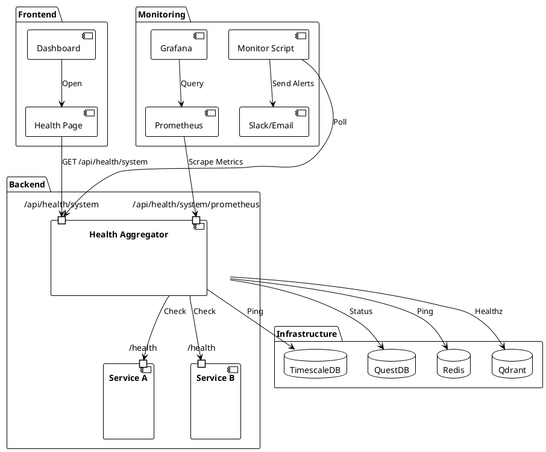

# 🏥 System Health Checks Guide

**Comprehensive health monitoring for TradingSystem**

> Part of Phase 1.7 - Health Checks (Improvement Plan v1.0)

## 📋 Overview

TradingSystem implements a **multi-layered health check system** that monitors:
- Application services (APIs, gateways, processors)
- Infrastructure components (databases, caches, message queues)
- Dependencies (external APIs, third-party services)
- System resources (CPU, memory, disk, network)

### Key Features

✅ **Standardized Health Endpoints** - Consistent `/health` endpoints across all services
✅ **Real-time Dashboard** - Visual monitoring dashboard with auto-refresh
✅ **Automated Monitoring** - Background monitoring with configurable intervals
✅ **Smart Alerting** - Slack/email alerts with threshold-based triggers
✅ **Prometheus Metrics** - Export health metrics for Grafana dashboards
✅ **Dependency Checks** - Validate database, cache, and API dependencies
✅ **CI/CD Integration** - Automated health checks in GitHub Actions

---

## 🏗️ Architecture

### Health Check Layers



### Component Responsibilities

| Component | Responsibility | Location |
|-----------|---------------|----------|
| **Health Middleware** | Standardized health endpoints | `backend/shared/middleware/health.js` |
| **Health Aggregator** | Centralized health status | `backend/api/workspace/src/routes/system-health.js` |
| **Dashboard Page** | Visual monitoring UI | `frontend/dashboard/src/components/pages/SystemHealthPage.tsx` |
| **Monitor Script** | Automated checking & alerting | `scripts/maintenance/monitor-system-health.sh` |
| **CI/CD Workflow** | Pre-deployment validation | `.github/workflows/health-check.yml` |

---

## 🚀 Quick Start

### 1. Enable Health Checks in Services

All services should use the standardized health middleware:

```javascript
import { createHealthCheckHandler, commonChecks } from '@backend/shared/middleware/health';
import { db, redis } from './config';

// Create health handler with dependency checks
app.get('/health', createHealthCheckHandler({
  serviceName: 'workspace-api',
  version: '1.0.0',
  checks: {
    database: commonChecks.postgres(db),
    redis: commonChecks.redis(redis),
  },
}));

// Liveness probe (no dependencies)
app.get('/health/live', createLivenessHandler({
  serviceName: 'workspace-api',
  version: '1.0.0',
}));

// Readiness probe (all dependencies must be healthy)
app.get('/health/ready', createReadinessHandler({
  serviceName: 'workspace-api',
  version: '1.0.0',
  checks: {
    database: commonChecks.postgres(db),
    redis: commonChecks.redis(redis),
  },
}));
```

### 2. Access Health Dashboard

Navigate to the health dashboard in your browser:

```bash
http://localhost:9080/health
```

**Features:**
- Real-time status for all services
- Auto-refresh every 30 seconds
- Detailed dependency checks
- Response time tracking
- Export health reports (JSON)

### 3. Test Health Checks

```bash
# Check specific service
curl http://localhost:3200/health | jq

# Check system-wide health
curl http://localhost:3200/api/health/system | jq

# Get Prometheus metrics
curl http://localhost:3200/api/health/system/prometheus
```

### 4. Setup Automated Monitoring

**Option A: Systemd Service (Recommended)**

```bash
# Install as systemd service (runs continuously)
sudo bash tools/systemd/setup-health-monitoring.sh systemd

# Check status
systemctl status system-health-monitor

# View logs
journalctl -u system-health-monitor -f
```

**Option B: Cron Job**

```bash
# Install as cron job (runs every minute)
sudo bash tools/systemd/setup-health-monitoring.sh cron

# View cron jobs
crontab -l

# View logs
tail -f logs/health-monitoring/cron.log
```

---

## 📊 Health Endpoints

### Standard Health Endpoint

**Request:**
```http
GET /health HTTP/1.1
Host: localhost:3200
```

**Response:**
```json
{
  "status": "healthy",
  "service": "workspace-api",
  "version": "1.0.0",
  "timestamp": "2025-11-11T12:00:00Z",
  "uptime": 3600,
  "checks": {
    "database": {
      "status": "healthy",
      "message": "OK",
      "responseTime": 5
    },
    "redis": {
      "status": "healthy",
      "message": "OK",
      "responseTime": 2
    }
  },
  "responseTime": 8
}
```

**HTTP Status Codes:**
- `200 OK` - Service is healthy
- `200 OK` - Service is degraded (some dependencies down)
- `503 Service Unavailable` - Service is unhealthy

### Aggregated System Health

**Request:**
```http
GET /api/health/system HTTP/1.1
Host: localhost:3200
```

**Response:**
```json
{
  "overallHealth": "healthy",
  "timestamp": "2025-11-11T12:00:00Z",
  "services": [
    {
      "name": "Workspace API",
      "status": "healthy",
      "endpoint": "http://localhost:3200/health",
      "version": "1.0.0",
      "uptime": 3600,
      "responseTime": 8
    }
  ],
  "infrastructure": [
    {
      "name": "TimescaleDB",
      "status": "healthy",
      "endpoint": "http://localhost:5432",
      "responseTime": 3
    }
  ],
  "summary": {
    "total": 8,
    "healthy": 7,
    "degraded": 1,
    "unhealthy": 0
  },
  "responseTime": 45
}
```

### Prometheus Metrics

**Request:**
```http
GET /api/health/system/prometheus HTTP/1.1
Host: localhost:3200
```

**Response:**
```prometheus
# HELP system_health_status Health status of system components (0=unhealthy, 1=degraded, 2=healthy)
# TYPE system_health_status gauge
system_health_status{name="Workspace API",type="service",endpoint="http://localhost:3200/health"} 2
system_health_status{name="TimescaleDB",type="database",endpoint="http://localhost:5432"} 2

# HELP system_health_response_time_ms Response time in milliseconds
# TYPE system_health_response_time_ms gauge
system_health_response_time_ms{name="Workspace API",type="service"} 8

# HELP system_health_overall Overall system health ratio (0-1)
# TYPE system_health_overall gauge
system_health_overall 0.88
```

---

## 🔔 Alerting

### Configure Slack Alerts

1. **Create Slack Webhook:**
   - Go to https://api.slack.com/messaging/webhooks
   - Create new webhook for your workspace
   - Copy webhook URL

2. **Add to Environment:**
   ```bash
   # Add to .env
   SLACK_WEBHOOK_URL=https://hooks.slack.com/services/YOUR/WEBHOOK/URL
   ```

3. **Test Alert:**
   ```bash
   bash scripts/maintenance/monitor-system-health.sh check --alert slack
   ```

### Configure Email Alerts

1. **Add to Environment:**
   ```bash
   # Add to .env
   ALERT_EMAIL=admin@example.com
   ```

2. **Install Mail Command (if not present):**
   ```bash
   # Ubuntu/Debian
   sudo apt-get install mailutils

   # RHEL/CentOS
   sudo yum install mailx
   ```

3. **Test Alert:**
   ```bash
   bash scripts/maintenance/monitor-system-health.sh check --alert email
   ```

### Alert Thresholds

Configure alert behavior in `.env`:

```bash
# Check interval in seconds (default: 60)
HEALTH_CHECK_INTERVAL=60

# Failed checks before alert (default: 3)
HEALTH_ALERT_THRESHOLD=3

# Minimum time between alerts in seconds (default: 300 = 5 minutes)
HEALTH_ALERT_COOLDOWN=300
```

**Alert Logic:**
1. Monitor checks health every `HEALTH_CHECK_INTERVAL` seconds
2. Consecutive failures increment counter
3. Alert sent when counter reaches `HEALTH_ALERT_THRESHOLD`
4. No duplicate alerts within `HEALTH_ALERT_COOLDOWN` period
5. Recovery notification sent when health restored

---

## 🔍 Monitoring Dashboard

### Dashboard Features

**Real-time Status Cards:**
- Service name and version
- Health status badge (Healthy/Degraded/Unhealthy)
- Endpoint URL
- Response time
- Uptime
- Dependency checks (expandable)

**Overall Status Summary:**
- Total services count
- Healthy services count
- Degraded services count
- Unhealthy services count

**Controls:**
- Manual refresh button
- Auto-refresh toggle (30s interval)
- Export report (JSON download)
- Last updated timestamp

### Color Coding

| Status | Color | Badge | Meaning |
|--------|-------|-------|---------|
| **Healthy** | 🟢 Green | ✅ Healthy | All checks passing |
| **Degraded** | 🟡 Yellow | ⚠️ Degraded | Some dependencies down |
| **Unhealthy** | 🔴 Red | ❌ Unhealthy | Critical failure |

---

## 🛠️ Advanced Configuration

### Custom Health Checks

#### HTTP Endpoint Check

```javascript
import { commonChecks } from '@backend/shared/middleware/health';

app.get('/health', createHealthCheckHandler({
  serviceName: 'my-service',
  checks: {
    externalAPI: commonChecks.http('https://api.example.com/health', 5000),
  },
}));
```

#### Custom Logic Check

```javascript
import { commonChecks } from '@backend/shared/middleware/health';

const checkDiskSpace = async () => {
  const stats = await fs.promises.statfs('/data');
  const freePercent = (stats.bavail / stats.blocks) * 100;

  if (freePercent < 10) {
    throw new Error('Low disk space: ' + freePercent.toFixed(1) + '%');
  }

  return `Disk space: ${freePercent.toFixed(1)}% free`;
};

app.get('/health', createHealthCheckHandler({
  serviceName: 'my-service',
  checks: {
    diskSpace: commonChecks.custom(checkDiskSpace),
  },
}));
```

### Docker Health Checks

Add health checks to Docker Compose services:

```yaml
services:
  workspace-api:
    image: workspace-api:latest
    healthcheck:
      test: ["CMD", "curl", "-f", "http://localhost:3200/health"]
      interval: 30s
      timeout: 10s
      retries: 3
      start_period: 40s
```

### Kubernetes Probes

Configure liveness and readiness probes for Kubernetes:

```yaml
apiVersion: v1
kind: Pod
metadata:
  name: workspace-api
spec:
  containers:
  - name: workspace-api
    image: workspace-api:latest
    livenessProbe:
      httpGet:
        path: /health/live
        port: 3200
      initialDelaySeconds: 30
      periodSeconds: 10
    readinessProbe:
      httpGet:
        path: /health/ready
        port: 3200
      initialDelaySeconds: 5
      periodSeconds: 5
```

---

## 📈 CI/CD Integration

### GitHub Actions Workflow

Health checks run automatically on:
- Pull requests
- Push to main/develop
- Every 6 hours (scheduled)
- Manual trigger

**Workflow:** [`.github/workflows/health-check.yml`](../../../.github/workflows/health-check.yml)

**Steps:**
1. Start Docker infrastructure
2. Wait for services to be ready
3. Verify service health (individual checks)
4. Run comprehensive health check (aggregated)
5. Validate overall status
6. Export Prometheus metrics
7. Upload artifacts (reports, metrics)

**Artifacts:**
- `health-report-{run_number}.json` - Health check results
- `prometheus-metrics-{run_number}.prom` - Prometheus metrics

---

## 🐛 Troubleshooting

### Service Reports Unhealthy

**1. Check Service Logs:**
```bash
# Docker container logs
docker logs workspace-api

# Systemd service logs
journalctl -u workspace-api -n 100
```

**2. Test Health Endpoint Directly:**
```bash
curl -v http://localhost:3200/health | jq
```

**3. Check Dependencies:**
```bash
# Database connection
docker exec timescaledb pg_isready

# Redis connection
docker exec redis redis-cli ping

# Qdrant connection
curl http://localhost:6333/healthz
```

### Health Dashboard Not Loading

**1. Verify Backend API is Running:**
```bash
curl http://localhost:3200/api/health/system
```

**2. Check Network Configuration:**
```bash
# Verify ports are accessible
netstat -tuln | grep 3200
```

**3. Check Browser Console:**
- Open Developer Tools → Console
- Look for API errors
- Verify CORS configuration

### Monitoring Script Not Running

**1. Check Systemd Service:**
```bash
systemctl status system-health-monitor
journalctl -u system-health-monitor -n 50
```

**2. Check Cron Job:**
```bash
crontab -l
tail -f logs/health-monitoring/cron.log
```

**3. Test Script Manually:**
```bash
bash scripts/maintenance/monitor-system-health.sh check
```

### Alerts Not Being Sent

**1. Verify Slack Webhook:**
```bash
# Test Slack webhook directly
curl -X POST -H 'Content-type: application/json' \
  --data '{"text":"Test alert"}' \
  $SLACK_WEBHOOK_URL
```

**2. Verify Email Configuration:**
```bash
# Test mail command
echo "Test alert" | mail -s "Test" $ALERT_EMAIL
```

**3. Check Alert Threshold:**
```bash
# View current state
cat logs/health-monitoring/health-state.json
```

---

## 📚 API Reference

### Health Middleware API

#### `createHealthCheckHandler(options)`

Creates a standard health check handler.

**Parameters:**
- `serviceName` (string) - Service name
- `version` (string) - Service version
- `checks` (object) - Dependency check functions
- `logger` (object) - Logger instance (optional)
- `timeout` (number) - Check timeout in ms (default: 5000)

**Returns:** Express route handler

#### `createLivenessHandler(options)`

Creates a liveness probe handler (no dependency checks).

**Parameters:**
- `serviceName` (string) - Service name
- `version` (string) - Service version

**Returns:** Express route handler

#### `createReadinessHandler(options)`

Creates a readiness probe handler (strict dependency checking).

**Parameters:**
- Same as `createHealthCheckHandler`

**Returns:** Express route handler

### Common Health Checks

#### `commonChecks.postgres(client)`

PostgreSQL/TimescaleDB health check.

**Parameters:**
- `client` - pg.Pool or similar client

**Returns:** Health check function

#### `commonChecks.redis(client)`

Redis health check.

**Parameters:**
- `client` - Redis client

**Returns:** Health check function

#### `commonChecks.http(url, timeout)`

HTTP endpoint health check.

**Parameters:**
- `url` (string) - Endpoint URL
- `timeout` (number) - Request timeout in ms (default: 3000)

**Returns:** Health check function

#### `commonChecks.custom(fn)`

Custom health check function.

**Parameters:**
- `fn` (async function) - Check function (throws on failure)

**Returns:** Health check function

---

## 🎯 Best Practices

### Health Check Implementation

✅ **DO:**
- Use standardized middleware for consistency
- Check critical dependencies (database, cache)
- Set appropriate timeouts (3-5 seconds)
- Return detailed error messages
- Log health check failures

❌ **DON'T:**
- Perform expensive operations in health checks
- Check non-critical dependencies
- Use long timeouts (&gt;10 seconds)
- Expose sensitive information in responses
- Ignore health check failures

### Monitoring Configuration

✅ **DO:**
- Set reasonable check intervals (30-60 seconds)
- Configure alert thresholds (2-3 failures)
- Use alert cooldown periods (5-10 minutes)
- Test alert delivery regularly
- Monitor the monitor (meta-monitoring)

❌ **DON'T:**
- Check too frequently (< 10 seconds)
- Send alerts on first failure
- Spam alerts without cooldown
- Ignore recovery notifications
- Rely on single monitoring method

### Dashboard Usage

✅ **DO:**
- Review dashboard daily
- Export reports for analysis
- Share dashboard URL with team
- Document unusual patterns
- Act on degraded statuses quickly

❌ **DON'T:**
- Ignore warning signs
- Wait for unhealthy status to act
- Dismiss persistent degradation
- Skip manual refresh when investigating
- Rely solely on automated monitoring

---

## 🔗 Related Documentation

- [System Architecture](../../reference/architecture/overview.mdx)
- [Monitoring & Observability](./overview.mdx)
- [Prometheus Metrics](./prometheus-guide.mdx)
- [Grafana Dashboards](./grafana-guide.mdx)
- [Incident Response](../../governance/procedures/incident-response.mdx)

---

**Last Updated:** 2025-11-11
**Version:** 1.0 (Phase 1.7 Implementation)
**Maintainer:** TradingSystem Team
