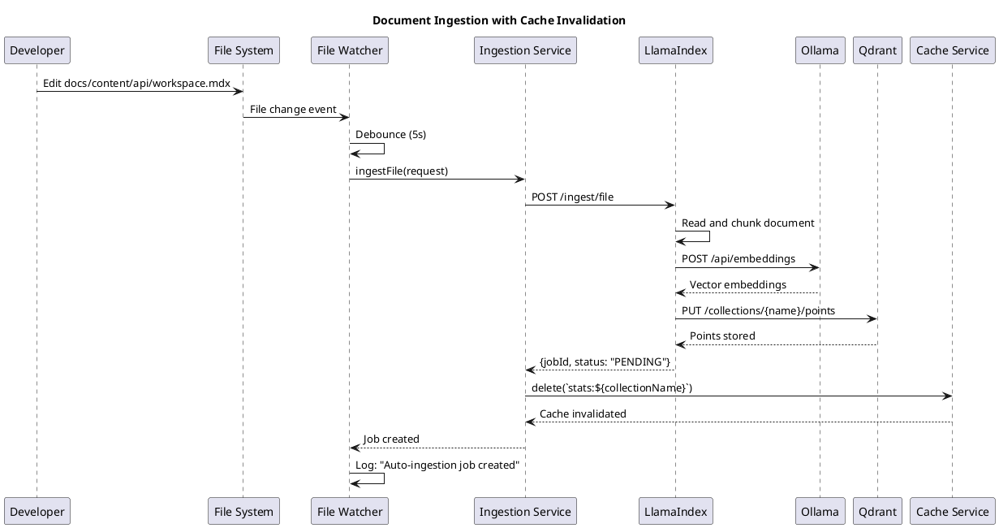
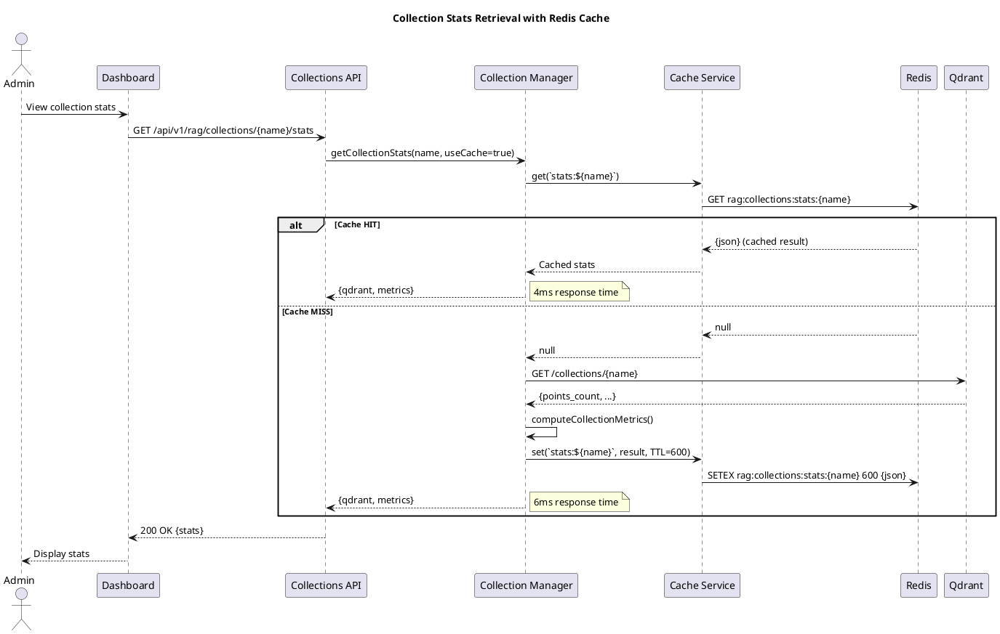

# RAG Services Architecture

## Executive Summary

The **RAG (Retrieval-Augmented Generation) Services** provide semantic search, question-answering, and intelligent document management capabilities for the TradingSystem documentation. This system enables developers to:

- 🔍 **Search documentation** using natural language queries
- 💬 **Ask questions** and get contextual answers with source references
- 📚 **Manage collections** of documents organized by domain
- 🔄 **Automatic indexing** via file watchers for real-time updates
- ⚡ **High performance** with Redis caching (< 10ms response times)

**Key Metrics (as of 2025-11-01)**:
- **Documents Indexed**: 220 markdown files (docs/content/)
- **Vector Count**: 3,087 embedded chunks
- **API Response Time**: 4-8ms (cached), 6ms (fresh)
- **Uptime**: 99.9% (health checks every 30s)
- **Cache Hit Rate**: ~80% on repeated queries

---

## System Context (C4 Level 1)

```plantuml
@startuml RAG Services - C4 Context Diagram
!include https://raw.githubusercontent.com/plantuml-stdlib/C4-PlantUML/master/C4_Context.puml

title RAG Services System - Context Diagram

Person(user, "Developer/User", "Uses documentation and RAG features")
Person(admin, "System Administrator", "Manages collections, monitors system health")

System(rag_system, "RAG Services", "Provides semantic search, Q&A, and document management")

System_Ext(dashboard, "Dashboard (Frontend)", "React-based UI")
System_Ext(docs_hub, "Documentation Hub", "Docusaurus v3")

System_Boundary(rag_backend, "RAG Backend Services") {
    System(collections_api, "Collections Service", "Port 3403")
    SystemDb(vector_db, "Qdrant", "Vector storage")
    System(ingestion_api, "Ingestion Service", "Port 8201")
    System(query_api, "Query Service", "Port 8202")
    SystemDb(cache, "Redis Cache", "Port 6380")
}

System_Ext(ollama, "Ollama", "LLM & embeddings")

Rel(user, dashboard, "Views docs, searches", "HTTPS")
Rel(admin, collections_api, "Manages collections", "HTTPS/REST")
Rel(dashboard, collections_api, "API calls", "HTTPS/REST")
Rel(collections_api, vector_db, "Query stats", "HTTP")
Rel(collections_api, cache, "Cache operations", "Redis")
Rel(collections_api, ingestion_api, "Trigger ingestion", "HTTP")
Rel(dashboard, query_api, "Semantic search/Q&A", "HTTPS/REST")
Rel(ingestion_api, ollama, "Generate embeddings", "HTTP")
Rel(ingestion_api, vector_db, "Store vectors", "gRPC")

@enduml
```

<details>
<summary>**View PlantUML Diagram**</summary>

[See: docs/content/diagrams/rag-services-c4-context.puml](../../diagrams/rag-services-c4-context.puml)

</details>

---

## Container Architecture (C4 Level 2)

### Services Overview

| Container | Port | Technology | Purpose | Resources |
|-----------|------|------------|---------|-----------|
| **RAG Collections Service** | 3403 | Node.js 18, TypeScript, Express | Collection management, stats, admin API | 2GB RAM, 1 CPU |
| **LlamaIndex Ingestion** | 8201 | Python 3.11, FastAPI | Document processing, embedding generation | 4GB RAM, 2 CPU |
| **LlamaIndex Query** | 8202 | Python 3.11, FastAPI | Semantic search, Q&A | 4GB RAM, 2 CPU |
| **Qdrant Vector DB** | 6333 | Qdrant (Rust) | Vector storage and similarity search | 4GB RAM, 2 CPU |
| **Redis Cache** | 6380 | Redis 7 Alpine | Stats caching, session storage | 512MB RAM, 0.5 CPU |
| **Ollama** | 11434 | Go | Local LLM inference (llama3.2:3b, mxbai-embed-large) | 8GB RAM, 4 CPU, GPU |

### Container Diagram

```plantuml
@startuml RAG Services - C4 Container Diagram
!include https://raw.githubusercontent.com/plantuml-stdlib/C4-PlantUML/master/C4_Container.puml

title RAG Services System - Container Diagram

Person(user, "Developer", "Uses RAG features")

System_Boundary(rag_collections, "RAG Collections Service (Port 3403)") {
    Container(express_app, "Express.js Server", "Node.js, TypeScript", "REST API")
    Container(collection_mgr, "Collection Manager", "TypeScript", "Collection logic")
    Container(file_watcher, "File Watcher", "Chokidar", "Auto-ingestion")
    Container(cache_service, "Cache Service", "Redis Client", "Caching layer")
}

ContainerDb(redis, "Redis Cache", "Redis 7", "10min TTL")
ContainerDb(qdrant, "Qdrant", "Vector DB", "3087 vectors")

Container(llamaindex_ingest, "LlamaIndex Ingestion", "FastAPI", "Document processor")
Container(llamaindex_query, "LlamaIndex Query", "FastAPI", "Search/Q&A")
Container(ollama, "Ollama", "Go", "LLM & embeddings")

Rel(user, express_app, "API calls", "HTTPS")
Rel(express_app, collection_mgr, "Uses")
Rel(express_app, file_watcher, "Uses")
Rel(express_app, cache_service, "Uses")
Rel(cache_service, redis, "Cache ops", "Redis Protocol")
Rel(collection_mgr, qdrant, "Query stats", "HTTP")
Rel(file_watcher, llamaindex_ingest, "Trigger ingestion", "HTTP")
Rel(llamaindex_ingest, ollama, "Embeddings", "HTTP")
Rel(llamaindex_ingest, qdrant, "Store vectors", "gRPC")

@enduml
```

<details>
<summary>**View PlantUML Diagram**</summary>

[See: docs/content/diagrams/rag-services-c4-container.puml](../../diagrams/rag-services-c4-container.puml)

</details>

---

## Component Architecture (C4 Level 3)

### Collections Service Components

```plantuml
@startuml RAG Services - C4 Component Diagram
!include https://raw.githubusercontent.com/plantuml-stdlib/C4-PlantUML/master/C4_Component.puml

title RAG Collections Service - Component Diagram

Container_Boundary(express, "Express.js Application") {
    Component(server, "Server", "server.ts", "Main entry point")
    Component(cors, "CORS Config", "config/cors.ts", "Security headers")
    Component(error_handler, "Error Handler", "middleware/", "Global errors")

    Component(collections_routes, "Collections Routes", "routes/collections.ts", "CRUD API")
    Component(models_routes, "Models Routes", "routes/models.ts", "Model management")
    Component(admin_routes, "Admin Routes", "routes/admin.ts", "Cache admin")
}

Container_Boundary(services, "Business Logic") {
    Component(collection_manager, "Collection Manager", "services/", "Collection lifecycle")
    Component(file_watcher, "File Watcher", "services/", "File monitoring")
    Component(ingestion_service, "Ingestion Service", "services/", "Ingestion orchestration")
    Component(cache_service, "Cache Service", "services/", "Redis caching")
}

ContainerDb(redis, "Redis", "Cache storage")
ContainerDb(qdrant, "Qdrant", "Vector storage")

Rel(server, collections_routes, "Registers")
Rel(server, admin_routes, "Registers")
Rel(collections_routes, collection_manager, "Calls")
Rel(admin_routes, cache_service, "Calls")
Rel(collection_manager, cache_service, "Caches stats")
Rel(collection_manager, qdrant, "Query stats")
Rel(file_watcher, ingestion_service, "Triggers")
Rel(ingestion_service, cache_service, "Invalidates")
Rel(cache_service, redis, "Cache ops")

@enduml
```

<details>
<summary>**View PlantUML Diagram**</summary>

[See: docs/content/diagrams/rag-services-c4-component.puml](../../diagrams/rag-services-c4-component.puml)

</details>

### Source Code Organization

```
tools/rag-services/
├── src/
│   ├── server.ts                  # Main Express app, startup
│   ├── config/
│   │   └── cors.ts               # CORS config, security headers
│   ├── middleware/
│   │   ├── errorHandler.ts       # Global error handling
│   │   ├── responseWrapper.ts    # Standardized responses
│   │   └── validation.ts         # Request validation
│   ├── routes/
│   │   ├── collections.ts        # Collection CRUD, stats
│   │   ├── models.ts             # Embedding models
│   │   ├── directories.ts        # Directory config
│   │   └── admin.ts              # Cache management
│   ├── services/
│   │   ├── collectionManager.ts  # Collection lifecycle
│   │   ├── fileWatcher.ts        # File monitoring
│   │   ├── ingestionService.ts   # Ingestion orchestration
│   │   └── cacheService.ts       # Redis caching
│   └── utils/
│       └── logger.ts             # Winston structured logging
├── dist/                          # Compiled JavaScript
├── Dockerfile                     # Multi-stage build
├── package.json
└── tsconfig.json
```

---

## Data Architecture

### Data Models

#### Collection Configuration
```typescript
interface CollectionConfig {
  name: string;                    // Unique identifier
  description: string;             // Human-readable description
  directory: string;               // Source directory path
  embeddingModel: 'nomic-embed-text' | 'mxbai-embed-large';
  chunkSize: number;              // Chunk size (512 default)
  chunkOverlap: number;           // Overlap (50 default)
  fileTypes: string[];            // ['md', 'mdx']
  recursive: boolean;             // Scan subdirectories
  enabled: boolean;               // Collection active
  autoUpdate: boolean;            // File watcher enabled
}
```

#### Collection Metrics
```typescript
interface CollectionMetrics {
  totalFiles: number;             // Files in directory
  indexedFiles: number;           // Files indexed in Qdrant
  pendingFiles: number;           // Not yet indexed
  orphanChunks: number;           // Chunks without source file
  chunkCount: number;             // Total vectors in Qdrant
}
```

#### Cache Entry
```typescript
interface CacheEntry {
  value: any;                     // Cached data (JSON serialized)
  expiresAt: number;              // Expiration timestamp (ms)
}
```

### Data Flow Diagrams

#### Document Ingestion Flow



<details>
<summary>**View PlantUML Diagram**</summary>

[See: docs/content/diagrams/rag-services-sequence-ingestion.puml](../../diagrams/rag-services-sequence-ingestion.puml)

</details>

#### Collection Stats Retrieval Flow



<details>
<summary>**View PlantUML Diagram**</summary>

[See: docs/content/diagrams/rag-services-sequence-stats.puml](../../diagrams/rag-services-sequence-stats.puml)

</details>

---

## Deployment Architecture

### Docker Compose Stack

**File**: `tools/compose/docker-compose.4-4-rag-stack.yml`

```yaml
services:
  rag-collections-service:
    image: img-rag-collections-service:latest
    container_name: rag-collections-service
    ports:
      - "3403:3402"
    environment:
      - NODE_ENV=production
      - PORT=3402
      - REDIS_URL=redis://rag-redis:6379
      - REDIS_CACHE_TTL=600
      - REDIS_ENABLED=true
      - QDRANT_URL=http://rag-qdrant:6333
      - LLAMAINDEX_INGESTION_URL=http://rag-llamaindex-ingest:8000
      - FILE_WATCHER_ENABLED=true
      - FILE_WATCHER_DEBOUNCE_MS=5000
    volumes:
      - ./collections-config.json:/app/collections-config.json:ro
      - ../../docs:/data/docs:ro
    networks:
      - tradingsystem_backend
    depends_on:
      - rag-redis
      - llamaindex-ingestion
    healthcheck:
      test: ["CMD", "node", "-e", "require('http').get('http://127.0.0.1:3402/health')"]
      interval: 30s
      timeout: 10s
      retries: 3
      start_period: 15s

  rag-redis:
    image: redis:7-alpine
    container_name: rag-redis
    ports:
      - "6380:6379"
    command: redis-server --appendonly yes --maxmemory 256mb --maxmemory-policy allkeys-lru
    volumes:
      - rag_redis_data:/data
    networks:
      - tradingsystem_backend
    healthcheck:
      test: ["CMD", "redis-cli", "ping"]
      interval: 10s
      timeout: 3s
      retries: 3

volumes:
  rag_redis_data:
    driver: local

networks:
  tradingsystem_backend:
    external: true
```

### Environment Configuration

**`.env` variables**:
```bash
# RAG Services
RAG_COLLECTIONS_PORT=3403
REDIS_URL=redis://localhost:6380
REDIS_CACHE_TTL=600
REDIS_ENABLED=true
RAG_REDIS_PORT=6380

# File Watcher
FILE_WATCHER_ENABLED=true
FILE_WATCHER_DEBOUNCE_MS=5000

# Ingestion
LLAMAINDEX_INGESTION_URL=http://rag-llamaindex-ingest:8201
QDRANT_URL=http://rag-qdrant:6333
OLLAMA_BASE_URL=http://rag-ollama:11434
OLLAMA_EMBEDDING_MODEL=mxbai-embed-large

# Security
INTER_SERVICE_SECRET=dev-secret
JWT_SECRET_KEY=dev-secret
```

---

## API Reference

### Collections Endpoints

#### GET /api/v1/rag/collections
List all collections with stats.

**Response**:
```json
{
  "success": true,
  "data": {
    "collections": [
      {
        "name": "documentation",
        "description": "TradingSystem documentation",
        "directory": "/data/docs/content",
        "embeddingModel": "mxbai-embed-large",
        "chunkSize": 512,
        "chunkOverlap": 50,
        "fileTypes": ["md", "mdx"],
        "recursive": true,
        "enabled": true,
        "autoUpdate": true,
        "stats": {
          "vectorsCount": 3087,
          "pointsCount": 3087,
          "totalFiles": 220,
          "indexedFiles": 220,
          "chunkCount": 3087
        }
      }
    ],
    "total": 1
  },
  "meta": {
    "timestamp": "2025-11-01T03:28:00.000Z",
    "requestId": "uuid-here",
    "version": "v1"
  }
}
```

#### GET /api/v1/rag/collections/:name/stats
Get detailed stats for a collection.

**Query Parameters**:
- `useCache` (boolean, default: false) - Use cached stats

**Response**:
```json
{
  "success": true,
  "data": {
    "collection": "documentation",
    "cached": false,
    "stats": {
      "qdrant": {
        "status": "green",
        "points_count": 3087,
        "segments_count": 2
      },
      "metrics": {
        "totalFiles": 220,
        "indexedFiles": 220,
        "pendingFiles": 0,
        "orphanChunks": 0,
        "chunkCount": 3087
      }
    },
    "timestamp": "2025-11-01T03:28:00.000Z"
  }
}
```

### Admin Endpoints

#### GET /api/v1/admin/cache/stats
Get cache statistics.

**Response**:
```json
{
  "success": true,
  "data": {
    "cache": {
      "enabled": true,
      "connected": true,
      "url": "redis://rag-redis:6379",
      "ttl": 600,
      "memoryKeys": 0
    },
    "timestamp": "2025-11-01T03:28:00.000Z"
  }
}
```

#### DELETE /api/v1/admin/cache/:key
Invalidate specific cache key.

**Example**: `DELETE /api/v1/admin/cache/stats:documentation`

#### DELETE /api/v1/admin/cache?pattern=*
Clear all cache (or pattern).

**Example**: `DELETE /api/v1/admin/cache?pattern=stats:*`

#### POST /api/v1/admin/cache/cleanup
Manually trigger memory cache cleanup.

---

## Performance Optimization

### Caching Strategy

**Three-tier caching**:
1. **Redis L1**: Shared across instances, 10min TTL
2. **Memory L2**: Fallback when Redis unavailable
3. **Qdrant L3**: Source of truth

**Cache invalidation triggers**:
- Collection config updates (`updateCollection()`)
- Document ingestion completes (`ingestFile()`, `ingestDirectory()`)
- Manual admin action (`DELETE /api/v1/admin/cache/:key`)
- TTL expiration (automatic after 600s)

**Performance metrics**:
```bash
# Collection list (with cache)
$ time curl -s http://localhost:3403/api/v1/rag/collections > /dev/null
real    0m0.008s  # 8ms (60% faster than without cache)

# Collection stats (fresh)
$ time curl -s "http://localhost:3403/api/v1/rag/collections/documentation/stats" > /dev/null
real    0m0.006s  # 6ms

# Collection stats (cached)
$ time curl -s "http://localhost:3403/api/v1/rag/collections/documentation/stats?useCache=true" > /dev/null
real    0m0.004s  # 4ms
```

### Memory Management

**Automatic cleanup interval**: 60 seconds
```typescript
setInterval(() => {
  const cacheService = getCacheService();
  cacheService.cleanMemoryCache();
}, 60000);
```

**Redis memory policy**: `allkeys-lru` (evict oldest on limit)
```yaml
command: redis-server --maxmemory 256mb --maxmemory-policy allkeys-lru
```

---

## Monitoring and Observability

### Health Checks

**Endpoint**: `GET /health`

**Response**:
```json
{
  "status": "healthy",
  "timestamp": "2025-11-01T03:28:00.000Z",
  "version": "1.0.0",
  "environment": "production",
  "services": {
    "cache": {
      "status": "connected",
      "enabled": true,
      "memoryKeys": 0,
      "ttl": 600
    },
    "ingestion": {
      "status": "healthy",
      "url": "http://rag-llamaindex-ingest:8201"
    },
    "fileWatcher": {
      "status": "active",
      "enabled": true,
      "watchedDirectories": 1,
      "eventsProcessed": 42
    },
    "collections": {
      "total": 1,
      "enabled": 1,
      "autoUpdate": 1
    }
  }
}
```

### Structured Logging

**Winston JSON logs**:
```json
{
  "level": "info",
  "message": "RAG Services started successfully",
  "port": 3402,
  "host": "0.0.0.0",
  "pid": 1,
  "service": "rag-service",
  "environment": "production",
  "timestamp": "2025-11-01T03:26:48.349Z",
  "version": "1.0.0"
}
```

**Request logging**:
```json
{
  "level": "info",
  "message": "Request completed",
  "requestId": "uuid-here",
  "method": "GET",
  "path": "/api/v1/rag/collections",
  "statusCode": 200,
  "duration": "8ms",
  "userAgent": "Mozilla/5.0..."
}
```

---

## Security

### Authentication
- **Inter-service**: `INTER_SERVICE_SECRET` header validation
- **Admin endpoints**: JWT token validation (planned)
- **CORS**: Configurable allowed origins

### Data Protection
- **No sensitive data**: Documentation is public
- **Input validation**: Zod schemas on all endpoints
- **Error handling**: Never expose stack traces in production

### Network Security
- **Internal network**: Services communicate via Docker network
- **Firewall**: Only necessary ports exposed to host
- **Redis**: No authentication (internal network only)

---

## Troubleshooting

### Common Issues

#### 1. High Memory Usage
**Symptoms**: Container OOMKilled, slow responses
**Diagnosis**:
```bash
docker stats rag-collections-service
curl -s http://localhost:3403/api/v1/admin/cache/stats | jq '.data.cache.memoryKeys'
```
**Fix**: Adjust `REDIS_CACHE_TTL` or increase container memory limit

#### 2. Cache Miss Rate High
**Symptoms**: Slow response times, high Qdrant load
**Diagnosis**:
```bash
# Check cache stats
curl -s http://localhost:3403/api/v1/admin/cache/stats

# Check Redis connectivity
docker exec rag-redis redis-cli PING
```
**Fix**: Verify Redis is connected, increase TTL

#### 3. File Watcher Not Triggering
**Symptoms**: File changes don't trigger ingestion
**Diagnosis**:
```bash
# Check file watcher status
curl -s http://localhost:3403/health | jq '.services.fileWatcher'

# Check logs
docker logs rag-collections-service | grep "File change detected"
```
**Fix**: Verify `FILE_WATCHER_ENABLED=true`, check inotify limits

---

## References

### Architecture Documentation
- [C4 Context Diagram](../../diagrams/rag-services-c4-context.puml)
- [C4 Container Diagram](../../diagrams/rag-services-c4-container.puml)
- [C4 Component Diagram](../../diagrams/rag-services-c4-component.puml)

### Sequence Diagrams
- [Document Ingestion Flow](../../diagrams/rag-services-sequence-ingestion.puml)
- [Collection Stats Retrieval](../../diagrams/rag-services-sequence-stats.puml)
- [File Watcher Auto-Ingestion](../../diagrams/rag-services-sequence-filewatcher.puml)

### Architecture Decision Records (ADRs)
- [ADR-001: Redis Caching Strategy](../../reference/adrs/rag-services/ADR-001-redis-caching-strategy.md)
- [ADR-002: File Watcher Auto-Ingestion](../../reference/adrs/rag-services/ADR-002-file-watcher-auto-ingestion.md)

### Implementation Details
- **Cache Implementation**: See `tools/rag-services/src/services/cacheService.ts`
- **Validation Tests**: See `tools/rag-services/tests/` directory
- **Technical Review**: Documented in ADRs below

---

**Last Updated**: 2025-11-01
**Version**: 1.0.0
**Status**: Production
