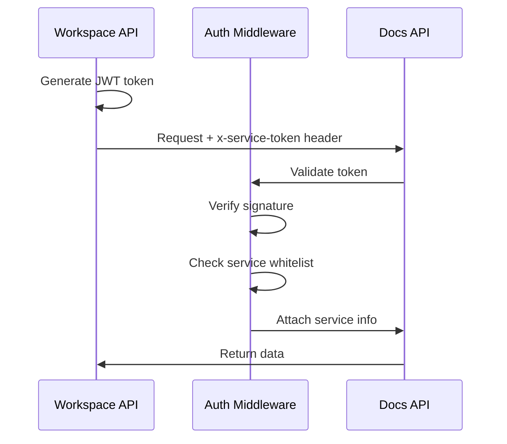

# Inter-Service Authentication

Secure service-to-service communication using **JWT-based authentication**.

## Overview

Inter-service authentication ensures that only authorized services can communicate with internal endpoints, implementing a **zero-trust architecture** where services must prove their identity.



## Core Concepts

### JWT Token Structure

```json
{
  "serviceName": "workspace-api",
  "issuer": "tradingsystem",
  "iat": 1699876543,
  "exp": 1699880143
}
```

**Fields:**
- `serviceName` - Name of the calling service (e.g., "workspace-api")
- `issuer` - Always "tradingsystem" (validates token origin)
- `iat` - Issued at timestamp (Unix)
- `exp` - Expiration timestamp (Unix)

### Secret Management

Tokens are signed with `INTER_SERVICE_SECRET` from environment:

```bash
# .env
INTER_SERVICE_SECRET="your-256-bit-secret-here"

# Generate secure secret
openssl rand -base64 32
```

⚠️ **Security**: Never commit secrets to git. Use `.env.example` as template.

## Implementation

### Generating Service Tokens

```javascript
import { generateServiceToken } from '@backend/shared/middleware/inter-service-auth';

// Generate token for outgoing requests
const token = generateServiceToken('workspace-api', {
  expiresIn: '1h', // Optional: default is 1h
  additionalClaims: { // Optional: extra metadata
    requestId: 'req-12345',
    purpose: 'data-sync',
  },
});

console.log(token);
// eyJhbGciOiJIUzI1NiIsInR5cCI6IkpXVCJ9...
```

### Protecting Internal Endpoints

```javascript
import express from 'express';
import { createInterServiceAuthMiddleware } from '@backend/shared/middleware/inter-service-auth';
import { createLogger } from '@backend/shared/logger';

const app = express();
const logger = createLogger('docs-api');

// Protect all /internal/* endpoints
app.use('/internal/*', createInterServiceAuthMiddleware({
  logger,
  allowedServices: ['workspace-api', 'telegram-gateway'], // Optional whitelist
  requireToken: true, // Default: true
}));

// Internal endpoint (requires service token)
app.get('/internal/data', (req, res) => {
  // req.serviceAuth is available
  const { serviceName, issuedAt, expiresAt } = req.serviceAuth;

  logger.info({ serviceName }, 'Internal request authenticated');

  res.json({
    message: 'Internal data',
    requestedBy: serviceName,
  });
});
```

### Making Authenticated Requests

```javascript
import fetch from 'node-fetch';
import { createServiceAuthHeaders } from '@backend/shared/middleware/inter-service-auth';

// Generate headers with service token
const headers = createServiceAuthHeaders('workspace-api');
// Returns: { 'x-service-token': 'eyJ...', 'user-agent': 'TradingSystem/workspace-api' }

// Make request to internal endpoint
const response = await fetch('http://docs-api:3405/internal/data', {
  method: 'GET',
  headers,
});

const data = await response.json();
console.log(data);
```

## Advanced Configuration

### Service Whitelist

Restrict which services can access endpoints:

```javascript
app.use('/internal/sensitive', createInterServiceAuthMiddleware({
  logger,
  allowedServices: ['workspace-api'], // Only workspace-api can access
}));
```

**Response for unauthorized service**:
```json
{
  "success": false,
  "error": "Forbidden",
  "message": "Service not authorized to access this resource"
}
```

### Hybrid Authentication

Allow **both user and service** authentication:

```javascript
import { createHybridAuthMiddleware } from '@backend/shared/middleware/inter-service-auth';

// Check for service token first, fall back to user auth
app.use('/api/items', createHybridAuthMiddleware({
  userAuthMiddleware: passport.authenticate('jwt', { session: false }),
  logger,
}));

app.get('/api/items', (req, res) => {
  if (req.serviceAuth) {
    // Request from service
    logger.info({ serviceName: req.serviceAuth.serviceName }, 'Service request');
  } else if (req.user) {
    // Request from user
    logger.info({ userId: req.user.id }, 'User request');
  }

  res.json({ items: [...] });
});
```

### Token Rotation

Generate tokens with rotation schedule:

```javascript
import { createTokenRotationSchedule } from '@backend/shared/middleware/inter-service-auth';

const schedule = createTokenRotationSchedule('workspace-api', {
  rotationInterval: '24h', // Rotate every 24 hours
});

console.log(schedule);
/*
{
  token: "eyJhbGciOiJIUzI1NiIsInR5cCI6IkpXVCJ9...",
  serviceName: "workspace-api",
  nextRotation: "2025-11-12T14:30:00.000Z",
  rotationInterval: "24h"
}
*/
```

### Audit Logging

Track all inter-service authentication attempts:

```javascript
import { createServiceAuthAuditMiddleware } from '@backend/shared/middleware/inter-service-auth';

// Add before route handlers
app.use(createServiceAuthAuditMiddleware(logger));

// Logs on every request with service token:
// {
//   event: 'inter_service_auth',
//   serviceName: 'workspace-api',
//   method: 'GET',
//   url: '/internal/data',
//   statusCode: 200,
//   duration: 45,
//   correlationId: 'req-12345'
// }
```

## Error Handling

### Missing Token

```json
{
  "success": false,
  "error": "Unauthorized",
  "message": "Service authentication token required"
}
```

**HTTP Status**: 401 Unauthorized

### Invalid Token

```json
{
  "success": false,
  "error": "Unauthorized",
  "message": "Invalid service token"
}
```

**HTTP Status**: 401 Unauthorized

### Expired Token

```json
{
  "success": false,
  "error": "Unauthorized",
  "message": "Service token has expired"
}
```

**HTTP Status**: 401 Unauthorized

### Service Not Whitelisted

```json
{
  "success": false,
  "error": "Forbidden",
  "message": "Service not authorized to access this resource"
}
```

**HTTP Status**: 403 Forbidden

## Testing

### Unit Tests

```javascript
import { generateServiceToken, verifyServiceToken } from '@backend/shared/middleware/inter-service-auth';

describe('Inter-Service Authentication', () => {
  it('should generate valid service token', () => {
    const token = generateServiceToken('test-service');
    expect(token).toBeDefined();
    expect(typeof token).toBe('string');
  });

  it('should verify valid token', () => {
    const token = generateServiceToken('test-service');
    const decoded = verifyServiceToken(token);

    expect(decoded.serviceName).toBe('test-service');
    expect(decoded.issuer).toBe('tradingsystem');
  });

  it('should reject invalid token', () => {
    expect(() => {
      verifyServiceToken('invalid.token.here');
    }).toThrow('Invalid service token');
  });
});
```

### Integration Tests

```javascript
import request from 'supertest';
import { generateServiceToken } from '@backend/shared/middleware/inter-service-auth';
import app from '../src/server';

describe('Protected Internal Endpoints', () => {
  it('should allow request with valid service token', async () => {
    const token = generateServiceToken('workspace-api');

    const response = await request(app)
      .get('/internal/data')
      .set('x-service-token', token)
      .expect(200);

    expect(response.body.message).toBe('Internal data');
  });

  it('should reject request without service token', async () => {
    const response = await request(app)
      .get('/internal/data')
      .expect(401);

    expect(response.body.error).toBe('Unauthorized');
  });
});
```

## Scripts

### Generate Service Tokens

```bash
# Generate tokens for all services
bash scripts/security/generate-service-tokens.sh

# Output: .service-tokens.json (gitignored)
{
  "workspace-api": "eyJhbGciOiJIUzI1NiIsInR5cCI6IkpXVCJ9...",
  "documentation-api": "eyJhbGciOiJIUzI1NiIsInR5cCI6IkpXVCJ9...",
  "telegram-gateway": "eyJhbGciOiJIUzI1NiIsInR5cCI6IkpXVCJ9..."
}

# Rotate tokens (regenerate all)
bash scripts/security/generate-service-tokens.sh --rotate
```

## Best Practices

### ✅ DO

- **Use short expiration times** (1h default)
- **Rotate tokens regularly** (daily/weekly)
- **Whitelist services** for sensitive endpoints
- **Log all authentication attempts** for audit
- **Use HTTPS** in production (prevent token interception)
- **Store secret in environment** (never hardcode)

### ❌ DON'T

- **Never commit tokens to git**
- **Never expose tokens in logs** (redact sensitive data)
- **Never reuse secrets** across environments
- **Never skip token verification** on internal endpoints
- **Never use weak secrets** (minimum 256 bits)

## Security Considerations

### Token Security

- **Signature Algorithm**: HS256 (HMAC-SHA256)
- **Secret Length**: Minimum 256 bits (32 bytes)
- **Expiration**: Short-lived (1h default)
- **Issuer Validation**: Always verify issuer='tradingsystem'

### Network Security

- **Use HTTPS** in production (prevent MITM attacks)
- **Rotate secrets** after incidents
- **Monitor failed attempts** (rate limiting + alerts)
- **Audit token usage** (track service-to-service calls)

### Environment Isolation

```bash
# Development
INTER_SERVICE_SECRET="dev-secret-do-not-use-in-prod"

# Staging
INTER_SERVICE_SECRET="staging-secret-rotate-monthly"

# Production
INTER_SERVICE_SECRET="$(openssl rand -base64 32)"
```

## Troubleshooting

### Problem: "Invalid service token"

**Cause**: Token signature verification failed.

**Solutions**:
1. Check `INTER_SERVICE_SECRET` matches between services
2. Verify token was generated with current secret
3. Check token hasn't been truncated/modified

### Problem: "Service token has expired"

**Cause**: Token age exceeds expiration time.

**Solutions**:
1. Generate new token
2. Increase `expiresIn` if needed
3. Implement automatic token rotation

### Problem: "Service not authorized"

**Cause**: Service name not in `allowedServices` whitelist.

**Solutions**:
1. Add service to whitelist
2. Check service name matches token payload
3. Verify middleware configuration

## Related Documentation

- [Security Overview](./overview.mdx)
- [Rate Limiting](./rate-limiting.mdx)
- [Authentication Best Practices](./best-practices.mdx)
- [CI/CD Security Pipeline](./security-cicd.mdx)

## API Reference

See [`backend/shared/middleware/inter-service-auth.js`](../../../backend/shared/middleware/inter-service-auth.js) for complete API documentation.
