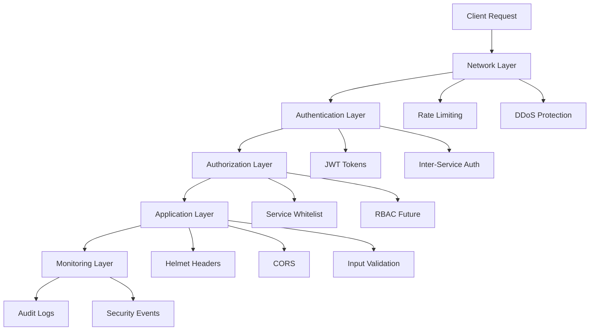

# Security Infrastructure Overview

TradingSystem implements a **defense-in-depth security architecture** with multiple layers of protection.

## Security Architecture Layers



## Core Security Components

### 1. Inter-Service Authentication
**JWT-based authentication** for service-to-service communication.

- **Token Format**: JSON Web Token with service name
- **Expiration**: 1 hour (configurable)
- **Secret**: `INTER_SERVICE_SECRET` environment variable
- **Header**: `x-service-token`

**Implementation**: [`backend/shared/middleware/inter-service-auth.js`](../../../backend/shared/middleware/inter-service-auth.js)

### 2. Advanced Rate Limiting
**Tiered rate limiting** with per-user, per-IP, and Redis-backed distributed limiting.

| Tier | Limit | Window | Use Case |
|------|-------|--------|----------|
| **Anonymous** | 100 req | 1 hour | Unauthenticated users (per-IP) |
| **Authenticated** | 1,000 req | 1 hour | Authenticated users (per-user) |
| **Premium** | 10,000 req | 1 hour | Premium tier users |
| **Strict** | 10 req | 1 minute | Expensive operations |
| **Auth** | 5 attempts | 15 minutes | Authentication endpoints |

**Implementation**: [`backend/shared/middleware/advanced-rate-limit.js`](../../../backend/shared/middleware/advanced-rate-limit.js)

### 3. Security Headers (Helmet)
**HTTP security headers** to protect against common web vulnerabilities.

- ✅ **X-Content-Type-Options**: `nosniff`
- ✅ **X-Frame-Options**: `DENY`
- ✅ **Strict-Transport-Security**: `max-age=31536000`
- ✅ **Content-Security-Policy**: Configurable directives
- ✅ **Referrer-Policy**: `no-referrer`

**Implementation**: [`backend/shared/middleware/index.js`](../../../backend/shared/middleware/index.js)

### 4. OWASP ZAP Automation
**Dynamic application security testing** with baseline and API scans.

- 🔍 **Baseline Scan**: Passive scanning for common vulnerabilities
- 🔍 **API Scan**: Active scanning of REST API endpoints
- 📊 **SARIF Reports**: Uploaded to GitHub Security
- ⚙️ **Custom Rules**: Configured thresholds per vulnerability

**Configuration**: [`.zap/rules.tsv`](../../../.zap/rules.tsv)

### 5. CI/CD Security Pipeline
**Automated security scanning** on every commit and PR.

| Scan Type | Tool | Purpose |
|-----------|------|---------|
| **Dependency Scan** | npm audit | Vulnerable dependencies |
| **Secret Detection** | TruffleHog | Exposed credentials |
| **OWASP ZAP** | ZAP Proxy | Runtime vulnerabilities |
| **Security Headers** | curl | Header validation |
| **Static Analysis** | CodeQL | Security patterns |
| **Container Scan** | Trivy | Docker vulnerabilities |

**Workflow**: [`.github/workflows/security-scan.yml`](../../../.github/workflows/security-scan.yml)

## Security Best Practices

### Authentication & Authorization

```javascript
// ✅ GOOD: Use JWT inter-service auth for internal endpoints
import { createInterServiceAuthMiddleware } from '@backend/shared/middleware/inter-service-auth';

app.use('/internal/*', createInterServiceAuthMiddleware({
  logger,
  allowedServices: ['workspace-api', 'docs-api']
}));

// ❌ BAD: Trust all internal requests
app.use('/internal/*', (req, res, next) => next());
```

### Rate Limiting

```javascript
// ✅ GOOD: Use tiered rate limiting based on user type
import { createAdvancedRateLimit } from '@backend/shared/middleware/advanced-rate-limit';

app.use(createAdvancedRateLimit({
  logger,
  useRedis: true // Enable distributed rate limiting
}));

// ❌ BAD: Single global rate limit for all users
app.use(rateLimit({ windowMs: 60000, max: 100 }));
```

### Security Headers

```javascript
// ✅ GOOD: Configure Helmet with proper CSP
import { configureHelmet } from '@backend/shared/middleware';

app.use(configureHelmet({
  contentSecurityPolicy: {
    directives: {
      defaultSrc: ["'self'"],
      scriptSrc: ["'self'", "'unsafe-inline'"],
      styleSrc: ["'self'", "'unsafe-inline'"],
      imgSrc: ["'self'", "data:", "https:"],
    }
  }
}));

// ❌ BAD: Disable security headers
app.use(helmet({ contentSecurityPolicy: false }));
```

### Input Validation

```javascript
// ✅ GOOD: Validate and sanitize all inputs
import { body, validationResult } from 'express-validator';

app.post('/api/orders', [
  body('symbol').isAlphanumeric().trim().escape(),
  body('quantity').isInt({ min: 1, max: 10000 }),
  body('price').isFloat({ min: 0 }),
], (req, res) => {
  const errors = validationResult(req);
  if (!errors.isEmpty()) {
    return res.status(400).json({ errors: errors.array() });
  }
  // Process order...
});

// ❌ BAD: Trust user input directly
app.post('/api/orders', (req, res) => {
  const { symbol, quantity, price } = req.body;
  db.query(`INSERT INTO orders VALUES (${symbol}, ${quantity}, ${price})`);
});
```

## Security Monitoring

### Audit Logging

All security events are logged with structured data:

```javascript
logger.warn({
  event: 'rate_limit_exceeded',
  ip: req.ip,
  path: req.path,
  method: req.method,
  userId: req.user?.id,
  tier: req.rateLimitTier,
}, 'Rate limit exceeded');
```

### Security Metrics

Prometheus metrics for security monitoring:

- `auth_failures_total` - Failed authentication attempts
- `rate_limit_hits_total` - Rate limit violations
- `security_scan_duration_seconds` - OWASP ZAP scan duration
- `vulnerabilities_detected_total` - Detected vulnerabilities

## Quick Start

### 1. Enable Inter-Service Authentication

```bash
# Generate service tokens
bash scripts/security/generate-service-tokens.sh

# Add to .env
INTER_SERVICE_SECRET="your-secret-here"

# Protect internal endpoints
import { createInterServiceAuthMiddleware } from '@backend/shared/middleware/inter-service-auth';
app.use('/internal/*', createInterServiceAuthMiddleware({ logger }));
```

### 2. Enable Advanced Rate Limiting

```bash
# Add to .env
REDIS_HOST=localhost
REDIS_PORT=6379

# Apply middleware
import { createAdvancedRateLimit } from '@backend/shared/middleware/advanced-rate-limit';
app.use(createAdvancedRateLimit({ logger, useRedis: true }));
```

### 3. Run Security Scans

```bash
# Manual trigger
gh workflow run security-scan.yml

# View results
gh workflow view security-scan.yml
```

## Related Documentation

- [Inter-Service Authentication Guide](./inter-service-auth.mdx)
- [Rate Limiting Guide](./rate-limiting.mdx)
- [OWASP ZAP Configuration](./owasp-zap.mdx)
- [Security CI/CD Pipeline](./security-cicd.mdx)
- [Security Best Practices](./best-practices.mdx)

## Support

For security issues or questions:
- **Security Issues**: Report via GitHub Security Advisories
- **Documentation**: See [docs/content/tools/security/](../../tools/security/)
- **Contact**: security@tradingsystem.local
