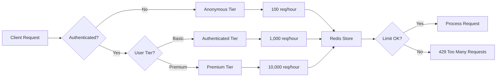

# Advanced Rate Limiting

Protect APIs from abuse with **tiered, per-user, and distributed rate limiting**.

## Overview

TradingSystem implements advanced rate limiting that goes beyond simple per-IP throttling:

- ✅ **Tiered Limits** - Different limits for anonymous, authenticated, and premium users
- ✅ **Per-User Tracking** - Track limits by user ID (not just IP)
- ✅ **Per-Service Tracking** - Separate limits for inter-service calls
- ✅ **Redis-Backed** - Distributed rate limiting across multiple instances
- ✅ **Standard Headers** - RateLimit-* headers (RFC draft)
- ✅ **Endpoint-Specific** - Custom limits for expensive operations



## Rate Limit Tiers

### Tier Definitions

| Tier | Limit | Window | Key | Use Case |
|------|-------|--------|-----|----------|
| **Anonymous** | 100 req | 1 hour | IP address | Unauthenticated users |
| **Authenticated** | 1,000 req | 1 hour | User ID | Logged-in users |
| **Premium** | 10,000 req | 1 hour | User ID | Premium tier users |
| **Strict** | 10 req | 1 minute | IP/User | Expensive operations |
| **Auth** | 5 attempts | 15 minutes | IP address | Auth endpoints |

### Key Generation Logic

```javascript
// Anonymous users: ratelimit:ip:192.168.1.100
// Authenticated users: ratelimit:user:12345
// Inter-service calls: ratelimit:service:workspace-api
```

## Implementation

### Basic Usage

```javascript
import express from 'express';
import { createAdvancedRateLimit } from '@backend/shared/middleware/advanced-rate-limit';
import { createLogger } from '@backend/shared/logger';

const app = express();
const logger = createLogger('api');

// Apply tiered rate limiting to all routes
app.use(createAdvancedRateLimit({
  logger,
  useRedis: true, // Enable distributed rate limiting
}));

app.get('/api/data', (req, res) => {
  // Rate limit automatically applied based on user tier
  res.json({ message: 'Data' });
});
```

**Behavior:**
- Anonymous users: 100 req/hour (per-IP)
- Authenticated users: 1,000 req/hour (per-user)
- Premium users: 10,000 req/hour (per-user)

### Explicit Tier

```javascript
// Force specific tier for all users
app.use(createAdvancedRateLimit({
  tier: 'anonymous', // Use anonymous tier for everyone
  logger,
}));
```

### Custom Limits

```javascript
// Override default limits
app.use(createAdvancedRateLimit({
  tier: 'authenticated',
  windowMs: 15 * 60 * 1000, // 15 minutes
  max: 100, // 100 requests per 15 minutes
  logger,
}));
```

### Endpoint-Specific Limits

```javascript
import { createStrictRateLimit, createAuthRateLimit } from '@backend/shared/middleware/advanced-rate-limit';

// Strict limit for expensive sync operation
app.post('/api/sync',
  createStrictRateLimit({ logger }), // 10 req/minute
  async (req, res) => {
    await performExpensiveSync();
    res.json({ success: true });
  }
);

// Very strict for auth endpoints
app.post('/api/auth/login',
  createAuthRateLimit({ logger }), // 5 attempts/15min
  async (req, res) => {
    const user = await authenticateUser(req.body);
    res.json({ token: generateToken(user) });
  }
);
```

### Multiple Endpoint Limits

```javascript
import { createEndpointRateLimits } from '@backend/shared/middleware/advanced-rate-limit';

const limiters = createEndpointRateLimits({
  '/api/search': { tier: 'strict', max: 10 },
  '/api/export': { tier: 'strict', max: 5 },
  '/api/import': { tier: 'strict', max: 3 },
}, { logger, useRedis: true });

// Apply per-endpoint limits
Object.entries(limiters).forEach(([path, middleware]) => {
  app.use(path, middleware);
});
```

## Redis Configuration

### Enable Distributed Rate Limiting

```bash
# .env
REDIS_HOST=localhost
REDIS_PORT=6379
REDIS_PASSWORD=your-redis-password
REDIS_RATE_LIMIT_DB=1
```

```javascript
app.use(createAdvancedRateLimit({
  logger,
  useRedis: true, // Automatically uses environment variables
  redisOptions: {
    // Optional overrides
    host: 'redis-cluster.local',
    port: 6380,
    password: 'custom-password',
    db: 2,
  },
}));
```

### Redis Key Structure

```
rl:ratelimit:user:12345
rl:ratelimit:ip:192.168.1.100
rl:ratelimit:service:workspace-api
```

**Prefix**: `rl:` (rate limit)
**TTL**: Matches window duration (e.g., 3600s for 1 hour)

## Custom Key Generator

```javascript
import { createAdvancedRateLimit } from '@backend/shared/middleware/advanced-rate-limit';

app.use(createAdvancedRateLimit({
  logger,
  keyGenerator: (req) => {
    // Custom logic for key generation
    if (req.user?.id) {
      return `custom:user:${req.user.id}:${req.route?.path}`;
    }
    return `custom:ip:${req.ip}`;
  },
}));
```

## Custom Tier Resolver

```javascript
function customTierResolver(req) {
  // Check user subscription
  if (req.user?.subscription === 'enterprise') {
    return 'premium';
  }

  // Check API key tier
  if (req.headers['x-api-key']) {
    const apiKey = getApiKey(req.headers['x-api-key']);
    return apiKey.tier || 'authenticated';
  }

  // Default to anonymous
  return 'anonymous';
}

app.use(createAdvancedRateLimit({
  logger,
  tierResolver: customTierResolver,
}));
```

## Response Headers

### Standard RateLimit-* Headers

```http
HTTP/1.1 200 OK
RateLimit-Limit: 1000
RateLimit-Remaining: 987
RateLimit-Reset: 1699880143
```

**Headers:**
- `RateLimit-Limit` - Maximum requests allowed in window
- `RateLimit-Remaining` - Requests remaining in current window
- `RateLimit-Reset` - Unix timestamp when limit resets

### Rate Limit Exceeded Response

```http
HTTP/1.1 429 Too Many Requests
RateLimit-Limit: 1000
RateLimit-Remaining: 0
RateLimit-Reset: 1699880143
Retry-After: 3543

{
  "success": false,
  "error": "TooManyRequests",
  "message": "Rate limit exceeded. Please try again later.",
  "retryAfter": 3543,
  "limit": 1000,
  "remaining": 0
}
```

## Skip Conditions

### Built-in Skips

```javascript
// Automatically skips:
// - /health
// - /metrics

// Optionally skip inter-service calls
// Set SKIP_RATE_LIMIT_FOR_SERVICES=true in .env
```

### Custom Skip Logic

```javascript
app.use(createAdvancedRateLimit({
  logger,
  skip: (req) => {
    // Skip rate limiting for admin users
    if (req.user?.role === 'admin') {
      return true;
    }

    // Skip for monitoring tools
    if (req.headers['user-agent']?.includes('Prometheus')) {
      return true;
    }

    return false;
  },
}));
```

## Advanced Options

### Skip Successful Requests

```javascript
// Only count failed requests (useful for APIs with high success rate)
app.use(createAdvancedRateLimit({
  logger,
  skipSuccessfulRequests: true,
}));
```

### Skip Failed Requests

```javascript
// Only count successful requests (useful for login endpoints)
app.use(createAdvancedRateLimit({
  logger,
  skipFailedRequests: true,
}));
```

## Rate Limit Info Middleware

```javascript
import { addRateLimitInfo } from '@backend/shared/middleware/advanced-rate-limit';

// Add rate limit info to request (for logging)
app.use(addRateLimitInfo({ logger }));

app.get('/api/data', (req, res) => {
  logger.info({
    rateLimitKey: req.rateLimitKey,
    rateLimitTier: req.rateLimitTier,
  }, 'Processing request');

  res.json({ message: 'Data' });
});
```

## Admin Operations

### Reset Rate Limit

```javascript
import { resetRateLimit } from '@backend/shared/middleware/advanced-rate-limit';

// Admin endpoint to reset user's rate limit
app.post('/admin/reset-rate-limit', async (req, res) => {
  const { userId } = req.body;
  const key = `ratelimit:user:${userId}`;

  const success = await resetRateLimit(key, {
    host: process.env.REDIS_HOST,
    port: process.env.REDIS_PORT,
  });

  res.json({ success });
});
```

## Testing

### Unit Tests

```javascript
import { RATE_LIMIT_TIERS, createAdvancedRateLimit } from '@backend/shared/middleware/advanced-rate-limit';

describe('Rate Limiting Tiers', () => {
  it('should have correct anonymous tier limits', () => {
    expect(RATE_LIMIT_TIERS.anonymous.max).toBe(100);
    expect(RATE_LIMIT_TIERS.anonymous.windowMs).toBe(60 * 60 * 1000);
  });

  it('should have correct authenticated tier limits', () => {
    expect(RATE_LIMIT_TIERS.authenticated.max).toBe(1000);
  });
});
```

### Integration Tests

```javascript
import request from 'supertest';
import app from '../src/server';

describe('Rate Limiting Behavior', () => {
  it('should allow requests within limit', async () => {
    for (let i = 0; i < 10; i++) {
      const response = await request(app)
        .get('/api/data')
        .expect(200);

      expect(response.headers['ratelimit-remaining']).toBeDefined();
    }
  });

  it('should block requests exceeding limit', async () => {
    // Exhaust rate limit
    for (let i = 0; i < 100; i++) {
      await request(app).get('/api/data');
    }

    // Next request should be blocked
    const response = await request(app)
      .get('/api/data')
      .expect(429);

    expect(response.body.error).toBe('TooManyRequests');
    expect(response.headers['retry-after']).toBeDefined();
  });
});
```

## Best Practices

### ✅ DO

- **Use Redis** for distributed rate limiting in production
- **Set appropriate limits** based on resource capacity
- **Monitor rate limit hits** (Prometheus metrics)
- **Use stricter limits** for expensive operations
- **Implement exponential backoff** in clients
- **Log rate limit violations** for security monitoring

### ❌ DON'T

- **Never use memory store** in multi-instance deployments
- **Never skip rate limiting** on public endpoints
- **Never use same limits** for all operations
- **Never ignore rate limit headers** in clients
- **Never set limits too high** (defeats purpose)

## Monitoring

### Prometheus Metrics

```javascript
import { register } from 'prom-client';

// Rate limit hits counter
const rateLimitHits = new Counter({
  name: 'rate_limit_hits_total',
  help: 'Total number of rate limit violations',
  labelNames: ['tier', 'endpoint'],
});

// Track in rate limit handler
handler: (req, res) => {
  rateLimitHits.inc({
    tier: req.rateLimitTier || 'unknown',
    endpoint: req.path,
  });

  // Send 429 response...
}
```

### Grafana Dashboard

```yaml
# Rate limit panel query
sum(rate(rate_limit_hits_total[5m])) by (tier, endpoint)
```

## Troubleshooting

### Problem: Rate limits not working in multi-instance setup

**Cause**: Using memory store instead of Redis.

**Solution**:
```javascript
app.use(createAdvancedRateLimit({
  logger,
  useRedis: true, // Enable Redis
}));
```

### Problem: Authenticated users getting anonymous limits

**Cause**: User info not attached to request.

**Solution**: Ensure authentication middleware runs **before** rate limiting:
```javascript
app.use(passport.authenticate('jwt', { session: false }));
app.use(createAdvancedRateLimit({ logger })); // Runs after auth
```

### Problem: Rate limits too strict/loose

**Cause**: Default tiers don't match use case.

**Solution**: Customize limits:
```javascript
app.use(createAdvancedRateLimit({
  tier: 'authenticated',
  max: 5000, // Custom limit
  windowMs: 60 * 60 * 1000, // 1 hour
  logger,
}));
```

## Security Considerations

- **DDoS Protection**: Rate limiting provides first line of defense
- **Brute Force Prevention**: Use `auth` tier for login endpoints (5 attempts/15min)
- **Resource Protection**: Use `strict` tier for expensive operations
- **Distributed Attacks**: Redis store prevents limit bypassing via multiple IPs
- **Admin Bypass**: Allow admins to bypass limits for operational tasks

## Related Documentation

- [Security Overview](./overview.mdx)
- [Inter-Service Authentication](./inter-service-auth.mdx)
- [Security Best Practices](./best-practices.mdx)
- [Performance Optimization](../performance/overview.mdx)

## API Reference

See [`backend/shared/middleware/advanced-rate-limit.js`](../../../backend/shared/middleware/advanced-rate-limit.js) for complete API documentation.
