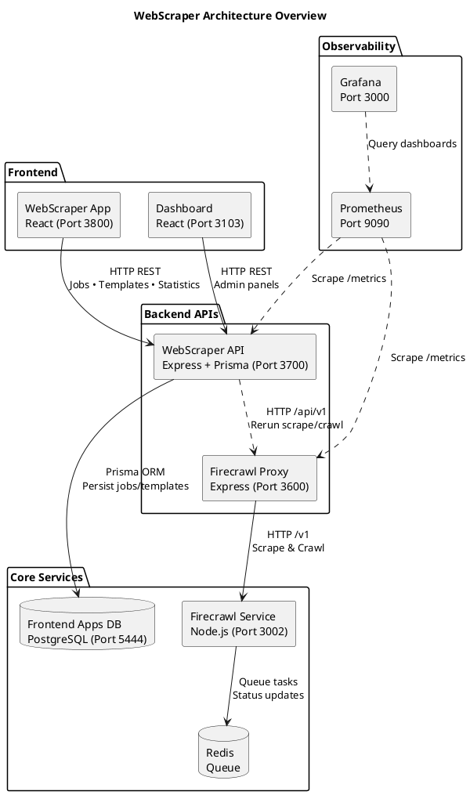
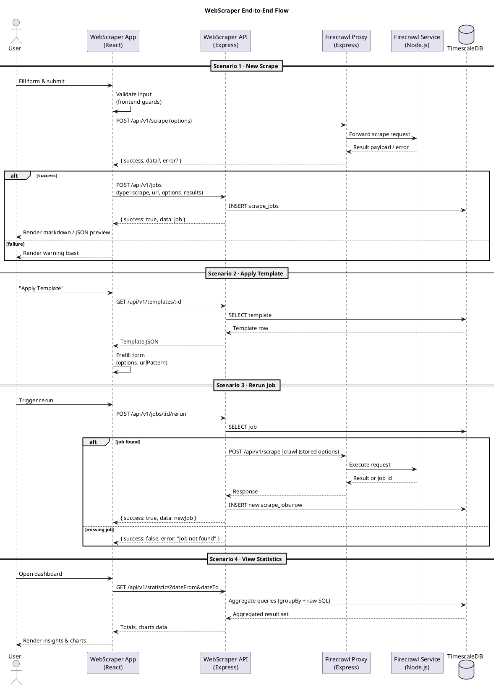

# Overview

The WebScraper API powers the standalone WebScraper experience (`frontend/apps/WebScraper`). It exposes REST endpoints for job management, template catalogs, and aggregated statistics while coordinating with the Firecrawl Proxy for scraping execution and TimescaleDB for time-series persistence.

**Service coordinates**

- Protocol: HTTP REST
- Default port: `3700` (`WEBSCRAPER_API_PORT`)
- Base path: `/api/v1`
- Metrics: `/metrics` (Prometheus exposition)
- Health: `/health`
- History alias: `/api/v1/history` (same payload as statistics)
- Firecrawl: [`WEBSCRAPER_FIRECRAWL_PROXY_URL`](./firecrawl-proxy.md) (defaults to `http://localhost:3600`)

# Architecture

Component relationships are illustrated in [webscraper-architecture.puml](../../shared/diagrams/webscraper-architecture.puml).



The end-to-end scraping flow is captured in [webscraper-flow.puml](../../shared/diagrams/webscraper-flow.puml).



# API Surface

## Jobs — `/api/v1/jobs`

| Method | Path | Description |
| ------ | ---- | ----------- |
| GET | `/api/v1/jobs` | Paginated listing. Filters: `status`, `type`, `templateId`, `url`, `dateFrom`, `dateTo`, `page`, `limit`. |
| GET | `/api/v1/jobs/:id` | Fetch a single job including template relation. |
| POST | `/api/v1/jobs` | Persist a job result (frontend call after Firecrawl completion). |
| DELETE | `/api/v1/jobs/:id` | Remove a job permanently. |
| POST | `/api/v1/jobs/:id/rerun` | Delegate rerun to Firecrawl with stored job options. |

**Create job payload**

```json
{
  "type": "scrape",
  "url": "https://example.com",
  "status": "completed",
  "templateId": "2e5d3f06-6485-4ae2-9e94-5caa6fa4900f",
  "options": {
    "formats": ["markdown", "html"],
    "onlyMainContent": true,
    "waitFor": 750
  },
  "results": {
    "markdown": "# Example",
    "links": ["https://example.com/docs"]
  },
  "startedAt": "2025-01-16T12:00:00.000Z",
  "completedAt": "2025-01-16T12:00:10.000Z",
  "duration": 10
}
```

## Templates — `/api/v1/templates`

| Method | Path | Description |
| ------ | ---- | ----------- |
| GET | `/api/v1/templates` | List templates ordered by `updatedAt DESC`. |
| GET | `/api/v1/templates/:id` | Retrieve template details. |
| POST | `/api/v1/templates` | Create template (`name`, optional `description`, optional `urlPattern`, `options`). |
| PUT | `/api/v1/templates/:id` | Update template fields. |
| DELETE | `/api/v1/templates/:id` | Delete template (cascades managed at app layer). |
| POST | `/api/v1/templates/import` | Bulk import array of templates (upsert by `name`). |
| GET | `/api/v1/templates/export` | Export all templates as ordered JSON. |

## Statistics — `/api/v1/statistics`

Aggregated analytics backing the dashboard. Supports `dateFrom`/`dateTo` query params for windowing.

```json
{
  "success": true,
  "data": {
    "totals": { "jobs": 128, "templates": 9, "successRate": 0.82 },
    "byStatus": { "completed": 88, "running": 4, "pending": 6, "failed": 30 },
    "byType": { "scrape": 110, "crawl": 18 },
    "recentJobs": [{ "id": "uuid", "status": "completed" }],
    "jobsPerDay": [{ "date": "2025-01-14", "count": 18 }],
    "popularTemplates": [{ "templateId": "uuid", "name": "Documentation Site", "usageCount": 27 }]
  }
}
```

## Schedules — `/api/v1/schedules`

| Method | Path | Description |
| ------ | ---- | ----------- |
| GET | `/api/v1/schedules` | List schedules with optional filters (`enabled`, `scheduleType`, `templateId`). |
| GET | `/api/v1/schedules/:id` | Retrieve a single schedule with template relation. |
| GET | `/api/v1/schedules/:id/history` | Paginated jobs triggered by this schedule (reuses job filters). |
| POST | `/api/v1/schedules` | Create cron, interval, or one-time schedule; `nextRunAt` calculated on save. |
| PUT | `/api/v1/schedules/:id` | Update schedule definition and restart timers. |
| PATCH | `/api/v1/schedules/:id/toggle` | Enable/disable schedule without deleting it. |
| DELETE | `/api/v1/schedules/:id` | Remove schedule and cancel timers. |

```plantuml
!include ../../shared/diagrams/webscraper-scheduler-flow.puml
```

**Scheduler runtime**

- Enabled by setting `WEBSCRAPER_SCHEDULER_ENABLED=true` (see `scripts/webscraper/start-scheduler.sh`).
- Supports cron expressions (5-field), fixed intervals ≥ 60 seconds, and single-run schedules.
- Retries failed executions up to `WEBSCRAPER_SCHEDULER_RETRY_ATTEMPTS` with exponential backoff.
- Auto-disables when `failureCount` reaches `WEBSCRAPER_SCHEDULER_MAX_FAILURES`.
- Emits Prometheus metrics: `webscraper_schedules_total`, `webscraper_schedule_executions_total`, `webscraper_schedule_execution_duration_seconds`.

## Exports — `/api/v1/exports`

Allows operators to download historical data in analyst-friendly formats. Files are generated asynchronously and stored in `WEBSCRAPER_EXPORT_DIR` until `expiresAt`.

| Method | Path | Description |
| ------ | ---- | ----------- |
| GET | `/api/v1/exports` | Paginated list with filters (`status`, `exportType`, `dateFrom`, `dateTo`, `page`, `limit`). |
| POST | `/api/v1/exports` | Create export job. Body: `{ "name", "exportType": "jobs" \| "templates" \| "schedules" \| "results", "formats": ["csv","json","parquet"], "filters": { ... } }`. |
| GET | `/api/v1/exports/:id` | Inspect export metadata (status, rowCount, file paths, expiresAt). |
| GET | `/api/v1/exports/:id/download/:format` | Stream file (`csv`, `json`, `parquet`, `zip`). Returns `409` if still processing. |
| DELETE | `/api/v1/exports/:id` | Delete export and purge files immediately. |

**Example request**

```http
POST /api/v1/exports
Content-Type: application/json

{
  "name": "January completed jobs",
  "description": "All successful scrapes from January 2025",
  "exportType": "jobs",
  "formats": ["csv", "parquet"],
  "filters": {
    "status": "completed",
    "dateFrom": "2025-01-01",
    "dateTo": "2025-01-31"
  }
}
```

**Response (202 Accepted)**

```json
{
  "success": true,
  "data": {
    "id": "b6a6d5d0-5f2a-4de2-9f1c-74502b153c25",
    "name": "January completed jobs",
    "exportType": "jobs",
    "formats": ["csv", "parquet"],
    "status": "pending",
    "expiresAt": "2025-01-17T10:00:00.000Z"
  }
}
```

### File generation

- CSV via `@json2csv/node` (streaming, UTF-8 BOM)
- Parquet via `@dsnp/parquetjs` (SNAPPY compression, schema enforced)
- JSON via native streams (2-space indentation)
- ZIP via `archiver` (created automatically when multiple formats are selected)

### Configuration

| Variable | Description | Default |
| --- | --- | --- |
| `WEBSCRAPER_EXPORT_ENABLED` | Toggle export service & cleanup job | `true` |
| `WEBSCRAPER_EXPORT_DIR` | Directory for generated files | `/tmp/webscraper-exports` |
| `WEBSCRAPER_EXPORT_TTL_HOURS` | Download window before cleanup | `24` |
| `WEBSCRAPER_EXPORT_CLEANUP_INTERVAL_HOURS` | Cleanup cadence | `6` |
| `WEBSCRAPER_EXPORT_MAX_ROWS` | Hard cap on retrieved rows | `100000` |
| `WEBSCRAPER_EXPORT_MAX_FILE_SIZE_MB` | Abort export if estimate exceeds | `500` |

### Metrics

- `webscraper_exports_total{status,export_type}`
- `webscraper_export_executions_total{export_type,status}`
- `webscraper_export_duration_seconds{export_type,format}`
- `webscraper_export_file_size_bytes{export_type,format}`

### Flow

```plantuml
!include ../../shared/diagrams/webscraper-export-flow.puml
```

## History — `/api/v1/history`

Convenience alias for the statistics payload. Returns the same structure as `/api/v1/statistics`; use this endpoint when clients expect a history-specific route.

## Health & Metrics

- `GET /` — service metadata + endpoint catalog.
- `GET /health` — database connectivity check (`SELECT 1` via Prisma).
- `GET /metrics` — Prometheus exposition for `webscraper_*` metrics.

# Data Model

Relational layout is documented in [webscraper-erd.puml](../../shared/diagrams/webscraper-erd.puml).

```plantuml
@startuml WebScraperERD
title WebScraper Database Schema (TimescaleDB)

hide methods
skinparam classAttributeIconSize 0

!define table(x) class x << (T,#FFAAAA) >>
!define primary_key(x) <u>x</u>
!define foreign_key(x) <i>x</i>

table("scrape_templates") as Template {
  primary_key(id): uuid
  --
  name: text <<unique>>
  description: text?
  url_pattern: text?
  options: jsonb
  usage_count: integer (default 0)
  created_at: timestamptz
  updated_at: timestamptz
}

table("scrape_jobs") as Job {
  primary_key(id): uuid
  --
  type: varchar(16)
  url: text
  status: varchar(16)
  firecrawl_job_id: varchar(128)?
  foreign_key(template_id): uuid?
  options: jsonb
  results: jsonb?
  error: text?
  started_at: timestamptz?
  completed_at: timestamptz?
  duration_seconds: integer?
  created_at: timestamptz
  updated_at: timestamptz
}

Template "1" -- "0..*" Job : owns >

note right of Template
  Constraints:
  - name UNIQUE
  Indexes:
  - (name)
end note

note right of Job
  Indexes:
  - (status, created_at)
  - (type)
  - (template_id)
  Notes:
  - Hypertable partitioned by created_at/started_at
  - Stores JSONB options & results payloads
end note

@enduml
```

**ScrapeJob**

- Columns: `id`, `type (scrape|crawl)`, `url`, `status`, `templateId`, `firecrawlJobId`, `options` JSONB, `results` JSONB, `error`, `startedAt`, `completedAt`, `duration`, `createdAt`, `updatedAt`.
- Indexes: `(status, createdAt)`, `(type)`, `(templateId)`.
- Hypertable (TimescaleDB) enabling retention policies and aggregate queries.

**Template**

- Columns: `id`, `name` (unique), `description`, `urlPattern`, `options` JSONB, `usageCount`, timestamps.
- Relationship: `Template` has many `ScrapeJob`.
- Validation: `name` uniqueness handled by Prisma (error code `P2002`), `urlPattern` validated as regexp.

# Error Handling

| Scenario | Status | Payload |
| -------- | ------ | ------- |
| Validation failure | 400 | `{ "success": false, "error": "Validation failed", "details": [...] }` |
| Not found | 404 | `{ "success": false, "error": "<resource> not found" }` |
| Rate limit exceeded | 429 | `{ "success": false, "error": "Too many requests" }` |
| Firecrawl proxy failure | 502 | Upstream message surfaced as `{ success: false, error: "<reason>" }` |
| Database outage | 503 | Health endpoint returns `{ success: false, status: "error" }` |

Unhandled errors flow through the global error handler, returning JSON envelopes and logging via `pino`.

# Rate Limiting

- Powered by `express-rate-limit`.
- Defaults:

```ini
WEBSCRAPER_API_RATE_LIMIT_WINDOW_MS=60000
WEBSCRAPER_API_RATE_LIMIT_MAX=100
```

- Response headers: `Retry-After`, `X-RateLimit-Limit`, `X-RateLimit-Remaining`.
- Adjust values in `.env` for different environments.

# Metrics

Prometheus counters, gauges, and histograms exposed at `/metrics`:

- `webscraper_http_requests_total{method,route,status}`
- `webscraper_http_request_duration_seconds{method,route}`
- `webscraper_jobs_total{type,status}`
- `webscraper_templates_total`
- `webscraper_active_jobs`

Integrate with the core Prometheus/Grafana stack or inspect locally via `curl http://localhost:3700/metrics`.

# Configuration

Configuration is centralised in the project root `.env`. Key variables:

| Variable | Description | Default |
| -------- | ----------- | ------- |
| `WEBSCRAPER_API_PORT` | Express listen port | `3700` |
| `WEBSCRAPER_DATABASE_URL` | TimescaleDB/PostgreSQL connection string | — |
| `WEBSCRAPER_FIRECRAWL_PROXY_URL` | Firecrawl proxy base URL | `http://localhost:3600` |
| `WEBSCRAPER_API_LOG_LEVEL` | Pino log level | `info` |
| `WEBSCRAPER_API_RATE_LIMIT_MAX` | Requests per window per IP | `100` |
| `WEBSCRAPER_API_RATE_LIMIT_WINDOW_MS` | Rate-limit window length | `60000` |

Initialization helper: [`init-database.sh`](https://github.com/marceloterra/TradingSystem/blob/main/backend/api/webscraper-api/scripts/init-database.sh) (supports optional `--seed`).

# Development Workflow

```bash
# Install dependencies and generate Prisma client
cd backend/api/webscraper-api
npm install
npx prisma generate

# Run migrations + optional seed
bash scripts/init-database.sh          # migrations only
bash scripts/init-database.sh --seed   # migrations + seed

# Start service in watch mode
npm run dev

# Run tests
npm test
npm run test:watch
```

Manual endpoint smoke test:

```bash
bash scripts/test-endpoints.sh
```

# Deployment Notes

1. Ensure TimescaleDB is reachable (`pg_isready`).
2. Deploy migrations: `npx prisma migrate deploy`.
3. Start service: `npm start` (honours `WEBSCRAPER_API_PORT`).
4. Verify health: `curl http://<host>:<port>/health`.
5. Register `/metrics` with Prometheus to observe `webscraper_*` series.

# Firecrawl Integration

- `POST /api/v1/jobs/:id/rerun` chooses `/api/v1/scrape` or `/api/v1/crawl` on the proxy based on job type.
- Saved options are reused to guarantee deterministic replays; results persist as a **new** job record to preserve history.
- Proxy errors (network or 4xx/5xx) bubble up as 502 responses with the original error message for observability.

# References

- Frontend client: [`WebScraper Feature`](../../frontend/features/webscraper-app.md)
- Firecrawl proxy API: [`firecrawl-proxy.md`](./firecrawl-proxy.md)
- Database schema deep dive: [`webscraper-schema.md`](../data/webscraper-schema.md)
- PlantUML diagrams: [`docs/context/shared/diagrams`](../../shared/diagrams/)
