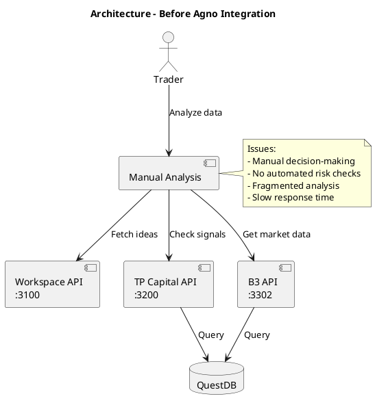
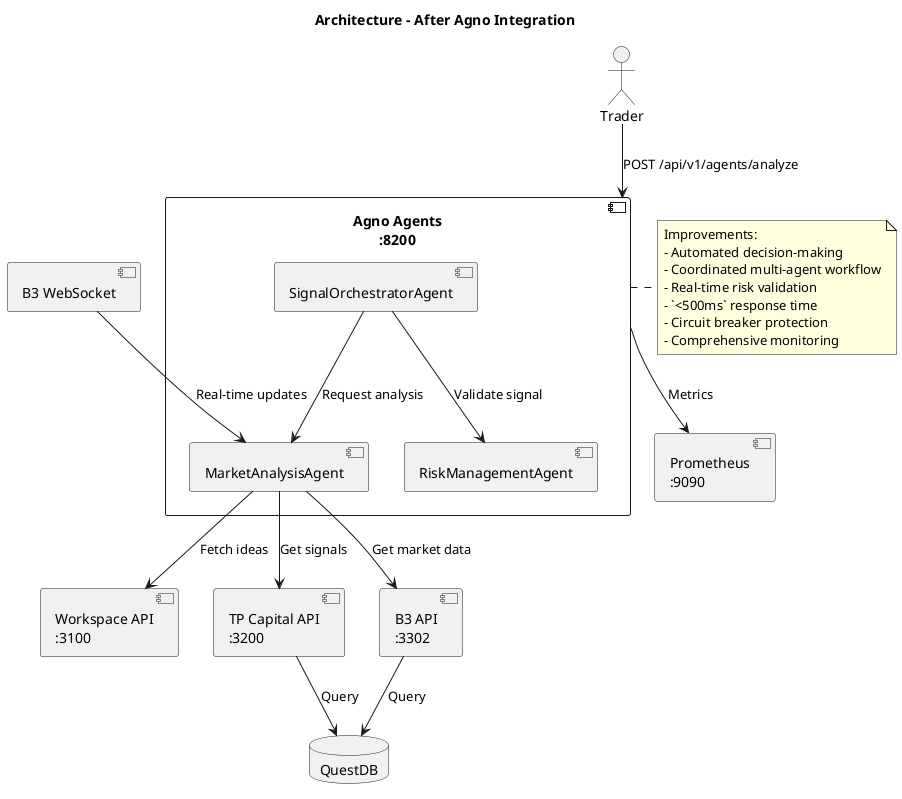

# ADR-0002 — Adopt Agno Framework for Multi-Agent Trading System

> ✅ **Accepted** — 2025-10-16

## Context

The TradingSystem platform currently relies on manual workflows to correlate data from the Workspace API (:3100), TP Capital API (:3200), and B3 API (:3302). Traders manually collect market information, cross-check Telegram signals, and apply risk heuristics before making a decision. This process is slow (5–10 minutes per decision), error-prone, and lacks observability. Risk checks are inconsistently applied and there is no shared execution context between data sources.

Key drivers and constraints:

- **Need for intelligent decision-making** — The product roadmap calls for automated signal generation that respects strict risk rules and integrates multiple data providers.
- **Latency requirement** — Decisions must be delivered in less than 500ms (p95) to remain actionable during fast market movements.
- **Stack alignment** — The backend team prefers a Python ecosystem to align with existing ML tooling and infrastructure.
- **Resilience & observability** — Any solution must offer retry patterns, circuit breakers, structured logging, Prometheus metrics, and optional tracing.
- **Deployment model** — The solution must run locally (on-premises) inside the existing Docker Compose stack and integrate with centralized `.env` configuration.

## Decision

We will adopt the **Agno framework** ([https://github.com/agno-agi/agno](https://github.com/agno-agi/agno)) to implement a multi-agent trading system with three specialized agents:

- **MarketAnalysisAgent** generates trading signals using Workspace ideas, TP Capital signals, and B3 market data.
- **RiskManagementAgent** validates each signal against configured risk limits (daily loss, position size, trading hours, circuit breaker state).
- **SignalOrchestratorAgent** coordinates the workflow between MarketAnalysis and RiskManagement agents, aggregates responses, and exposes them through FastAPI endpoints.

The service will be implemented using **Python 3.12 + FastAPI** following Clean Architecture principles (Domain, Application, Infrastructure, Interfaces layers). It will ship as a Docker container listening on port 8200, with metrics exported to Prometheus and health checks at `/health?detailed=true`.

## Options Considered

### Option 1 — Custom Python Scripts
- **Description:** Implement ad hoc scripts that call external APIs directly and apply bespoke logic for analysis and risk validation.
- **Pros:**
  - ✅ Full control over implementation details.
  - ✅ No external framework dependencies.
  - ✅ Simple deployment and minimal abstractions.
- **Cons:**
  - ❌ No agent abstraction or orchestration primitives.
  - ❌ Significant effort to re-implement scheduling, context handling, and coordination.
  - ❌ Risk of inconsistent patterns and difficult maintenance as complexity grows.
  - ❌ Limited ability to reuse components or evolve into multiple agents.

### Option 2 — LangChain / LangGraph
- **Description:** Leverage the existing LangChain ecosystem (already used elsewhere in the project) to orchestrate agent behaviour.
- **Pros:**
  - ✅ Mature ecosystem with extensive documentation.
  - ✅ Rich tooling for LLM integrations and agent builders.
  - ✅ Familiar to team members already working with LangChain.
- **Cons:**
  - ❌ Larger dependency footprint and heavier runtime.
  - ❌ Abstractions optimized for conversational flows rather than low-latency trading use cases.
  - ❌ Added complexity to model synchronous workflows with strict latency requirements.
  - ❌ Potential performance penalties under high-frequency workloads.

### Option 3 — Agno Framework *(Chosen)*
- **Description:** Adopt Agno, a lightweight multi-agent framework designed for speed and developer ergonomics.
- **Pros:**
  - ✅ Built for fast, deterministic agent execution.
  - ✅ Clean API for defining specialized agents and coordinating workflows.
  - ✅ Seamless integration with FastAPI and structured logging.
  - ✅ Lightweight dependency set suited for on-prem deployments.
  - ✅ Active open-source development with focus on practical agent use cases.
- **Cons:**
  - ❌ Relatively new framework with a smaller community.
  - ❌ Fewer battle-tested examples compared to LangChain.
  - ❌ Potential for breaking changes as the project evolves.

## Architecture Impact

### Before — Source
Download: [`docs/context/shared/diagrams/adr-0002-before-architecture.puml`](../../../shared/diagrams/adr-0002-before-architecture.puml)

### Before — Rendered

### After — Source
Download: [`docs/context/shared/diagrams/adr-0002-after-architecture.puml`](../../../shared/diagrams/adr-0002-after-architecture.puml)

### After — Rendered

## Consequences

### Positive
- ✅ **Automated analysis** — MarketAnalysisAgent reduces manual effort, enabling scalable signal generation.
- ✅ **Risk enforcement** — RiskManagementAgent ensures every recommendation respects configured policies.
- ✅ **Coordinated decisions** — SignalOrchestratorAgent provides a deterministic workflow across agents.
- ✅ **Resilience** — Retry with exponential backoff and circuit breaker prevent cascading failures during outages.
- ✅ **Observability** — Prometheus metrics, structured logging, and optional tracing provide full visibility.
- ✅ **Maintainability** — Clean Architecture boundaries make each layer independently testable and replaceable.

### Negative
- ❌ **Framework dependency** — Coupling with Agno requires monitoring upstream changes and pinning versions.
- ❌ **Learning curve** — Team members must adopt new agent abstractions and best practices.
- ❌ **Debugging complexity** — Multi-agent flows can be harder to troubleshoot than linear scripts.

### Risks
- ⚠️ **Framework maturity** — As a newer project, Agno may expose undiscovered bugs. *Mitigation:* comprehensive tests, staged rollout, ability to fall back to manual process.
- ⚠️ **Performance under load** — Agent orchestration could add overhead. *Mitigation:* async processing, profiling, load testing, caching of health checks.

## Implementation Notes

### Required Changes
1. Create `infrastructure/agno-agents/` service following Clean Architecture structure.
2. Implement MarketAnalysisAgent, RiskManagementAgent, and SignalOrchestratorAgent using Agno.
3. Build HTTP client adapters (`WorkspaceClient`, `TPCapitalClient`, `B3Client`) with httpx, retry, and circuit breaker.
4. Add `B3WebSocketConsumer` for real-time data streaming.
5. Provide resilience utilities (tenacity retry decorator, pybreaker circuit breaker).
6. Define FastAPI routes (`/api/v1/agents/analyze`, `/api/v1/agents/signals`, `/api/v1/agents/status`).
7. Add Prometheus metrics, structured logging, and optional OpenTelemetry tracing.
8. Update Docker Compose (AI tools stack) with container, health checks, and metrics port.
9. Register Prometheus scrape job and alert rules (`AgnoAgentsDown`, `AgnoAgentErrorsHigh`, `AgnoDependencyUnhealthy`, `AgnoApiErrorsHigh`).

### Migration Path
No migration is required. The Agno Agents service is a new capability that operates alongside existing manual workflows. Operators can continue using legacy processes during rollout.

### Rollback Strategy
If the Agno service encounters critical issues, operators can revert to manual analysis using Workspace, TP Capital, and B3 APIs directly. The service is stateless and does not mutate external data stores, so disabling it poses minimal risk.

## Metrics & Monitoring

### Success Criteria
- [ ] Agent processing time `<500ms` (p95).
- [ ] API response time `<200ms` (p95).
- [ ] 99% uptime measured over 30 days.
- [ ] 100% of signals validated by RiskManagementAgent prior to delivery.
- [ ] Error rate `<1%` across agent executions.

### Monitoring
- Prometheus counters and histograms (`agent_decisions_total`, `agent_processing_seconds`, `agent_errors_total`, `dependency_status`).
- Alert rules (`AgnoAgentsDown`, `AgnoAgentErrorsHigh`, `AgnoAgentProcessingSlow`, `AgnoDependencyUnhealthy`, `AgnoApiErrorsHigh`).
- Grafana dashboards visualising latency, decision volume, dependency health.

## Related

- **Related ADRs:** [ADR-0001 — Use LowDB for MVP Persistence](2025-10-09-adr-0001-use-lowdb.md)
- **Related Documentation:**
  - Guide: [`docs/context/backend/guides/agno-agents-guide.md`](../../guides/agno-agents-guide.md)
  - Service README: [`infrastructure/agno-agents/README.md`](https://github.com/marceloterra/TradingSystem/blob/main/infrastructure/agno-agents/README.md)
  - Prometheus alerts: [`infrastructure/monitoring/prometheus/rules/alert-rules.yml`](https://github.com/marceloterra/TradingSystem/blob/main/infrastructure/monitoring/prometheus/rules/alert-rules.yml)

## References
- [Agno Framework](https://github.com/agno-agi/agno)
- [FastAPI Documentation](https://fastapi.tiangolo.com/)
- [Prometheus Best Practices](https://prometheus.io/docs/practices/naming/)
- [Circuit Breaker Pattern](https://martinfowler.com/bliki/CircuitBreaker.html)

## Change Log

| Date | Author | Changes |
|------|--------|---------|
| 2025-10-16 | Marcelo Terra | Initial draft, architecture review, decision accepted. |
