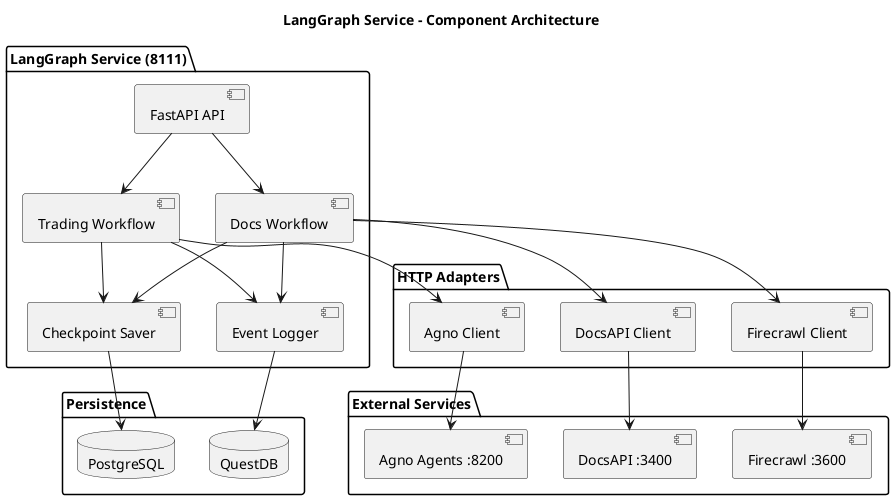
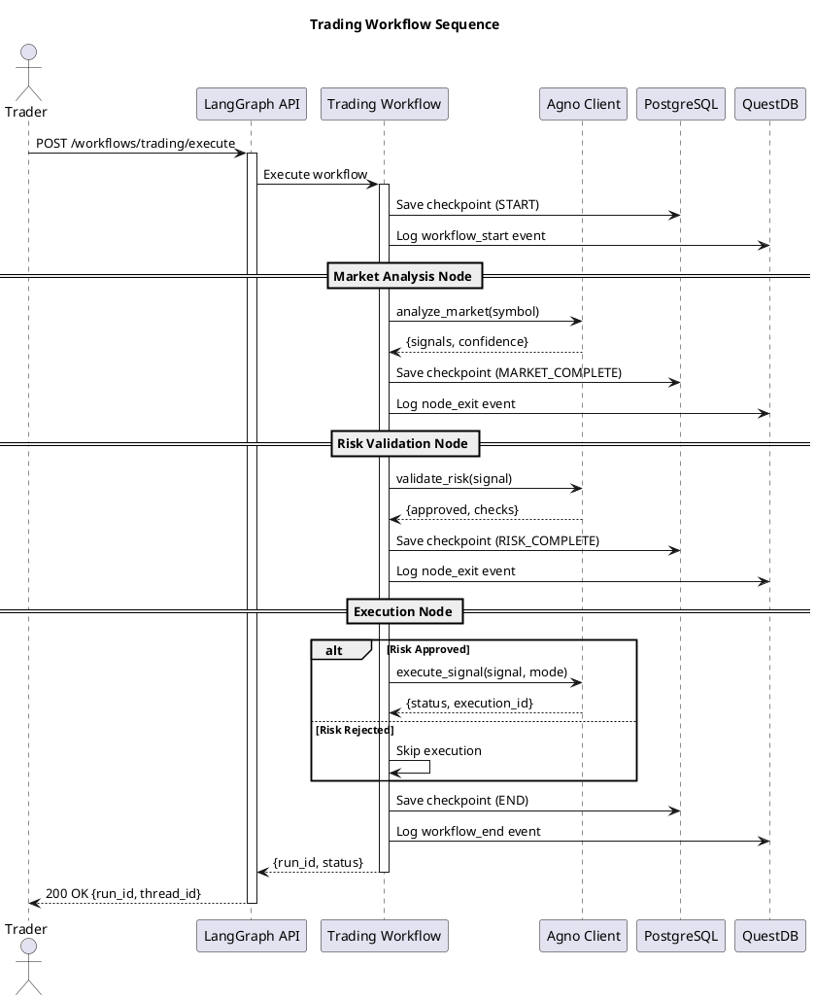

# LangGraph Implementation Guide

**Version:** 2.0.0  
**Service:** LangGraph Orchestrator  
**Port:** 8111  
**Status:** ✅ Production Ready (MVP)

---

## 🎯 Overview

Este guia documenta a implementação completa do **LangGraph Service**, o orquestrador central de workflows do TradingSystem, seguindo as diretrizes técnicas do Marcelo Terra.

### Decisões Arquiteturais

| Decisão | Escolha | Justificativa |
|---------|---------|---------------|
| **Escopo** | Dual-purpose (Trading + Docs) | Bounded contexts com reutilização de infra |
| **Workflows** | Hybrid (ambos simultâneos) | Validação de infra em dois domínios |
| **Persistência** | PostgreSQL (checkpoints) + QuestDB (logs) | Separação de concerns: estado vs telemetria |
| **LLM** | Híbrido (determinístico + opcional) | Gating crítico determinístico, enriquecimento com LLM |
| **Integração Agno** | LangGraph → Agno (HTTP) | LangGraph como orquestrador superior |

---

## 📊 Arquitetura Implementada

### Component Diagram



### Flow: Trading Workflow



---

## 🛠️ Implementation Details

### 1. Database Schemas

#### PostgreSQL - Checkpoints

**Localização:** `backend/data/postgresql/schemas/langgraph_checkpoints.sql`

**Tables:**
- `langgraph_checkpoints` - Workflow state snapshots
- `langgraph_runs` - Execution lifecycle tracking

**Key Features:**
- UUID primary keys
- JSONB for flexible state storage
- Idempotency support via unique keys
- TimescaleDB hypertable support (optional)

#### QuestDB - Events

**Localização:** `backend/data/questdb/schemas/langgraph_events.sql`

**Tables:**
- `langgraph_events` - High-frequency event stream
- `langgraph_node_metrics` - Aggregated node performance
- `langgraph_workflow_metrics` - Workflow statistics

**Key Features:**
- SYMBOL columns for high performance
- Partitioned by DAY
- Optimized for time-series queries

### 2. Clean Architecture Structure

```
infrastructure/langgraph/src/
├── domain/                  # Core business logic
│   └── models.py           # Entities & Value Objects
├── application/            # Use cases (future)
├── infrastructure/         # External integrations
│   ├── adapters/
│   │   ├── agno_client.py       # HTTP → Agno Agents
│   │   ├── docs_client.py       # HTTP → DocsAPI
│   │   └── firecrawl_client.py  # HTTP → Firecrawl
│   └── persistence/
│       ├── postgres_checkpoint.py  # State persistence
│       └── questdb_logger.py       # Event logging
├── interfaces/             # API & Workflows
│   ├── api/
│   │   └── routes.py       # FastAPI endpoints
│   └── workflows/
│       ├── trading_workflow.py  # LangGraph trading flow
│       └── docs_workflow.py     # LangGraph docs flow
└── config.py               # Pydantic settings
```

### 3. Workflow Implementation

#### Trading Workflow (trading_workflow.py)

**State Machine:**
```python
START 
  → analyze_market_node 
  → validate_risk_node 
  → execute_trade_node 
  → END
```

**State Type:**
```python
class TradingState(TypedDict):
    symbol: str
    signal_id: str
    mode: str  # paper | live
    market_analysis: Dict[str, Any]
    risk_validation: Dict[str, Any]
    execution_result: Dict[str, Any]
    error: str
    current_step: str
```

**Conditional Edges:**
- After market analysis: proceed to risk OR end (on error)
- After risk validation: proceed to execution OR end (if not approved)

#### Docs Workflow (docs_workflow.py)

**State Machine:**
```python
START 
  → fetch_document_node 
  → [review_node OR enrich_node] 
  → save_results_node 
  → END
```

**Operations:**
- `review`: Analyze document for issues and generate suggestions
- `enrich`: Scrape external references and add context

### 4. HTTP Client Adapters

#### Agno Client (agno_client.py)

**Methods:**
- `analyze_market(symbols)` → Market analysis
- `validate_risk(signal)` → Risk validation
- `execute_signal(signal, mode)` → Trade execution

**Resilience:**
- Retry with tenacity (3 attempts, exponential backoff)
- Circuit breaker ready (future)
- Timeout enforcement

#### DocsAPI Client (docs_client.py)

**Methods:**
- `get_document(doc_id)` → Fetch document
- `search_documents(query)` → Search docs
- `update_document(doc_id, content, metadata)` → Update
- `create_review_report(doc_id, issues, suggestions)` → Report

#### Firecrawl Client (firecrawl_client.py)

**Methods:**
- `scrape_url(url, formats)` → Scrape single URL
- `crawl_site(url, max_pages)` → Crawl entire site
- `extract_references(url)` → Extract links

---

## 🚀 Deployment Guide

### 1. Prerequisites

**Required Services:**
- PostgreSQL 14+ (Port 5432)
- QuestDB 7.3+ (Port 9000)
- Agno Agents (Port 8200)
- DocsAPI (Port 3400)
- Firecrawl Proxy (Port 3600)

### 2. Database Setup

```bash
# PostgreSQL
psql -U postgres -d tradingsystem -f backend/data/postgresql/schemas/langgraph_checkpoints.sql

# QuestDB
curl -G "http://localhost:9000/exec" \
  --data-urlencode "query=$(cat backend/data/questdb/schemas/langgraph_events.sql)"
```

### 3. Environment Configuration

Add to **project root `.env`**:

```bash
# LangGraph Service
LANGGRAPH_PORT=8111
LANGGRAPH_ENV=production
LANGGRAPH_LOG_LEVEL=INFO

# PostgreSQL
POSTGRES_HOST=localhost
POSTGRES_PORT=5432
POSTGRES_DB=tradingsystem
POSTGRES_USER=postgres
POSTGRES_PASSWORD=your_secure_password

# QuestDB
QUESTDB_HOST=localhost
QUESTDB_HTTP_PORT=9000

# Service URLs
AGNO_API_URL=http://localhost:8200
DOCS_API_URL=http://localhost:3400
FIRECRAWL_PROXY_URL=http://localhost:3600

# Features
ENABLE_TRADING_WORKFLOWS=true
ENABLE_DOCS_WORKFLOWS=true
ENABLE_METRICS=true
```

### 4. Docker Compose Deployment

```bash
cd /home/marce/projetos/TradingSystem

# Build and start
docker compose -f infrastructure/compose/docker-compose.infra.yml up -d langgraph

# Verify
docker logs infra-langgraph --tail 50

# Health check
curl http://localhost:8111/health | jq
```

### 5. Local Development

```bash
cd infrastructure/langgraph

# Install dependencies
pip install -r requirements.txt

# Run server
python server.py
```

---

## 🧪 Testing

### Integration Tests

**Test Trading Workflow:**
```bash
curl -X POST http://localhost:8111/workflows/trading/execute \
  -H "Content-Type: application/json" \
  -H "X-Idempotency-Key: test-001" \
  -d '{
    "symbol": "WINZ25",
    "signal_id": "test:001",
    "mode": "paper"
  }' | jq
```

**Expected Response:**
```json
{
  "run_id": "uuid",
  "thread_id": "trading-WINZ25-uuid",
  "status": "completed",
  "message": "Trading workflow completed"
}
```

**Test Docs Review:**
```bash
curl -X POST http://localhost:8111/workflows/docs/review \
  -H "Content-Type: application/json" \
  -d '{
    "markdown": "# Test Document\n\nThis is a test.",
    "operation": "review"
  }' | jq
```

### Query Telemetry

**PostgreSQL - Checkpoints:**
```sql
SELECT 
  thread_id,
  type,
  checkpoint_id,
  created_at
FROM langgraph_checkpoints
ORDER BY created_at DESC
LIMIT 10;
```

**QuestDB - Events:**
```sql
SELECT 
  timestamp,
  workflow_name,
  node_name,
  status,
  duration_ms
FROM langgraph_events
WHERE workflow_type = 'trading'
ORDER BY timestamp DESC
LIMIT 20;
```

---

## 📊 Monitoring

### Prometheus Metrics

**Endpoint:** `http://localhost:8111/metrics`

**Key Metrics:**
- `langgraph_workflow_executions_total`
- `langgraph_workflow_duration_seconds`
- `langgraph_workflow_errors_total`
- `langgraph_node_executions_total`

### Grafana Dashboard

**Queries:**
```promql
# Workflow success rate
rate(langgraph_workflow_executions_total{status="completed"}[5m])
/ rate(langgraph_workflow_executions_total[5m])

# P95 latency
histogram_quantile(0.95, 
  rate(langgraph_workflow_duration_seconds_bucket[5m]))
```

---

## 🔧 Troubleshooting

### Issue: Workflow hangs

**Diagnosis:**
```bash
# Check logs
docker logs infra-langgraph --tail 100

# Check PostgreSQL locks
SELECT * FROM pg_stat_activity WHERE state = 'active';
```

**Solution:**
- Increase `WORKFLOW_TIMEOUT_SECONDS`
- Check Agno Agents availability
- Verify network connectivity

### Issue: High error rate

**Diagnosis:**
```sql
-- QuestDB
SELECT 
  workflow_name,
  COUNT(*) as error_count,
  error_message
FROM langgraph_events
WHERE status = 'error'
  AND timestamp > dateadd('h', -1, now())
GROUP BY workflow_name, error_message;
```

**Solution:**
- Check Agno Agents health: `curl http://localhost:8200/health`
- Verify database connections
- Review retry configuration

---

## 📚 Related Documentation


- [ADR-0002 - Agno Framework](../../architecture/decisions/2025-10-16-adr-0002-agno-framework.md)
- [LangGraph README](../../../../infrastructure/langgraph/README.md)
- [Agno Agents Guide](./agno-agents-guide.md)

---

## ✅ Implementation Checklist

### D0-D1: Infrastructure ✅
- [x] PostgreSQL schemas created
- [x] QuestDB schemas created
- [x] Docker Compose updated
- [x] Environment variables documented
- [x] Network connectivity configured

### D2-D3: Trading Workflow MVP ✅
- [x] Trading workflow implemented
- [x] Agno client adapter created
- [x] API endpoints exposed
- [x] State persistence working
- [x] Event logging active

### D4-D5: Docs Workflow MVP ✅
- [x] Docs workflow implemented
- [x] DocsAPI client adapter created
- [x] Firecrawl client adapter created
- [x] Review logic implemented
- [x] Enrichment logic implemented

### D6+: Advanced Features 🚧
- [ ] Webhook notifications
- [ ] Status tracking endpoint
- [ ] Advanced retry strategies
- [ ] Circuit breaker per service
- [ ] LLM-powered enrichment
- [ ] OpenTelemetry tracing

---

**Autor:** Marcelo Terra  
**Data:** 2025-10-17  
**Status:** Complete (D0-D5) | In Progress (D6+)

