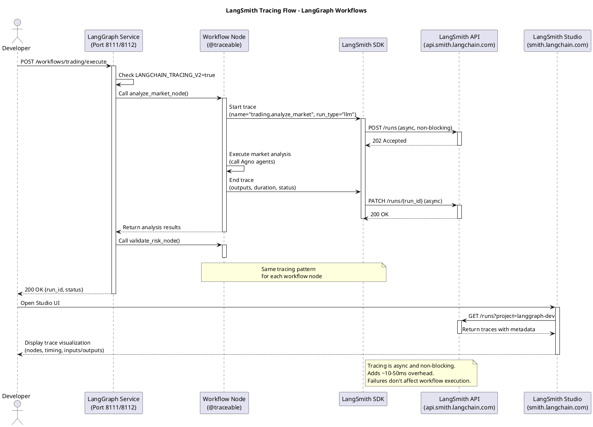

# LangSmith Studio Integration Guide

## Overview

LangSmith Studio is a powerful visual debugging interface that provides real-time trace visualization, input/output inspection, and performance analysis for LangGraph workflows. This guide covers the complete integration of LangSmith Studio with the TradingSystem's LangGraph service, supporting both production (port 8111) and development (port 8112) environments.

**Key Benefits:**
- 🎯 **Real-time trace visualization** - See workflow execution step-by-step
- 🔍 **Input/output inspection** - Analyze data transformations between nodes
- 📊 **Performance analysis** - Identify bottlenecks and optimize execution
- 🐛 **Error debugging** - Trace error propagation through workflows
- 🔄 **Iterative development** - Compare runs and optimize performance

## Prerequisites

Before setting up LangSmith Studio integration, ensure you have:

- **LangSmith Account** - Sign up at https://smith.langchain.com
- **API Key** - Generate at https://smith.langchain.com/settings
- **Docker Compose** - For development environment setup
- **Existing LangGraph Service** - See `infrastructure/langgraph/README.md`
- **Environment Configuration** - Root `.env` file with LangSmith variables

## Environment Setup

### Production Setup (Port 8111)

For production monitoring and debugging:

1. **Configure Environment Variables** in root `.env`:
   ```bash
   # LangSmith Configuration
   LANGSMITH_TRACING=true
   LANGSMITH_API_KEY=lsv2_your_api_key_here
   LANGSMITH_PROJECT=langgraph-production
   ```

2. **Restart Production Service**:
   ```bash
   docker compose -f infrastructure/compose/docker-compose.infra.yml restart langgraph
   ```

3. **Verify Service Health**:
   ```bash
   curl http://localhost:8111/health
   ```

### Development Setup (Port 8112)

For development debugging and testing:

1. **Configure Environment Variables** in root `.env` (same as production):
   ```bash
   # LangSmith Configuration
   LANGSMITH_TRACING=true
   LANGSMITH_API_KEY=lsv2_your_api_key_here
   LANGSMITH_PROJECT=langgraph-dev
   ```

2. **Start Development Stack**:
   ```bash
   bash scripts/langgraph/start-dev.sh
   ```

3. **Verify Development Service**:
   ```bash
   curl http://localhost:8112/health
   ```

> **Note:** Development environment has LangSmith tracing enabled by default with isolated databases and Redis for complete workflow isolation.

> **Environment Variable Mapping:** The `server.py` runtime maps `LANGSMITH_*` variables to `LANGCHAIN_*` variables internally: `LANGSMITH_TRACING` → `LANGCHAIN_TRACING_V2`, `LANGSMITH_API_KEY` → `LANGCHAIN_API_KEY`, `LANGSMITH_PROJECT` → `LANGCHAIN_PROJECT`. You can use either naming convention in your `.env` file.

## Accessing Studio

1. **Navigate to LangSmith Studio**: https://smith.langchain.com/studio

2. **Select Project**:
   - Development: `langgraph-dev`
   - Production: `langgraph-production`

3. **Studio UI Components**:
   - **Trace List** - Historical workflow executions
   - **Trace Details** - Step-by-step execution breakdown
   - **Node Inspection** - Input/output analysis per node
   - **Timing Analysis** - Performance metrics and bottlenecks

## Workflow Debugging Examples

### Example 1: Trading Workflow Debugging

Execute a trading workflow and analyze the trace:

```bash
curl -X POST http://localhost:8112/workflows/trading/execute \
  -H "Content-Type: application/json" \
  -d '{
    "symbol": "WINZ25",
    "mode": "paper",
    "strategy": "default"
  }'
```

**In Studio, you'll see:**
- `analyze_market_node` - Market analysis execution
- `validate_risk_node` - Risk validation checks
- `execute_trade_node` - Trade execution logic
- **Input/Output** at each node (market data, risk scores, trade decisions)
- **Timing breakdown** (identify slow nodes, optimize performance)

### Example 2: Docs Workflow Debugging

Execute a document review workflow:

```bash
curl -X POST http://localhost:8112/workflows/docs/review \
  -H "Content-Type: application/json" \
  -d '{
    "markdown": "# Test Document\n\nThis is sample content for review.",
    "operation": "review",
    "context": "trading_system"
  }'
```

**In Studio, analyze:**
- `fetch_document_node` - Document retrieval
- `review_document_node` - Content analysis and suggestions
- `save_results_node` - Results persistence
- **Review suggestions** and metadata extracted from the document

### Example 3: Error Debugging

Trigger an error scenario to understand error tracing:

```bash
# Invalid symbol to trigger validation error
curl -X POST http://localhost:8112/workflows/trading/execute \
  -H "Content-Type: application/json" \
  -d '{
    "symbol": "INVALID",
    "mode": "paper"
  }'
```

**Error Analysis in Studio:**
- **Error propagation** through workflow nodes
- **Root cause identification** (validation failure, API error, timeout)
- **Recovery attempts** and retry logic
- **Error context** and stack traces

## Trace Analysis

### Filtering Traces

- **By Status**: Filter successful vs failed executions
- **By Workflow Type**: `trading`, `docs`, `custom`
- **By Time Range**: Last hour, day, week, or custom range
- **By Tags**: Custom metadata tags from `@traceable` decorators

### Performance Analysis

- **Duration Histograms**: Identify execution time patterns
- **Node Timing**: Compare performance across different nodes
- **Bottleneck Detection**: Find slow operations
- **Resource Usage**: Memory and CPU consumption patterns

### Input/Output Inspection

- **Data Validation**: Verify inputs match expected schemas
- **Transformation Analysis**: Track data changes between nodes
- **Output Quality**: Assess result completeness and accuracy
- **Schema Compliance**: Ensure data structure consistency

### Metadata Exploration

- **Run IDs**: Unique identifiers for trace correlation
- **Thread IDs**: Concurrent execution tracking
- **Custom Tags**: Business context and categorization
- **Environment Info**: Service version, deployment details

## Advanced Features

### Comparing Runs

1. **Select multiple traces** from the trace list
2. **Use "Compare Runs"** feature to analyze:
   - Performance differences
   - Input/output variations
   - Error patterns
   - Success vs failure scenarios

### Feedback Collection

1. **Open trace details** in Studio
2. **Add feedback** with:
   - Thumbs up/down for quality assessment
   - Comments for specific improvements
   - Tags for categorization (e.g., "slow-execution", "data-quality-issue")
3. **Use feedback** for model fine-tuning and workflow optimization

### Custom Metadata

Enhance traceability with custom metadata:

```python
@traceable(
    name="trading.analyze_market",
    run_type="llm",
    tags=["trading", "market-analysis", "production"],
    metadata={
        "version": "2.1.0",
        "strategy": "momentum",
        "environment": "production"
    }
)
def analyze_market_node(symbol: str, mode: str) -> dict:
    # Implementation here
    pass
```

### Trace Sharing

1. **Open specific trace** in Studio
2. **Click "Share"** to generate shareable link
3. **Share with team** for collaborative debugging
4. **Embed in documentation** for reference

## Troubleshooting

### Traces Not Appearing

**Symptoms:** Workflows execute but no traces appear in Studio

**Solutions:**
1. **Verify API Key**: Check `LANGSMITH_API_KEY` in `.env`
2. **Enable Tracing**: Ensure `LANGSMITH_TRACING=true`
3. **Check Project Name**: Verify `LANGSMITH_PROJECT` matches Studio project
4. **View Service Logs**:
   ```bash
   docker logs langgraph-dev -f
   # Look for LangSmith-related messages
   ```

### Incomplete Traces

**Symptoms:** Traces appear but show incomplete execution

**Solutions:**
1. **Check Network Connectivity**: Ensure service can reach LangSmith API
2. **Verify API Permissions**: Confirm API key has tracing permissions
3. **Check Service Health**: Verify LangGraph service is running properly
4. **Review Logs** for any trace sending errors

### High Latency

**Symptoms:** Workflow execution is slower with tracing enabled

**Analysis:**
- **Expected Overhead**: LangSmith adds ~10-50ms per trace
- **Acceptable for Development**: Overhead is acceptable in dev environment
- **Production Consideration**: Disable tracing in production if performance critical:
  ```bash
  # In .env for production
  LANGSMITH_TRACING=false
  ```

### Project Not Found

**Symptoms:** Studio shows "Project not found" error

**Solutions:**
1. **Verify Project Name**: Check `LANGSMITH_PROJECT` matches exactly
2. **Create Project**: Create project in Studio if it doesn't exist
3. **Check API Key Scope**: Ensure API key has access to the project
4. **Project Permissions**: Verify you're a member of the project

## Best Practices

### Project Organization

- **Separate Projects**: Use different projects for dev/prod environments
  - `langgraph-dev` for development debugging
  - `langgraph-production` for production monitoring
- **Descriptive Names**: Use clear, descriptive project names
- **Access Control**: Manage team access appropriately per project

### Trace Naming

- **Semantic Names**: Use descriptive names in `@traceable` decorators
  ```python
  # Good
  @traceable(name="trading.analyze_market")

  # Avoid
  @traceable(name="process_node")
  ```

- **Hierarchical Naming**: Use dot notation for organization
  ```python
  @traceable(name="trading.risk.validate_position")
  @traceable(name="docs.review.analyze_content")
  ```

### Run Types

Use appropriate `run_type` values for categorization:
- `"llm"` - Language model calls
- `"chain"` - Chain operations
- `"tool"` - Tool/function calls
- `"retriever"` - Data retrieval operations

### Production Usage

- **Selective Tracing**: Enable tracing in production only when debugging
- **Performance Monitoring**: Monitor trace overhead impact
- **Data Privacy**: Ensure no sensitive data in traces
- **Retention Policy**: Manage trace data retention appropriately

### Regular Analysis

- **Weekly Reviews**: Schedule regular trace analysis sessions
- **Performance Trends**: Monitor execution time patterns
- **Error Patterns**: Identify recurring issues
- **Optimization Opportunities**: Find areas for improvement

## PlantUML Diagram: LangSmith Tracing Flow



> **Note:** The diagram shows `LANGCHAIN_TRACING_V2=true` internally, which is set automatically when `LANGSMITH_TRACING=true` is configured in your `.env` file. The server handles this mapping automatically.

## Related Documentation

- **[LangGraph Service](https://github.com/marceloterra1983/TradingSystem/blob/main/infrastructure/langgraph/README.md)** - Complete service documentation
- **[Development vs Production Comparison](https://github.com/marceloterra1983/TradingSystem/blob/main/infrastructure/langgraph/DEVELOPMENT.md)** - Environment setup guide
- **[LangGraph Implementation Guide](./langgraph-implementation-guide.md)** - Architecture and implementation details
- **[LangSmith Official Docs](https://docs.smith.langchain.com)** - Platform documentation
- **[LangGraph Studio Docs](https://docs.langchain.com/langgraph-platform/local-server)** - Studio-specific features

## Quick Reference

### Environment Variables
```bash
# Required for Studio integration
LANGSMITH_TRACING=true
LANGSMITH_API_KEY=lsv2_your_api_key_here
LANGSMITH_PROJECT=langgraph-dev  # or langgraph-production
```

### Studio URLs
- **Studio UI**: https://smith.langchain.com/studio
- **API Settings**: https://smith.langchain.com/settings
- **Project Management**: https://smith.langchain.com/projects

### Common Commands
```bash
# Development environment
bash scripts/langgraph/start-dev.sh

# Production environment
docker compose -f infrastructure/compose/docker-compose.infra.yml restart langgraph

# Health checks
curl http://localhost:8112/health  # Development
curl http://localhost:8111/health  # Production

# View logs
docker logs langgraph-dev -f        # Development
docker logs infra-langgraph -f     # Production
```

### Debugging Workflow
1. **Enable tracing** in environment
2. **Execute workflow** via API
3. **Open Studio** and select project
4. **Analyze trace** for performance and errors
5. **Iterate** based on insights