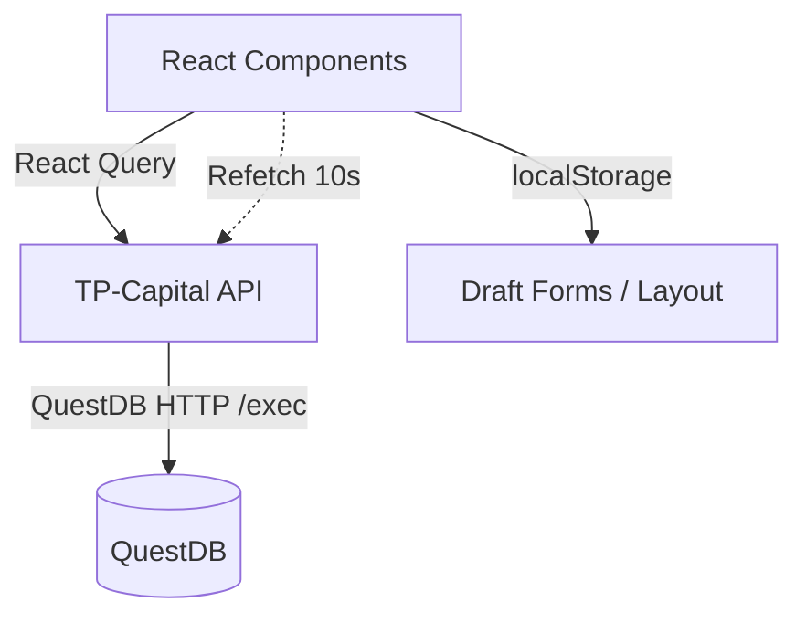

# Feature: Telegram Connections Management

## Overview

The **Connections** page centralises the configuration of Telegram bots and channels used by the TP Capital ingestion pipeline. Operators can add, edit, soft-delete, and monitor Telegram assets stored in QuestDB through the TP-Capital API.

- **Location**: `frontend/apps/dashboard/src/components/pages/ConnectionsPage.tsx`
- **Route**: `/connections`
- **Backend**: `frontend/apps/tp-capital` (port `4005`)
- **QuestDB Tables**: `telegram_bots`, `telegram_channels`

## Component Tree

```
ConnectionsPage
├─ WebSocketStatusSection
├─ ProfitDLLStatusSection
├─ ServiceHealthSection
└─ TelegramManagementSection
   ├─ TelegramBotTableCard
   │  ├─ Bot status card (GET /bots)
   │  ├─ Bot CRUD table (GET/POST/PUT/DELETE /telegram/bots)
   │  └─ Add/Edit dialog (React Hook Form)
   └─ TelegramChannelTableCard
      ├─ Channel CRUD table (GET/POST/PUT/DELETE /telegram/channels)
      └─ Add/Edit dialog + description modal
```

## Data Flow



## Data Models

### BotRecord (QuestDB `telegram_bots`)

```typescript
type BotRecord = {
  id: string;             // QuestDB primary key ("bot-<ts>-<rand>")
  username: string;       // Telegram bot username (@MyBot)
  token: string;          // Bot token (stored in QuestDB)
  bot_type: 'Forwarder' | 'Sender';
  description?: string;
  status: 'active' | 'deleted';
  created_at?: string;
  updated_at?: string;
};
```

### ChannelRecord (QuestDB `telegram_channels`)

```typescript
type ChannelRecord = {
  id: string;                   // "channel-<ts>-<rand>"
  label: string;
  channel_id: number;
  channel_type: 'source' | 'destination';
  description?: string;
  status: 'active' | 'deleted';
  signal_count?: number;
  last_signal?: string | null;
  created_at?: string;
  updated_at?: string;
};
```

Local component state mirrors these shapes when editing rows. Layout preferences and open dialogs remain in local state; persisted data lives entirely in QuestDB.

## API Contracts

| Endpoint | Method | Purpose | Notes |
|----------|--------|---------|-------|
| `/bots` | GET | Fetch ingestion bot status (configured, mode, running) | Used for status card. |
| `/telegram/bots` | GET | List bot records | Returns `{ data: BotRecord[] }`. |
| `/telegram/bots` | POST | Create bot | Body: `{ username, token, bot_type, description }`. |
| `/telegram/bots/:id` | PUT | Update bot | Partial updates; strings trimmed client-side. |
| `/telegram/bots/:id` | DELETE | Soft delete | Inserts new row with status `deleted`. |
| `/telegram/channels` | GET | List channels | Returns `{ data: ChannelRecord[] }`. |
| `/telegram/channels` | POST | Create channel | Body includes `label`, `channel_id`, `channel_type`, `description`. |
| `/telegram/channels/:id` | PUT | Update channel | Partial update; updates `updated_at`. |
| `/telegram/channels/:id` | DELETE | Soft delete | Appends `deleted` row. |

All requests use `API_BASE_URL = import.meta.env.VITE_TP_CAPITAL_API_URL || 'http://localhost:4005'`.

## React Query Integration

```typescript
const botsQuery = useQuery({
  queryKey: ['telegram-bots-questdb'],
  queryFn: async () => {
    const res = await fetch(`${API_BASE_URL}/telegram/bots`);
    if (!res.ok) throw new Error('Failed to fetch bots from QuestDB');
    return (await res.json()).data as BotRecord[];
  },
  refetchInterval: 10_000,
});
```

- Separate queries for bots, bot status, channels.
- Mutations (`POST`/`PUT`/`DELETE`) call `await botsQuery.refetch()` or `channelsQuery.refetch()` after success.
- Errors are surfaced via toast/alert fallback and inline messages.

## UX Details

- **Token masking**: `maskToken()` reveals only first 4 and last 4 characters. Toggle per row.
- **Dialogs**: Reuse for add/edit; forms trimmed and validated (username/token/channel ID required).
- **Status badges**: Use `CONNECTION_STATE_META` to render consistent colors.
- **Polling**: 10 s interval to keep UI in sync with QuestDB writes from other operators.
- **LocalStorage**: Only used for layout persistence and (future) offline drafts—not the source of truth for bots/channels.

## Error Handling

- Failed fetches display inline banners (`Erro ao carregar ...`) while keeping last known data.
- Mutations wrap in `try/catch`; on failure, show alert/toast and keep dialog open for retry.
- Delete operations confirm via `window.confirm`.

## Security Considerations

- QuestDB currently stores bot tokens in plain text; front-end masks tokens by default and only reveals upon user action.
- Future work: integrate secrets manager or encrypt tokens before persistence.
- Ensure `VITE_TP_CAPITAL_API_URL` is set per environment to avoid hard-coded localhost in production build.

## Testing Backlog

- Unit tests for helpers (`maskToken`, normalization).
- React Testing Library tests for CRUD flows (mock fetch).
- Integration tests verifying React Query cache invalidation after mutations.
- Playwright scenario: end-to-end create/edit/delete bot & channel with QuestDB test container.

## Future Enhancements

1. CSV export/import for bulk operations.
2. Role-based permissions for edit vs. read-only users.
3. WebSocket push updates to eliminate polling.
4. Inline audit log showing who changed each record.

Maintain this document alongside QuestDB schema updates (`tp_capital_signals.md`) to keep UI and database contracts aligned.
