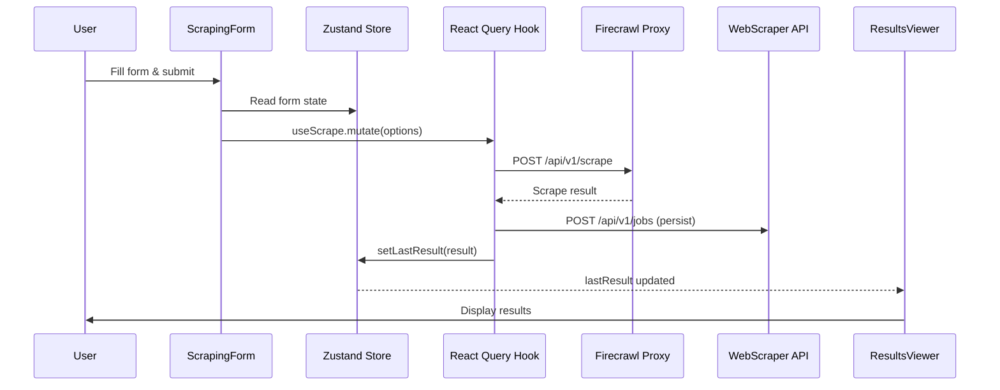
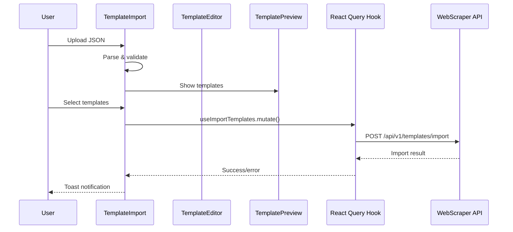

# Overview

The **WebScraper App** (`frontend/apps/WebScraper`) is a Vite + React application that delivers a dedicated cockpit for AI-powered scraping. It can run standalone on port **3800** or be embedded into the TradingSystem dashboard via iframe routing. The UI mirrors the dashboard design system (Tailwind CSS + Radix UI) while adding bespoke pages for scraping, template management, and job history.

**Primary goals**
- Enable advanced Firecrawl configuration without leaving the browser.
- Persist jobs/templates through the WebScraper API (Express + TimescaleDB).
- Provide analytics (cards, charts, popular templates, success rate).
- Integrate seamlessly with existing infrastructure (central `.env`, Firecrawl proxy).

# Architecture

Source: [webscraper-flow.puml](../../shared/diagrams/webscraper-flow.puml)

```plantuml
@startuml
!include ../../shared/diagrams/webscraper-flow.puml
@enduml
```

## Component Architecture

The web scraping functionality is decomposed into specialized, reusable components:

### Component Hierarchy

```
ScrapingPage
├── ScrapingForm
│   ├── FormatSelector
│   └── AdvancedOptions
└── ResultsViewer
    └── ScreenshotViewer

TemplatesPage
├── TemplateList (display + actions)
├── TemplateEditor (create/edit dialog)
│   └── TemplatePreview (live preview)
└── TemplateImport (import dialog)
    └── TemplatePreview (preview before import)

SchedulesPage
├── ScheduleList (cards with per-item actions)
├── ScheduleEditor (create/edit dialog)
│   └── CronBuilder (presets, advanced, manual)
└── ScheduleStatus (health dashboard)
```

### Component Responsibilities

#### ScrapingForm (`src/components/scraping/ScrapingForm.tsx`)
- Form orchestration and submission
- URL input and validation
- Scrape type selection (single/crawl)
- Template management (save/apply)
- Action buttons (submit, reset, save template)
- Integration with Zustand store

#### FormatSelector (`src/components/scraping/FormatSelector.tsx`)
- Output format selection (checkboxes)
- Supports: markdown, html, rawHtml, links, screenshot, screenshot@fullPage, json
- Validation error display
- Responsive grid layout

#### AdvancedOptions (`src/components/scraping/AdvancedOptions.tsx`)
- Collapsible section (Radix UI Collapsible)
- Common options: waitFor, timeout
- Crawl options: limit, maxDepth, includePaths, excludePaths
- Content filters: includeTags, excludeTags
- Conditional rendering based on scrape type

#### ResultsViewer (`src/components/scraping/ResultsViewer.tsx`)
- Multi-format result display
- Tabbed interface (Radix UI Tabs)
- Dynamic tabs based on available data
- Download actions for each format
- Empty/error/success states

#### ScreenshotViewer (`src/components/scraping/ScreenshotViewer.tsx`)
- Base64 image preview
- Zoom functionality (Dialog)
- Download support
- Error handling

### Template Management Components

#### TemplateList (`src/components/templates/TemplateList.tsx`)
- Displays all templates with search functionality
- Actions: Edit, Duplicate, Delete, Apply
- Responsive card layout with metadata badges
- Expandable/collapsible preview panel
- Configurable preview toggle
- Search filtering by name/description/URL pattern
- Loading, empty, and error states

#### TemplateEditor (`src/components/templates/TemplateEditor.tsx`)
- Create/Edit dialog with form fields
- Live preview in side panel (responsive)
- Real-time validation with warnings
- Two-column desktop layout
- Form fields:
  - Name input with validation
  - Description (optional)
  - URL pattern (regex) with common mistake detection
  - Format selector (multi-select)
  - Wait/timeout options with validation
  - Content filters (includeTags, excludeTags)
- Dialog actions: Save, Cancel
- Success/error toast notifications

#### TemplatePreview (`src/components/templates/TemplatePreview.tsx`)
- Visual preview of template configuration
- Sections: Basic info, formats, options, filters
- Validation status indicators
- Visual feedback for warnings
- Compact mode for side panels
- CSS-based error highlighting
- Reusable in editor and import views

#### TemplateImport (`src/components/templates/TemplateImport.tsx`)
- Multi-step wizard interface
- Drag-and-drop file upload
- JSON validation and error reporting
- Table view of templates to import
- Per-template validation status
- Expandable preview rows
- Selective import (checkboxes)
- Import strategy selection
- Progress indicators
- Success/error feedback

### Scheduler Components

#### SchedulesPage (`src/components/pages/SchedulesPage.tsx`)
- Orchestrates React Query hooks for schedules and templates
- Handles dialog state (create/edit), status dashboard toggle, and per-item progress
- Integrates search, navigation (history deep link), and Quick Actions

#### ScheduleList (`src/components/schedules/ScheduleList.tsx`)
- Card layout sorted by enabled/next run
- Per-item loading indicators for delete/toggle
- Inline metadata (next run, last run, failure rate, template badges)
- Action buttons: Edit, History, Enable/Disable, Delete (with tooltips)

#### ScheduleEditor (`src/components/schedules/ScheduleEditor.tsx`)
- Dialog supporting create/update flows
- Cron/interval/one-time configuration with validation and warnings
- Template binding with option merge, job mode toggle (scrape/crawl), format selection
- Preview tab summarising status, URL, and human-readable schedule

#### ScheduleStatus (`src/components/schedules/ScheduleStatus.tsx`)
- Summaries: total, enabled, due soon, overdue, success rate
- Upcoming executions timeline and failure spotlight
- Responsive layout with Prometheus-aligned metrics

#### CronBuilder (`src/components/schedules/CronBuilder.tsx`)
- Preset cards, advanced field-based builder, and manual text input
- Human-readable description via `cronstrue`
- Next execution preview (5 occurrences) with timezone awareness

> Backend note: run the API with `WEBSCRAPER_SCHEDULER_ENABLED=true` (see `scripts/webscraper/start-scheduler.sh`) to activate scheduler endpoints consumed by the UI.

### Export Components

#### ExportsPage (`src/components/pages/ExportsPage.tsx`)
- Orchestrates export list, search, pagination, and dialog state
- React Query polling while exports are `pending`/`processing`
- Per-item loading state for delete/download actions via local state

#### ExportDialog (`src/components/exports/ExportDialog.tsx`)
- Multi-step wizard: Configure → Preview → Confirm
- Supports export types (`jobs`, `templates`, `schedules`, `results`)
- Filter builder reuses history filters; preview fetches sample rows
- Estimates file sizes per format and warns about large payloads

#### ExportHistory (`src/components/exports/ExportHistory.tsx`)
- Table view with status badges, format indicators, expiration countdown
- Inline actions (download per format, delete) with per-row spinners
- Handles empty/loading states with consistent visuals

#### ExportPreview (`src/components/exports/ExportPreview.tsx`)
- Shared component between wizard steps for data preview & summaries
- Displays applied filters, sample rows, and estimated size per format
- Compact mode used during confirmation step and history tooltips

### Export Hooks

- `useExports(filters)` – paginated list with auto polling while running
- `useExport(id)` – fetch single export metadata
- `useCreateExport()` – mutation with toast feedback and history invalidation
- `useDeleteExport()` – mutation for removal + refetch
- `useDownloadExport()` – handles blob download + toast notifications

### Download Utilities (`src/utils/download.ts`)
- Format-specific download functions
- Supports: Markdown, HTML, JSON, Links, Screenshots
- Batch download for all formats
- Error handling and validation

### Export Utilities (`src/utils/export.ts`)
- File size formatting (`KB`, `MB`, etc.)
- Filter summary helpers shared between dialog/history
- Format icon mapping for consistent UI labels

### State Management

**Zustand Store** (`scrapingStore.ts`):
- Single source of truth for form state
- Persisted to localStorage
- Actions: setUrl, setScrapeType, toggleFormat, setOptions, applyTemplate, reset
- State: url, scrapeType, formats, options, selectedTemplate, lastResult

**React Query Hooks**:
- `useScrape()`: Single page scraping mutation
- `useCrawl()`: Multi-page crawling mutation
- `useTemplates()`: Template list query
- `useCreateTemplate()`: Template creation mutation
- `useUpdateTemplate()`: Template update mutation
- `useDeleteTemplate()`: Template deletion mutation
- `useImportTemplates()`: Template bulk import mutation
- `useSchedules()`: Scheduler listing with 30s polling window
- `useCreateSchedule()`: Create mutation with toast feedback
- `useUpdateSchedule()`: Update mutation (invalidates schedule cache)
- `useDeleteSchedule()`: Delete mutation with per-item spinner
- `useToggleSchedule()`: Enable/disable mutation
- `useScheduleHistory()`: Job history filtered by schedule
- `useExports()`: Export list with pagination & polling while processing
- `useCreateExport()`: Export creation wizard mutation
- `useDeleteExport()`: Delete export and clean up files
- `useDownloadExport()`: Blob download helper for CSV/JSON/Parquet/ZIP
- Automatic job persistence to webscraper-api

### Data Flow





**Stack**
- React 18 + TypeScript
- Vite 7 (HMR, alias `@ → src/`)
- Zustand (form state, toast store)
- React Query 5 (jobs, templates, statistics)
- Tailwind CSS 3 + Radix UI primitives + Lucide icons
- React Markdown (preview results) + remark-gfm + rehype-raw

# Pages

| Page | Route | Highlights |
| ---- | ----- | ---------- |
| **Home** | `#/home` | KPI cards, jobs per day chart, recent jobs, quick actions |
| **Scraping** | `#/scraping` | Scrape vs Crawl toggle, advanced options, template application, markdown preview |
| **Templates** | `#/templates` | CRUD, duplicate, bulk import/export, live preview, enhanced validation |
| **History** | `#/history` | Filters (status/type/template/date), pagination, detail dialog with JSON tabs |

# State Management

- **Zustand** (`useScrapingStore`): keeps URL, formats, advanced options, last result, persists in localStorage (`webscraper-form-state`).
- **React Query**: caches `jobs`, `templates`, `statistics`, `crawl-status`. Polls running jobs every 10s.
- **Toast store**: lightweight Zustand store powering the `ToastContainer`.
- **Theme context**: copies dashboard behaviour (light/dark/system with persistence).

# Integration Points

| Integration | Description |
| ----------- | ----------- |
| WebScraper API (`/api/webscraper` via Vite proxy) | Jobs, templates, statistics |
| Firecrawl Proxy (`/api/firecrawl` via Vite proxy) | Scrape, crawl, status, health |
| Local storage | Persists sidebar collapse + theme + form state |

Vite proxy configuration (excerpt):

```ts
server: {
  proxy: {
    '/api/webscraper': {
      target: env.VITE_WEBSCRAPER_API_URL ?? 'http://localhost:3700',
      rewrite: path => path.replace(/^\/api\/webscraper/, '/api/v1')
    },
    '/api/firecrawl': {
      target: env.VITE_WEBSCRAPER_FIRECRAWL_URL ?? 'http://localhost:3600',
      rewrite: path => path.replace(/^\/api\/firecrawl/, '/api/v1')
    }
  }
}
```

# Styling & Components

- Tailwind configuration mirrors the dashboard palette (cyan primary).
- Shared UI primitives under `src/components/ui` (Button, Input, Dialog, Tabs, Tooltip, Table, Badge, Spinner, Toast).
- Layout shell (`Layout` + `Sidebar` + `Header`) replicates dashboard ergonomics with localStorage-backed collapse.
- Markdown preview uses `ReactMarkdown` with typography plugin (`@tailwindcss/typography`).

# Development Guidelines

## Adding New Formats

1. Add format type to `ScrapeFormat` union
2. Create viewer component in `ResultsViewer`
3. Add download handler in `download.ts`
4. Update FormatSelector grid

## Extending Advanced Options

1. Add option to `ScrapeOptions` or `CrawlOptions` type
2. Add field to `AdvancedOptions` component
3. Update validation in `validation.ts`
4. Connect to Zustand store

## Custom Result Viewers

1. Create component in `components/scraping/viewers/`
2. Add tab trigger and content to `ResultsViewer`
3. Handle loading and error states
4. Implement download functionality

## Creating New Template Components

1. Create component in `src/components/templates/`
2. Add to `index.ts` barrel export
3. Add TypeScript types/interfaces
4. Implement error handling and validation
5. Add success/error toasts
6. Use React Query for data management
7. Add component to `webscraper-app.md` docs

# Development Workflow

```bash
cd frontend/apps/WebScraper
npm install
npm run dev  # http://localhost:3800
```

**Scripts**
- `npm run build` → Type-check + Vite build
- `npm run lint` / `lint:fix`
- `npm run test` / `test:watch` / `test:coverage`

The `scripts/webscraper/start-services.sh` helper boots the frontend and API together.

# Testing

- Unit testing powered by **Vitest** (`npm run test`).
- React Testing Library can be added for components (structure follows dashboard conventions).
- Integration testing spans both API + frontend via `scripts/webscraper/start-services.sh` + Playwright (future).

# Deployment Notes

- Frontend can be embedded into the main dashboard (iframe or routing) or hosted standalone.
- Always use the root `.env` for configuration (`VITE_WEBSCRAPER_*` variables).
- For production builds, ensure `npm run build` outputs are served via Vite preview, nginx, or the Service Launcher.

# Future Enhancements

✅ ~~Template import wizard with validation feedback~~ (Completed)
✅ ~~Enhanced validation with warnings~~ (Completed)
✅ ~~Live template preview~~ (Completed)
✅ ~~Content filter validation~~ (Completed)
- WebSocket bridge for real-time job updates instead of polling
- Role-based access control (hook into workspace auth once available)
- Additional analytics widgets (credits consumption, failure breakdown)
- Custom output formats with plugins
- Preview mode for crawl results
- Advanced content filtering DSL
- Template categories and sharing
- Template version history and rollback
- Template permissions and sharing
- Search templates by content filter patterns
- Template usage analytics and insights
- Template auto-apply based on URL patterns
- Bulk template operations

# References

- Backend service: [`webscraper-api.md`](../../backend/api/webscraper-api.md)
- Database schema: [`webscraper-schema.md`](../../backend/data/webscraper-schema.md)
- Firecrawl proxy: [`firecrawl-proxy.md`](../../backend/api/firecrawl-proxy.md)
