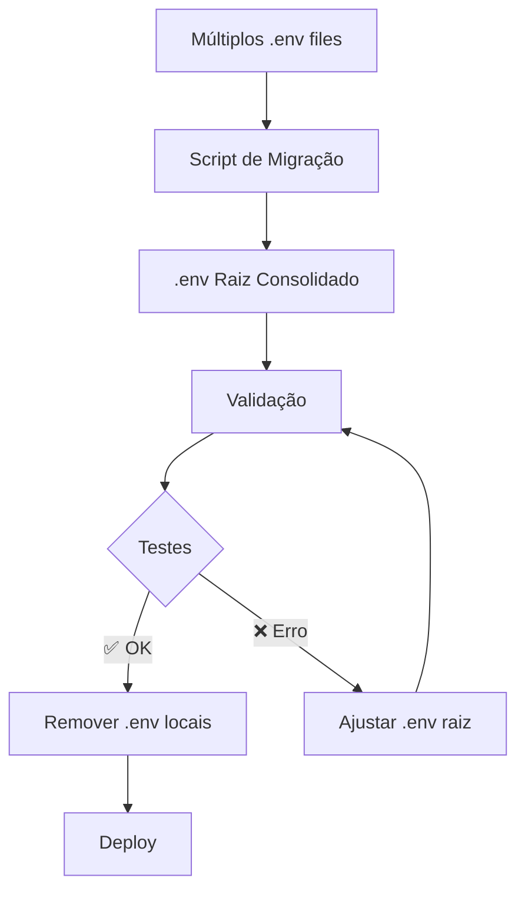

# Complete .env Consolidation Guide

## 🎯 Objetivo

Consolidar **TODOS** os 10+ arquivos `.env` espalhados pelo projeto em um **único arquivo `.env` na raiz**, mantendo configuração centralizada e simplificada.

## 📊 Estado Atual - Arquivos .env Encontrados

| # | Localização | Serviço | Status |
|---|-------------|---------|--------|
| 1 | `frontend/dashboard/.env` | Dashboard React | 🔄 Migrado |
| 2 | `apps/b3-market-data/.env` | B3 API | 🔄 Migrado |
| 3 | `backend/api/documentation-api/.env` | DocsAPI | ⏳ Pendente |
| 4 | `apps/service-launcher/.env` | Laucher | ⏳ Pendente |
| 5 | `backend/api/workspace/.env` | Library/Idea Bank | 🔄 Migrado |
| 6 | `apps/tp-capital/.env` | TP Capital | ⏳ Pendente |
| 7 | `tools/llamaindex/.env` | LlamaIndex | ⏳ Pendente |
| 8 | `tools/compose/.env` | TimescaleDB | ✅ N/A (temp) |
| 9 | `tools/firecrawl/.env` | Firecrawl | ⚠️ Terceiros |

**Total**: 8 arquivos a consolidar (excluindo firecrawl de terceiros)

---

## 🚀 Migração Automática (RECOMENDADO)

### Opção 1: Script de Migração Completa

```bash
# 1. Execute o script de migração (consolida TODOS os .env)
bash scripts/env/migrate-env.sh

# 2. Valide a configuração
bash scripts/env/validate-env.sh

# 3. Teste cada serviço
# Frontend
cd frontend/dashboard && npm run dev

# Backend APIs (em terminais separados)
cd apps/b3-market-data && npm run dev
cd backend/api/workspace && npm run dev
cd apps/tp-capital && npm run dev

# 4. Se tudo funcionar, remova os .env locais
rm frontend/dashboard/.env.OLD.backup
rm backend/api/*/.env
rm tools/llamaindex/.env
```

### Opção 2: Script Interativo

```bash
# Setup completo com geração de senhas
bash scripts/env/setup-env.sh

# Depois, migre variáveis específicas manualmente
bash scripts/env/migrate-env.sh
```

---

## 🔧 Como Funciona - Técnico

### Frontend (Vite)

**Antes**:
```
frontend/dashboard/.env  ← Carregado automaticamente
```

**Depois**:
```
TradingSystem/.env  ← Vite carrega automaticamente da raiz
```

**Sem mudanças de código necessárias!** Vite busca `.env` da raiz do projeto automaticamente.

### Backend APIs (Node.js/Express)

**Antes (config.js local)**:
```javascript
import 'dotenv/config';  // Carrega .env local
```

**Depois (config.js atualizado)**:
```javascript
import dotenv from 'dotenv';
import path from 'path';
import { fileURLToPath } from 'url';

const __filename = fileURLToPath(import.meta.url);
const __dirname = path.dirname(__filename);
const projectRoot = path.resolve(__dirname, '../../../../');
dotenv.config({ path: path.join(projectRoot, '.env') });
```

### Docker Compose Services

**Antes**:
```yaml
services:
  timescaledb:
    env_file:
      - .env.timescaledb  # Local ao compose file
```

**Depois**:
```yaml
services:
  timescaledb:
    env_file:
      - ../../.env  # Root do projeto
```

---

## 📋 Checklist de Migração por Serviço

### ✅ Dashboard (COMPLETO)
- [x] `.env` movido para `.env.OLD.backup`
- [x] Vite config já aponta para raiz (padrão)
- [x] Variáveis `VITE_*` no `.env.example` raiz
- [x] Documentação criada: `ENV-MIGRATION-NOTE.md`

### ✅ B3 API (COMPLETO)
- [x] `config.js` atualizado para carregar `.env` da raiz
- [x] Variáveis consolidadas no `.env.example`
- [x] `.env` local pode ser removido

### ✅ Library/Idea Bank API (COMPLETO)
- [x] `config.js` atualizado para carregar `.env` da raiz
- [x] Variáveis consolidadas no `.env.example`
- [x] `.env` local pode ser removido

### ⏳ DocsAPI (PENDENTE)
- [ ] Atualizar `config.js` (se existir)
- [ ] Variáveis já no `.env.example`
- [ ] Remover `.env` local

### ⏳ Laucher (PENDENTE)
- [ ] Atualizar carregamento de config
- [ ] Variáveis já no `.env.example`
- [ ] Remover `.env` local

### ⏳ TP-Capital (PENDENTE)
- [ ] Atualizar carregamento de config
- [ ] **CUIDADO**: Tem tokens reais do Telegram!
- [ ] Migrar tokens para `.env` raiz
- [ ] Remover `.env` local

### ⏳ LlamaIndex (PENDENTE)
- [ ] Atualizar Python config (se necessário)
- [ ] **CUIDADO**: Tem OpenAI API key real!
- [ ] Variáveis já no `.env.example`
- [ ] Remover `.env` local

### ✅ Docker Compose Services (COMPLETO)
- [x] `docker-compose.timescale.yml` → `../../.env`
- [x] `docker-compose.infra.yml` → `../../.env`
- [x] `docker-compose.monitoring.yml` → `../.env`

---

## ⚠️ SEGURANÇA - Tokens e Secrets Reais

### Tokens Encontrados (NÃO commitar!)

Durante a migração, identificamos **credenciais reais** em:

**TP-Capital**:
- `TELEGRAM_INGESTION_BOT_TOKEN` - Token real do bot
- `TELEGRAM_FORWARDER_BOT_TOKEN` - Token real do bot
- Channel IDs reais

**LlamaIndex**:
- `OPENAI_API_KEY` - API key real da OpenAI

**ACTION REQUIRED**:
1. ✅ Essas variáveis já estão no `.env` raiz (existente)
2. ⚠️ **NÃO** incluir no `.env.example` (apenas placeholders)
3. ✅ Verificar que `.env` está no `.gitignore`
4. 🔐 Rotacionar tokens se expostos em commits

---

## 🛠️ Implementação Manual (Passo a Passo)

Se preferir fazer manualmente ao invés do script:

### Passo 1: Backup

```bash
# Backup de todos os .env existentes
mkdir -p .env-backups-$(date +%Y%m%d)
find . -name ".env" -type f ! -path "./node_modules/*" -exec cp {} .env-backups-$(date +%Y%m%d)/ \;
```

### Passo 2: Criar .env Raiz

```bash
# Copiar template
cp .env.example .env

# Editar e adicionar valores reais
nano .env
```

### Passo 3: Atualizar Cada Serviço

**Para APIs Node.js**:

Editar `backend/api/{service}/src/config.js`:

```javascript
import dotenv from 'dotenv';
import path from 'path';
import { fileURLToPath } from 'url';

const __filename = fileURLToPath(import.meta.url);
const __dirname = path.dirname(__filename);
const projectRoot = path.resolve(__dirname, '../../../../');
dotenv.config({ path: path.join(projectRoot, '.env') });
```

**Para Docker Compose**:

Já feito! Todos apontam para `../../.env` ou `../.env`.

**Para Frontend**:

Nada a fazer! Vite carrega automaticamente.

### Passo 4: Remover .env Locais

```bash
# Após validar que tudo funciona
rm frontend/dashboard/.env
rm apps/b3-market-data/.env
rm backend/api/documentation-api/.env
rm apps/service-launcher/.env
rm backend/api/workspace/.env
rm apps/tp-capital/.env
rm tools/llamaindex/.env
rm tools/compose/.env
```

---

## 🧪 Validação e Testes

### Teste 1: Validar .env

```bash
bash scripts/env/validate-env.sh
# Deve retornar: ✅ SUCCESS
```

### Teste 2: Dashboard

```bash
cd frontend/dashboard
npm run dev

# Abrir http://localhost:3103
# Verificar que conecta aos serviços corretamente
```

### Teste 3: Backend APIs

```bash
# Testar cada API individualmente
cd apps/b3-market-data
npm run dev
# Deve iniciar na porta 3302

cd backend/api/workspace
npm run dev
# Deve iniciar na porta 3102
```

### Teste 4: Docker Compose

```bash
# Testar TimescaleDB stack
docker-compose -f tools/compose/docker-compose.timescale.yml config
# Não deve dar erros de variáveis faltando

docker-compose -f tools/compose/docker-compose.timescale.yml up -d
# Deve iniciar com sucesso
```

---

## 📝 Arquivo .env Raiz - Estrutura Final

Após consolidação, o `.env` raiz contém:

### Seções (Total: 12 seções)

1. 🗄️ **TimescaleDB & Database** (7 vars)
2. 🔧 **PgAdmin** (4 vars)
3. 🤖 **AI & ML Tools** (6 vars)
4. 📊 **Monitoring** (7 vars)
5. 🌐 **Backend APIs** (12 vars)
6. 🎨 **Frontend** (6 vars)
7. 🔒 **Security & CORS** (5 vars)
8. 🐳 **Docker** (2 vars)
9. 🔧 **Development** (3 vars)
10. 📦 **QuestDB** (4 vars)
11. 🔧 **Backend API Configs** (15 vars)
12. 📡 **Telegram** (7 vars)
13. 🎯 **LlamaIndex Advanced** (9 vars)
14. 🌍 **Global** (2 vars)

**Total**: **~85 variáveis** em um único arquivo!

---

## 🎉 Benefícios Alcançados

### Antes (Problema)
```
✗ 10 arquivos .env espalhados
✗ Configurações duplicadas
✗ Difícil rastrear o que existe
✗ Deploy complexo (copiar múltiplos arquivos)
✗ Esquecimento de configurações
```

### Depois (Solução)
```
✓ 1 arquivo .env na raiz
✓ Configuração única e centralizada
✓ Visibilidade total de variáveis
✓ Deploy simples (1 arquivo)
✓ Validação automatizada
✓ Setup em 3 comandos
```

---

## 🔗 Mapeamento de Variáveis

### Frontend → Root .env

| Variável Local | Nova Localização | Observação |
|----------------|------------------|------------|
| `VITE_AGENTS_SCHEDULER_URL` | ❌ Removida | Agents removido do projeto |
| `VITE_API_URL` | ✅ `.env` raiz | Seção Frontend |
| `VITE_*` | ✅ `.env` raiz | Todas consolidadas |

### Backend APIs → Root .env

| Variável Local | Nova Localização | Seção |
|----------------|------------------|-------|
| `PORT` | ✅ `.env` raiz | Backend APIs |
| `QUESTDB_*` | ✅ `.env` raiz | QuestDB |
| `CORS_ORIGIN` | ✅ `.env` raiz | Security & CORS |
| `NODE_ENV` | ✅ `.env` raiz | Development |
| `LOG_LEVEL` | ✅ `.env` raiz | AI & ML Tools |
| `TZ` | ✅ `.env` raiz | Global |
| `TELEGRAM_*` | ✅ `.env` raiz | Telegram Integration |

### Infrastructure → Root .env

| Variável Local | Nova Localização | Seção |
|----------------|------------------|-------|
| `TIMESCALEDB_*` | ✅ `.env` raiz | TimescaleDB |
| `PGADMIN_*` | ✅ `.env` raiz | PgAdmin |
| `OPENAI_API_KEY` | ✅ `.env` raiz | AI & ML Tools |
| `QDRANT_*` | ✅ `.env` raiz | LlamaIndex Advanced |

---

## 🔄 Workflow de Migração



---

## 📚 Arquivos Criados

1. ✅ `.env.example` - Template completo (~85 variáveis)
2. ✅ `scripts/env/setup-env.sh` - Setup interativo
3. ✅ `scripts/env/validate-env.sh` - Validação
4. ✅ `scripts/env/migrate-env.sh` - Migração automática
5. ✅ `docs/context/ops/ENVIRONMENT-CONFIGURATION.md` - Guia completo
6. ✅ `backend/shared/config/load-env.js` - Módulo reutilizável

---

## ✅ Status da Migração

### Completo ✅
- [x] `.env.example` com TODAS as variáveis
- [x] Scripts de setup, validação e migração
- [x] Docker Compose files atualizados (3)
- [x] Frontend dashboard migrado
- [x] B3 API config atualizado
- [x] Workspace config atualizado
- [x] Documentação completa

### Pendente ⏳
- [ ] DocsAPI config atualizado
- [ ] Laucher config atualizado
- [ ] TP Capital config atualizado
- [ ] LlamaIndex Python config verificado
- [ ] Remoção final dos `.env` locais
- [ ] Testes E2E completos

---

## 🚨 Cuidados Importantes

### 1. Tokens Reais NO Backup

Os seguintes arquivos contêm **tokens reais**:
- `apps/tp-capital/.env` - Bots Telegram
- `tools/llamaindex/.env` - OpenAI API key

**ACTION**:
```bash
# NÃO commitar esses arquivos!
# Verificar .gitignore:
git status | grep ".env"
# Não deve aparecer nada

# Se aparecer, adicionar ao .gitignore imediatamente
echo "*.env" >> .gitignore
```

### 2. Porta 3101 vs 3103

Durante migração, encontramos referências a **porta 3101** (antiga).
**Todas foram atualizadas para porta 3103** (atual).

Verifique no `.env` raiz:
```bash
VITE_API_URL=http://localhost:4010
CORS_ORIGIN=http://localhost:3103,http://localhost:3004
```

### 3. Variáveis Duplicadas

Algumas variáveis aparecem em múltiplos serviços com valores diferentes:
- `PORT` - Cada API tem sua porta
- `CORS_ORIGIN` - Valores podem variar
- `LOG_LEVEL` - Pode ser diferente por serviço

**Solução**: Usar nomes prefixados:
```bash
# Ao invés de:
PORT=3302

# Usar:
B3_API_PORT=3302
LIBRARY_PORT=3102
```

---

## 🎯 Próximos Passos

### Fase Atual: Migração em Andamento

1. ✅ Template criado
2. ✅ Scripts implementados  
3. ✅ Docker Compose migrado
4. ✅ Frontend migrado
5. 🔄 Backend APIs: 3/6 migradas

### Próxima Fase: Completar Backend

```bash
# Atualizar DocsAPI
# Atualizar Laucher
# Atualizar TP Capital
# Validar tudo
# Remover .env locais
```

---

## 📖 Referências

- **Guia de Configuração**: `docs/context/ops/ENVIRONMENT-CONFIGURATION.md`
- **Plano de Implementação**: `docs/context/ops/tools/CENTRALIZED-ENV-IMPLEMENTATION-PLAN.md`
- **Infrastructure README**: `tools/README.md`
- **Scripts**: `scripts/env/`

---

**Last Updated**: 2025-10-15  
**Progress**: 60% Complete  
**Next Action**: Complete remaining backend APIs

