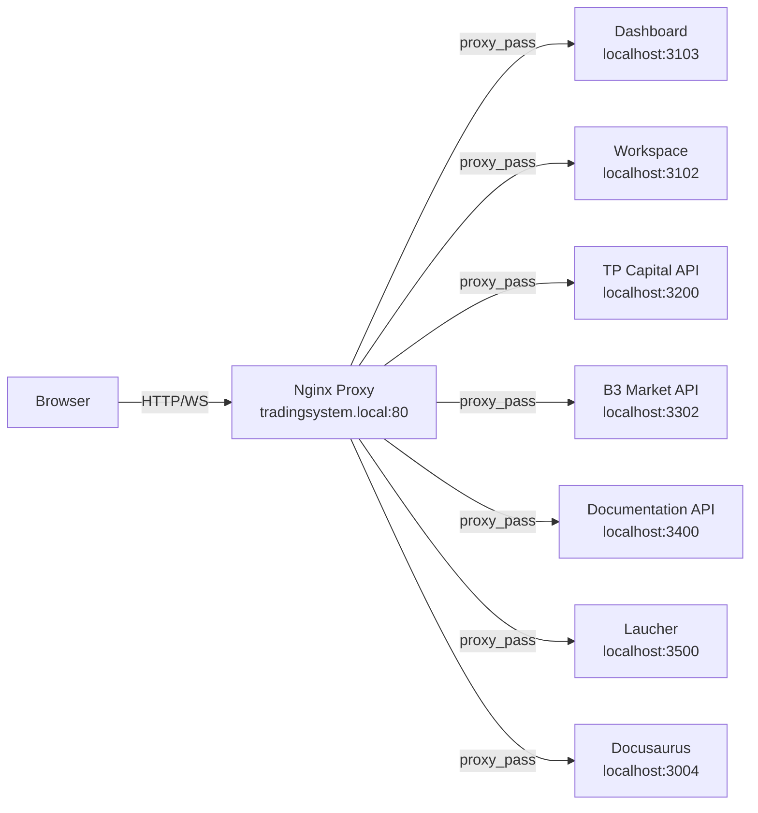

# Reverse Proxy Architecture

This document describes the unified domain architecture using Nginx as a reverse proxy for all Trading System services.

## Overview

The Trading System now uses a unified domain approach (`tradingsystem.local`) to route all services through a single Nginx reverse proxy. This eliminates CORS requirements by making all requests same-origin and provides a more production-ready architecture.



## Benefits

- ✅ No more CORS issues - all requests originate from same domain
- ✅ Single entry point for all services
- ✅ Simplified API configuration in frontend
- ✅ Easier debugging with centralized logging
- ✅ Production-ready architecture that matches VPS deployment
- ✅ WebSocket support for real-time features
- ✅ Ready for SSL/TLS via Certbot

## Route Mapping

| Service | Public URL | Internal URL |
|---------|------------|--------------|
| Dashboard | `/` | `http://localhost:3103` |
| Workspace | `/api/library/*` | `http://localhost:3102/api/*` |
| TP Capital API | `/api/tp-capital/*` | `http://localhost:3200/*` |
| B3 Market API | `/api/b3/*` | `http://localhost:3302/*` |
| Documentation API | `/api/docs/*` | `http://localhost:3400/*` |
| Laucher | `/api/launcher/*` | `http://localhost:3500/*` |
| Docusaurus | `/docs/*` | `http://localhost:3004/*` |

## Local Development Setup

1. Install Nginx in WSL2:
   ```bash
   sudo apt update
   sudo apt install nginx
   ```

2. Configure local domain:
   ```bash
   echo "127.0.0.1 tradingsystem.local" | sudo tee -a /etc/hosts
   ```

3. Set up Nginx configuration:
    ```bash
    sudo cp infrastructure/nginx-proxy/tradingsystem.conf /etc/nginx/sites-available/
    sudo ln -s /etc/nginx/sites-available/tradingsystem.conf /etc/nginx/sites-enabled/
    sudo nginx -t
    sudo systemctl reload nginx
    ```

> **📖 Detailed Setup Guide**: For comprehensive setup instructions including production deployment, SSL/TLS configuration, and advanced troubleshooting, see **[Nginx Proxy README](https://github.com/marceloterra1983/TradingSystem/blob/main/infrastructure/nginx-proxy/README.md)**

4. Configure services for unified domain:
   ```bash
   # Frontend (.env)
   VITE_USE_UNIFIED_DOMAIN=true
   VITE_API_BASE_URL=http://tradingsystem.local

   # Backend APIs (.env)
   DISABLE_CORS=true
   ```

## Quick Reference

### Common Commands
```bash
# Test configuration
sudo nginx -t

# Reload configuration (no downtime)
sudo systemctl reload nginx

# Restart Nginx
sudo systemctl restart nginx

# Check status
sudo systemctl status nginx

# View real-time logs
sudo tail -f /var/log/nginx/tradingsystem-error.log

# Test endpoint
curl -I http://tradingsystem.local/health
```

### Configuration Files
- **Main config**: `/etc/nginx/sites-available/tradingsystem.conf`
- **Symlink**: `/etc/nginx/sites-enabled/tradingsystem.conf`
- **Source**: `infrastructure/nginx-proxy/tradingsystem.conf`
- **Logs**: `/var/log/nginx/tradingsystem-*.log`

### Service URLs
| Service | URL | Direct Port |
|---------|-----|-------------|
| Dashboard | `http://tradingsystem.local/` | 3103 |
| Workspace API | `http://tradingsystem.local/api/library` | 3102 |
| TP Capital | `http://tradingsystem.local/api/tp-capital` | 3200 |
| B3 Data | `http://tradingsystem.local/api/b3` | 3302 |
| Docs API | `http://tradingsystem.local/api/docs` | 3400 |
| Launcher | `http://tradingsystem.local/api/launcher` | 3500 |
| Docusaurus | `http://tradingsystem.local/docs` | 3004 |

## Development Workflow

When developing locally, you have two options:

### 1. Unified Domain (Recommended)

Use `http://tradingsystem.local` for all services:
```javascript
// Frontend will automatically use:
fetch('http://tradingsystem.local/api/library/ideas')
fetch('http://tradingsystem.local/api/tp-capital/signals')
```

Benefits:
- No CORS configuration needed
- Matches production behavior
- Single domain for all requests

### 2. Direct Port Access (Legacy)

Use individual ports for development:
```javascript
// Frontend needs CORS headers from backends:
fetch('http://localhost:3102/api/items')
fetch('http://localhost:3200/signals')
```

Drawbacks:
- Requires CORS configuration
- Different behavior from production
- Multiple domains to manage

## Proxy Features

### HTTP Request Handling
- Path-based routing with prefix stripping
- Automatic host header handling
- Real client IP forwarding
- HTTP/1.1 protocol support

### WebSocket Support
- Full WebSocket proxy support for HMR
- Automatic connection upgrades
- Native WebSocket ping/pong
- Configurable timeouts

### Security Features
- Cross-origin header control
- HTTP/HTTPS redirection (in production)
- Rate limiting available
- SSL/TLS termination (in production)

## Logging and Monitoring

### Log Locations
- Access log: `/var/log/nginx/tradingsystem-access.log`
- Error log: `/var/log/nginx/tradingsystem-error.log`
- Nginx main error log: `/var/log/nginx/error.log`

### Log Format
```nginx
log_format detailed '$remote_addr - $remote_user [$time_local] '
                    '"$request" $status $body_bytes_sent '
                    '"$http_referer" "$http_user_agent" '
                    '$request_time';
```

### Monitoring Tools
- Use `tail -f` for live log monitoring
- Check error log for issues
- Monitor access patterns
- Watch WebSocket connections

## Environment Configuration

### Frontend Settings
```env
# Enable unified domain
VITE_USE_UNIFIED_DOMAIN=true
VITE_API_BASE_URL=http://tradingsystem.local
VITE_DOCS_URL=http://tradingsystem.local/docs

# Legacy direct access (kept for backwards compatibility)
VITE_B3_API_URL=http://localhost:3302
VITE_TP_CAPITAL_API_URL=http://localhost:3200
```

### Backend Settings
```env
# Disable CORS when using unified domain
DISABLE_CORS=true

# Legacy CORS settings (when using direct access)
CORS_ORIGIN=http://localhost:3101,http://localhost:3004
```

## Troubleshooting

### Common Issues

1. **502 Bad Gateway**
   - Check if backend service is running
   - Verify port numbers in nginx config
   - Check service logs

2. **404 Not Found**
   - Verify URL path mapping
   - Check if rewrite rules are correct
   - Confirm service endpoints

3. **WebSocket Connection Failed**
   - Check WebSocket upgrade headers
   - Verify proxy timeouts
   - Monitor connection logs

4. **CORS Errors**
   - Ensure `DISABLE_CORS=true` on backends
   - Check `VITE_USE_UNIFIED_DOMAIN=true`
   - Verify all requests use same domain

### Debug Commands

```bash
# Check Nginx status
sudo systemctl status nginx

# Test configuration
sudo nginx -t

# View real-time logs
sudo tail -f /var/log/nginx/tradingsystem-error.log

# Check listening ports
sudo netstat -tulpn | grep nginx

# Reload configuration
sudo systemctl reload nginx
```

### Advanced Troubleshooting

For comprehensive troubleshooting including WebSocket issues, performance optimization, SSL/TLS problems, and production deployment scenarios, see:
- **[Nginx Proxy README - Troubleshooting](https://github.com/marceloterra1983/TradingSystem/blob/main/infrastructure/nginx-proxy/README.md#troubleshooting)**
- **[Nginx Proxy README - Production Deployment](https://github.com/marceloterra1983/TradingSystem/blob/main/infrastructure/nginx-proxy/README.md#production-deployment)**

**Quick diagnostics:**
```bash
# Test all backend services are running
bash scripts/services/status-all.sh

# Test each service directly
curl http://localhost:3103/health  # Dashboard
curl http://localhost:3102/health  # Workspace
curl http://localhost:3200/health  # TP Capital
curl http://localhost:3302/health  # B3
curl http://localhost:3400/health  # Docs API
curl http://localhost:3500/health  # Launcher
curl http://localhost:3600/health  # Firecrawl Proxy

# Test through proxy
curl http://tradingsystem.local/api/launcher/health
```

## Migration Notes

1. To migrate an existing deployment:
   - Update frontend environment variables
   - Update backend CORS settings
   - Deploy Nginx configuration
   - Update DNS/hosts file
   - Test all routes and WebSocket connections

2. To rollback changes:
   - Remove Nginx configuration
   - Restore original CORS settings
   - Reset frontend variables
   - Return to direct port access

## Production Considerations

### SSL/TLS Setup
For production deployment with HTTPS, follow the SSL/TLS setup guide in:
- **[Nginx Proxy README - Production Deployment](https://github.com/marceloterra1983/TradingSystem/blob/main/infrastructure/nginx-proxy/README.md#production-deployment)**
- **[VPS Migration Guide](https://github.com/marceloterra1983/TradingSystem/blob/main/infrastructure/nginx-proxy/VPS-MIGRATION-GUIDE.md)**

### Performance Tuning
For high-traffic scenarios, optimize Nginx configuration:
- Worker processes and connections
- Buffer sizes
- Keepalive settings
- Caching strategies

See: **[Nginx Proxy README - Performance Tuning](https://github.com/marceloterra1983/TradingSystem/blob/main/infrastructure/nginx-proxy/README.md#production-deployment)**

### Monitoring
Integrate Nginx with existing monitoring stack:
- Access log analysis
- Error rate tracking
- Response time monitoring
- Upstream health checks

See: **[Nginx Proxy README - Monitoring](https://github.com/marceloterra1983/TradingSystem/blob/main/infrastructure/nginx-proxy/README.md#monitoring-and-observability)**

### Security
Harden Nginx configuration for production:
- Rate limiting
- IP whitelisting
- Security headers (already configured)
- DDoS protection

See: **[Nginx Proxy README - Security Hardening](https://github.com/marceloterra1983/TradingSystem/blob/main/infrastructure/nginx-proxy/README.md#production-deployment)**

## Next Steps

1. Monitor for:
    - Error rates
    - Response times
    - WebSocket stability
    - Resource usage

2. Consider enhancing:
    - Rate limiting
    - SSL/TLS setup
    - Caching strategy
    - Load balancing

3. Production preparation:
    - Set up domain name
    - Configure SSL certificates
    - Implement security headers
    - Add monitoring tools

## Related Documents

### Infrastructure Documentation
- **[Nginx Proxy README](https://github.com/marceloterra1983/TradingSystem/blob/main/infrastructure/nginx-proxy/README.md)** - Complete setup guide, troubleshooting, and configuration management
- **[Nginx Configuration File](https://github.com/marceloterra1983/TradingSystem/blob/main/infrastructure/nginx-proxy/tradingsystem.conf)** - Active proxy configuration
- **[VPS Migration Guide](https://github.com/marceloterra1983/TradingSystem/blob/main/infrastructure/nginx-proxy/VPS-MIGRATION-GUIDE.md)** - Production deployment procedures

### Service Documentation
- **[Workspace API](https://github.com/marceloterra1983/TradingSystem/blob/main/backend/api/workspace/README.md)** - Library API (Port 3102)
- **[TP Capital API](https://github.com/marceloterra1983/TradingSystem/blob/main/frontend/apps/tp-capital/README.md)** - TP Capital signals (Port 3200)
- **[B3 Market Data API](https://github.com/marceloterra1983/TradingSystem/blob/main/frontend/apps/b3-market-data/README.md)** - B3 data service (Port 3302)
- **[Documentation API](https://github.com/marceloterra1983/TradingSystem/blob/main/backend/api/documentation-api/README.md)** - Documentation management (Port 3400)
- **[Firecrawl Proxy API](https://github.com/marceloterra1983/TradingSystem/blob/main/backend/api/firecrawl-proxy/README.md)** - Web scraping proxy (Port 3600)
- **[Service Launcher](https://github.com/marceloterra1983/TradingSystem/blob/main/backend/api/service-launcher/README.md)** - Service orchestration

### API Documentation
- **[Service Port Map](../service-port-map.md)** - Complete port reference for all services
- **[Environment Configuration](../ENVIRONMENT-CONFIGURATION.md)** - Centralized environment variable management
