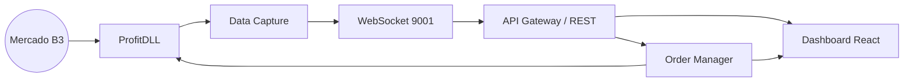

# TradingSystem - Visão Geral

Este resumo orienta novos operadores sobre a arquitetura principal do TradingSystem. Para detalhes completos consulte:
- [Backend Architecture Overview](../../backend/architecture/overview.md)
- [Frontend Documentation Hub](../../frontend/README.md)
- [Service Port Map](../service-port-map.md)

## Principais Domínios

| Domínio | Responsabilidade | Tecnologias |
|---------|------------------|-------------|
| **Coleta de Dados** | Captura dados de mercado via ProfitDLL e envia para pipelines internos. | C# (.NET 8), ProfitDLL |
| **Análise** | Processa sinais de trading com modelos incrementais. | Python 3.11, scikit-learn |
| **Execução** | Gerencia ordens, risco e posições. | C# (.NET 8) |
| **APIs de Suporte** | CRUD de ideias, documentação, dados de mercado. | Node.js/Express |
| **Dashboard** | UI unificada para monitoramento e operação. | React 18, Vite, Tailwind |
| **Infra & Docs** | Proxy, scraping, documentação, observabilidade. | Nginx, Firecrawl, Docusaurus, Prometheus |

## Serviços Ativos e Portas

| Serviço | Porta | Descrição |
|---------|-------|-----------|
| Dashboard (Vite) | 3103 | Interface principal para operadores. |
| Docusaurus Docs | 3004 | Portal de documentação. |
| Library API | 3200 | Banco de ideias e documentação. |
| B3 Market Data API | 3302 | Dados B3 mínimos para dashboards. |
| Documentation API | 3400 | Registro de sistemas e arquivos. |
| Service Launcher API | 3500 | Controle unificado de serviços auxiliares. |
| Firecrawl Proxy | 3600 | Scraping com validação e métricas. |

## Fluxo de Dados (Resumo)

1. **Mercado → ProfitDLL**: Dados em tempo real chegam via callbacks.
2. **Data Capture Service**: Normaliza, enfileira e publica via WebSocket.
3. **Order Manager**: Executa ordens após passar pelo motor de risco.
4. **Dashboard**: Consome dados em tempo real, exibe alertas, permite ações.

## Operações Essenciais

- **Proxy Nginx**: Centraliza acesso em `tradingsystem.local`. Ver [Nginx Reverse Proxy Playbook](../infrastructure/nginx-proxy.md).
- **Ambientação**: Sempre usar `.env` raiz. Ver [ENVIRONMENT-CONFIGURATION.md](../ENVIRONMENT-CONFIGURATION.md).
- **Observabilidade**: Prometheus/Grafana monitoram serviços; alertas configurados para latência e status.
- **Firecrawl**: Disponível via proxy (`:3600`). Infra detalhada em [Firecrawl Stack Overview](../infrastructure/firecrawl-stack.md).

## Próximos Passos para Novos Operadores

1. Configurar ambiente seguindo [Quick Start (Linux/WSL)](./QUICK-START-LINUX-WSL.md).
2. Validar serviços com [Start Services](./START-SERVICES.md).
3. Registrar qualquer incidente no [Incident Review Checklist](../checklists/incident-review.md).

---

**Atualizado por:** Docs & Ops Guild  
**Última revisão:** 2025-10-17
