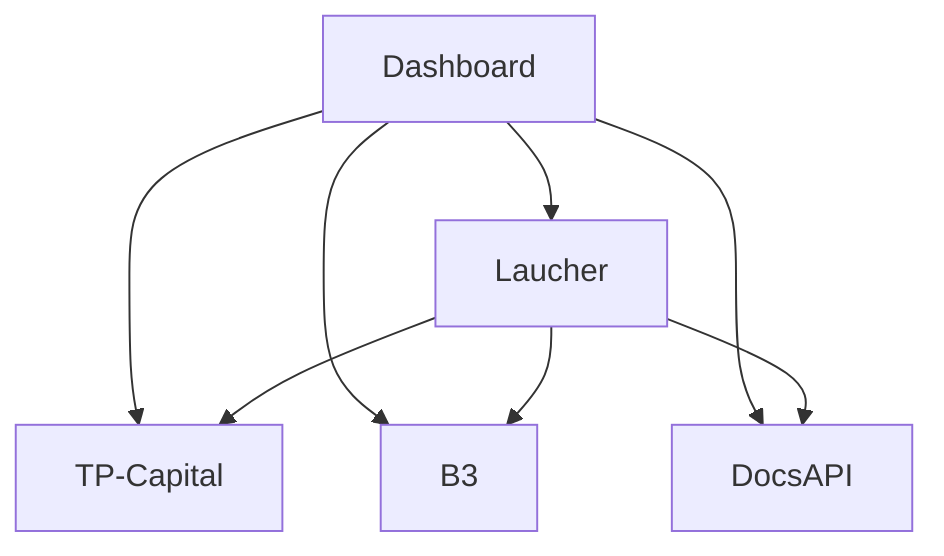

# TradingSystem Service Startup Guide

## Overview

The TradingSystem uses a unified startup script that efficiently manages all services with health checks, proper port configuration, and comprehensive logging.

## Quick Start

```bash
# Start all services
# (recommended for Dashboard QA)
./scripts/start-dashboard-stack.sh

# Or, use the legacy helper
./scripts/start-services.sh start

# Check service status
./scripts/start-services.sh status

# Stop all services
./scripts/start-services.sh stop

# View service URLs
./scripts/start-services.sh urls
```

## Service Architecture

### Service Ports

| Service | Port | Type | Description |
|---------|------|------|-------------|
| Dashboard | 3103 | Frontend | React + Vite UI |
| Docusaurus | 3004 | Docs | Documentation portal |
| TP-Capital | 3200 | API | Telegram ingestion |
| B3 | 3302 | API | Market data service |
| DocsAPI | 3400 | API | Docs management |
| Laucher | 3500 | API | Service orchestration |

### Service Dependencies



### Required External Services

Some dashboard features depend on auxiliary stacks that must be running before validation:

- **Firecrawl stack** (`tools/firecrawl/firecrawl-source/docker-compose.yaml`): start `firecrawl-api`, `firecrawl-redis`, `firecrawl-postgres`, `firecrawl-playwright` e exponha o proxy na porta **3600**.
- **QuestDB core** (`tools/compose/docker-compose.data.yml`): garanta HTTP **9000** (e console **9002**) para dashboards B3 e logs TP Capital.
- **Telegram ingestion**: configure tokens/IDs válidos em `.env.local` (ou `.env`) para autenticar a API TP Capital.
- **TimescaleDB** (`tools/compose/docker-compose.timescale.yml`): necessário para migrações Workspace/WebScraper e dashboards baseados em TimescaleDB.

If any of these components estiver offline, as páginas correspondentes (B3, TP Capital, Workspace, Firecrawl) exibem dados de fallback e alertas até que as integrações respondam.

### Environment Loading Overview

- Valores padrão vivem em `config/.env.defaults` (versionado).
- O mapeamento de imagens Docker está em `config/container-images.env`; exporte com `scripts/env/export-images.sh` (`--format json` opcional).
- Use `.env.local` para segredos/overrides locais (ignorado pelo Git). `.env` continua aceito para compatibilidade.
- O loader compartilhado (`backend/shared/config/load-env.js`) carrega, nesta ordem: `container-images.env`, `.env.defaults`, `.env`, `.env.local`.
- Os scripts `start-dashboard-stack.sh` e `stop-dashboard-stack.sh` aplicam automaticamente `docker-compose.images.override.yml` para padronizar as imagens.

## Startup Script Features

### Health Checks

Each service is monitored with:
- HTTP health endpoint probing
- 30-second timeout with retry logic
- Port availability verification
- Process lifecycle tracking

### Logging

All service logs are stored in `.logs/` directory:
- Individual log files per service
- Structured JSON logging where available
- Real-time log tailing with `./scripts/start-services.sh logs [service]`

### PID Management

Process IDs are tracked in `.pids/` directory:
- Clean shutdown support
- Orphan process cleanup
- Restart without conflicts

## Commands Reference

### Start Services

```bash
./scripts/start-services.sh start
```

Starts all services in the correct order:
1. Backend APIs (TP Capital, B3, Documentation)
2. Laucher (orchestration)
3. Dashboard (frontend)
4. Docusaurus (documentation)

### Stop Services

```bash
./scripts/start-services.sh stop
```

For the frontend stack specifically:

```bash
./scripts/stop-dashboard-stack.sh
```

Gracefully stops all services:
- Sends SIGTERM first
- Waits up to 10 seconds
- Force kills if necessary
- Cleans up PID files

### Restart Services

```bash
./scripts/start-services.sh restart
```

Equivalent to `stop` followed by `start`.

### Check Status

```bash
./scripts/start-services.sh status
```

Displays:
- Service name
- Port number
- Running status (UP/DOWN)
- Process ID (if running)

Example output:
```
SERVICE                   PORT     STATUS     PID
────────────────────────────────────────────────────────────
tp-capital-signals        3200     UP         12345
b3-market-data           3300     UP         12346
documentation-api        3400     DOCKER     (container)
service-launcher         3500     UP         12348
dashboard                3101     UP         12349
docusaurus               3004     UP         12350
```

**Note**: `documentation-api` runs as a Docker container. Start with:
```bash
docker compose -f tools/compose/docker-compose.docs.yml up -d
```

### View Logs

```bash
# List all available logs
./scripts/start-services.sh logs

# Tail specific service log
./scripts/start-services.sh logs tp-capital-signals
./scripts/start-services.sh logs dashboard
```

### Clean Environment

```bash
./scripts/start-services.sh clean
```

Stops all services and removes:
- All log files (`.logs/*.log`)
- All PID files (`.pids/*.pid`)

Useful for troubleshooting or fresh starts.

### Show URLs

```bash
./scripts/start-services.sh urls
```

Displays all service URLs for easy access.

## Environment Configuration

Each service uses `.env` files for configuration:

### TP-Capital (Port 3200)

```env
PORT=3200
LOG_LEVEL=info
TZ=America/Sao_Paulo
QUESTDB_HTTP_URL=http://localhost:9000
CORS_ORIGIN=http://localhost:3101
```

### B3 (Port 3302)

```env
PORT=3302
NODE_ENV=development
LOG_LEVEL=info
QUESTDB_HTTP_URL=http://localhost:9000
CORS_ORIGIN=http://localhost:3101
```

### DocsAPI (Port 3400)

```env
PORT=3400
NODE_ENV=development
LOG_LEVEL=info
CORS_ORIGIN=http://localhost:3101
```

### Laucher (Port 3500)

```env
PORT=3500
SERVICE_LAUNCHER_PORT=3500
SERVICE_LAUNCHER_PROTOCOL=http
SERVICE_LAUNCHER_HOST=localhost

# Monitored service ports
SERVICE_LAUNCHER_TP_CAPITAL_PORT=3200
SERVICE_LAUNCHER_B3_PORT=3302
SERVICE_LAUNCHER_DASHBOARD_PORT=3101
SERVICE_LAUNCHER_DOCUSAURUS_PORT=3004
```

## Troubleshooting

### Port Already in Use

If a port is already occupied:

```bash
# Find process using port
lsof -i :3200

# Kill process
kill -9 <PID>

# Or let the script handle it
./scripts/start-services.sh clean
./scripts/start-services.sh start
```

### Service Won't Start

1. Check logs:
   ```bash
   ./scripts/start-services.sh logs <service-name>
   ```

2. Verify dependencies installed:
   ```bash
   cd backend/api/<service-name>
   npm install
   ```

3. Check environment variables:
   ```bash
   cat backend/api/<service-name>/.env
   ```

### Health Check Timeout

If health checks are timing out:
- Service may be starting slowly (normal for first run)
- Check logs for startup errors
- Verify port is not blocked by firewall
- Ensure QuestDB is running (for data services)

### Services Not Stopping

```bash
# Force cleanup
./scripts/start-services.sh clean

# Manual kill all Node processes (use with caution)
pkill -9 node
```

## Best Practices

### Development Workflow

1. **Start services once per session:**
   ```bash
   ./scripts/start-services.sh start
   ```

2. **Check status periodically:**
   ```bash
   ./scripts/start-services.sh status
   ```

3. **Monitor logs for errors:**
   ```bash
   ./scripts/start-services.sh logs <service>
   ```

4. **Clean shutdown at end of day:**
   ```bash
   ./scripts/start-services.sh stop
   ```

### Performance Tips

- Services use `--watch` mode for hot reload (no restart needed)
- Logs are buffered to reduce I/O overhead
- Health checks use short timeouts (2.5s default)
- PID tracking prevents duplicate processes

### Security Considerations

- Services bind to `localhost` only
- CORS configured for trusted origins
- No services exposed to external network
- Environment files are git-ignored

## Integration with CI/CD

### GitHub Actions Example

```yaml
name: Service Integration Tests

on: [push, pull_request]

jobs:
  test:
    runs-on: ubuntu-latest
    steps:
      - uses: actions/checkout@v3

      - name: Setup Node.js
        uses: actions/setup-node@v3
        with:
          node-version: '18'

      - name: Install dependencies
        run: |
          cd apps/tp-capital && npm install
          cd ../b3-market-data && npm install
          cd ../service-launcher && npm install
          cd ../../../frontend/dashboard && npm install
          # documentation-api runs as Docker container (see docker-compose.docs.yml)

      - name: Start services
        run: ./scripts/start-services.sh start

      - name: Run tests
        run: npm test

      - name: Stop services
        run: ./scripts/start-services.sh stop
```

## Monitoring & Observability

The Laucher provides aggregated status at:
```
http://localhost:3500/api/status
```

Response includes:
- Overall system status (`ok`, `degraded`, `down`)
- Individual service health
- Response latencies
- Last check timestamp

Example response:
```json
{
  "overallStatus": "ok",
  "totalServices": 6,
  "degradedCount": 0,
  "downCount": 0,
  "averageLatencyMs": 12,
  "lastCheckAt": "2025-10-13T20:00:00.000Z",
  "services": [
    {
      "id": "tp-capital-signals-api",
      "name": "TP-Capital API",
      "port": 3200,
      "status": "ok",
      "latencyMs": 8
    }
  ]
}
```

## Future Enhancements

- [ ] Docker Compose integration
- [ ] Systemd service files for production
- [ ] Windows service installer
- [ ] Prometheus metrics export
- [ ] Grafana dashboard integration
- [ ] Automated backup before shutdown
- [ ] Email/SMS alerts on service failure

## Related Documentation

- [Launcher API Guide](../backend/api/service-launcher/README.md)
- [Infrastructure Overview](tools/overview.md)
- [Monitoring Setup](monitoring/prometheus-setup.md)
- [Production Deployment](deployment/windows-native.md)
