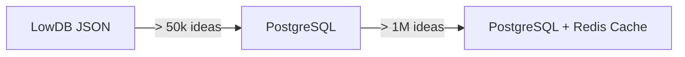
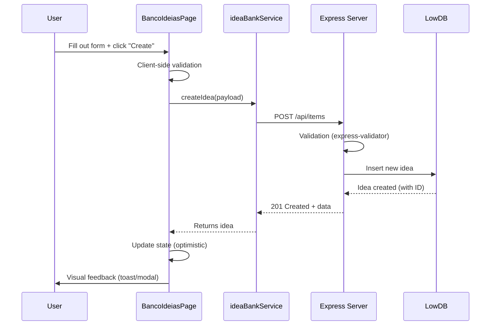

# PRD: Idea Bank - TradingSystem

**Status:** Implemented
**Version:** 1.0.0
**Last Update:** 2025-10-09
**Author:** Marcelo Terra
**Stakeholders:** Main Developer, System Users

---

## 1. Overview

### 1.1 Executive Summary

**Banco de Ideias** is an ideas and suggestions management system integrated with the TradingSystem Dashboard. It allows users to capture, organize, prioritize and track ideas for improvements, features and corrections across all 6 systems of the trading platform.

### 1.2 Product Context

TradingSystem is a complex platform with 6 independent systems:

1. Dashboard (Cyan)
2. Data Collection (Green)
3. Database (Purple)
4. Data Analysis (Orange)
5. Risk Management (Red)
6. Documentation (Blue)

The Idea Bank serves as a centralized repository for:

-   Brainstorming new features
-   Log of known bugs and issues
-   Suggestions for UX/UI improvements
-   Feature requests from users
-   Performance optimizations

### 1.3 Positioning

**For:** TradingSystem Developers and Users
**That:** They need to organize and prioritize improvement ideas
**The Idea Bank is:** An integrated idea management tool
**That:** Allows capture, categorization and tracking of ideas
**Different from:** Generic tools like Trello/Notion
**Our product:** Is integrated into the specific TradingSystem context with pre-defined categories per system

---

## 2. Problem and Opportunity

### 2.1 Current Problem

**Before the Idea Bank:**

-   Ideas scattered in notes, emails and messages
-   Lack of systematic prioritization
-   Difficulty tracking implementation status
-   Lack of product decision history
-   Fragmented communication about new features

### 2.2 Opportunity

**With the Idea Bank:**

-   Centralized and structured repository
-   Clear prioritization (4 levels)
-   Real-time status tracking
-   Categorization by system (6 categories)
-   Complete history of ideas and decisions
-   Base for product roadmap

### 2.3 Evidence

**Identified Needs:**

1. During development, ~20 improvement ideas without a centralized location were identified
2. Feature requests arise during use of the system without formal registration
3. Known bugs need tracking before being prioritized
4. Need for transparency in the development roadmap

---

## 3. Objectives and Non-Objectives

### 3.1 Goals

#### Primary Objective

Create an idea management system integrated with the Dashboard that allows capturing, organizing and tracking suggestions for improvements to the TradingSystem.

#### Secondary Objectives

1. **Organization:** Categorize ideas across the platforms 6 systems
2. **Prioritization:** Implement 4 priority levels (low, medium, high, critical)
3. **Tracking:** Track 5 progress states (new completed/rejected)
4. **Transparency:** Make the roadmap visible through the status of ideas
5. **Agility:** Allows quick creation of ideas (< 30 seconds)

### 3.2 Non-Goals

**The Idea Bank is NOT:**

-   Complete project management system (does not replace Jira/Linear)
-   Robust bug tracking system (no complex workflows)
-   Team collaboration tool (no comments/discussions - v1.0)
-   Public voting system (no upvote/downvote - v1.0)
-   Multi-tenant platform (single-user to MVP)

### 3.3 Success Criteria

**Quantitative:**

-   [ ] 100% of ideas registered in a centralized system
-   [ ] < 30 seconds to add new idea
-   [ ] 95% API service uptime
-   [ ] Support for 10,000+ ideas without performance degradation

**Qualitative:**

-   [ ] Intuitive interface (no training required)
-   [ ] Seamless integration with Dashboard
-   [ ] Clear roadmap visibility through the status board
-   [ ] User satisfaction: "Easy to use and useful"

---

## 4. Functional Requirements

### 4.1 RF-001: CRUD of Ideas

**Priority:** P0 (Critical)
**Status:** Implemented

**Description:**
The system must allow creating, reading, updating and deleting ideas.

**Acceptance Criteria:**

-   [x] **CREATE:** User can add new idea with title, description, category, priority and tags
-   [x] **READ:** User can view complete list of ideas ordered by date
-   [x] **UPDATE:** User can edit title, description, category, priority, status and tags
-   [x] **DELETE:** User can remove ideas with confirmation

**Required Fields:**

-   `title`: String (1-200 characters)
-   `description`: String (10-2000 characters)
-   `category`: Enum (6 options)
-   `priority`: Enum (4 levels)

**Optional Fields:**

-   `tags`: Array of strings
-   `status`: Auto-set to 'new' on creation

### 4.2 RF-002: Categorization by System

**Priority:** P0 (Critical)
**Status:** Implemented

**Description:**
Ideas must be categorized by the 6 TradingSystem systems.

**Categories:**

1.  **Documentation** (Blue) - Improvements in docs, PRDs, ADRs
2.  **Data Collection** (Green) - ProfitDLL, WebSocket, feeds
3.  **Database** (Purple) - Parquet, PostgreSQL, metadata
4.  **Data Analysis** (Orange) - ML, features, backtesting
5.  **Risk Management** (Red) - Orders, positions, limits
6.  **Dashboard** (Cyan) - UI/UX, KPIs, visualizations

**Acceptance Criteria:**

-   [x] Dropdown with 6 categories
-   [x] Visual icons for each category
-   [x] Colors corresponding to systems
-   [x] Filter by category in the list

### 4.3 RF-003: Prioritization System

**Priority:** P0 (Critical)
**Status:** Implemented

**Description:**
4 priority levels to classify urgency/impact.

**Priority Levels:**

-   **Critical:** Blocker, system down, security
-   **High:** Essential functionality, high impact
-   **Medium:** Important improvement, moderate impact
-   **Low:** Nice-to-have, low priority

**Acceptance Criteria:**

-   [x] Dropdown with 4 levels
-   [x] Colorful badges (red, orange, yellow, green)
-   [x] Filter by priority
-   [x] Sort by priority

### 4.4 RF-004: Status Tracking

**Priority:** P0 (Critical)
**Status:** Implemented

**Description:**
5 progress states to monitor the ideas life cycle.

**States:**

1.  **New:** Newly created idea, awaiting screening
2.  **Review:** Under feasibility/priority analysis
3.  **In Progress:** In active development
4.  **Completed:** Implemented and delivered
5.  **Rejected:** Will not be implemented (with justification)

**Acceptance Criteria:**

-   [x] Visual Kanban Status Board
-   [x] Drag-and-drop between columns
-   [x] Idea counter by status
-   [x] Filter by status

### 4.5 RF-005: Tag System

**Priority:** P1 (High)
**Status:** Implemented

**Description:**
Flexible tags for additional classification beyond category.

**Tag Examples:**

-   Techniques: `api`, `websocket`, `ml`, `database`, `ui`, `performance`
-   Type: `bug`, `feature`, `enhancement`, `refactor`, `docs`
-   Component: `profitdll`, `gateway`, `risk-engine`, `dashboard`

**Acceptance Criteria:**

-   [x] Tag input with suggestions
-   [x] Multiple tags per idea
-   [x] Visual badges for each tag
-   [x] Filter by tag

### 4.6 RF-006: Search and Filters

**Priority:** P1 (High)
**Status:** Partially Implemented

**Description:**
Full-text search and multiple filters to find ideas.

**Capabilities:**

-   [x] Search in title and description
-   [ ] Combined filter (category + priority + status)
-   [ ] Filter by tags
-   [ ] Filter by date (created in the last X days)
-   [ ] Customizable ordering

### 4.7 RF-007: Automatic Timestamps

**Priority:** P0 (Critical)
**Status:** Implemented

**Description:**
Automatic recording of creation and update dates.

**Fields:**

-   `createdAt`: ISO 8601 timestamp (generated on creation)
-   `updatedAt`: ISO 8601 timestamp (updated in each edition)

**Acceptance Criteria:**

-   [x] createdAt automatically set on POST
-   [x] updatedAt automatically updated on PUT
-   [x] Timestamps in ISO 8601 format (UTC)
-   [x] Display of formatted dates in the UI ("2 days ago")

---

## 5. Non-Functional Requirements

### 5.1 RNF-001: Performance

**Metrics:**

-   API response time: < 200ms (p95)
-   UI loading time: < 1s
-   Support for 10,000+ ideas without required pagination
-   Full-text search: < 500ms

### 5.2 RNF-002: Availability

**Target:** 95% uptime (for local MVP)

**Strategies:**

-   Auto-restart with PM2/Windows Service
-   Health check endpoint (`GET /health`)
-   Graceful shutdown
-   Robust error handling

### 5.3 RNF-003: Security

**Considerations (local MVP):**

-   CORS configurable per environment
-   Input validation (express-validator)
-   Data sanitization
-   Authentication: Not required (local single-user)
-   Authorization: Not required (MVP)

**Future (if multi-user):**

-   [ ] JWT authentication
-   [ ] Role-based access control
-   [ ] Rate limiting
-   [ ] SQL injection prevention

### 5.4 RNF-004: Scalability

**MVP limits (LowDB):**

-   Up to 10,000 ideas: Performance OK
-   10,000 - 50,000 ideas: Acceptable degradation
-   50,000+ ideas: Migration to PostgreSQL mandatory

**Migration Strategy:**



### 5.5 RNF-005: Usability

**Principles:**

-   Intuitive interface (no manual required)
-   Immediate visual feedback on actions
-   Confirmation before destructive actions (delete)
-   Clear and actionable error messages
-   Responsiveness (mobile-friendly)

**Metrics:**

-   Time to add idea: < 30 seconds
-   Task completion rate: > 95%
-   User errors: < 5%

### 5.6 RNF-006: Maintainability

**Requirements:**

-   Code following standards (ESLint, Prettier)
-   Inline documentation (JSDoc)
-   Complete README with examples
-   Automated tests (Jest + Supertest)
-   Structured logs (Pino)

### 5.7 RNF-007: Compatibility

**Platforms:**

-   Windows 11 x64 (primary)
-   Windows 10 x64 (compatible)
-   Docker (recommended for this service)

**Browsers:**

-   Chrome/Edge (latest)
-   Firefox (latest)
-   Safari (best effort)

---

## 6. User Stories

### 6.1 Epic: Idea Management

#### US-001: Add New Idea

**As** TradingSystem developer
**I want** to add a new idea quickly
**So** I can capture insights before I forget them

**Acceptance Criteria:**

-   [ ] "Add Idea" button visible at the top
-   [ ] Modal/form with mandatory fields highlighted
-   [ ] Real-time validation (title, description)
-   [ ] Tag suggestions as you type
-   [ ] Visual confirmation after creation
-   [ ] Total time: < 30 seconds

**DoD (Definition of Done):**

-   [ ] Automated tests (API + UI)
-   [ ] Updated documentation
-   [ ] Code review approved
-   [ ] Deploy in dev/staging

---

#### US-002: View List of Ideas

**As** user
**I want** to see all the ideas organized
**So** I can review and prioritize

**Acceptance Criteria:**

-   [ ] Paginated list or infinite scroll
-   [ ] Category, priority and status badges
-   [ ] Description preview (first 2 lines)
-   [ ] Sort by date (newest first)
-   [ ] Total idea counter

---

#### US-003: Filter Ideas

**As** user
**I want** to filter ideas by category and status
**So** I can focus on a specific context

**Acceptance Criteria:**

-   [ ] Filters visible in the sidebar or top
-   [ ] Multiple filters combined
-   [ ] Filtered results counter
-   [ ] Clear filters in 1 click

---

#### US-004: Update Idea Status (Kanban)

**As** product manager
**I want** to drag ideas between status columns
**So** I can update progress visually

**Acceptance Criteria:**

-   [ ] Functional drag-and-drop
-   [ ] Visual feedback during drag
-   [ ] Optimistic update (UI first, then API)
-   [ ] Rollback in case of error
-   [ ] Smooth animations

---

#### US-005: Edit Existing Idea

**As** user
**I want** to edit an idea after creation
**So that** I can correct or add information

**Acceptance Criteria:**

-   [ ] "Edit" button on each card
-   [ ] Modal pre-populated with current data
-   [ ] Timestamp updatedAt updated
-   [ ] Change history (future)

---

#### US-006: Delete Idea

**As** user
**I want** to remove duplicate or irrelevant ideas
**So that** the bank remains organized

**Acceptance Criteria:**

-   [ ] Confirmation before deleting
-   [ ] Soft delete with possibility of restore (future)
-   [ ] Visual success feedback
-   [ ] Impossible to delete accidentally

---

### 6.2 Epic: Prioritization and Roadmap

#### US-007: View Status Board

**As** stakeholder
**I want** to view the Kanban board
**So that** I understand what is in progress

**Acceptance Criteria:**

-   [ ] 5 columns (New, Review, In Progress, Completed, Rejected)
-   [ ] Card counter per column
-   [ ] Colors differentiated by status
-   [ ] Horizontal scroll if many cards

---

#### US-008: Export Ideas

**As** product manager
**I want** to export ideas to CSV/JSON
**So that** I can analyze it in external tools

**Status:** Future (v2.0)

---

## 7. Architecture and Technology

### 7.1 Technology Stack

#### Backend (Idea Bank API)

```
Node.js 18+
 Express 4.18 (Web framework)
 LowDB 7.0 (JSON database)
 Express Validator 7.0 (Input validation)
 Pin 9.4 (Structured logging)
 CORS 2.8 (Cross-origin resource sharing)
 Dotenv 16.3 (Environment variables)
```

**Port:** 3200
**Base URL:** `http://localhost:3200/api`

#### Frontend (Dashboard)

```
React 18
 TypeScript 5.0
 Vite 5.0 (Build tool)
 Tailwind CSS 3.4 (Styling)
 shadcn/ui (Component library)
 @dnd-kit (Drag-and-drop)
 Lucide React (Icons)
 Zustand (State management)
```

**Port:** 5173
**URL:** `http://localhost:5173/documentacao/banco-ideias`

### 7.2 System Architecture

```mermaid
graphic TB
    subgraph "Frontend - React Dashboard"
        A[BancoIdeiasPage.tsx]
        B[ideaBankService.ts]
        C[Zustand Store]
    end

    subgraph "Backend - Idea Bank API"
        D[Express Server :3200]
        E[Routes /api/items]
        F[Validators]
        G[Controllers]
    end

    subgraph "Persistence"
        H[(LowDB - ideas.json)]
    end

    A -->|HTTP Requests| B
    B -->|fetch| D
    D --> E
    E --> F
    F --> G
    G -->|Read/Write| H
    H -->|JSON| G
    C -->|Local State| THE
```

### 7.3 Data Model

#### Entity: Idea

```typescript
interface Idea {
  id: string;                    // UUID or auto-increment
  title: string;                 // 1-200 characters
  description: string;           // 10-2000 characters
  category: Category;            // Enum (6 options)
  priority: Priority;            // Enum (4 levels)
  status: Status;                // Enum (5 states)
  tags: string[];                // optional array
  createdAt: string;             // ISO 8601 timestamp
  updatedAt?: string;            // ISO 8601 timestamp (optional)
}

typeCategory =
  | 'documentation'
  | 'data-collection'
  | 'database'
  | 'data-analyze'
  | 'management-risks'
  | 'dashboard';

type Priority = 'low' | 'medium' | 'high' | 'critical';

type Status = 'new' | 'review' | 'in-progress' | 'completed' | 'rejected';
```

#### JSON example (ideas.json)

```json
{
    "ideas": [
        {
            "id": "1",
            "title": "Add OpenAPI/Swagger docs",
            "description": "Create OpenAPI specs for all system APIs",
            "category": "documentation",
            "priority": "high",
            "status": "review",
            "tags": ["api", "swagger", "docs"],
            "createdAt": "2025-10-09T10:00:00.000Z",
            "updatedAt": "2025-10-09T14:30:00.000Z"
        }
    ]
}
```

### 7.4 Data Flow (Create Idea)



---

## 8. User Interface

### 8.1 Wireframes and Layout

#### Main Page: Idea Bank

```

  Idea Bank [+ New Idea]


 [ Search...] [ Category ] [ Priority ] [Status ]


   Add OpenAPI/Swagger docs  High
   Documentation   Review
  Create OpenAPI specs for all APIs...
   api swagger docs  2 days ago
  [ Edit] [ Del]


   Support multiple brokers  High
   Data Collection   In Progress
  Expand integration to CME/Nasdaq...
   broker cme integration  5 days ago
  [ Edit] [ Del]


 Showing 2 of 2 ideas

```

#### Modal: Add/Edit Idea

```

  New Idea []


 Title *

  [Enter title...]


 Description *


  [Describe the idea...]


 Category * Priority *
 [Documentation ] [Medium ]

 Tags (optional)

  api, swagger, docs


 [Cancel] [ Create]

```

#### Status Board (Kanban)

```

  New  Review  In Prog Done  Reject
 (12)  (5)  (3)  (45)  (2)


Idea A Idea D Idea G Idea J Idea M
 High  High  Crit  Low  Med


Idea B Idea E Idea H Idea K Idea N
 Med  Med  High  Med  Low

 ...  ...  ...  ...  ...

```

### 8.2 Design System

#### Colors (by System)

| System          | Main Color | Hex     | Usage         |
| --------------- | ---------- | ------- | ------------- |
| Documentation   | Blue       | #3B82F6 | Badges, icons |
| Data Collection | Green      | #10B981 | Badges, icons |
| Database        | Purple     | #8B5CF6 | Badges, icons |
| Data Analysis   | Orange     | #F59E0B | Badges, icons |
| Risk Management | Red        | #EF4444 | Badges, icons |
| Dashboard       | Cyan       | #06B6D4 | Badges, icons |

#### Colors (by Priority)

| Priority | Color  | Hex     | Badge    |
| -------- | ------ | ------- | -------- |
| Critical | Red    | #DC2626 | Critical |
| High     | Orange | #EA580C | High     |
| Medium   | Yellow | #CA8A04 | Medium   |
| Low      | Green  | #16A34A | Low      |

#### Typography

-   **Headings:** Inter, 600-700 weight
-   **Body:** Inter, 400 weight
-   **Monospace:** JetBrains Mono (for IDs, timestamps)

---

## 9. API and Integrations

### 9.1 API Endpoints

#### Base URL

```
http://localhost:3200/api
```

#### Main Endpoints

| Method | Endpoint     | Description     | Auth |
| ------ | ------------ | --------------- | ---- |
| GET    | `/ideas`     | List all ideas  | -    |
| POST   | `/ideas`     | Create new idea | -    |
| PUT    | `/ideas/:id` | Update idea     | -    |
| DELETE | `/ideas/:id` | Delete idea     | -    |
| GET    | `/health`    | Health check    | -    |

**Note:** Authentication not implemented in MVP (local single-user).

#### Examples of Requests/Responses

**GET /api/items**

Request:

```http
GET /api/items HTTP/1.1
Host: localhost:3200
```

Response (200 OK):

```json
{
    "success": true,
    "count": 2,
    "date": [
        {
            "id": "1",
            "title": "Add OpenAPI docs",
            "description": "Create complete specs",
            "category": "documentation",
            "priority": "high",
            "status": "review",
            "tags": ["api", "docs"],
            "createdAt": "2025-10-09T10:00:00.000Z"
        }
    ]
}
```

**POST /api/items**

Request:

```http
POST /api/items HTTP/1.1
Host: localhost:3200
Content-Type: application/json

{
  "title": "Implement Redis cache",
  "description": "Add Redis to cache frequent queries",
  "category": "database",
  "priority": "medium",
  "tags": ["performance", "cache", "redis"]
}
```

Response (201 Created):

```json
{
    "success": true,
    "message": "Idea created successfully",
    "date": {
        "id": "3",
        "title": "Implement Redis cache",
        "description": "Add Redis to cache frequent queries",
        "category": "database",
        "priority": "medium",
        "status": "new",
        "tags": ["performance", "cache", "redis"],
        "createdAt": "2025-10-09T15:00:00.000Z"
    }
}
```

**PUT /api/items/:id**

Request:

```http
PUT /api/items/3 HTTP/1.1
Host: localhost:3200
Content-Type: application/json

{
  "status": "in-progress",
  "priority": "high"
}
```

Response (200 OK):

```json
{
    "success": true,
    "message": "Idea updated successfully",
    "date": {
        "id": "3",
        "status": "in-progress",
        "priority": "high",
        "updatedAt": "2025-10-09T16:30:00.000Z"
    }
}
```

**DELETE /api/items/:id**

Request:

```http
DELETE /api/items/3 HTTP/1.1
Host: localhost:3200
```

Response (200 OK):

```json
{
    "success": true,
    "message": "Idea deleted successfully",
    "date": {
        "id": "3",
        "title": "Implement Redis cache"
    }
}
```

### 9.2 Data Validation

**express-validator Rules:**

```javascript
// POST /api/items
[
    body("title").notEmpty().trim().isLength({ min: 1, max: 200 }),
    body("description").notEmpty().trim().isLength({ min: 10, max: 2000 }),
    body("category").isIn([
        "documentacao",
        "coleta-dados",
        "baco-dados",
        "analyse-dados",
        "gestao-riscos",
        "dashboard",
    ]),
    body("priority").isIn(["low", "medium", "high", "critical"]),
    body("tags").optional().isArray(),
    body("tags.*").optional().isString().trim(),
];
```

**Error Response (400):**

```json
{
    "success": false,
    "errors": [
        {
            "msg": "Title must be between 1 and 200 characters",
            "param": "title",
            "location": "body"
        }
    ]
}
```

### 9.3 Frontend Service (ideaBankService.ts)

```typescript
class IdeaBankService {
    private baseUrl = "http://localhost:3200/api";

    async getAllIdeas(): Promise<Idea[]> {
        const response = await fetch(`${this.baseUrl}/ideas`);
        const json = await response.json();
        return json.data;
    }

    async createIdea(idea: Omit<Idea, "id" | "createdAt">): Promise<Idea> {
        const response = await fetch(`${this.baseUrl}/ideas`, {
            method: "POST",
            headers: { "Content-Type": "application/json" },
            body: JSON.stringify(idea),
        });
        const json = await response.json();
        return json.data;
    }

    async updateIdea(id: string, updates: Partial<Idea>): Promise<Idea> {
        const response = await fetch(`${this.baseUrl}/ideas/${id}`, {
            method: "PUT",
            headers: { "Content-Type": "application/json" },
            body: JSON.stringify(updates),
        });
        const json = await response.json();
        return json.data;
    }

    async deleteIdea(id: string): Promise<void> {
        await fetch(`${this.baseUrl}/ideas/${id}`, {
            method: "DELETE",
        });
    }
}
```

---

## 10. Use Cases

### 10.1 UC-001: Capturing Ideas During Development

**Actor:** Developer
**Preconditions:** Dashboard open, Idea Bank API running
**Trigger:** Developer has improvement insight

**Main Flow:**

1. Developer navigates to Documentation Idea Bank
2. Click on the "+ New Idea" button
3. Complete:
    - Title: "Add automatic retry in WebSocket"
    - Description: "Implement exponential backoff for reconnection"
    - Category: Data Collection
    - Priority: Medium
    - Tags: `websocket`, `reconnection`, `reliability`
4. Click on "Create"
5. System validates and saves ideas
6. Display confirmation toast
7. Idea appears in the list with "New" status

**Postconditions:**

-   Idea persisted in `ideas.json`
-   Visible in the list and status board
-   Timestamp `createdAt` registered

**Alternative Flows:**

-   4th. Validation fails (empty title) Displays inline error
-   6a. Offline API Displays connection error, allows retry

---

### 10.2 UC-002: Prioritize Ideas in the Weekly Review

**Actor:** Product Owner
**Preconditions:** 15 ideas with "New" status
**Trigger:** Weekly roadmap meeting

**Main Flow:**

1. PO opens Idea Bank
2. Filter by Status: "New"
3. For each idea:
    - Click on "Edit"
    - Evaluates impact vs effort
    - Updates Priority (Critical/High/Medium/Low)
    - Update Status to "Review"
4. Save changes
5. Review Status Board to view distribution

**Postconditions:**

-   15 ideas moved from "New" "Review"
-   Defined priorities
-   Updated `updatedAt` timestamps

---

### 10.3 UC-003: Implementation Tracking (Kanban)

**Actor:** Developer
**Preconditions:** Starting work on an idea
**Trigger:** Sprint planning defines idea as next task

**Main Flow:**

1. Dev opens Status Board
2. Find the idea card in the Review column
3. Drag card to the "In Progress" column
4. System updates status via API
5. Develop feature/fix
6. When finished, drag to "Completed"
7. Add final note (future: comments)

**Postconditions:**

-   Updated status: Review In Progress Completed
-   Recorded change history (future)
-   Time metrics in each phase (future)

---

### 10.4 UC-004: Identify Duplicate Ideas

**Actor:** Triager
**Preconditions:** New idea created
**Trigger:** Search before creating idea

**Main Flow:**

1. User types search term: "websocket reconnect"
2. System filters ideas containing terms
3. Find similar existing idea
4. User decides not to create a duplicate
5. Toggle to edit existing idea by adding details

**Postconditions:**

-   Duplicate avoided
-   Existing idea enriched with new details

---

## 11. Success Metrics

### 11.1 Product KPIs

| Metric                      | Target | Measurement     |
| --------------------------- | ------ | --------------- |
| Total ideas registered      | 100+   | Count in DB     |
| Average time to create idea | < 30s  | Frontend timing |
| Completion rate (Completed) | > 40%  | Count by status |
| Ideas added per week        | 5+     | Timestamp query |
| Service uptime              | 95%+   | Health checks   |

### 11.2 Performance Metrics

| Metric                  | Target  | Measurement      |
| ----------------------- | ------- | ---------------- |
| API response time (p95) | < 200ms | Pin logs         |
| UI load time            | < 1s    | Browser DevTools |
| Search latency          | < 500ms | Frontend timing  |
| Database size limit     | < 10MB  | File size        |

### 11.3 Quality Metrics

| Metric                  | Target | Measurement   |
| ----------------------- | ------ | ------------- |
| Test coverage (backend) | > 80%  | Jest coverage |
| TypeScript errors       | 0      | tsc --noEmit  |
| ESLint warnings         | 0      | eslint.       |
| User-reported bugs      | < 2/mo | GitHub Issues |

---

## 12. Roadmap and Phases

### 12.1 Phase 1: MVP (Completed )

**Timeline:** Week 1-2
**Status:** Implemented (2025-10-09)

**Features:**

-   [x] Complete idea CRUD (API + UI)
-   [x] 6 categories (systems)
-   [x] 4 priority levels
-   [x] 5 status states
-   [x] Basic tags
-   [x] List of ideas
-   [x] Status Board (Kanban)
-   [x] Drag-and-drop between statuses
-   [x] Simple search (title/description)
-   [x] Automatic timestamps

**Tech Stack:**

-   Backend: Node.js + Express + LowDB
-   Frontend: React + TypeScript + shadcn/ui

---

### 12.2 Phase 2: UX Improvements (Planned)

**Timeline:** Week 3-4
**Status:** Planned

**Features:**

-   [ ] Combined advanced filters (category + priority + status)
-   [ ] Customizable ordering (date, priority, title)
-   [ ] Pagination or infinite scroll (if > 100 ideas)
-   [ ] Optimized full-text search
-   [ ] Tag suggestions as you type
-   [ ] Improved visual confirmation (toasts)
-   [ ] Loading states in all actions
-   [ ] Error boundaries for API failures
-   [ ] Mobile responsiveness

**Technical Improvements:**

-   [ ] Query caching (React Query)
-   [ ] Optimistic updates
-   [ ] Debounce in search

---

### 12.3 Phase 3: Collaboration (Future)

**Timeline:** Month 2
**Status:** Backlog

**Features:**

-   [ ] Comment system
-   [ ] Mentions (@username)
-   [ ] Notifications (webhook/email)
-   [ ] Change history (audit log)
-   [ ] Soft delete with restore
-   [ ] File attachments (images, PDFs)
-   [ ] Voting (upvote/downvote)
-   [ ] Assignment of responsible

**Tech Stack Additions:**

-   WebSocket for real-time notifications
-   PostgreSQL for complex queries
-   S3/local storage for attachments

---

### 12.4 Phase 4: Intelligence (Future)

**Timeline:** Month 3-4
**Status:** Exploratory

**Features:**

-   [ ] Automatic duplicate detection (ML)
-   [ ] Standards-based priority suggestion
-   [ ] Self-categorization with NLP
-   [ ] Tag recommendation
-   [ ] Analytics and reports
-   [ ] Export to CSV/JSON/PDF
-   [ ] Integration with Jira/Linear

**Tech Stack Additions:**

-   Python backend for ML
-   OpenAI API for NLP (optional)
-   BI tools (Metabase/Grafana)

---

## 13. Risks and Mitigations

### 13.1 Technical Risks

| Risk                                 | Probability | Impact | Mitigation                                |
| ------------------------------------ | ----------- | ------ | ----------------------------------------- |
| LowDB doesn't scale (>50k ideas)     | Medium      | High   | Migration to PostgreSQL planned           |
| Offline API affects UX               | Bass        | Medium | Offline-first with Local Storage fallback |
| Data loss (corrupted JSON)           | Bass        | High   | Daily automatic backups                   |
| Degraded performance (too many tags) | Bass        | Medium | Indexes and pagination                    |

### 13.2 Product Risks

| Risk                                    | Probability | Impact | Mitigation                        |
| --------------------------------------- | ----------- | ------ | --------------------------------- |
| Low adoption (users do not use)         | Medium      | High   | Onboarding + workflow integration |
| Unnecessary features (over-engineering) | Medium      | Medium | Lean MVP, usage-based iteration   |
| Lack of governance (idea spam)          | Bass        | Medium | Regular screening, review process |

### 13.3 Operational Risks

| Risk                                     | Probability | Impact | Mitigation                           |
| ---------------------------------------- | ----------- | ------ | ------------------------------------ |
| Port 3200 conflicts with another service | Bass        | Bass   | Configurable port via `.env`         |
| CORS blocks requests                     | Medium      | High   | Explicit origins configuration       |
| Windows Service does not restart         | Bass        | Medium | PM2/Task Scheduler with auto-restart |

---

## 14. Appendices

### 14.1 Glossary

| Term             | Definition                                                      |
| ---------------- | --------------------------------------------------------------- |
| **Idea**         | Suggestion for functionality, improvement or correction         |
| **Category**     | One of TradingSystem's 6 systems                                |
| **Priority**     | Urgency/impact (Critical, High, Medium, Low)                    |
| **Status**       | Progress Status (New, Review, In Progress, Completed, Rejected) |
| **Tag**          | Flexible label for additional classification                    |
| **Status Board** | Kanban view of ideas by status                                  |
| **LowDB**        | JSON file-based database                                        |
| **MVP**          | Minimum Viable Product (minimum functional version)             |

### 14.2 References

**Technical Documentation:**

-   [Frontend Component](https://github.com/marceloterra1983/TradingSystem/blob/main/frontend/apps/dashboard/src/components/pages/BancoIdeiasPage.tsx)

**Frameworks and Libs:**

-   [Express.js](https://expressjs.com/)
-   [LowDB](https://github.com/typicode/lowdb)
-   [React DnD Kit](https://dndkit.com/)
-   [shadcn/ui](https://ui.shadcn.com/)

**Best Practices:**

-   [REST API Design](https://restfulapi.net/)
-   [React Best Practices](https://react.dev/learn)
-   [TypeScript Handbook](https://www.typescriptlang.org/docs/)

### 14.3 Changelog

| Version | Date       | Author        | Changes                               |
| ------- | ---------- | ------------- | ------------------------------------- |
| 1.0.0   | 2025-10-09 | Marcelo Terra | Creation of the PRD - MVP implemented |

### 14.4 Approvals

| Paper         | Name          | Date       | Subscription |
| ------------- | ------------- | ---------- | ------------ |
| Product Owner | Marcelo Terra | 2025-10-09 |              |
| Tech Lead     | Marcelo Terra | 2025-10-09 |              |
| Developer     | Marcelo Terra | 2025-10-09 |              |

---

## 15. Conclusion

The **Idea Bank** represents a fundamental component for the continuous evolution of TradingSystem. With the MVP already implemented and functional, the platform now has:

**Centralized repository** of improvement ideas
**Categorization by system** (6 categories)
**Clear prioritization** (4 levels)
**Visual tracking** (Kanban board with 5 states)
**Search and filters** to quickly find ideas
**Seamless integration** with the main Dashboard

**Next Steps:**

1. Collect usage feedback over the next few weeks
2. Implement Phase 2 (advanced filters, pagination)
3. Assess the need for migration from LowDB PostgreSQL
4. Explore collaboration features (comments, voting)

**Current Status:** **MVP Completed and in Production**

---

**Document Created:** 2025-10-09
**Last Revision:** 2025-10-09
**Version:** 1.0.0
**Format:** Markdown (Full PRD)
