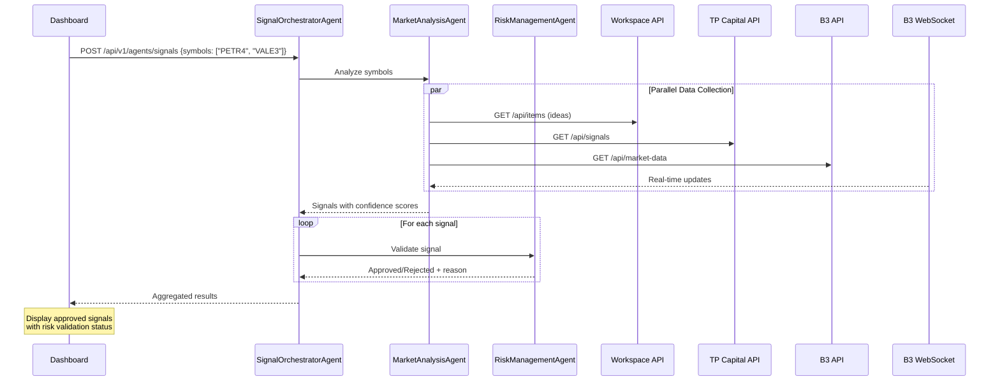

# PRD: Sistema Multi-Agente para Trading Automatizado

## Metadata

-   **Autor:** Backend Guild
-   **Data:** 2025-10-18
-   **Status:** Approved
-   **Prioridade:** P0
-   **Versão:** 1.0.0

## Sumário Executivo

O **Sistema Multi-Agente para Trading Automatizado** implementa três agentes especializados usando o Agno Framework para coordenar análise de mercado, validação de risco e orquestração de sinais de trading. O sistema integra dados do Workspace API (:3100), sinais do TP Capital API (:3200) e dados de mercado da B3 API (:3302) para gerar recomendações BUY/SELL/HOLD com validação automática de risco.

**Benefícios chave**

-   🤖 Análise automatizada de múltiplas fontes de dados em tempo real
-   🛡️ Validação automática de risco antes de qualquer sinal
-   ⚡ Latência p95 < 500ms para decisões de trading
-   🔄 Coordenação inteligente entre agentes especializados
-   📊 Métricas completas e audit trail para compliance

## Problema

### Contexto atual

-   Traders precisam correlacionar manualmente dados de múltiplas fontes (Workspace, TP Capital, B3)
-   Processo de decisão leva 5-10 minutos, perdendo oportunidades de mercado rápido
-   Validação de risco aplicada de forma inconsistente
-   Falta contexto compartilhado entre diferentes fontes de dados
-   Ausência de audit trail para decisões de trading

### Dores

-   **Traders:** Análise manual lenta impede capitalizar movimentos rápidos do mercado
-   **Risk Management:** Aplicação inconsistente de regras de risco leva a exposição
-   **Operations:** Ausência de audit trail das decisões tomadas
-   **Product:** Impossibilidade de escalar operações de trading sem automação

## Objetivos & KPIs

### Objetivos

1. ✅ Implementar MarketAnalysisAgent para gerar sinais BUY/SELL/HOLD com scores de confiança
2. ✅ Implementar RiskManagementAgent para validar sinais contra limites configurados
3. ✅ Implementar SignalOrchestratorAgent para coordenar workflow entre agentes
4. ✅ Integrar com APIs existentes (Workspace, TP Capital, B3) via HTTP clients com retry e circuit breaker
5. ✅ Consumir dados em tempo real via B3 WebSocket
6. ✅ Expor endpoints FastAPI para consumo pelo Dashboard
7. ✅ Exportar métricas Prometheus e logs estruturados JSON
8. ✅ Garantir latência p95 < 500ms para decisões

### KPIs

-   ⏱️ **Latência:** p95 de processamento de agentes < 500ms (medido via `agent_processing_seconds`)
-   ⏱️ **Latência API:** p95 de resposta de endpoints < 200ms (medido via `api_request_duration_seconds`)
-   📊 **Validação:** 100% dos sinais passam por RiskManagementAgent antes de entrega
-   🔁 **Disponibilidade:** 99% uptime medido em 30 dias (alert `AgnoAgentsDown`)
-   ✅ **Taxa de erro:** < 1% de erros em execuções de agentes
-   📈 **Throughput:** Suportar análise de 10+ símbolos simultaneamente sem degradação
-   🔍 **Observabilidade:** 100% das decisões registradas com trace_id para auditoria

### Não Objetivos

-   ❌ Executar ordens automaticamente (apenas gerar sinais - execução requer aprovação humana)
-   ❌ Substituir análise humana completamente (agentes atuam como copilotos)
-   ❌ Integrar com exchanges externas (escopo 100% local)
-   ❌ Implementar estratégias de ML complexas no MVP (usar regras determinísticas)

## Requisitos Funcionais

### RF1: MarketAnalysisAgent

-   Coletar ideias do Workspace API via `WorkspaceClient.get_ideas()`
-   Buscar sinais do TP Capital via `TPCapitalClient.get_tp_capital_signals()`
-   Obter dados de mercado do B3 via `B3Client.get_b3_data()`
-   Consumir atualizações em tempo real via `B3WebSocketConsumer`
-   Gerar recomendações (BUY/SELL/HOLD) com confidence score (0-100)
-   Incluir justificativa textual para cada decisão

### RF2: RiskManagementAgent

-   Validar sinais contra limites diários de perda (configurável via `.env`)
-   Verificar tamanho máximo de posição por ativo
-   Validar horário de trading (9:00-18:00 padrão, configurável)
-   Consultar estado do circuit breaker (kill switch)
-   Rejeitar sinais que violem qualquer regra com motivo específico
-   Registrar todas as validações para auditoria

### RF3: SignalOrchestratorAgent

-   Coordenar workflow: MarketAnalysis → RiskManagement → Response
-   Agregar resultados de múltiplos símbolos em uma resposta unificada
-   Implementar timeout configurável para cada etapa
-   Fornecer fallback em caso de falha parcial (retornar sinais aprovados)
-   Manter contexto de execução para tracing

### RF4: HTTP Client Adapters

-   Implementar retry com exponential backoff (configurável via `RETRY_DELAYS`)
-   Implementar circuit breaker (threshold e timeout configuráveis)
-   Respeitar timeout global (`HTTP_TIMEOUT`)
-   Logar todas as requisições com latência
-   Fornecer health check para cada dependência

### RF5: API Endpoints

-   `POST /api/v1/agents/analyze` - Análise de mercado para lista de símbolos
-   `POST /api/v1/agents/signals` - Workflow orquestrado completo (análise + risco)
-   `GET /api/v1/agents/status` - Status de prontidão de agentes e dependências
-   `GET /health` - Health check simples
-   `GET /health?detailed=true` - Health check detalhado com status de dependências
-   `GET /metrics` - Métricas Prometheus

### RF6: Observabilidade

-   Logs estruturados JSON com campos: timestamp, service, agent, decision, trace_id, span_id
-   Métricas Prometheus: `agent_decisions_total`, `agent_processing_seconds`, `agent_errors_total`, `api_requests_total`, `api_request_duration_seconds`, `dependency_status`
-   Tracing opcional via OpenTelemetry (configurável via `AGNO_ENABLE_TRACING`)

## Requisitos Não Funcionais

| Categoria          | Meta                                      | Medição                                              |
| ------------------ | ----------------------------------------- | ---------------------------------------------------- |
| Latência           | p95 < 500ms para decisões                 | Histogram `agent_processing_seconds`                 |
| Latência API       | p95 < 200ms para endpoints                | Histogram `api_request_duration_seconds`             |
| Disponibilidade    | 99% uptime (30 dias)                      | Alert `AgnoAgentsDown`                               |
| Taxa de erro       | < 1% de erros em execuções                | Counter `agent_errors_total`                         |
| Validação de risco | 100% dos sinais validados                 | Audit logs                                           |
| Resiliência        | Retry automático em falhas transitórias   | Configurável via `RETRY_MAX_ATTEMPTS`                |
| Isolamento         | Circuit breaker após N falhas             | Configurável via `CIRCUIT_BREAKER_FAILURE_THRESHOLD` |
| Observabilidade    | Logs estruturados + métricas + traces     | JSON logs + Prometheus + OpenTelemetry               |
| Segurança          | Execução isolada, sem saída para internet | Docker network isolation                             |

## Fluxo do Usuário



## Histórias de Usuário

### HU1: Como trader, quero receber sinais automatizados de BUY/SELL/HOLD

**Critérios de Aceitação:**

-   Sistema gera sinais com confidence score 0-100
-   Sinais incluem justificativa textual
-   Sinais são validados por RiskManagementAgent antes de entrega

### HU2: Como risk manager, quero validação automática de limites de risco

**Critérios de Aceitação:**

-   Sinais rejeitados se violam limites diários de perda
-   Validação de tamanho máximo de posição por ativo
-   Verificação de horário de trading (9:00-18:00 padrão)

### HU3: Como desenvolvedor, quero integração com APIs existentes

**Critérios de Aceitação:**

-   HTTP clients com retry e circuit breaker
-   Timeout configurável para todas as requisições
-   Health checks para dependências externas

### HU4: Como operador, quero observabilidade completa do sistema

**Critérios de Aceitação:**

-   Métricas Prometheus para latência e erros
-   Logs estruturados JSON com trace_id
-   Alertas automáticos para falhas críticas

## Notas de UX

### Dashboard Integration

-   Sinais exibidos em tempo real no dashboard de trading
-   Indicadores visuais para confidence score (cores: verde >80, amarelo 50-80, vermelho `<50`)
-   Tooltips com justificativa completa do sinal
-   Filtros por símbolo, confidence score e status de validação

### Risk Management Interface

-   Painel de limites de risco configuráveis
-   Alertas visuais para violações de limite
-   Histórico de validações com motivos de rejeição
-   Status do circuit breaker e health checks

### Observability Dashboard

-   Gráficos de latência e throughput em tempo real
-   Logs estruturados com busca por trace_id
-   Métricas de disponibilidade das dependências
-   Alertas ativos com severidade color-coded

## Perguntas em Aberto

### Q1: Estratégias de ML para MarketAnalysisAgent

**Status:** Backlog - MVP usa regras determinísticas
**Decisão:** Implementar ML no próximo ciclo após validação das regras base

### Q2: Autenticação e autorização de endpoints

**Status:** Backlog - MVP sem autenticação
**Decisão:** Implementar JWT/OAuth2 no próximo ciclo

### Q3: Backtesting framework para validação

**Status:** Backlog - MVP sem histórico
**Decisão:** Framework separado após estabilização do sistema

### Q4: Estratégias multi-agente avançadas

**Status:** Backlog - MVP com 3 agentes fixos
**Decisão:** Arquitetura extensível para agentes adicionais

## Roadmap

| Fase   | Entrega                                          | Status      | Data       |
| ------ | ------------------------------------------------ | ----------- | ---------- |
| Fase 1 | Estrutura Clean Architecture + Domain entities   | ✅ Completo | 2025-10-10 |
| Fase 2 | HTTP Client Adapters com retry e circuit breaker | ✅ Completo | 2025-10-12 |
| Fase 3 | MarketAnalysisAgent + RiskManagementAgent        | ✅ Completo | 2025-10-14 |
| Fase 4 | SignalOrchestratorAgent + FastAPI endpoints      | ✅ Completo | 2025-10-15 |
| Fase 5 | B3 WebSocket Consumer para dados em tempo real   | ✅ Completo | 2025-10-16 |
| Fase 6 | Prometheus metrics + structured logging          | ✅ Completo | 2025-10-16 |
| Fase 7 | Docker Compose integration + health checks       | ✅ Completo | 2025-10-17 |
| Fase 8 | Testes unitários + integração                    | ✅ Completo | 2025-10-17 |
| Fase 9 | Documentação (ADR, Guide, README)                | ✅ Completo | 2025-10-17 |

**Próximos Passos (Backlog):**

-   🔄 Integração com Dashboard (visualização de sinais)
-   🤖 Estratégias de ML para MarketAnalysisAgent
-   📊 Grafana dashboards customizados
-   🔐 Autenticação e autorização de endpoints
-   📈 Backtesting framework para validação de estratégias

## Riscos e Mitigações

| Risco                                   | Impacto | Probabilidade | Mitigação                                                                        |
| --------------------------------------- | ------- | ------------- | -------------------------------------------------------------------------------- |
| Latência de APIs externas               | Alto    | Média         | Retry com exponential backoff + circuit breaker + timeout configurável           |
| Falha em dependências (Workspace/TP/B3) | Alto    | Baixa         | Health checks + degraded mode (retornar sinais parciais) + alertas Prometheus    |
| Sinais falsos positivos                 | Médio   | Média         | Aprovação humana obrigatória antes de execução + audit trail completo            |
| Sobrecarga do sistema                   | Médio   | Baixa         | Rate limiting + resource limits no Docker + monitoramento de CPU/memória         |
| Mudanças no Agno Framework              | Baixo   | Média         | Pin de versões + testes de regressão + monitoramento de breaking changes         |
| Complexidade de debugging multi-agente  | Médio   | Média         | Logs estruturados com trace_id + tracing opcional + testes unitários abrangentes |

## Anexos

### Documentação Relacionada

-   **ADR-0002:** [Adoção do Agno Framework](../../../../backend/architecture/decisions/2025-10-16-adr-0002-agno-framework.md) - Decisão arquitetural e justificativa
-   **Guia de Implementação:** [Agno Agents Guide](../../../../backend/guides/agno-agents-guide.md) - Guia completo de desenvolvimento
-   **README do Serviço:** [infrastructure/agno-agents/README.md](../../../../../infrastructure/agno-agents/README.md) - Documentação técnica do serviço
-   **Alertas Prometheus:** [alert-rules.yml](../../../../../infrastructure/monitoring/prometheus/rules/alert-rules.yml) - Regras de alerta configuradas

### Diagramas de Arquitetura

-   **Before/After Architecture:** Incluídos no ADR-0002 (PlantUML)
-   **Component Architecture:** Ver `infrastructure/agno-agents/src/` para estrutura Clean Architecture
-   **Sequence Diagram:** Ver seção "Fluxo do Usuário" acima

### Configuração

-   **Variáveis de Ambiente:** Ver `.env.example` em `infrastructure/agno-agents/`
-   **Portas:** Serviço escuta em `:8200`
-   **Dependências:** Workspace (:3100), TP Capital (:3200), B3 (:3302), B3 WebSocket (:3302/ws)

### Endpoints de Teste

```bash
# Health check simples
curl http://localhost:8200/health

# Health check detalhado
curl http://localhost:8200/health?detailed=true | jq

# Análise de mercado
curl -X POST http://localhost:8200/api/v1/agents/analyze \
  -H "Content-Type: application/json" \
  -d '{"symbols": ["PETR4", "VALE3"]}' | jq

# Workflow completo (análise + risco)
curl -X POST http://localhost:8200/api/v1/agents/signals \
  -H "Content-Type: application/json" \
  -d '{"symbols": ["PETR4"], "risk_profile": "conservative"}' | jq

# Status dos agentes
curl http://localhost:8200/api/v1/agents/status | jq

# Métricas Prometheus
curl http://localhost:8200/metrics
```

### Glossário

-   **Agent:** Componente especializado que executa uma tarefa específica (análise, risco, orquestração)
-   **Circuit Breaker:** Padrão de resiliência que interrompe chamadas a serviços com falhas repetidas
-   **Confidence Score:** Pontuação 0-100 indicando confiança na recomendação do agente
-   **Orchestrator:** Agente coordenador que gerencia workflow entre outros agentes
-   **Signal:** Recomendação de trading (BUY/SELL/HOLD) gerada pelo sistema
-   **Trace ID:** Identificador único para rastrear uma requisição através de múltiplos componentes

## Detalhes de Implementação

### Arquitetura Clean Architecture

O serviço segue Clean Architecture com 4 camadas:

**Domain Layer** (`src/domain/`):

-   `entities.py`: TradingSignal, RiskAssessment, MarketData, AgentDecision
-   `value_objects.py`: Symbol, Price, Confidence, Timestamp

**Application Layer** (`src/application/`):

-   `ports.py`: Interfaces para adapters externos (IWorkspaceClient, ITPCapitalClient, IB3Client)
-   `dto.py`: Data Transfer Objects para requests/responses

**Infrastructure Layer** (`src/infrastructure/`):

-   `adapters/workspace_client.py`: HTTP client para Workspace API
-   `adapters/tp_capital_client.py`: HTTP client para TP Capital API
-   `adapters/b3_client.py`: HTTP client para B3 API
-   `adapters/b3_websocket_consumer.py`: WebSocket consumer para B3 real-time
-   `adapters/risk_engine_client.py`: Cliente para validação de risco
-   `resilience.py`: Retry decorator e circuit breaker utilities

**Interfaces Layer** (`src/interfaces/`):

-   `routes.py`: FastAPI endpoints
-   `agents/market_analysis.py`: MarketAnalysisAgent implementation
-   `agents/risk_management.py`: RiskManagementAgent implementation
-   `agents/signal_orchestrator.py`: SignalOrchestratorAgent implementation
-   `agents/utils.py`: Shared agent utilities

### Tecnologias Utilizadas

-   **Framework:** Agno (multi-agent orchestration)
-   **API:** FastAPI (async endpoints)
-   **HTTP Client:** httpx (async requests)
-   **Resiliência:** tenacity (retry), pybreaker (circuit breaker)
-   **Logging:** python-json-logger (structured logs)
-   **Métricas:** prometheus-client
-   **Tracing:** OpenTelemetry (opcional)
-   **Testing:** pytest, pytest-cov, pytest-asyncio

### Configuração via Environment Variables

Todas as variáveis devem estar no `.env` raiz do projeto:

```bash
# Service Configuration
AGNO_PORT=8200
AGNO_CORS_ORIGINS=http://localhost:3103,http://localhost:3004
AGNO_ENABLE_METRICS=true
AGNO_ENABLE_TRACING=false
AGNO_ENABLE_LLM=false
AGNO_ENABLE_B3_WEBSOCKET=true

# API URLs
WORKSPACE_API_URL=http://localhost:3100
TP_CAPITAL_API_URL=http://localhost:3200
B3_API_URL=http://localhost:3302
B3_WEBSOCKET_URL=ws://localhost:3302/ws

# Resilience
HTTP_TIMEOUT=30
AGNO_HEALTH_CHECK_TIMEOUT=5
RETRY_MAX_ATTEMPTS=3
RETRY_DELAYS=1,2,4
CIRCUIT_BREAKER_FAILURE_THRESHOLD=5
CIRCUIT_BREAKER_TIMEOUT=60
```

### Prometheus Alerts

Alertas configurados em `infrastructure/monitoring/prometheus/rules/alert-rules.yml`:

-   **AgnoAgentsDown** (critical): Serviço não responde por 2 minutos
-   **AgnoAgentErrorsHigh** (warning): Taxa de erro > 0.1 erros/segundo por 5 minutos
-   **AgnoAgentProcessingSlow** (warning): p95 de latência > 10 segundos
-   **AgnoDependencyUnhealthy** (warning): Dependência reporta status 0 por 3 minutos
-   **AgnoCircuitBreakerOpen** (critical): Circuit breaker acumula >5 erros em 5 minutos

### Testes

Suite de testes em `infrastructure/agno-agents/tests/`:

-   `test_domain.py`: Testes de entidades e value objects
-   `test_adapters.py`: Testes de HTTP clients com mocks
-   `test_websocket_consumer.py`: Testes de WebSocket consumer
-   `test_agents.py`: Testes de lógica dos agentes
-   `test_routes.py`: Testes de endpoints FastAPI
-   `test_main.py`: Testes de integração
-   `conftest.py`: Fixtures compartilhados

Executar testes:

```bash
cd infrastructure/agno-agents
pytest --cov=src --cov-report=html
```
