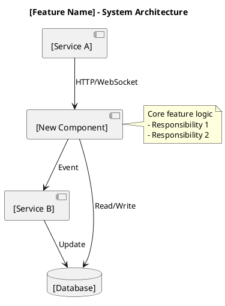
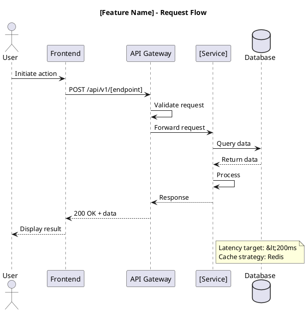
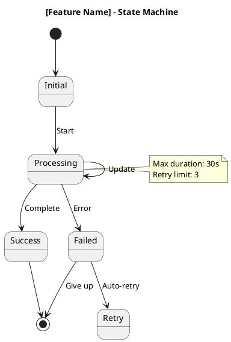
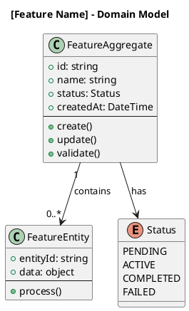

# Technical Specification: [Feature Name]

> Replace placeholder values (tags, domain, last_review, etc.) before publishing the spec.

## Overview

**Feature**: [Feature Name]
**Status**: [Draft | Review | Approved | Implemented]
**Owner**: [Team/Person]
**Target Release**: vX.X.X

### Summary
[Brief 2-3 sentence summary of what this feature does and why it's needed]

### Goals
- 🎯 [Primary goal]
- 🎯 [Secondary goal]
- 🎯 [Tertiary goal]

### Non-Goals
- ❌ [What this feature will NOT do]
- ❌ [What is explicitly out of scope]

## System Architecture

### High-Level Architecture - Source
Download: `[feature-name]-architecture.puml`

### High-Level Architecture - Rendered


## Data Flow

### Request Flow - Source
Download: `[feature-name]-sequence.puml`

### Request Flow - Rendered


## State Management

### State Machine - Source
Download: `[feature-name]-state.puml`

### State Machine - Rendered


## Data Model

### Domain Model - Source
Download: `[feature-name]-domain.puml`

### Domain Model - Rendered


## API Specification

### Endpoints

#### POST /api/v1/[resource]
**Description**: [What this endpoint does]

**Request**:
```json
{
  "field1": "string",
  "field2": 123,
  "field3": true
}
```

**Response** (200 OK):
```json
{
  "id": "uuid",
  "status": "success",
  "data": {
    "result": "value"
  }
}
```

**Errors**:
- `400 Bad Request`: Invalid input
- `401 Unauthorized`: Missing authentication
- `409 Conflict`: Resource already exists
- `500 Internal Server Error`: Server error

#### GET /api/v1/[resource]/\{id\}
**Description**: [What this endpoint does]

**Parameters**:
- `id` (path, required): Resource identifier

**Response** (200 OK):
```json
{
  "id": "uuid",
  "field1": "value",
  "field2": 123
}
```

## Technology Stack

| Component | Technology | Version | Rationale |
|-----------|------------|---------|-----------|
| Backend | [.NET/Python/Node] | X.X | [Why chosen] |
| Database | [PostgreSQL/Redis] | X.X | [Why chosen] |
| Cache | [Redis/Memcached] | X.X | [Why chosen] |
| Queue | [RabbitMQ/Redis] | X.X | [Why chosen] |

## Performance Requirements

### Latency Targets

| Operation | Target | P95 | P99 |
|-----------|--------|-----|-----|
| Read operation | &lt;50ms | &lt;100ms | &lt;200ms |
| Write operation | &lt;100ms | &lt;200ms | &lt;500ms |
| Batch operation | &lt;500ms | &lt;1s | &lt;2s |

### Throughput Targets

| Metric | Target |
|--------|--------|
| Requests per second | X,XXX |
| Concurrent users | X,XXX |
| Data volume | XX GB/day |

### Scalability

- **Horizontal**: Service can scale to N instances
- **Vertical**: Tested up to XX GB RAM, XX CPU cores
- **Database**: Supports up to XX million records

## Security Considerations

### Authentication & Authorization
- [How users are authenticated]
- [What permissions are required]
- [How authorization is enforced]

### Data Protection
- [ ] Sensitive data encrypted at rest
- [ ] Sensitive data encrypted in transit
- [ ] PII data properly handled
- [ ] Audit logging enabled

### Security Controls
- [ ] Input validation
- [ ] SQL injection prevention
- [ ] XSS prevention
- [ ] Rate limiting
- [ ] CORS configured

## Error Handling

### Error Scenarios

| Scenario | Handling | User Experience |
|----------|----------|-----------------|
| Invalid input | Return 400 with details | Show validation errors |
| Not found | Return 404 | Show "not found" message |
| Server error | Return 500, log | Show generic error |
| Timeout | Retry + circuit breaker | Show loading state |

### Retry Strategy
- **Transient errors**: Retry 3x with exponential backoff
- **Permanent errors**: Fail fast, log, alert
- **Circuit breaker**: Open after 5 consecutive failures

## Monitoring & Observability

### Metrics to Track
- [ ] Request count (by endpoint, status)
- [ ] Latency (P50, P95, P99)
- [ ] Error rate
- [ ] Throughput
- [ ] Resource utilization (CPU, memory, disk)

### Logging
- **Level**: Info for normal ops, Debug for troubleshooting
- **Format**: Structured JSON
- **Fields**: timestamp, level, message, context, trace_id

### Alerting
- [ ] High error rate (>5% for 5min)
- [ ] High latency (P95 > target for 5min)
- [ ] Service down (health check fails 3x)

### Dashboards
- Grafana dashboard: `[link]`
- Prometheus metrics: `[namespace]_[feature]_*`

## Testing Strategy

### Unit Tests
- [ ] Core business logic (>80% coverage)
- [ ] Edge cases and error paths
- [ ] Mocking external dependencies

### Integration Tests
- [ ] API endpoints
- [ ] Database interactions
- [ ] External service integrations

### E2E Tests
- [ ] Happy path user flows
- [ ] Critical business scenarios

### Performance Tests
- [ ] Load testing (target RPS)
- [ ] Stress testing (2x expected load)
- [ ] Soak testing (24h sustained load)

## Deployment Strategy

### Deployment Phases

**Phase 1: Development** (Week 1-2)
- [ ] Implement core logic
- [ ] Unit tests pass
- [ ] Integration tests pass

**Phase 2: Staging** (Week 3)
- [ ] Deploy to staging
- [ ] E2E tests pass
- [ ] Performance testing
- [ ] Security review

**Phase 3: Production** (Week 4)
- [ ] Gradual rollout (10% → 50% → 100%)
- [ ] Monitor metrics
- [ ] Be ready to rollback

### Rollback Plan
If critical issues detected:
1. Disable feature flag (if applicable)
2. Revert deployment to previous version
3. Investigate and fix issues
4. Re-deploy with fixes

## Dependencies

### Internal Dependencies
- [Service A]: [What we need from it]
- [Service B]: [What we need from it]

### External Dependencies
- [Third-party API]: [What we use]
- [Library]: [Version and purpose]

## Migration Notes

### Data Migration
[If existing data needs to be migrated]

1. **Preparation**: [Steps]
2. **Migration**: [Process]
3. **Validation**: [How to verify]
4. **Rollback**: [If needed]

### Breaking Changes
- [ ] [Change 1]: [Impact and mitigation]
- [ ] [Change 2]: [Impact and mitigation]

## Open Questions

- [ ] **Q1**: [Question]
  - **A1**: [Answer or "TBD"]
- [ ] **Q2**: [Question]
  - **A2**: [Answer or "TBD"]

## Related Documentation

- ADR reference placeholder: `architecture/decisions/adr-XXXX.md`
- Implementation guide placeholder: `guide-[feature-name].md`
- API documentation placeholder: `api-[feature-name].md`

---

## Approval

| Role | Name | Date | Status |
|------|------|------|--------|
| Tech Lead | [Name] | YYYY-MM-DD | ✅ Approved |
| Product Manager | [Name] | YYYY-MM-DD | ✅ Approved |
| Security | [Name] | YYYY-MM-DD | ✅ Approved |

## Change Log

| Date | Author | Changes |
|------|--------|---------|
| YYYY-MM-DD | [Name] | Initial draft |
| YYYY-MM-DD | [Name] | Added architecture diagrams |
| YYYY-MM-DD | [Name] | Approved after review |
