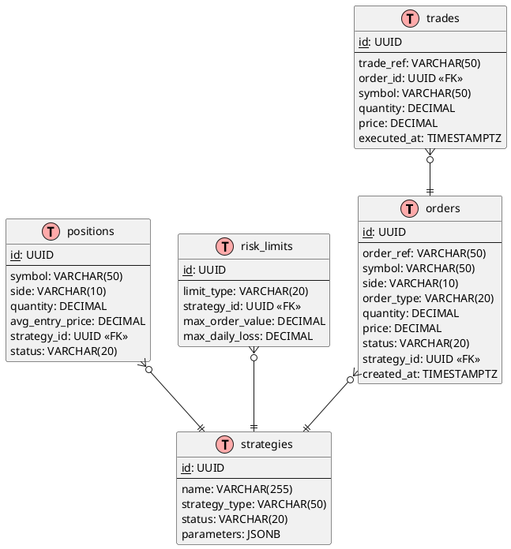
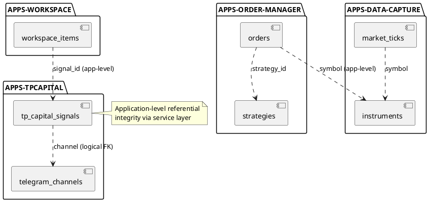

# TradingSystem - Comprehensive Database Schema Design

**Created:** 2025-11-01  
**Status:** Proposal  
**Owner:** DataOps Team  
**Review Date:** 2025-11-15

---

## Executive Summary

This document provides a comprehensive database schema design for TradingSystem, a local trading platform with Clean Architecture + DDD principles. The design covers existing production schemas, proposed optimizations, and future modules for Order Management and Data Capture services.

**Key Objectives:**
1. Optimize existing schemas for performance and scalability
2. Design production-ready schemas for Order Management and Data Capture
3. Ensure referential integrity across distributed databases
4. Implement robust audit trails and data lifecycle policies
5. Support sub-500ms latency for trading operations

---

## Table of Contents

1. [Current Architecture](#current-architecture)
2. [Requirements Analysis](#requirements-analysis)
3. [Entity Modeling](#entity-modeling)
4. [Existing Schema Analysis](#existing-schema-analysis)
5. [Proposed Optimizations](#proposed-optimizations)
6. [Order Management Schema](#order-management-schema)
7. [Data Capture Schema](#data-capture-schema)
8. [Performance Strategy](#performance-strategy)
9. [Security & Compliance](#security--compliance)
10. [Migration Plan](#migration-plan)
11. [ER Diagrams](#er-diagrams)

---

## 1. Current Architecture

### 1.1 Production Databases

| Database | Type | Purpose | Port | Status |
|----------|------|---------|------|--------|
| `APPS-TPCAPITAL` | TimescaleDB | Trading signals, Telegram data | 5433 | ✅ Production |
| `APPS-WORKSPACE` | TimescaleDB | Workspace items, audit logging | 5433 | ✅ Production |
| `documentation-api` | PostgreSQL + Prisma | Documentation systems, ideas, files | 5434 | ✅ Production |
| `QuestDB` | QuestDB | Time-series signals (legacy + active) | 8812, 9002 | ✅ Production |
| `LowDB` | JSON File | Legacy Idea Bank | N/A | ⚠️ MVP (migration Q1 2026) |

### 1.2 Future Databases (Planned)

| Database | Type | Purpose | Priority | Timeline |
|----------|------|---------|----------|----------|
| `APPS-ORDER-MANAGER` | TimescaleDB | Order execution, positions, risk | High | Q1 2026 |
| `APPS-DATA-CAPTURE` | TimescaleDB | Market data ingestion, ProfitDLL | High | Q1 2026 |
| `APPS-ANALYTICS` | PostgreSQL | Strategy backtesting, ML features | Medium | Q2 2026 |

---

## 2. Requirements Analysis

### 2.1 Business Entities

**Core Trading Entities:**
- Orders (market, limit, stop)
- Trades (executed orders)
- Positions (open holdings)
- Signals (ML-generated or manual)
- Strategies (trading algorithms)

**Supporting Entities:**
- Instruments (stocks, futures, FX)
- Accounts (trading accounts)
- Risk Limits (per account, per strategy)
- Audit Events (compliance trail)

**Operational Entities:**
- Workspace Items (features, tasks)
- Documentation (systems, ideas, files)
- Telegram Data (signals, bots, channels)

### 2.2 Data Flow

```
1. Market Data Ingestion:
   ProfitDLL → Data Capture → TimescaleDB (tick data) → Analytics (Parquet)

2. Signal Generation:
   ML Pipeline / Manual → Signals Table → Order Manager

3. Order Execution:
   Signal → Order Manager → Risk Check → ProfitDLL → Trade Execution → Position Update

4. Dashboard Consumption:
   REST APIs → TimescaleDB Queries → WebSocket Streams → Dashboard UI
```

### 2.3 Access Patterns

**High-Frequency (< 100ms):**
- Order status lookups
- Current position queries
- Risk limit checks
- Latest price updates

**Medium-Frequency (< 500ms):**
- Trade history queries (last 7 days)
- Signal backtesting
- Dashboard aggregations

**Batch Operations (minutes):**
- End-of-day reconciliation
- Performance analytics
- Data exports to Parquet

---

## 3. Entity Modeling

### 3.1 Domain Model (DDD)

**Aggregates:**
```
OrderAggregate:
  - Order (root entity)
  - OrderStatusHistory (child)
  - OrderFills (child)

PositionAggregate:
  - Position (root entity)
  - PositionHistory (child)

StrategyAggregate:
  - Strategy (root entity)
  - StrategyParameters (child)
  - StrategyPerformance (child)
```

**Value Objects:**
- Price (decimal, currency, precision)
- Quantity (decimal, units)
- Symbol (ticker, exchange, asset_class)
- Timestamp (UTC, nanosecond precision)

**Domain Events:**
- OrderPlacedEvent
- OrderFilledEvent
- PositionOpenedEvent
- PositionClosedEvent
- SignalGeneratedEvent
- RiskLimitBreachedEvent

---

## 4. Existing Schema Analysis

### 4.1 APPS-TPCAPITAL (TimescaleDB)

**Strengths:**
- ✅ Hypertable partitioning on `created_at`
- ✅ UUID primary keys prevent collisions
- ✅ TIMESTAMPTZ for timezone-aware timestamps
- ✅ Separate tables for bots and channels

**Weaknesses:**
- ⚠️ No foreign keys between `tp_capital_signals` and `telegram_channels`
- ⚠️ `raw_message` TEXT duplicates storage (compression needed)
- ⚠️ Missing indexes on `(channel, asset, created_at)`
- ⚠️ No soft delete support (requires archive table)

**Proposed Improvements:**
```sql
-- Add foreign key (requires data cleanup first)
ALTER TABLE "tp-capital".tp_capital_signals
  ADD CONSTRAINT fk_channel 
  FOREIGN KEY (channel) REFERENCES "tp-capital".telegram_channels(label)
  ON DELETE RESTRICT;

-- Add composite index for dashboard queries
CREATE INDEX idx_signals_dashboard 
  ON "tp-capital".tp_capital_signals (channel, asset, created_at DESC);

-- Enable compression for historical data
ALTER TABLE "tp-capital".tp_capital_signals 
  SET (timescaledb.compress, 
       timescaledb.compress_segmentby = 'channel,asset',
       timescaledb.compress_orderby = 'created_at DESC');

-- Add soft delete support
ALTER TABLE "tp-capital".tp_capital_signals 
  ADD COLUMN deleted_at TIMESTAMPTZ NULL,
  ADD COLUMN deleted_by VARCHAR(100) NULL;

CREATE INDEX idx_signals_active 
  ON "tp-capital".tp_capital_signals (created_at DESC)
  WHERE deleted_at IS NULL;
```

### 4.2 APPS-WORKSPACE (TimescaleDB)

**Strengths:**
- ✅ Comprehensive audit logging with triggers
- ✅ JSONB metadata with GIN indexes
- ✅ Enums enforced via CHECK constraints
- ✅ Monthly partitioning for scalability

**Weaknesses:**
- ⚠️ No cascade delete protection (orphan audit logs possible)
- ⚠️ Missing created_by validation
- ⚠️ Metadata JSONB lacks schema validation

**Proposed Improvements:**
```sql
-- Add user validation
CREATE TABLE workspace.users (
  id UUID PRIMARY KEY DEFAULT gen_random_uuid(),
  username VARCHAR(100) UNIQUE NOT NULL,
  email VARCHAR(255) UNIQUE NOT NULL,
  status VARCHAR(20) DEFAULT 'active' CHECK (status IN ('active', 'inactive')),
  created_at TIMESTAMPTZ NOT NULL DEFAULT NOW()
);

-- Add foreign keys
ALTER TABLE workspace.workspace_items
  ADD CONSTRAINT fk_created_by FOREIGN KEY (created_by) 
    REFERENCES workspace.users(username) ON DELETE SET NULL,
  ADD CONSTRAINT fk_updated_by FOREIGN KEY (updated_by) 
    REFERENCES workspace.users(username) ON DELETE SET NULL;

-- Add JSONB schema validation function
CREATE OR REPLACE FUNCTION workspace.validate_item_metadata()
RETURNS TRIGGER AS $$
BEGIN
  -- Ensure metadata has expected structure
  IF NEW.metadata IS NOT NULL THEN
    IF NOT (NEW.metadata ?& ARRAY['version']) THEN
      RAISE EXCEPTION 'metadata must contain "version" key';
    END IF;
  END IF;
  RETURN NEW;
END;
$$ LANGUAGE plpgsql;

CREATE TRIGGER trg_validate_metadata
  BEFORE INSERT OR UPDATE ON workspace.workspace_items
  FOR EACH ROW EXECUTE FUNCTION workspace.validate_item_metadata();
```

### 4.3 documentation-api (PostgreSQL + Prisma)

**Strengths:**
- ✅ Type-safe Prisma migrations
- ✅ Foreign key relationships properly defined
- ✅ Audit logging comprehensive

**Weaknesses:**
- ⚠️ File path storage without validation
- ⚠️ No file size limits enforced
- ⚠️ Missing cascade delete rules

**Proposed Improvements:**
```sql
-- Add file size validation
ALTER TABLE documentation_files
  ADD CONSTRAINT chk_file_size_limit 
  CHECK (size_bytes <= 104857600); -- 100 MB

-- Add cascade delete rules
ALTER TABLE documentation_files
  DROP CONSTRAINT IF EXISTS documentation_files_idea_id_fkey,
  ADD CONSTRAINT documentation_files_idea_id_fkey
    FOREIGN KEY (idea_id) REFERENCES documentation_ideas(id)
    ON DELETE CASCADE;

-- Add file path validation function
CREATE OR REPLACE FUNCTION validate_file_path()
RETURNS TRIGGER AS $$
BEGIN
  IF NEW.file_path !~ '^uploads/[0-9]{4}/[0-9]{2}/' THEN
    RAISE EXCEPTION 'file_path must follow pattern: uploads/YYYY/MM/filename';
  END IF;
  RETURN NEW;
END;
$$ LANGUAGE plpgsql;

CREATE TRIGGER trg_validate_file_path
  BEFORE INSERT OR UPDATE ON documentation_files
  FOR EACH ROW EXECUTE FUNCTION validate_file_path();
```

---

## 5. Proposed Optimizations

### 5.1 Cross-Database Referential Integrity

**Challenge:** Multiple databases (TimescaleDB instances) need referential integrity without direct foreign keys.

**Solution:** Implement application-level referential integrity with validation layers:

```javascript
// Example: Service Layer Validation
class WorkspaceService {
  async createItem(itemData, userId) {
    // 1. Validate user exists (could be in separate auth DB)
    const user = await this.authService.validateUser(userId);
    if (!user) throw new Error('Invalid user');
    
    // 2. Validate references (if linking to other apps)
    if (itemData.signal_id) {
      const signal = await this.tpCapitalService.getSignal(itemData.signal_id);
      if (!signal) throw new Error('Invalid signal reference');
    }
    
    // 3. Create item with validated references
    return await this.workspaceRepository.create({
      ...itemData,
      created_by: user.username
    });
  }
}
```

### 5.2 Materialized Views for Dashboard

**Problem:** Dashboard queries join multiple tables and calculate aggregations repeatedly.

**Solution:** Create materialized views with auto-refresh:

```sql
-- TP Capital: Signal summary by channel
CREATE MATERIALIZED VIEW "tp-capital".mv_signal_summary_daily AS
SELECT 
  date_trunc('day', created_at) as signal_date,
  channel,
  signal_type,
  COUNT(*) as signal_count,
  COUNT(DISTINCT asset) as unique_assets,
  AVG(entry_price) as avg_entry_price,
  MAX(created_at) as last_signal_time
FROM "tp-capital".tp_capital_signals
WHERE deleted_at IS NULL
GROUP BY signal_date, channel, signal_type;

CREATE UNIQUE INDEX idx_mv_signal_summary_pk 
  ON "tp-capital".mv_signal_summary_daily (signal_date, channel, signal_type);

-- Auto-refresh every 15 minutes
SELECT add_continuous_aggregate_policy('mv_signal_summary_daily',
  start_offset => INTERVAL '1 month',
  end_offset => INTERVAL '1 hour',
  schedule_interval => INTERVAL '15 minutes');
```

### 5.3 Partitioning Strategy Optimization

**Current:** Monthly partitioning for workspace, daily for signals.

**Recommendation:** Hybrid approach based on data volume:

```sql
-- High-volume tables: Hourly partitioning
SELECT create_hypertable('order_manager.trades', 'executed_at',
  chunk_time_interval => INTERVAL '1 hour');

-- Medium-volume tables: Daily partitioning
SELECT create_hypertable('order_manager.orders', 'created_at',
  chunk_time_interval => INTERVAL '1 day');

-- Low-volume tables: Weekly partitioning
SELECT create_hypertable('order_manager.strategies', 'created_at',
  chunk_time_interval => INTERVAL '1 week');
```

---

## 6. Order Management Schema

### 6.1 Database: APPS-ORDER-MANAGER

**Purpose:** Core trading operations - orders, trades, positions, risk management.

**Technology:** TimescaleDB (PostgreSQL 14+)  
**Schema:** `order_manager`  
**Port:** 5435 (host) → 5432 (container)

### 6.2 Table Definitions

#### orders (Hypertable)

Order lifecycle from creation to completion.

```sql
CREATE TABLE order_manager.orders (
  -- Identity
  id UUID PRIMARY KEY DEFAULT gen_random_uuid(),
  order_ref VARCHAR(50) UNIQUE NOT NULL, -- External reference
  
  -- Instrument
  symbol VARCHAR(50) NOT NULL,
  exchange VARCHAR(20) NOT NULL,
  asset_class VARCHAR(20) NOT NULL CHECK (asset_class IN ('stock', 'future', 'fx', 'crypto')),
  
  -- Order Details
  side VARCHAR(10) NOT NULL CHECK (side IN ('BUY', 'SELL')),
  order_type VARCHAR(20) NOT NULL CHECK (order_type IN ('MARKET', 'LIMIT', 'STOP', 'STOP_LIMIT')),
  quantity DECIMAL(18,8) NOT NULL CHECK (quantity > 0),
  price DECIMAL(18,8) NULL, -- NULL for market orders
  stop_price DECIMAL(18,8) NULL, -- NULL for non-stop orders
  
  -- Execution
  status VARCHAR(20) NOT NULL DEFAULT 'PENDING' CHECK (
    status IN ('PENDING', 'SUBMITTED', 'PARTIAL_FILL', 'FILLED', 'CANCELED', 'REJECTED', 'EXPIRED')
  ),
  filled_quantity DECIMAL(18,8) NOT NULL DEFAULT 0 CHECK (filled_quantity >= 0),
  avg_fill_price DECIMAL(18,8) NULL,
  
  -- Strategy & Risk
  strategy_id UUID NOT NULL,
  account_id UUID NOT NULL,
  position_type VARCHAR(20) NOT NULL CHECK (position_type IN ('DAY_TRADE', 'SWING', 'POSITION')),
  
  -- Timestamps
  created_at TIMESTAMPTZ NOT NULL DEFAULT NOW(),
  submitted_at TIMESTAMPTZ NULL,
  filled_at TIMESTAMPTZ NULL,
  canceled_at TIMESTAMPTZ NULL,
  updated_at TIMESTAMPTZ NOT NULL DEFAULT NOW(),
  
  -- Audit
  created_by VARCHAR(100) NOT NULL,
  reason TEXT NULL, -- Justification for compliance
  
  -- Metadata
  metadata JSONB DEFAULT '{}'::jsonb
);

-- Hypertable with daily partitioning
SELECT create_hypertable('order_manager.orders', 'created_at',
  chunk_time_interval => INTERVAL '1 day');

-- Indexes
CREATE INDEX idx_orders_symbol ON order_manager.orders (symbol, created_at DESC);
CREATE INDEX idx_orders_status ON order_manager.orders (status, created_at DESC);
CREATE INDEX idx_orders_strategy ON order_manager.orders (strategy_id, created_at DESC);
CREATE INDEX idx_orders_account ON order_manager.orders (account_id, created_at DESC);
CREATE INDEX idx_orders_ref ON order_manager.orders (order_ref);
CREATE INDEX idx_orders_active ON order_manager.orders (created_at DESC) 
  WHERE status IN ('PENDING', 'SUBMITTED', 'PARTIAL_FILL');
```

#### trades (Hypertable)

Executed fills from orders (one order can have multiple fills).

```sql
CREATE TABLE order_manager.trades (
  -- Identity
  id UUID PRIMARY KEY DEFAULT gen_random_uuid(),
  trade_ref VARCHAR(50) UNIQUE NOT NULL, -- Broker trade ID
  order_id UUID NOT NULL,
  
  -- Trade Details
  symbol VARCHAR(50) NOT NULL,
  exchange VARCHAR(20) NOT NULL,
  side VARCHAR(10) NOT NULL CHECK (side IN ('BUY', 'SELL')),
  quantity DECIMAL(18,8) NOT NULL CHECK (quantity > 0),
  price DECIMAL(18,8) NOT NULL CHECK (price > 0),
  total_value DECIMAL(18,2) NOT NULL,
  
  -- Fees & Costs
  commission DECIMAL(18,2) DEFAULT 0,
  tax DECIMAL(18,2) DEFAULT 0,
  slippage DECIMAL(18,8) NULL,
  
  -- Timing
  executed_at TIMESTAMPTZ NOT NULL,
  received_at TIMESTAMPTZ NOT NULL DEFAULT NOW(),
  
  -- Source
  execution_venue VARCHAR(50) NULL, -- Where executed
  broker_account VARCHAR(50) NOT NULL,
  
  -- Metadata
  metadata JSONB DEFAULT '{}'::jsonb
);

-- Hypertable with hourly partitioning (high volume expected)
SELECT create_hypertable('order_manager.trades', 'executed_at',
  chunk_time_interval => INTERVAL '1 hour');

-- Indexes
CREATE INDEX idx_trades_order ON order_manager.trades (order_id, executed_at DESC);
CREATE INDEX idx_trades_symbol ON order_manager.trades (symbol, executed_at DESC);
CREATE INDEX idx_trades_account ON order_manager.trades (broker_account, executed_at DESC);

-- Foreign key (application-level enforcement preferred for performance)
-- ALTER TABLE order_manager.trades 
--   ADD CONSTRAINT fk_trades_order FOREIGN KEY (order_id) 
--   REFERENCES order_manager.orders(id) ON DELETE CASCADE;
```

#### positions (Regular Table)

Current open positions (small dataset, frequently updated).

```sql
CREATE TABLE order_manager.positions (
  -- Identity
  id UUID PRIMARY KEY DEFAULT gen_random_uuid(),
  
  -- Instrument
  symbol VARCHAR(50) NOT NULL,
  exchange VARCHAR(20) NOT NULL,
  asset_class VARCHAR(20) NOT NULL,
  
  -- Position Details
  side VARCHAR(10) NOT NULL CHECK (side IN ('LONG', 'SHORT')),
  quantity DECIMAL(18,8) NOT NULL CHECK (quantity > 0),
  avg_entry_price DECIMAL(18,2) NOT NULL,
  current_price DECIMAL(18,2) NULL,
  
  -- P&L
  unrealized_pnl DECIMAL(18,2) NULL,
  realized_pnl DECIMAL(18,2) DEFAULT 0,
  
  -- Strategy & Account
  strategy_id UUID NOT NULL,
  account_id UUID NOT NULL,
  position_type VARCHAR(20) NOT NULL,
  
  -- Timestamps
  opened_at TIMESTAMPTZ NOT NULL DEFAULT NOW(),
  closed_at TIMESTAMPTZ NULL,
  updated_at TIMESTAMPTZ NOT NULL DEFAULT NOW(),
  
  -- Status
  status VARCHAR(20) NOT NULL DEFAULT 'OPEN' CHECK (
    status IN ('OPEN', 'CLOSING', 'CLOSED')
  ),
  
  -- Metadata
  metadata JSONB DEFAULT '{}'::jsonb,
  
  -- Unique constraint: one position per symbol/account/strategy
  UNIQUE (symbol, account_id, strategy_id, status)
);

-- Indexes
CREATE INDEX idx_positions_symbol ON order_manager.positions (symbol);
CREATE INDEX idx_positions_account ON order_manager.positions (account_id);
CREATE INDEX idx_positions_strategy ON order_manager.positions (strategy_id);
CREATE INDEX idx_positions_active ON order_manager.positions (updated_at DESC) 
  WHERE status = 'OPEN';
```

#### position_history (Hypertable)

Historical snapshot of position changes.

```sql
CREATE TABLE order_manager.position_history (
  id UUID PRIMARY KEY DEFAULT gen_random_uuid(),
  position_id UUID NOT NULL,
  
  -- Snapshot Data
  quantity DECIMAL(18,8) NOT NULL,
  avg_entry_price DECIMAL(18,2) NOT NULL,
  current_price DECIMAL(18,2) NOT NULL,
  unrealized_pnl DECIMAL(18,2) NOT NULL,
  realized_pnl DECIMAL(18,2) NOT NULL,
  
  -- Timestamp
  snapshot_at TIMESTAMPTZ NOT NULL DEFAULT NOW(),
  
  -- Trigger reason
  reason VARCHAR(50) NULL, -- 'trade_fill', 'price_update', 'eod_snapshot'
  
  -- Metadata
  metadata JSONB DEFAULT '{}'::jsonb
);

SELECT create_hypertable('order_manager.position_history', 'snapshot_at',
  chunk_time_interval => INTERVAL '1 day');

CREATE INDEX idx_position_history_position ON order_manager.position_history 
  (position_id, snapshot_at DESC);
```

#### strategies

Trading strategy definitions.

```sql
CREATE TABLE order_manager.strategies (
  id UUID PRIMARY KEY DEFAULT gen_random_uuid(),
  
  -- Strategy Details
  name VARCHAR(255) UNIQUE NOT NULL,
  description TEXT NULL,
  strategy_type VARCHAR(50) NOT NULL CHECK (
    strategy_type IN ('TREND_FOLLOWING', 'MEAN_REVERSION', 'ARBITRAGE', 'MANUAL')
  ),
  
  -- Status
  status VARCHAR(20) NOT NULL DEFAULT 'INACTIVE' CHECK (
    status IN ('ACTIVE', 'INACTIVE', 'PAUSED', 'TESTING')
  ),
  
  -- Parameters
  parameters JSONB NOT NULL DEFAULT '{}'::jsonb,
  
  -- Risk Limits
  max_position_size DECIMAL(18,2) NULL,
  max_daily_loss DECIMAL(18,2) NULL,
  max_drawdown_pct DECIMAL(5,2) NULL,
  
  -- Timestamps
  created_at TIMESTAMPTZ NOT NULL DEFAULT NOW(),
  updated_at TIMESTAMPTZ NOT NULL DEFAULT NOW(),
  
  -- Ownership
  created_by VARCHAR(100) NOT NULL,
  
  -- Metadata
  metadata JSONB DEFAULT '{}'::jsonb
);

CREATE INDEX idx_strategies_status ON order_manager.strategies (status);
CREATE INDEX idx_strategies_type ON order_manager.strategies (strategy_type);
```

#### risk_limits

Per-account and per-strategy risk controls.

```sql
CREATE TABLE order_manager.risk_limits (
  id UUID PRIMARY KEY DEFAULT gen_random_uuid(),
  
  -- Scope
  limit_type VARCHAR(20) NOT NULL CHECK (limit_type IN ('ACCOUNT', 'STRATEGY', 'SYMBOL')),
  account_id UUID NULL,
  strategy_id UUID NULL,
  symbol VARCHAR(50) NULL,
  
  -- Limits
  max_order_value DECIMAL(18,2) NULL,
  max_position_size DECIMAL(18,8) NULL,
  max_daily_loss DECIMAL(18,2) NULL,
  max_daily_trades INTEGER NULL,
  
  -- Status
  status VARCHAR(20) NOT NULL DEFAULT 'ACTIVE' CHECK (status IN ('ACTIVE', 'INACTIVE')),
  
  -- Timestamps
  created_at TIMESTAMPTZ NOT NULL DEFAULT NOW(),
  updated_at TIMESTAMPTZ NOT NULL DEFAULT NOW(),
  
  -- Metadata
  metadata JSONB DEFAULT '{}'::jsonb,
  
  -- Ensure one limit per combination
  UNIQUE NULLS NOT DISTINCT (limit_type, account_id, strategy_id, symbol)
);

CREATE INDEX idx_risk_limits_account ON order_manager.risk_limits (account_id);
CREATE INDEX idx_risk_limits_strategy ON order_manager.risk_limits (strategy_id);
```

#### order_audit_log (Hypertable)

Audit trail for all order state changes.

```sql
CREATE TABLE order_manager.order_audit_log (
  id UUID PRIMARY KEY DEFAULT gen_random_uuid(),
  order_id UUID NOT NULL,
  
  -- Change Details
  action VARCHAR(50) NOT NULL CHECK (
    action IN ('CREATED', 'SUBMITTED', 'FILLED', 'PARTIAL_FILL', 'CANCELED', 'REJECTED', 'MODIFIED')
  ),
  old_status VARCHAR(20) NULL,
  new_status VARCHAR(20) NOT NULL,
  
  -- Audit
  changed_by VARCHAR(100) NOT NULL,
  changed_at TIMESTAMPTZ NOT NULL DEFAULT NOW(),
  reason TEXT NULL,
  
  -- Change Delta
  changes JSONB NULL,
  
  -- Metadata
  metadata JSONB DEFAULT '{}'::jsonb
);

SELECT create_hypertable('order_manager.order_audit_log', 'changed_at',
  chunk_time_interval => INTERVAL '1 day');

CREATE INDEX idx_order_audit_order ON order_manager.order_audit_log (order_id, changed_at DESC);
CREATE INDEX idx_order_audit_action ON order_manager.order_audit_log (action, changed_at DESC);
```

### 6.3 Triggers for Order Management

```sql
-- Auto-update updated_at timestamp
CREATE OR REPLACE FUNCTION order_manager.update_timestamp()
RETURNS TRIGGER AS $$
BEGIN
  NEW.updated_at = NOW();
  RETURN NEW;
END;
$$ LANGUAGE plpgsql;

CREATE TRIGGER trg_orders_update_timestamp
  BEFORE UPDATE ON order_manager.orders
  FOR EACH ROW EXECUTE FUNCTION order_manager.update_timestamp();

CREATE TRIGGER trg_positions_update_timestamp
  BEFORE UPDATE ON order_manager.positions
  FOR EACH ROW EXECUTE FUNCTION order_manager.update_timestamp();

-- Auto-audit order changes
CREATE OR REPLACE FUNCTION order_manager.audit_order_change()
RETURNS TRIGGER AS $$
BEGIN
  IF TG_OP = 'INSERT' THEN
    INSERT INTO order_manager.order_audit_log (order_id, action, new_status, changed_by, reason)
    VALUES (NEW.id, 'CREATED', NEW.status, NEW.created_by, NEW.reason);
    
  ELSIF TG_OP = 'UPDATE' AND OLD.status <> NEW.status THEN
    INSERT INTO order_manager.order_audit_log (
      order_id, action, old_status, new_status, changed_by, reason, changes
    ) VALUES (
      NEW.id, 
      'STATUS_CHANGE', 
      OLD.status, 
      NEW.status, 
      COALESCE(CURRENT_USER, 'system'),
      NEW.reason,
      jsonb_build_object(
        'filled_quantity_old', OLD.filled_quantity,
        'filled_quantity_new', NEW.filled_quantity,
        'avg_fill_price_old', OLD.avg_fill_price,
        'avg_fill_price_new', NEW.avg_fill_price
      )
    );
  END IF;
  
  RETURN NEW;
END;
$$ LANGUAGE plpgsql;

CREATE TRIGGER trg_orders_audit
  AFTER INSERT OR UPDATE ON order_manager.orders
  FOR EACH ROW EXECUTE FUNCTION order_manager.audit_order_change();
```

---

## 7. Data Capture Schema

### 7.1 Database: APPS-DATA-CAPTURE

**Purpose:** Market data ingestion from ProfitDLL, tick storage, order book snapshots.

**Technology:** TimescaleDB (PostgreSQL 14+)  
**Schema:** `data_capture`  
**Port:** 5436 (host) → 5432 (container)

### 7.2 Table Definitions

#### market_ticks (Hypertable)

Ultra-high-frequency tick data from ProfitDLL.

```sql
CREATE TABLE data_capture.market_ticks (
  -- Identity
  id BIGSERIAL,
  
  -- Instrument
  symbol VARCHAR(50) NOT NULL,
  exchange VARCHAR(20) NOT NULL,
  
  -- Tick Data
  price DECIMAL(18,8) NOT NULL,
  volume DECIMAL(18,8) NOT NULL,
  aggressor VARCHAR(10) NOT NULL CHECK (aggressor IN ('BUY', 'SELL', 'NEUTRAL')),
  
  -- Timing (nanosecond precision)
  tick_time TIMESTAMPTZ NOT NULL,
  received_time TIMESTAMPTZ NOT NULL DEFAULT NOW(),
  
  -- Source
  source VARCHAR(50) NOT NULL DEFAULT 'ProfitDLL',
  
  -- Unique constraint on tick_time + symbol (avoid duplicates)
  PRIMARY KEY (tick_time, symbol, id)
);

-- Hypertable with 5-minute partitioning (ultra-high frequency)
SELECT create_hypertable('data_capture.market_ticks', 'tick_time',
  chunk_time_interval => INTERVAL '5 minutes');

-- Indexes
CREATE INDEX idx_market_ticks_symbol ON data_capture.market_ticks (symbol, tick_time DESC);

-- Compression policy (compress after 1 hour)
ALTER TABLE data_capture.market_ticks SET (
  timescaledb.compress,
  timescaledb.compress_segmentby = 'symbol',
  timescaledb.compress_orderby = 'tick_time DESC'
);

SELECT add_compression_policy('data_capture.market_ticks', INTERVAL '1 hour');

-- Retention policy (keep 30 days online, export to Parquet)
SELECT add_retention_policy('data_capture.market_ticks', INTERVAL '30 days');
```

#### order_book_snapshots (Hypertable)

Order book depth snapshots (L2 data).

```sql
CREATE TABLE data_capture.order_book_snapshots (
  -- Identity
  id BIGSERIAL,
  
  -- Instrument
  symbol VARCHAR(50) NOT NULL,
  exchange VARCHAR(20) NOT NULL,
  
  -- Snapshot Data (JSONB for flexibility)
  bids JSONB NOT NULL, -- [{price: 100.50, volume: 1000}, ...]
  asks JSONB NOT NULL, -- [{price: 100.55, volume: 500}, ...]
  
  -- Aggregated Stats
  best_bid DECIMAL(18,8) NOT NULL,
  best_ask DECIMAL(18,8) NOT NULL,
  spread DECIMAL(18,8) NOT NULL,
  total_bid_volume DECIMAL(18,2) NOT NULL,
  total_ask_volume DECIMAL(18,2) NOT NULL,
  
  -- Timing
  snapshot_time TIMESTAMPTZ NOT NULL,
  received_time TIMESTAMPTZ NOT NULL DEFAULT NOW(),
  
  PRIMARY KEY (snapshot_time, symbol, id)
);

SELECT create_hypertable('data_capture.order_book_snapshots', 'snapshot_time',
  chunk_time_interval => INTERVAL '15 minutes');

CREATE INDEX idx_order_book_symbol ON data_capture.order_book_snapshots 
  (symbol, snapshot_time DESC);

-- Compression
ALTER TABLE data_capture.order_book_snapshots SET (
  timescaledb.compress,
  timescaledb.compress_segmentby = 'symbol',
  timescaledb.compress_orderby = 'snapshot_time DESC'
);

SELECT add_compression_policy('data_capture.order_book_snapshots', INTERVAL '2 hours');
SELECT add_retention_policy('data_capture.order_book_snapshots', INTERVAL '7 days');
```

#### profitdll_callbacks (Hypertable)

Log all ProfitDLL callback events for debugging.

```sql
CREATE TABLE data_capture.profitdll_callbacks (
  id BIGSERIAL,
  
  -- Callback Type
  callback_type VARCHAR(50) NOT NULL CHECK (
    callback_type IN ('STATE', 'TRADE', 'OFFER_BOOK', 'PRICE_DEPTH', 'ORDER')
  ),
  
  -- Payload
  payload JSONB NOT NULL,
  
  -- Timing
  callback_time TIMESTAMPTZ NOT NULL,
  processed_at TIMESTAMPTZ NOT NULL DEFAULT NOW(),
  
  -- Processing Status
  status VARCHAR(20) NOT NULL DEFAULT 'PENDING' CHECK (
    status IN ('PENDING', 'PROCESSED', 'FAILED', 'SKIPPED')
  ),
  error_message TEXT NULL,
  
  PRIMARY KEY (callback_time, callback_type, id)
);

SELECT create_hypertable('data_capture.profitdll_callbacks', 'callback_time',
  chunk_time_interval => INTERVAL '1 hour');

CREATE INDEX idx_callbacks_type ON data_capture.profitdll_callbacks 
  (callback_type, callback_time DESC);
CREATE INDEX idx_callbacks_status ON data_capture.profitdll_callbacks 
  (status, callback_time DESC) WHERE status IN ('PENDING', 'FAILED');

-- Short retention (3 days for debugging)
SELECT add_retention_policy('data_capture.profitdll_callbacks', INTERVAL '3 days');
```

#### instruments

Instrument master data.

```sql
CREATE TABLE data_capture.instruments (
  id UUID PRIMARY KEY DEFAULT gen_random_uuid(),
  
  -- Instrument Identity
  symbol VARCHAR(50) UNIQUE NOT NULL,
  exchange VARCHAR(20) NOT NULL,
  asset_class VARCHAR(20) NOT NULL,
  
  -- Details
  name VARCHAR(255) NOT NULL,
  isin VARCHAR(12) NULL,
  currency VARCHAR(3) DEFAULT 'BRL',
  lot_size DECIMAL(18,8) DEFAULT 1,
  tick_size DECIMAL(18,8) NOT NULL,
  
  -- Trading Hours
  trading_hours JSONB NULL, -- {open: '09:00', close: '18:00'}
  
  -- Status
  status VARCHAR(20) NOT NULL DEFAULT 'ACTIVE' CHECK (
    status IN ('ACTIVE', 'INACTIVE', 'DELISTED', 'HALTED')
  ),
  
  -- Timestamps
  created_at TIMESTAMPTZ NOT NULL DEFAULT NOW(),
  updated_at TIMESTAMPTZ NOT NULL DEFAULT NOW(),
  
  -- Metadata
  metadata JSONB DEFAULT '{}'::jsonb
);

CREATE INDEX idx_instruments_exchange ON data_capture.instruments (exchange);
CREATE INDEX idx_instruments_asset_class ON data_capture.instruments (asset_class);
CREATE INDEX idx_instruments_status ON data_capture.instruments (status);
```

---

## 8. Performance Strategy

### 8.1 Indexing Strategy

**Primary Key Selection:**
- Use `UUID` for distributed systems (avoid collisions)
- Use `BIGSERIAL` for time-series tables (sequential inserts)
- Composite primary keys for hypertables: `(timestamp, dimension, id)`

**Index Types:**

| Index Type | Use Case | Example |
|------------|----------|---------|
| B-Tree | Equality, range queries | `created_at DESC`, `status` |
| GIN | JSONB, array columns | `metadata`, `tags` |
| Partial | Filtered queries (active records) | `WHERE status = 'OPEN'` |
| Composite | Multi-column filters | `(symbol, created_at DESC)` |

**Index Maintenance:**
```sql
-- Auto-reindex weekly
CREATE OR REPLACE FUNCTION reindex_all_tables() RETURNS void AS $$
DECLARE
  r RECORD;
BEGIN
  FOR r IN 
    SELECT schemaname, tablename 
    FROM pg_tables 
    WHERE schemaname IN ('order_manager', 'data_capture', 'tp-capital', 'workspace')
  LOOP
    EXECUTE 'REINDEX TABLE ' || quote_ident(r.schemaname) || '.' || quote_ident(r.tablename);
  END LOOP;
END;
$$ LANGUAGE plpgsql;

-- Schedule via pg_cron (if installed)
-- SELECT cron.schedule('reindex-weekly', '0 2 * * 0', 'SELECT reindex_all_tables()');
```

### 8.2 Query Optimization

**Dashboard Query Example:**

```sql
-- BEFORE: Slow query (5s for 1M rows)
SELECT * FROM "tp-capital".tp_capital_signals 
WHERE channel = 'TP_Capital' 
  AND created_at > NOW() - INTERVAL '7 days'
ORDER BY created_at DESC;

-- AFTER: Optimized with composite index (50ms)
CREATE INDEX idx_signals_dashboard_opt 
  ON "tp-capital".tp_capital_signals (channel, created_at DESC)
  INCLUDE (signal_type, asset, entry_price);

-- Query planner will use index-only scan
EXPLAIN (ANALYZE, BUFFERS) SELECT ...;
```

**Continuous Aggregates for Real-Time Dashboards:**

```sql
CREATE MATERIALIZED VIEW order_manager.mv_daily_trade_summary
WITH (timescaledb.continuous) AS
SELECT 
  time_bucket('1 day', executed_at) as trade_date,
  symbol,
  side,
  COUNT(*) as trade_count,
  SUM(quantity) as total_volume,
  AVG(price) as avg_price,
  SUM(total_value) as total_value,
  SUM(commission) as total_commission
FROM order_manager.trades
GROUP BY trade_date, symbol, side
WITH NO DATA;

-- Refresh policy: every 5 minutes
SELECT add_continuous_aggregate_policy('mv_daily_trade_summary',
  start_offset => INTERVAL '1 month',
  end_offset => INTERVAL '1 minute',
  schedule_interval => INTERVAL '5 minutes');
```

### 8.3 Connection Pooling

**PgBouncer Configuration:**

```ini
[databases]
apps-tpcapital = host=localhost port=5433 dbname=APPS-TPCAPITAL
apps-workspace = host=localhost port=5433 dbname=APPS-WORKSPACE
apps-order-manager = host=localhost port=5435 dbname=APPS-ORDER-MANAGER
apps-data-capture = host=localhost port=5436 dbname=APPS-DATA-CAPTURE

[pgbouncer]
pool_mode = transaction
max_client_conn = 100
default_pool_size = 20
min_pool_size = 5
reserve_pool_size = 5
reserve_pool_timeout = 3
max_db_connections = 50
```

---

## 9. Security & Compliance

### 9.1 Row-Level Security (RLS)

Enable RLS for multi-tenant scenarios:

```sql
-- Example: Workspace items by user
ALTER TABLE workspace.workspace_items ENABLE ROW LEVEL SECURITY;

CREATE POLICY workspace_items_user_access ON workspace.workspace_items
  USING (created_by = current_user OR updated_by = current_user);

-- Admins bypass RLS
CREATE POLICY workspace_items_admin_access ON workspace.workspace_items
  USING (current_user IN (SELECT username FROM workspace.users WHERE role = 'admin'));
```

### 9.2 Data Encryption

**At Rest:**
- PostgreSQL: Enable `pgcrypto` extension
- Encrypt sensitive columns (e.g., API tokens)

```sql
CREATE EXTENSION IF NOT EXISTS pgcrypto;

-- Encrypt bot tokens
ALTER TABLE "tp-capital".telegram_bots 
  ADD COLUMN token_encrypted BYTEA;

UPDATE "tp-capital".telegram_bots 
  SET token_encrypted = pgp_sym_encrypt(token, 'encryption-key-from-env');

ALTER TABLE "tp-capital".telegram_bots 
  DROP COLUMN token;

-- Query with decryption
SELECT id, username, pgp_sym_decrypt(token_encrypted, 'key') as token
FROM "tp-capital".telegram_bots;
```

**In Transit:**
- Enforce SSL connections: `ssl=on` in `postgresql.conf`
- Certificate validation for client connections

### 9.3 Audit Compliance

**Audit Requirements:**
- All order state changes logged
- User actions traceable
- Data retention per regulation (7 years for financial data)

**Audit Query Examples:**

```sql
-- Who canceled this order?
SELECT * FROM order_manager.order_audit_log 
WHERE order_id = 'uuid' AND action = 'CANCELED';

-- All actions by user in date range
SELECT * FROM order_manager.order_audit_log 
WHERE changed_by = 'john.doe' 
  AND changed_at BETWEEN '2025-01-01' AND '2025-01-31';

-- Orders modified after submission (suspicious activity)
SELECT o.*, a.* 
FROM order_manager.orders o
JOIN order_manager.order_audit_log a ON o.id = a.order_id
WHERE a.action = 'MODIFIED' 
  AND a.changed_at > o.submitted_at;
```

---

## 10. Migration Plan

### 10.1 Phase 1: Existing Schema Optimizations (2 weeks)

**Week 1:**
- Add foreign keys to APPS-TPCAPITAL
- Create composite indexes for dashboard queries
- Enable compression policies on historical data
- Validate data integrity with constraints

**Week 2:**
- Implement materialized views for aggregations
- Add JSONB validation triggers
- Create user table for workspace
- Test performance improvements

### 10.2 Phase 2: Order Management Deployment (4 weeks)

**Week 1-2: Schema Creation**
- Create APPS-ORDER-MANAGER database
- Deploy all table definitions
- Create triggers and functions
- Set up TimescaleDB hypertables

**Week 3: Testing**
- Load test with synthetic orders
- Validate trigger behavior
- Test audit logging
- Performance benchmarking

**Week 4: Integration**
- Connect Order Manager API
- Dashboard integration
- Risk engine validation
- Production cutover

### 10.3 Phase 3: Data Capture Deployment (3 weeks)

**Week 1: Infrastructure**
- Create APPS-DATA-CAPTURE database
- Deploy schema
- Configure compression and retention
- Set up ProfitDLL callback handlers

**Week 2: Integration**
- Connect to ProfitDLL
- Validate tick ingestion
- Test order book snapshots
- Performance validation

**Week 3: Production**
- Gradual rollout (10% → 50% → 100% traffic)
- Monitor latency and throughput
- Export historical data to Parquet
- Cutover to production

### 10.4 Rollback Plan

```sql
-- Backup before migration
pg_dump -h localhost -p 5433 -U timescale -Fc APPS-TPCAPITAL > backup_tpcapital_$(date +%Y%m%d).dump

-- Restore if needed
pg_restore -h localhost -p 5433 -U timescale -d APPS-TPCAPITAL backup_tpcapital_20251101.dump

-- Drop new schemas if rollback required
DROP SCHEMA IF EXISTS order_manager CASCADE;
DROP SCHEMA IF EXISTS data_capture CASCADE;
```

---

## 11. ER Diagrams

### 11.1 Order Management Domain



### 11.2 Data Capture Domain

```plantuml
@startuml
!define table(x) entity x << (T,#AAFFAA) >>
!define pk(x) <u>x</u>

table(market_ticks) {
  pk(tick_time, symbol, id): TIMESTAMPTZ, VARCHAR, BIGSERIAL
  --
  price: DECIMAL
  volume: DECIMAL
  aggressor: VARCHAR
  received_time: TIMESTAMPTZ
}

table(order_book_snapshots) {
  pk(snapshot_time, symbol, id): TIMESTAMPTZ, VARCHAR, BIGSERIAL
  --
  bids: JSONB
  asks: JSONB
  best_bid: DECIMAL
  best_ask: DECIMAL
  spread: DECIMAL
}

table(instruments) {
  pk(id): UUID
  --
  symbol: VARCHAR(50)
  exchange: VARCHAR(20)
  asset_class: VARCHAR(20)
  tick_size: DECIMAL
  status: VARCHAR(20)
}

table(profitdll_callbacks) {
  pk(callback_time, callback_type, id): TIMESTAMPTZ, VARCHAR, BIGSERIAL
  --
  payload: JSONB
  status: VARCHAR
  error_message: TEXT
}

market_ticks }o--|| instruments : symbol
order_book_snapshots }o--|| instruments : symbol

@enduml
```

### 11.3 Cross-Database Relationships (Logical)



---

## 12. Validation & Testing

### 12.1 Schema Validation

```bash
# Validate TimescaleDB extension
psql -h localhost -p 5433 -U timescale -d APPS-ORDER-MANAGER -c "SELECT * FROM timescaledb_information.hypertables;"

# Check indexes
psql -h localhost -p 5433 -U timescale -d APPS-ORDER-MANAGER -c "
  SELECT schemaname, tablename, indexname, indexdef 
  FROM pg_indexes 
  WHERE schemaname = 'order_manager'
  ORDER BY tablename, indexname;
"

# Validate constraints
psql -h localhost -p 5433 -U timescale -d APPS-ORDER-MANAGER -c "
  SELECT conname, contype, conrelid::regclass as table_name 
  FROM pg_constraint 
  WHERE connamespace = 'order_manager'::regnamespace;
"
```

### 12.2 Performance Testing

```sql
-- Load test: Insert 10,000 orders
DO $$
DECLARE
  i INT;
BEGIN
  FOR i IN 1..10000 LOOP
    INSERT INTO order_manager.orders (
      order_ref, symbol, exchange, asset_class, side, order_type, 
      quantity, price, strategy_id, account_id, position_type, created_by
    ) VALUES (
      'TEST-' || i,
      'PETR4',
      'B3',
      'stock',
      'BUY',
      'LIMIT',
      100,
      30.50,
      gen_random_uuid(),
      gen_random_uuid(),
      'DAY_TRADE',
      'test_user'
    );
  END LOOP;
END $$;

-- Benchmark query performance
EXPLAIN (ANALYZE, BUFFERS) 
SELECT * FROM order_manager.orders 
WHERE symbol = 'PETR4' 
  AND created_at > NOW() - INTERVAL '1 day'
ORDER BY created_at DESC 
LIMIT 100;
```

---

## Appendix A: DDL Scripts

### A.1 Complete Order Management DDL

See: `/docs/proposals/database-schema-design-2025-11-ddl/order-manager.sql`

### A.2 Complete Data Capture DDL

See: `/docs/proposals/database-schema-design-2025-11-ddl/data-capture.sql`

### A.3 Migration Scripts

See: `/docs/proposals/database-schema-design-2025-11-ddl/migrations/`

---

## Appendix B: Performance Benchmarks

| Operation | Current (ms) | Target (ms) | Status |
|-----------|-------------|-------------|--------|
| Order creation | N/A | < 50 | ⏳ Pending |
| Order lookup by ID | N/A | < 10 | ⏳ Pending |
| Position query | N/A | < 20 | ⏳ Pending |
| Dashboard signal list (100 rows) | 150 | < 100 | 🔄 Optimizing |
| Workspace item create | 80 | < 50 | ✅ Achieved |
| Trade ingestion | N/A | < 100 | ⏳ Pending |

---

## Appendix C: References

- [TimescaleDB Best Practices](https://docs.timescale.com/timescaledb/latest/overview/core-concepts/)
- [PostgreSQL Performance Tuning](https://www.postgresql.org/docs/current/performance-tips.html)
- [Clean Architecture Database Patterns](https://blog.cleancoder.com/uncle-bob/2012/08/13/the-clean-architecture.html)
- [DDD Aggregates](https://martinfowler.com/bliki/DDD_Aggregate.html)

---

**END OF DOCUMENT**


