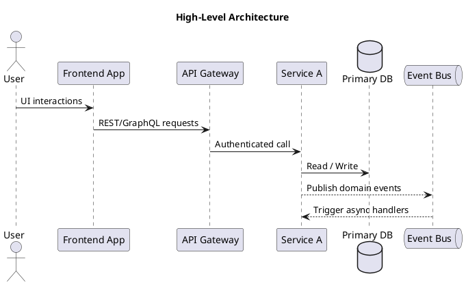
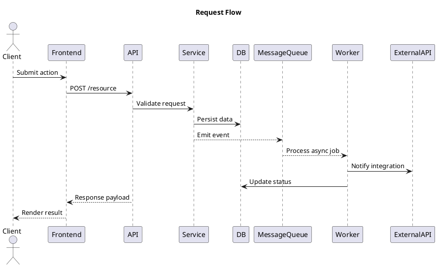
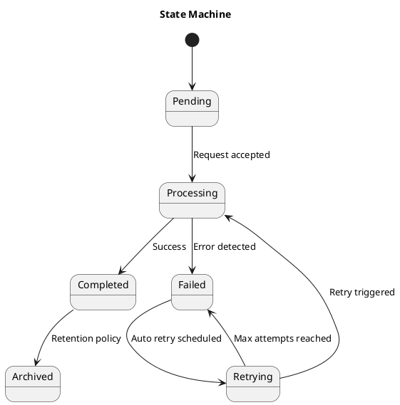
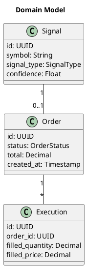

## Template

> Use this template for comprehensive software design specifications. Replace placeholder content with project-specific details and reference supporting documentation where applicable.

### Overview

- **Feature**: [Feature or project name]
- **Status**: [Draft | In Review | Approved]
- **Owner**: [Primary author or team]
- **Target Release**: [Release or milestone]
- **Summary**: [1-2 sentence overview of the design]

#### Goals

1. [Goal 1 - e.g., Provide automated signal ingestion]
2. [Goal 2 - e.g., Reduce processing latency below 1s]
3. [Goal 3 - e.g., Maintain auditability of decisions]

#### Non-Goals

- [Explicit non-goal 1 - e.g., Replacing existing data warehouse]
- [Explicit non-goal 2 - e.g., Building new UI components]

### System Architecture

**High-Level Architecture**



**Key Components**:

- [Component 1]: [Responsibility and interactions]
- [Component 2]: [Responsibility and interactions]
- [Component 3]: [Responsibility and interactions]

### Data Flow

**Request Flow**



**Notes**:

- [Note about synchronous vs asynchronous steps]
- [Note about error paths or retries]

### State Management



**State Descriptions**:

- **Pending**: [Definition]
- **Processing**: [Definition]
- **Completed**: [Definition]
- **Failed/Retrying**: [Definition]
- **Archived**: [Definition]

### Data Model



**Entity Definitions**:

- **Order**: [Purpose, key fields, constraints]
- **Signal**: [Purpose, key fields, constraints]
- **Execution**: [Purpose, key fields, constraints]

### API Specification

| Endpoint | Method | Description | Auth |
|----------|--------|-------------|------|
| `/api/v1/orders` | POST | Create new order | Required |
| `/api/v1/orders/{id}` | GET | Retrieve order details | Required |
| `/api/v1/signals` | GET | List trading signals | Optional |

**POST `/api/v1/orders`**

Request:

```json
{
  "symbol": "PETR4",
  "quantity": 100,
  "side": "BUY",
  "price": 32.5
}
```

Response:

```json
{
  "id": "3c0538b3-0d7f-4ca3-83e4-0d41dddac002",
  "status": "PENDING",
  "createdAt": "2025-10-24T12:00:00Z"
}
```

**Error Codes**:

- `400` – Validation error (`INVALID_PRICE`, `INSUFFICIENT_FUNDS`)
- `401` – Unauthorized
- `409` – Conflict (duplicate order)
- `500` – Unexpected failure (log with correlation ID)

### Technology Stack

| Layer | Choice | Version | Notes |
|-------|--------|---------|-------|
| Frontend | React + Vite | 18.x | Shared component library |
| API | Node.js + Express | 20.x | REST + WebSocket support |
| Database | TimescaleDB | 2.x | Time-series storage |
| Message Bus | RabbitMQ | 3.x | Durable queues |
| Cache | Redis | 7.x | Session + rate limiting |

### Performance Requirements

| Metric | Target | Measurement |
|--------|--------|-------------|
| Response latency (p95) | < 500 ms | Prometheus histogram |
| Throughput | 100 requests/sec sustained | k6 load test |
| Error rate | < 0.5% | SLO dashboard |

**Scalability**:

- Horizontal scaling for API (Kubernetes HPA, min 2 pods, max 10)
- Database partitioning strategy (per month, per asset)
- Queue consumers auto-scale based on backlog size

### Security Considerations

**Authentication & Authorization**:

- [Auth method - e.g., JWT with RS256]
- [Role model - e.g., Admin, Trader, Viewer]
- [Session management and expiration]

**Data Protection**:

- Encrypt data in transit (TLS 1.3)
- Encrypt sensitive fields at rest (KMS-managed keys)
- Mask PII in logs and analytics

**Security Controls**:

- [ ] Static analysis (npm run lint:security)
- [ ] Dependency scanning (GitHub Dependabot)
- [ ] Runtime protection (WAF, rate limiting)

### Error Handling

| Scenario | Detection | Recovery | User Impact |
|----------|-----------|----------|-------------|
| External API timeout | Timeout middleware | Retry with exponential backoff | Delayed response |
| Database connection loss | Connection pool errors | Failover to read replica | Minimal |
| Invalid payload | Request validation | Return 400 with details | Inform user |

**Retry Strategy**:

- Exponential backoff with jitter (1s, 2s, 4s, max 5 attempts)
- Idempotency keys for POST requests
- Dead-letter queue for failed async jobs

### Monitoring & Observability

**Metrics**:

- Request rate, latency, error rate (Prometheus)
- Queue depth, consumer lag
- Business KPIs (orders filled, signals processed)

**Logging**:

- Structured JSON logs (correlation IDs, user IDs)
- Log levels: INFO for success, WARN for recoverable errors, ERROR for failures

**Alerting**:

- Alert on error rate &gt;1% for 5 minutes
- Alert on latency p95 &gt;1s for 5 minutes
- Alert on queue backlog &gt;10k messages

**Dashboards**:

- Grafana dashboard: `TradingSystem / Orders`
- Kibana dashboard: `trading-system-logs`

### Testing Strategy

**Unit Tests**:

- Critical utilities, domain logic, validation rules
- Target coverage: 80% statements for core modules

**Integration Tests**:

- API + database interactions
- Message bus publish/consume flow
- External API integrations (mocked environments)

**End-to-End Tests**:

- User journey from signal to executed order
- Failover scenarios (simulate downstream outage)

**Performance Tests**:

- Load testing (baseline and peak)
- Soak testing (8-hour run)
- Stress testing (determine breaking point)

### Deployment Strategy

**Phases**:

1. Deploy to staging (feature flag off)
2. Run validation suite (integration + E2E)
3. Canary release to 10% traffic
4. Full rollout with monitoring

**Rollback Plan**:

- Maintain previous container image
- Toggle feature flag off
- Restore database snapshot if schema migration fails

### Dependencies

**Internal**:

- [Service A] (version constraint, API contract)
- [Shared library] (semver requirement)

**External**:

- [Third-party API] (SLAs, rate limits)
- [Identity provider] (token issuance)

### Migration Notes

**Data Migration**:

- Migration script path (`scripts/migrations/2025-10-24-add-orders.ts`)
- Backfill strategy (batch size, scheduling)
- Verification plan (row counts, checksums)

**Breaking Changes**:

- API contract changes (versioned endpoints)
- Deprecation timeline for legacy functionality

### Open Questions

1. [Outstanding decision or assumption]
2. [Dependency awaiting confirmation]
3. [Unknown about workload or requirement]

### Related Documentation

- Link to the related PRD for business context.
- Reference ADRs that influenced the design (e.g., ``../../reference/adrs/ADR-0001``).
- Add implementation guides or playbooks that support rollout.
- Include runbooks that operators should execute for this system.

### Approval

| Role | Name | Date | Status |
|------|------|------|--------|
| Architect | [Name] | YYYY-MM-DD | ✅ Approved |
| Tech Lead | [Name] | YYYY-MM-DD | ✅ Approved |
| Product Manager | [Name] | YYYY-MM-DD | ✅ Approved |
| Security | [Name] | YYYY-MM-DD | ✅ Approved |

### Change Log

| Date | Author | Changes |
|------|--------|----------|
| YYYY-MM-DD | [Name] | Initial draft |
| YYYY-MM-DD | [Name] | Updated architecture section |
| YYYY-MM-DD | [Name] | Approved for implementation |

---

**Example Usage**: Use this template for SDDs like "Order Manager Service Design", "Data Capture Service Design", "Dashboard Architecture Specification".
