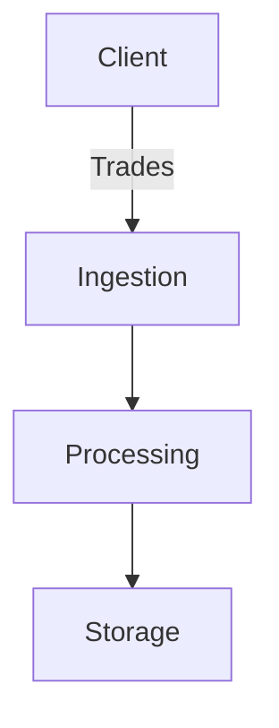

## Diagrams

Embed high-level diagrams (PlantUML or Mermaid) illustrating ingestion pipelines, queues, and
persistence layers.

## Components

Describe each component's responsibilities, dependencies, and scaling considerations.
