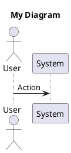

## Overview

TradingSystem uses PlantUML diagrams to visualize architecture, sequences, components, states, and deployment topology. All diagram sources are stored in `content/assets/diagrams/source/` and automatically rendered by Docusaurus.

**Total Diagrams**: 26  
**Rendering**: Automatic via @akebifiky/remark-simple-plantuml plugin  
**Source Format**: PlantUML (.puml files)  
**Organization**: Domain-based subdirectories (backend, frontend, ops, agents, adr, shared)

## Diagram Catalogue

| Diagram | Path | Domain | Type | Purpose | Owner | Update Frequency |
|---------|------|--------|------|---------|-------|------------------|
| System Architecture | assets/diagrams/source/shared/system-architecture.puml | Shared | Component | High-level system overview | DocsOps | Quarterly |
| Data Flow - Trading Pipeline | assets/diagrams/source/backend/data-flow-trading-pipeline.puml | Backend | Sequence | End-to-end trading flow | Backend Guild | On flow changes |
| Frontend Component Architecture | assets/diagrams/source/frontend/customizable-layout-component-architecture.puml | Frontend | Component | Page components and layout system | Frontend Guild | On component changes |
| Telegram Bot Configuration | assets/diagrams/source/backend/sequence-telegram-bot-configuration.puml | Backend | Sequence | Bot configuration user flows | Product & Frontend | On feature changes |
| Order Lifecycle | assets/diagrams/source/backend/state-machine-order-lifecycle.puml | Backend | State | Order states and transitions | Backend Guild | On order logic changes |
| Connection States | assets/diagrams/source/ops/state-machine-connection-states.puml | Ops | State | ProfitDLL connection states | DevOps | On integration changes |
| Deployment Architecture | assets/diagrams/source/ops/deployment-architecture.puml | Ops | Deployment | Infrastructure topology | DevOps | On deployment changes |
| Idea Bank - Component | assets/diagrams/source/backend/idea-bank-component-architecture.puml | Backend | Component | API architecture | Backend & Frontend | On API changes |
| Idea Bank - Create Sequence | assets/diagrams/source/backend/idea-bank-create-sequence.puml | Backend | Sequence | Idea creation flow | Frontend & Backend | On workflow changes |
| Idea Bank - Kanban State | assets/diagrams/source/backend/idea-bank-kanban-state.puml | Backend | State | Kanban workflow states | Frontend & Product | On status logic changes |
| TP Capital - Ingestion | assets/diagrams/source/backend/tp-capital-ingestion-sequence.puml | Backend | Sequence | Telegram to QuestDB flow | Backend & DevOps | On ingestion changes |
| Customizable Layout - Component | assets/diagrams/source/frontend/customizable-layout-component-architecture.puml | Frontend | Component | Layout system architecture | Frontend Guild | On layout changes |
| Customizable Layout - Interaction | assets/diagrams/source/frontend/customizable-layout-interaction-sequence.puml | Frontend | Sequence | User interaction flows | Frontend & UX | On interaction changes |
| Customizable Layout - State | assets/diagrams/source/frontend/customizable-layout-state-diagram.puml | Frontend | State | State management | Frontend Guild | On state logic changes |
| Firecrawl Proxy - Architecture | assets/diagrams/source/ops/firecrawl-proxy-architecture.puml | Ops | Component | Proxy architecture | DevOps & Backend | On integration changes |
| Firecrawl Proxy - Sequence | assets/diagrams/source/ops/firecrawl-proxy-sequence.puml | Ops | Sequence | Proxy interaction flow | DevOps & Backend | On integration changes |
| Database UI Tools | assets/diagrams/source/ops/database-ui-tools-architecture.puml | Ops | Component | Database UI tools architecture | Backend & DBAs | On tool changes |
| Docker Container Architecture | assets/diagrams/source/ops/docker-container-architecture.puml | Ops | Component | Container architecture | DevOps | On container changes |

## Diagram Types

**Sequence Diagrams** (9):

- Show interactions between components over time
- Use for user flows, API calls, event sequences
- Examples: Telegram ingestion, idea creation, signal consumption

**Component Diagrams** (11):

- Show system structure and relationships
- Use for architecture overviews, service dependencies
- Examples: System architecture, TP Capital ingestion pipeline

**State Machines** (4):

- Show states and transitions
- Use for lifecycle management, workflow states
- Examples: Order lifecycle, connection states, Kanban workflow

**Deployment Diagrams** (2):

- Show infrastructure and deployment topology
- Use for deployment planning, infrastructure documentation
- Examples: Deployment architecture, Docker containers

## Usage Guidelines

### Rendering Options

**Automatic Rendering** (Recommended):

- Embed .puml files in MDX pages using code blocks
- Docusaurus automatically renders via remark-simple-plantuml plugin
- No manual export needed

**Example**:

````markdown

````

**Local PlantUML Server**:

- Set `PLANTUML_BASE_URL` environment variable
- Docusaurus forwards rendering requests to local server
- Faster builds, offline support

**Manual Export** (Optional):

- Use PlantUML CLI or VSCode extension
- Export to SVG/PNG for external sharing
- Store in `docs/static/media/diagrams/`

### Diagram Conventions

**Color Coding**:

- Use consistent colors for system categories (per design system)
- Documentation: Blue #3B82F6
- Data Collection: Green #10B981
- Database: Purple #8B5CF6
- Data Analysis: Orange #F59E0B
- Risk Management: Red #EF4444
- Dashboard: Cyan #06B6D4

**Naming Conventions**:

- Use kebab-case: `order-placement-sequence.puml`
- Prefix with domain: `backend-service-map.puml`
- Version when architecture changes: `deployment-v2.puml`

**Notes and Annotations**:

- Add notes for context and rationale
- Reference related code files
- Include performance targets
- Document assumptions

### Maintenance

**Update Triggers**:

- Architecture changes (new services, removed components)
- API contract changes (new endpoints, changed flows)
- State machine updates (new states, transitions)
- Deployment topology changes (new infrastructure)

**Review Schedule**:

- Quarterly review of all diagrams
- Update when referenced code changes
- Deprecate obsolete diagrams
- Archive historical versions

**Version Control**:

- Commit .puml sources to Git
- Use descriptive commit messages
- Link commits to ADRs/PRDs when applicable
- Tag major architecture changes

## Creating New Diagrams

**Steps**:

1. Choose appropriate diagram type (sequence, component, state, deployment)
2. Use PlantUML syntax
3. Follow color coding and naming conventions
4. Add comprehensive notes with context
5. Reference related code and documentation
6. Save to appropriate domain subdirectory
7. Update this index with new entry
8. Commit with descriptive message

**Best Practices**:

- Keep diagrams simple and focused (one concept per diagram)
- Use colors sparingly (highlight key components)
- Add notes for non-obvious relationships
- Test rendering locally before committing
- Use skinparams for consistent styling

## Related Documentation

- [PlantUML Guide](../tools/documentation/plantuml/overview.mdx) - Rendering and syntax
- [Architecture Service Map](../reference/architecture/service-map.mdx)
- [ADR-0001](../reference/adrs/ADR-0001.md) - Initial ADR sample
- Diagram sources: `assets/diagrams/source/` (raw .puml files)
