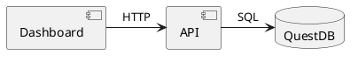

# Documentation Tooling

Documentation generation, diagramming, and API documentation tools.

## 🛠️ Tools

### Docusaurus

**Modern documentation site generator (React-based).**

- **[Overview](/tools/documentation/docusaurus/overview)** - Docusaurus v3 introduction
- **[Installation](/tools/documentation/docusaurus/install)** - Setup and configuration
- **[Configuration](/tools/documentation/docusaurus/config)** - docusaurus.config.js
- **[Commands](/tools/documentation/docusaurus/commands)** - CLI commands
- **[Troubleshooting](/tools/documentation/docusaurus/troubleshooting)** - Common issues
- **[Changelog](/tools/documentation/docusaurus/changelog)** - Version history

**Features:**
- MDX support (Markdown + React components)
- Versioning and i18n
- Full-text search (Algolia)
- Dark mode
- Plugin ecosystem

**Access:** [http://localhost:3400](http://localhost:3400)

**Quick Start:**

```bash
cd docs
npm install
npm run start -- --port 3400
```

---

### PlantUML

**Diagram generation from text (UML, architecture, flows).**

- **[Overview](/tools/documentation/plantuml/overview)** - PlantUML introduction
- **[Installation](/tools/documentation/plantuml/install)** - Setup and configuration
- **[Usage](/tools/documentation/plantuml/usage)** - Diagram types and syntax
- **[Changelog](/tools/documentation/plantuml/changelog)** - Version history

**Supported Diagrams:**
- Component diagrams (architecture)
- Sequence diagrams (workflows)
- State diagrams (state machines)
- Class diagrams (domain models)
- Deployment diagrams (infrastructure)

**Integration:**
- Docusaurus plugin (live rendering)
- VS Code extension (preview)
- CI/CD (auto-generate PNGs)

**Example:**

````markdown

````

**Location:** `docs/content/diagrams/` (PlantUML guide and examples)

---

### Redocusaurus

**OpenAPI/Swagger documentation in Docusaurus.**

- **[Overview](/tools/documentation/redocusaurus/overview)** - Redocusaurus introduction
- **[Installation](/tools/documentation/redocusaurus/install)** - Setup and configuration
- **[Configuration](/tools/documentation/redocusaurus/config)** - Spec file configuration
- **[Commands](/tools/documentation/redocusaurus/commands)** - CLI commands
- **[Changelog](/tools/documentation/redocusaurus/changelog)** - Version history

**Features:**
- Interactive API documentation
- Try-it-out requests
- Code samples (cURL, JavaScript, Python)
- Schema validation
- Embedded in Docusaurus

**Documented APIs:**
- **[Workspace API](/api/workspace)** - Workspace item management
- **[Documentation API](/api/documentation-api)** - Documentation CRUD
- **[Alert Router](/api/alert-router)** - GitHub Issues integration

**OpenAPI Specs Location:** `docs/static/specs/` (YAML files)

**Example:**

```yaml
# docs/static/specs/workspace-api.yaml
openapi: 3.0.0
info:
  title: Workspace API
  version: 1.0.0
paths:
  /api/items:
    get:
      summary: List workspace items
      responses:
        200:
          description: Success
```

**Docusaurus Config:**

```javascript
// docusaurus.config.js
presets: [
  [
    'redocusaurus',
    {
      specs: [
        {
          spec: 'static/specs/workspace-api.yaml',
          route: '/api/workspace',
        },
      ],
    },
  ],
],
```

---

## 🚀 Quick Operations

### Start Documentation Site

```bash
cd docs
npm install
npm run start -- --port 3400
```

### Build Documentation

```bash
cd docs
npm run build
```

### Generate PlantUML Diagrams

```bash
# Install PlantUML
sudo apt install plantuml

# Generate PNG from .puml
plantuml docs/content/diagrams/architecture.puml

# Generate all diagrams
find docs/content/diagrams -name "*.puml" -exec plantuml {} \;
```

### Validate OpenAPI Specs

```bash
# Install Redocly CLI
npm install -g @redocly/cli

# Validate spec
redocly lint docs/static/specs/workspace-api.yaml

# Bundle multi-file spec
redocly bundle docs/static/specs/workspace-api.yaml -o docs/static/specs/workspace-api.bundled.yaml
```

---

## 📝 Documentation Standards

### Frontmatter (Required)

All MDX files MUST include YAML frontmatter:

```yaml
---
title: Page Title
description: Brief description (1-2 sentences)
tags:
  - tag1
  - tag2
owner: GuildName
lastReviewed: '2025-10-27'
---
```

### PlantUML Guidelines

**Required for:**
- Architecture Decision Records (ADRs)
- Request for Comments (RFCs)
- Technical Specifications
- System Design Documents

**Best Practices:**
- Provide both `.puml` source and embedded rendering
- Use consistent styling (colors, fonts)
- Include legend for complex diagrams
- Test rendering in Docusaurus before commit

### API Documentation

**OpenAPI Specs:**
- Use OpenAPI 3.0.0 or later
- Include examples for all endpoints
- Document all status codes
- Provide schema definitions
- Test with Redocly CLI before commit

---

## 📖 Related Documentation

- **Governance & Validation** - Documentation quality standards (see `governance/controls/VALIDATION-GUIDE.md`)
- **Review Checklist** - Documentation review process (see `governance/controls/REVIEW-CHECKLIST.md`)
- **[Diagrams Guide](/diagrams)** - PlantUML examples and patterns
- **[API Overview](/api/overview)** - All API documentation
