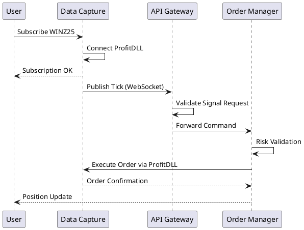
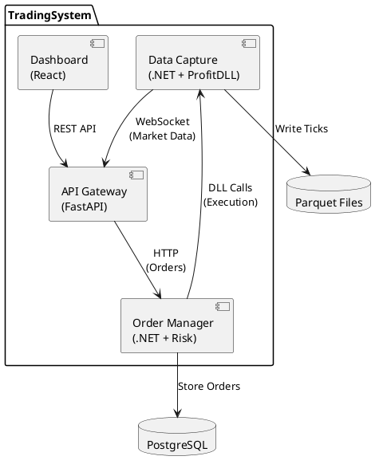
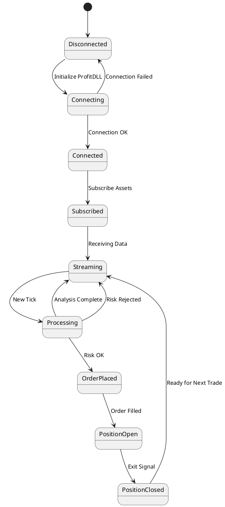
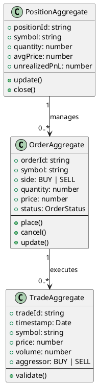

## Overview

This guide demonstrates how to render PlantUML diagrams directly in Docusaurus documentation. PlantUML is used across TradingSystem docs to visualise architecture, sequences, components, states, and class relationships.

## How It Works

PlantUML diagrams are automatically rendered using the `@akebifiky/remark-simple-plantuml` plugin. Wrap diagrams in fenced code blocks with the `plantuml` language tag and Docusaurus handles the rendering.

## Diagram Standards

- **Naming Conventions**: Use kebab-case filenames such as `order-placement-sequence.puml`; prefix with the domain (`frontend-component-architecture.puml`, `backend-service-map.puml`); version diagrams when architecture changes (e.g., `order-placement-sequence-v2.puml`).
- **Storage Locations**: Store source `.puml` files under `docs/content/assets/diagrams/source/`; embed diagrams by inlining their contents in MDX; export static images to `docs/static/media/diagrams/` when external sharing is required.
- **Review Practices**: Include diagrams in ADRs or architecture updates; refresh diagrams whenever implementation changes; review diagrams in PRs; keep each diagram focused on a single concept.

## Example: Sequence Diagram



## Example: Component Diagram



## Example: State Diagram



## Example: Class Diagram



## Using Existing .puml Files

You can embed existing `.puml` sources by copying their contents into a ` ```plantuml ` code block within the MDX file. The renderer will produce the diagram automatically during the Docusaurus build.

## Advantages

- ✅ **Automatic Rendering** — no manual SVG generation required.
- ✅ **Version Control** — `.puml` sources live in Git alongside code.
- ✅ **Easy Updates** — edit text and rebuild to refresh diagrams.
- ✅ **Consistent Style** — shared PlantUML standards across teams.
- ✅ **Documentation as Code** — diagrams ship with the documentation.

## Tips

1. Keep diagrams simple to maintain readability.
2. Use colour sparingly; rely on layout for emphasis.
3. Add notes to explain complex flows.
4. Test diagrams locally with the Docusaurus dev server.
5. Apply `skinparam` for targeted visual adjustments.

## Related Resources

- [PlantUML Official Documentation](https://plantuml.com/)
- [PlantUML Cheat Sheet](https://plantuml.com/guide)
- [All TradingSystem Diagrams](/diagrams)
