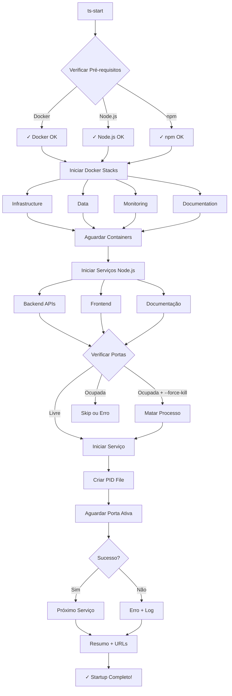

# Comando Universal de Startup - TradingSystem

## 📋 Visão Geral

O TradingSystem agora possui um **comando universal de startup** que orquestra todos os serviços necessários (Docker + Node.js) com um único comando de terminal. Este comando pode ser executado de **qualquer diretório** no sistema, tornando o desenvolvimento muito mais ágil.

## 🎯 Objetivo

Eliminar a necessidade de:

-   ❌ Abrir múltiplas abas de terminal
-   ❌ Navegar entre diretórios para iniciar serviços
-   ❌ Lembrar comandos específicos de cada serviço
-   ❌ Gerenciar portas e dependências manualmente

✅ **Agora**: Um único comando `ts-start` inicia tudo!

## 🚀 Instalação

### Passo 1: Executar Instalador

```bash
cd /home/marce/projetos/TradingSystem
bash install-shortcuts.sh
```

O instalador irá:

-   ✅ Adicionar aliases ao seu `~/.bashrc` ou `~/.zshrc`
-   ✅ Criar backup automático do arquivo de configuração
-   ✅ Verificar se os aliases já existem (idempotente)

### Passo 2: Recarregar Shell

```bash
source ~/.bashrc  # ou source ~/.zshrc
```

### Passo 3: Testar

```bash
ts-start --help
```

Se o comando funcionar, a instalação foi bem-sucedida! 🎉

## 📋 Comandos Disponíveis

### Comandos Principais

| Comando     | Alias Curto | Descrição                           |
| ----------- | ----------- | ----------------------------------- |
| `ts-start`  | `tss`       | Startup completo (Docker + Node.js) |
| `ts-stop`   | `tst`       | Para todos os serviços              |
| `ts-status` | `tsst`      | Verifica status dos serviços        |
| `ts-health` | -           | Health check completo               |
| `ts-logs`   | -           | Ver logs em tempo real              |

### Modos de Startup

| Comando             | Descrição                                  |
| ------------------- | ------------------------------------------ |
| `ts-start`          | Startup completo (Docker + Node.js)        |
| `ts-start-docker`   | Apenas containers Docker                   |
| `ts-start-services` | Apenas serviços Node.js                    |
| `ts-start-minimal`  | Modo mínimo (Dashboard + Workspace + Docs) |

### Opções Avançadas

```bash
# Force restart matando processos em portas ocupadas
ts-start --force-kill

# Pular frontend
ts-start --skip-frontend

# Pular backend
ts-start --skip-backend

# Pular documentação
ts-start --skip-docs

# Ajuda completa
ts-start --help
```

## 🎬 Exemplos de Uso

### Dia Típico de Desenvolvimento

```bash
# Manhã: Iniciar tudo
tss

# Trabalhar no projeto...

# Final do dia: Parar tudo
tst
```

### Desenvolvimento Focado

```bash
# Apenas frontend e essenciais
ts-start-minimal

# Apenas backend APIs
ts-start-services --skip-frontend

# Apenas infraestrutura Docker
ts-start-docker
```

### Troubleshooting

```bash
# Force restart quando portas estão ocupadas
ts-start --force-kill

# Ver status de tudo
ts-status

# Health check completo
ts-health

# Ver logs em tempo real
ts-logs

# Log específico
tail -f /tmp/tradingsystem-logs/workspace-api.log
```

## 📊 O Que é Iniciado

### Docker Stacks

| Stack              | Serviços                             | Portas                       |
| ------------------ | ------------------------------------ | ---------------------------- |
| **Infrastructure** | Qdrant, Redis, LangGraph             | 6333, 6379, 8111-8112        |
| **Data**           | QuestDB, TimescaleDB, pgAdmin, pgweb | 9000, 9009, 5432, 5050, 8081 |
| **Monitoring**     | Prometheus, Grafana                  | 9090, 3000                   |
| **Documentation**  | Documentation API                    | 3400                         |

### Node.js Services

| Serviço          | Porta | Descrição                          |
| ---------------- | ----- | ---------------------------------- |
| Dashboard        | 3103  | Interface principal (React + Vite) |
| Workspace API    | 3200  | API de workspace (Express)         |
| TP Capital       | 3200  | API TP Capital (Express)           |
| B3 Market Data   | 3302  | API B3 (Express)                   |
| Docusaurus       | 3004  | Documentação (Docusaurus)          |
| Service Launcher | 3500  | Orquestrador (Express)             |
| Firecrawl Proxy  | 3600  | Proxy Firecrawl (Express)          |

## 🔄 Fluxo de Execução



## 📁 Arquivos Criados

### Scripts Principais

```
TradingSystem/
├── scripts/startup/
│   ├── start-tradingsystem.sh                   # Entrypoint (wrapper de conveniência)
│   ├── start-tradingsystem-full.sh              # Orquestração completa
│   ├── start-trading-system-dev.sh              # Script legado
│   └── README.md                                # Documentação detalhada
├── scripts/install-shortcuts.sh                 # Instalador de aliases
└── docs/context/ops/
    └── universal-startup-command.md             # Este documento
```

### Aliases no `~/.bashrc`

```bash
alias ts-start='bash /home/marce/projetos/TradingSystem/scripts/startup/start-tradingsystem.sh'
alias ts-start-docker='bash /home/marce/projetos/TradingSystem/scripts/startup/start-tradingsystem.sh --docker'
alias ts-start-services='bash /home/marce/projetos/TradingSystem/scripts/startup/start-tradingsystem.sh --services'
alias ts-start-minimal='bash /home/marce/projetos/TradingSystem/scripts/startup/start-tradingsystem.sh --minimal'
alias ts-stop='bash /home/marce/projetos/TradingSystem/scripts/shutdown/stop-tradingsystem.sh'
alias ts-status='bash /home/marce/projetos/TradingSystem/scripts/healthcheck/hc-tradingsystem-status.sh --quick'
alias ts-health='bash /home/marce/projetos/TradingSystem/scripts/healthcheck/hc-tradingsystem-status.sh'
alias ts-logs='tail -f /tmp/tradingsystem-logs/*.log'

# Aliases curtos
alias tss='ts-start'
alias tst='ts-stop'
alias tsst='ts-status'
```

## 🐛 Troubleshooting

### Problema: Aliases não funcionam

**Sintoma**: `bash: ts-start: command not found`

**Solução**:

```bash
# 1. Verificar se aliases foram adicionados
grep "ts-start" ~/.bashrc

# 2. Recarregar shell
source ~/.bashrc

# 3. Testar
ts-start --help
```

### Problema: Porta ocupada

**Sintoma**: `Port 3103 already in use`

**Solução**:

```bash
# Opção 1: Force restart
ts-start --force-kill

# Opção 2: Matar processo manualmente
lsof -ti:3103 | xargs kill -9

# Opção 3: Identificar processo
lsof -i:3103
```

### Problema: Serviço não inicia

**Sintoma**: Serviço falha no startup

**Solução**:

```bash
# Ver logs
tail -n 50 /tmp/tradingsystem-logs/<service-name>.log

# Verificar dependências
cd /home/marce/projetos/TradingSystem/<service-path>
npm install

# Testar manualmente
npm run dev
```

### Problema: Docker não responde

**Sintoma**: Containers não sobem

**Solução**:

```bash
# Verificar Docker
docker ps
docker info

# Restart Docker daemon
sudo systemctl restart docker

# Limpar recursos
docker system prune -a --volumes
```

### Problema: Falta de memória

**Sintoma**: Serviços travam ou crasheam

**Solução**:

```bash
# Usar modo mínimo
ts-start-minimal

# Parar serviços desnecessários
ts-stop
ts-start-services --skip-backend

# Monitorar recursos
docker stats
htop
```

## 📊 Performance

### Tempo de Startup

| Modo          | Tempo Estimado |
| ------------- | -------------- |
| Completo      | 60-90 segundos |
| Docker Only   | 30-45 segundos |
| Services Only | 20-30 segundos |
| Minimal       | 15-20 segundos |

### Requisitos de Sistema

-   **CPU**: 4+ cores recomendado
-   **RAM**: 8GB mínimo, 16GB recomendado
-   **Disco**: SSD recomendado (melhor I/O)
-   **Network**: Porta 80 (Nginx) e portas 3000-9999 livres

## 🔐 Segurança

### Variáveis de Ambiente

O script usa o arquivo `.env` centralizado:

```bash
# Localização
/home/marce/projetos/TradingSystem/.env

# Validar configuração
bash /home/marce/projetos/TradingSystem/scripts/env/validate-env.sh
```

### Logs e Auditoria

-   **Logs Node.js**: `/tmp/tradingsystem-logs/<service-name>.log`
-   **PID Files**: `/tmp/tradingsystem-logs/<service-name>.pid`
-   **Docker Logs**: `docker logs <container_name>`

### Permissões

O instalador mantém permissões seguras:

-   ✅ Apenas leitura dos scripts (`chmod +x`)
-   ✅ Backup automático do `.bashrc`
-   ✅ Nenhuma modificação de arquivos do sistema

## 🚀 Próximos Passos

### Para Desenvolvedores

1. **Use o comando diariamente**: `tss` → trabalhe → `tst`
2. **Explore as opções**: `ts-start --help`
3. **Monitore com health checks**: `ts-health`
4. **Customize aliases**: Edite `~/.bashrc` conforme necessário

### Para Administradores

1. **Configure monitoramento**: Integre com Prometheus/Grafana
2. **Automatize backups**: Configure cron jobs
3. **Documente mudanças**: Atualize este documento
4. **Treine equipe**: Compartilhe conhecimento

## 📚 Documentação Relacionada

-   **[QUICK-START.md](../../../QUICK-START.md)** - Guia rápido de início
-   **[scripts/startup/README.md](../../../scripts/startup/README.md)** - Documentação detalhada dos scripts
-   **[Service Startup Guide](service-startup-guide.md)** - Guia de inicialização manual
-   **[Health Monitoring](health-monitoring.md)** - Monitoramento de saúde
-   **[Environment Configuration](ENVIRONMENT-CONFIGURATION.md)** - Configuração de ambiente
-   **[CLAUDE.md](../../../CLAUDE.md)** - Guia completo do projeto

## 🤝 Contribuindo

Ao adicionar novos serviços ao startup:

1. **Adicionar ao array SERVICES** em `scripts/services/start-all.sh`:

    ```bash
    ["new-service"]="path/to/service:port:npm run dev"
    ```

2. **Atualizar documentação** de portas neste documento

3. **Adicionar health check** em `scripts/maintenance/health-check-all.sh`

4. **Testar startup completo**:
    ```bash
    ts-start --force-kill
    ts-status
    ts-health
    ```

## 📄 Changelog

### 2025-10-20 - v1.0.0 (Lançamento Inicial)

-   ✅ Comando universal `ts-start` criado
-   ✅ Instalador de shortcuts (`install-shortcuts.sh`)
-   ✅ Aliases curtos (`tss`, `tst`, `tsst`)
-   ✅ Modos de startup (completo, docker, services, minimal)
-   ✅ Documentação completa
-   ✅ Integração com CLAUDE.md e README.md
-   ✅ Health checks integrados
-   ✅ Logs centralizados

---

**Pronto!** Agora você pode iniciar o TradingSystem completo com um único comando de qualquer lugar! 🎉
