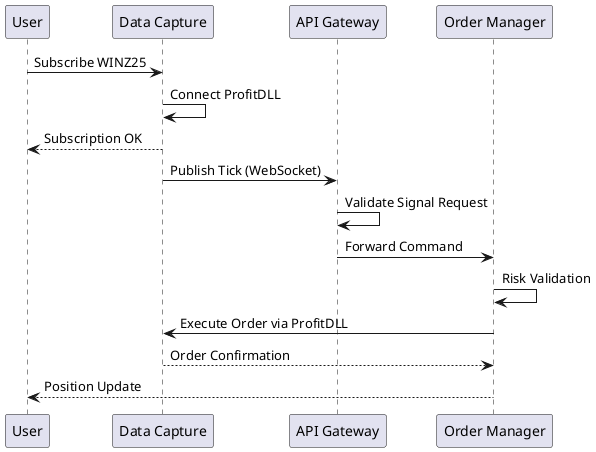
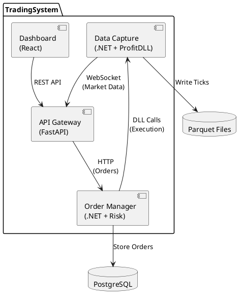
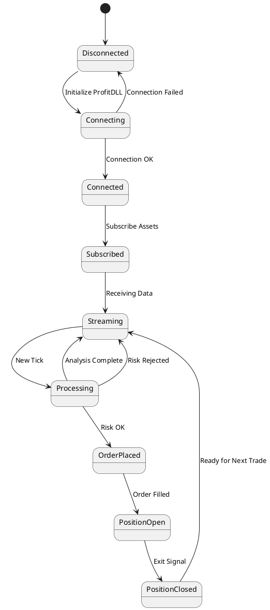
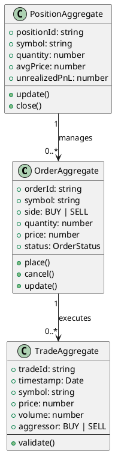

# PlantUML Rendering in Docusaurus

This guide demonstrates how to render PlantUML diagrams directly in Docusaurus documentation.

## How It Works

PlantUML diagrams are automatically rendered using the `@akebifiky/remark-simple-plantuml` plugin. Simply use code blocks with the `plantuml` language tag.

## Example: Sequence Diagram

## Example: Component Diagram

## Example: State Diagram

## Example: Class Diagram

## Using Existing .puml Files

You can also embed existing `.puml` files by copying their content into markdown code blocks:

## Advantages

✅ **Automatic Rendering**: No need to manually generate SVG files
✅ **Version Control**: Source `.puml` files tracked in Git
✅ **Easy Updates**: Just edit the text, diagram updates automatically
✅ **Consistent Style**: All diagrams follow PlantUML standards
✅ **Documentation as Code**: Diagrams live alongside the docs

## Tips

1. **Keep diagrams simple**: Complex diagrams may be hard to read
2. **Use colors sparingly**: Too many colors can be distracting
3. **Add notes**: Explain complex parts with PlantUML notes
4. **Test locally**: Run Docusaurus dev server to preview diagrams
5. **Use skinparams**: Customize appearance with PlantUML skinparams

## Related Resources

- [PlantUML Official Documentation](https://plantuml.com/)
- [PlantUML Cheat Sheet](https://plantuml.com/guide)
- [All TradingSystem Diagrams](./README.md)
