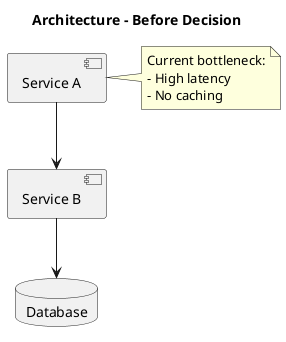
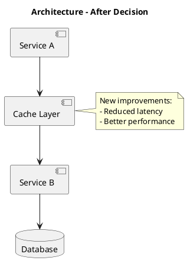

# ADR-NNNN: [Decision Title]

> Replace `ADR-0000`, placeholders, tags, and domain with real values before publishing.

## Status

[Choose one and add date]
- 📝 **Draft** - YYYY-MM-DD
- 🔄 **Proposed** - YYYY-MM-DD
- ✅ **Accepted** - YYYY-MM-DD
- ⚠️ **Deprecated** - YYYY-MM-DD (Replaced by ADR-XXXX)
- 🔁 **Superseded** - YYYY-MM-DD (See ADR-XXXX)

## Context

[Describe the context and problem statement. What is the issue we're addressing? What are the forces at play? What are the constraints?]

### Current Situation
[Describe the current state]

### Problem
[Clearly state the problem that needs solving]

### Constraints
- [Technical constraint 1]
- [Business constraint 2]
- [Time constraint 3]

## Decision

[State the decision that was made clearly and concisely. Use the present tense.]

We will [decision statement].

## Options Considered

### Option 1: [Option Name]

**Description**: [Brief description]

**Pros**:
- ✅ [Advantage 1]
- ✅ [Advantage 2]

**Cons**:
- ❌ [Disadvantage 1]
- ❌ [Disadvantage 2]

### Option 2: [Option Name]

**Description**: [Brief description]

**Pros**:
- ✅ [Advantage 1]
- ✅ [Advantage 2]

**Cons**:
- ❌ [Disadvantage 1]
- ❌ [Disadvantage 2]

### Option 3: [Option Name] (Chosen)

**Description**: [Brief description]

**Pros**:
- ✅ [Advantage 1]
- ✅ [Advantage 2]

**Cons**:
- ❌ [Disadvantage 1]
- ❌ [Disadvantage 2]

## Architecture Impact

### Before Architecture - Source
Download placeholder: `diagrams/adr-NNNN-before-architecture.puml`

### Before Architecture - Rendered

### After Architecture - Source
Download placeholder: `diagrams/adr-NNNN-after-architecture.puml`

### After Architecture - Rendered

## Consequences

### Positive Consequences
- ✅ [Benefit 1]: [Description]
- ✅ [Benefit 2]: [Description]
- ✅ [Benefit 3]: [Description]

### Negative Consequences
- ❌ [Trade-off 1]: [Description and mitigation]
- ❌ [Trade-off 2]: [Description and mitigation]

### Risks
- ⚠️ [Risk 1]: [Description and mitigation strategy]
- ⚠️ [Risk 2]: [Description and mitigation strategy]

## Implementation Notes

### Required Changes
1. [Change 1 in component X]
2. [Change 2 in component Y]
3. [Change 3 in component Z]

### Migration Path
[If this decision requires migration from existing system]

1. **Phase 1**: [Description]
2. **Phase 2**: [Description]
3. **Phase 3**: [Description]

### Rollback Strategy
[How to revert if needed]

## Metrics & Monitoring

### Success Criteria
- [ ] [Metric 1]: Target value
- [ ] [Metric 2]: Target value
- [ ] [Metric 3]: Target value

### Monitoring
- [What to monitor]
- [Alert thresholds]
- [Dashboard location]

## Related

### Related ADRs
- ADR reference placeholder: `ADR-XXXX: Related Decision`
- ADR reference placeholder: `ADR-YYYY: Another Related Decision`

### Related Documentation
- Related spec placeholder: `guides/spec-name.md`
- Related guide placeholder: `guides/guide-name.md`
- Related API placeholder: `references/api-name.md`

### References
- [External Reference 1](https://example.com)
- [External Reference 2](https://example.com)

---

## Change Log

| Date | Author | Changes |
|------|--------|---------|
| YYYY-MM-DD | [Name] | Initial draft |
| YYYY-MM-DD | [Name] | Accepted after review |
