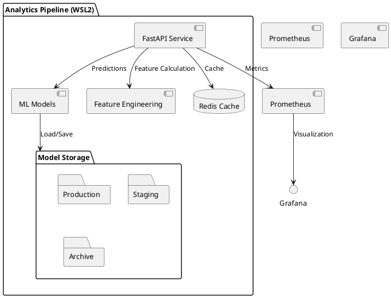

> **Status Update (2025-10-18):** O pipeline de Analytics foi descontinuado; esta proposta permanece arquivada para referência histórica.

# FastAPI Implementation Design

## Architecture Overview

### Service Architecture


## Design Decisions

### 1. WSL2 Container Configuration

#### Decision
Optimize container configuration for WSL2 environment:

```yaml
version: '3.8'
services:
  analytics-api:
    deploy:
      resources:
        limits:
          cpus: '4'
          memory: 8G
        reservations:
          cpus: '2'
          memory: 4G
    environment:
      - WATCHPACK_POLLING=true
      - CHOKIDAR_USEPOLLING=true
    volumes:
      - type: bind
        source: ./app
        target: /app
        consistency: cached
```

#### Rationale
- Optimized for WSL2 environment
- Resource limits set for stability
- Proper volume mounting for development
- Performance optimizations enabled

### 2. Model Storage and Versioning

#### Decision
Implement structured model storage within container:

```python
class ModelManager:
    def __init__(self, base_path="/app/models"):
        self.production_path = f"{base_path}/production"
        self.staging_path = f"{base_path}/staging"
        self.archive_path = f"{base_path}/archive"

    async def save_model(self, model, version, metadata):
        path = f"{self.production_path}/v{version}"
        os.makedirs(path, exist_ok=True)
        await self._save_model_files(model, path, metadata)

    async def archive_model(self, version):
        src = f"{self.production_path}/v{version}"
        dst = f"{self.archive_path}/v{version}"
        await self._move_model(src, dst)
```

#### Rationale
- Clear separation of model versions
- Easy backup and restore
- Version tracking
- Clean promotion path

### 3. Performance Optimization

#### Decision
Implement multi-layer caching strategy:

```python
from fastapi_cache import FastAPICache
from fastapi_cache.backends.redis import RedisBackend

@app.on_event("startup")
async def configure_cache():
    redis = aioredis.from_url(
        "redis://redis:6379",
        encoding="utf8",
        decode_responses=True
    )
    FastAPICache.init(RedisBackend(redis))

@app.get("/predict/{model_id}")
@cache(expire=60)
async def predict(model_id: str, data: PredictionRequest):
    return await ml_engine.predict(model_id, data)
```

#### Rationale
- Redis for fast data access
- Caching for frequent predictions
- Async operations for better performance

### 4. Backup Strategy

#### Decision
Implement automated backup system:

```bash
#!/bin/bash
BACKUP_DIR="/backup/models"
TIMESTAMP=$(date +%Y%m%d_%H%M%S)

# Backup models
tar -czf "$BACKUP_DIR/models_$TIMESTAMP.tar.gz" /app/models/production

# Backup Redis
redis-cli save
cp /data/dump.rdb "$BACKUP_DIR/redis_$TIMESTAMP.rdb"

# Cleanup old backups
find $BACKUP_DIR -name "models_*.tar.gz" -mtime +7 -delete
find $BACKUP_DIR -name "redis_*.rdb" -mtime +7 -delete
```

#### Rationale
- Regular automated backups
- Version history maintained
- Easy recovery process
- Automatic cleanup

### 5. Error Handling

#### Decision
Implement centralized error handling:

```python
from fastapi import HTTPException
from starlette.status import HTTP_422_UNPROCESSABLE_ENTITY

class ModelPredictionError(HTTPException):
    def __init__(self, detail: str):
        super().__init__(
            status_code=HTTP_422_UNPROCESSABLE_ENTITY,
            detail=detail
        )

@app.exception_handler(ModelPredictionError)
async def prediction_error_handler(request, exc):
    return JSONResponse(
        status_code=exc.status_code,
        content={"error": exc.detail}
    )
```

#### Rationale
- Consistent error responses
- Clear error categorization
- Proper HTTP status codes

## Performance Considerations

1. Async Processing
   - Use asyncio for I/O operations
   - Implement connection pooling
   - Buffer predictions when possible

2. Resource Management
   - Monitor memory usage
   - Implement proper cleanup
   - Handle cache invalidation

3. WSL2 Optimizations
   - Use cached volume mounts
   - Enable polling for file watching
   - Optimize network settings

## Security Considerations

1. Input Validation
   - Strict Pydantic models
   - Request size limits
   - Input sanitization

2. Resource Protection
   - Rate limiting
   - Request timeout
   - Memory limits

3. Monitoring
   - Error tracking
   - Resource usage
   - Performance metrics

## Integration Points

1. Metrics Export
   - Prometheus metrics
   - Custom ML metrics
   - Performance tracking

2. Logging
   - Structured JSON logs
   - Correlation IDs
   - Log levels

3. Health Checks
   - Model availability
   - Cache connection
   - Resource status