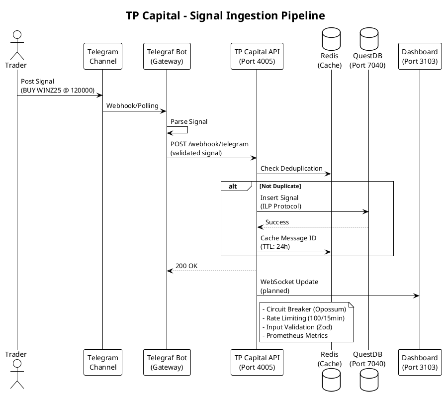

# TP Capital API - Detailed Reference

> **Telegram signal ingestion pipeline** with QuestDB persistence
> **Last Updated:** 2025-11-05

## Overview

**Purpose:** Ingest trading signals from Telegram channels and persist to QuestDB

**Location:** `apps/tp-capital/`
**Port:** 4005
**Database:** QuestDB (HTTP: 7040, ILP: 7039)
**Technology:** Express.js + Telegraf + QuestDB + Redis

## Architecture Diagram



## API Endpoints

| Method | Endpoint | Description | Auth |
|--------|----------|-------------|------|
| POST | `/webhook/telegram` | Telegram webhook receiver | API Key |
| GET | `/api/signals` | List signals | Optional |
| GET | `/api/signals/:id` | Get signal by ID | Optional |
| DELETE | `/api/signals/:id` | Delete signal | API Key |
| GET | `/health` | Health check | None |
| GET | `/metrics` | Prometheus metrics | None |

## Signal Schema

```typescript
interface TradingSignal {
  id: string;
  symbol: string;              // e.g., "WINZ25"
  direction: "BUY" | "SELL";
  entryPrice: number;
  stopLoss?: number;
  takeProfit?: number;
  timestamp: string;           // ISO 8601
  source: string;              // "telegram"
  channelId: string;
  messageId: number;
  confidence?: number;
}
```

## QuestDB Schema

```sql
CREATE TABLE tp_capital_signals (
  id SYMBOL,
  symbol SYMBOL INDEX,
  direction SYMBOL,
  entry_price DOUBLE,
  stop_loss DOUBLE,
  take_profit DOUBLE,
  source SYMBOL,
  channel_id SYMBOL,
  message_id LONG,
  confidence DOUBLE,
  timestamp TIMESTAMP
) TIMESTAMP(timestamp) PARTITION BY DAY;
```

## Key Features

### 1. Circuit Breaker (Opossum)

```javascript
import CircuitBreaker from 'opossum';

const writeBreaker = new CircuitBreaker(writeToQuestDB, {
  timeout: 3000,
  errorThresholdPercentage: 50,
  resetTimeout: 30000
});

writeBreaker.fallback(() => ({ error: 'Service unavailable' }));
writeBreaker.on('open', () => logger.error('Circuit breaker opened!'));
```

### 2. Redis Deduplication

```javascript
async function isDuplicate(messageId) {
  const key = `signal:dedup:${messageId}`;
  const exists = await redis.exists(key);
  if (!exists) {
    await redis.setex(key, 86400, '1'); // 24h TTL
  }
  return exists;
}
```

### 3. ILP Protocol (InfluxDB Line Protocol)

```javascript
function formatSignalForILP(signal) {
  return `tp_capital_signals,symbol=${signal.symbol},direction=${signal.direction} entry_price=${signal.entryPrice},timestamp=${Date.now() * 1000000}`;
}

// Send via TCP
socket.write(formatSignalForILP(signal) + '\n');
```

## Prometheus Metrics

```javascript
const messagesProcessed = new promClient.Counter({
  name: 'tp_capital_messages_processed_total',
  help: 'Total messages processed'
});

const signalsIngested = new promClient.Counter({
  name: 'tp_capital_signals_ingested_total',
  help: 'Total signals successfully ingested',
  labelNames: ['symbol', 'direction']
});

const ingestDuration = new promClient.Histogram({
  name: 'tp_capital_ingest_duration_seconds',
  help: 'Signal ingestion duration in seconds'
});
```

## Testing

```javascript
describe('Signal Parsing', () => {
  it('should parse BUY signal', () => {
    const input = 'BUY WINZ25 @ 120000 SL: 119500 TP: 121000';
    const result = parseSignal(input);
    expect(result.direction).toBe('BUY');
    expect(result.symbol).toBe('WINZ25');
    expect(result.entryPrice).toBe(120000);
  });
});
```

## Troubleshooting

**QuestDB connection failed:**
```bash
# Test ILP port
echo "test,tag=value field=1 $(date +%s)000000000" | nc localhost 7039

# Check HTTP API
curl http://localhost:7040/exec?query=SELECT%20*%20FROM%20tp_capital_signals%20LIMIT%201
```

**Telegram webhook not working:**
```bash
# Set webhook
curl -X POST https://api.telegram.org/bot${BOT_TOKEN}/setWebhook \
  -d "url=https://yourdomain.com/webhook/telegram"

# Check webhook info
curl https://api.telegram.org/bot${BOT_TOKEN}/getWebhookInfo
```

## Additional Resources

- **Source Code:** [apps/tp-capital/](../../apps/tp-capital/)
- **QuestDB Docs:** https://questdb.io/docs/
- **Telegraf Docs:** https://telegraf.js.org/
