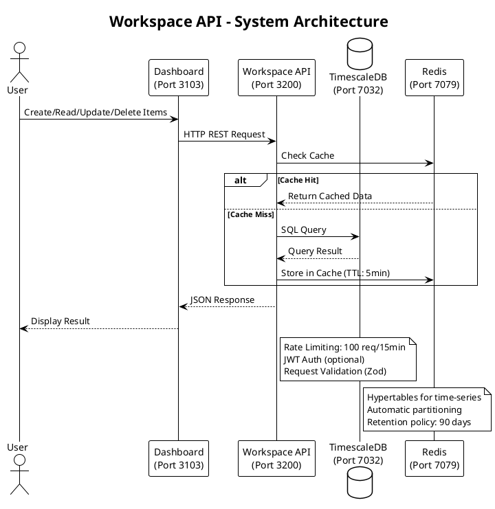
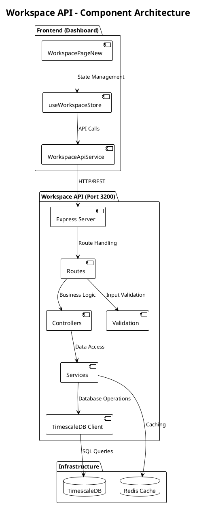

# Workspace API - Detailed Reference

> **Complete implementation guide** for the Workspace API service
> **Last Updated:** 2025-11-05

## Overview

**Purpose:** Item management system with TimescaleDB persistence for collaborative workspace

**Location:** `apps/workspace/`
**Port:** 3200 (backend API) / 3900 (standalone UI - optional)
**Database:** TimescaleDB (port 7032)
**Technology:** Express.js + TypeScript + React (UI)

## Architecture

### System Architecture Diagram



### Component Diagram



## API Endpoints

### Base URL

```
Development: http://localhost:3200/api/workspace
Production:  https://api.tradingsystem.local/api/workspace
```

### Endpoints Overview

| Method | Endpoint | Description | Auth |
|--------|----------|-------------|------|
| GET | `/items` | List all workspace items | Optional |
| GET | `/items/:id` | Get item by ID | Optional |
| POST | `/items` | Create new item | Optional |
| PUT | `/items/:id` | Update item | Optional |
| DELETE | `/items/:id` | Delete item | Optional |
| GET | `/health` | Health check | None |

---

### GET /items - List All Items

**Description:** Retrieve all workspace items with optional filtering

**Request:**
```http
GET /api/workspace/items
Accept: application/json
```

**Query Parameters:**
```typescript
interface QueryParams {
  category?: ItemCategory;      // Filter by category
  priority?: ItemPriority;      // Filter by priority
  status?: ItemStatus;          // Filter by status
  tags?: string;                // Comma-separated tags
  limit?: number;               // Pagination limit (default: 100)
  offset?: number;              // Pagination offset (default: 0)
}
```

**Response (200 OK):**
```json
{
  "success": true,
  "data": [
    {
      "id": "550e8400-e29b-41d4-a716-446655440000",
      "title": "Implement RAG search",
      "description": "Add semantic search to documentation using LlamaIndex",
      "category": "documentacao",
      "priority": "high",
      "status": "in-progress",
      "tags": ["rag", "search", "ai"],
      "createdAt": "2025-11-05T10:00:00Z",
      "updatedAt": "2025-11-05T12:30:00Z"
    }
  ],
  "count": 42
}
```

**Error Response (500):**
```json
{
  "success": false,
  "error": "Database connection failed",
  "message": "Unable to retrieve items"
}
```

**Example (curl):**
```bash
# Get all items
curl http://localhost:3200/api/workspace/items

# Filter by category and priority
curl "http://localhost:3200/api/workspace/items?category=documentacao&priority=high"

# Pagination
curl "http://localhost:3200/api/workspace/items?limit=20&offset=40"
```

**Example (TypeScript):**
```typescript
import { workspaceApi } from '@/services/workspaceApi';

const response = await workspaceApi.getAllItems();
if (response.success) {
  console.log(`Found ${response.count} items`);
  response.data?.forEach(item => {
    console.log(`- ${item.title} (${item.status})`);
  });
}
```

---

### GET /items/:id - Get Item by ID

**Description:** Retrieve a specific workspace item

**Request:**
```http
GET /api/workspace/items/550e8400-e29b-41d4-a716-446655440000
Accept: application/json
```

**Response (200 OK):**
```json
{
  "success": true,
  "data": {
    "id": "550e8400-e29b-41d4-a716-446655440000",
    "title": "Implement RAG search",
    "description": "Add semantic search to documentation using LlamaIndex",
    "category": "documentacao",
    "priority": "high",
    "status": "in-progress",
    "tags": ["rag", "search", "ai"],
    "createdAt": "2025-11-05T10:00:00Z",
    "updatedAt": "2025-11-05T12:30:00Z"
  }
}
```

**Error Response (404):**
```json
{
  "success": false,
  "error": "Item not found",
  "message": "No item found with ID: 550e8400-e29b-41d4-a716-446655440000"
}
```

**Example (TypeScript):**
```typescript
try {
  const response = await workspaceApi.getItemById('550e8400-...');
  if (response.success && response.data) {
    console.log(`Item: ${response.data.title}`);
  }
} catch (error) {
  console.error('Failed to fetch item:', error);
}
```

---

### POST /items - Create Item

**Description:** Create a new workspace item

**Request:**
```http
POST /api/workspace/items
Content-Type: application/json
```

**Request Body:**
```typescript
interface CreateItemPayload {
  title: string;              // Required, 1-200 chars
  description: string;        // Required, 1-2000 chars
  category: ItemCategory;     // Required
  priority: ItemPriority;     // Required
  tags?: string[];            // Optional, max 10 tags
}
```

**Example Request:**
```json
{
  "title": "Implement WebSocket real-time updates",
  "description": "Add WebSocket support for real-time item updates across all connected clients",
  "category": "dashboard",
  "priority": "medium",
  "tags": ["websocket", "realtime", "frontend"]
}
```

**Response (201 Created):**
```json
{
  "success": true,
  "data": {
    "id": "generated-uuid",
    "title": "Implement WebSocket real-time updates",
    "description": "Add WebSocket support for real-time item updates across all connected clients",
    "category": "dashboard",
    "priority": "medium",
    "status": "new",
    "tags": ["websocket", "realtime", "frontend"],
    "createdAt": "2025-11-05T14:00:00Z"
  },
  "message": "Item created successfully"
}
```

**Validation Errors (400):**
```json
{
  "success": false,
  "errors": [
    {
      "msg": "Title is required",
      "param": "title",
      "location": "body"
    },
    {
      "msg": "Invalid category",
      "param": "category",
      "location": "body"
    }
  ]
}
```

**Example (TypeScript):**
```typescript
const newItem = {
  title: 'Implement WebSocket real-time updates',
  description: 'Add WebSocket support for real-time item updates',
  category: 'dashboard' as const,
  priority: 'medium' as const,
  tags: ['websocket', 'realtime']
};

const response = await workspaceApi.createItem(newItem);
if (response.success) {
  console.log(`Created item: ${response.data?.id}`);
}
```

---

### PUT /items/:id - Update Item

**Description:** Update an existing workspace item

**Request:**
```http
PUT /api/workspace/items/550e8400-e29b-41d4-a716-446655440000
Content-Type: application/json
```

**Request Body (all fields optional):**
```typescript
interface UpdateItemPayload {
  title?: string;
  description?: string;
  category?: ItemCategory;
  priority?: ItemPriority;
  status?: ItemStatus;
  tags?: string[];
}
```

**Example Request:**
```json
{
  "status": "completed",
  "priority": "low"
}
```

**Response (200 OK):**
```json
{
  "success": true,
  "data": {
    "id": "550e8400-e29b-41d4-a716-446655440000",
    "title": "Implement RAG search",
    "description": "Add semantic search to documentation using LlamaIndex",
    "category": "documentacao",
    "priority": "low",
    "status": "completed",
    "tags": ["rag", "search", "ai"],
    "createdAt": "2025-11-05T10:00:00Z",
    "updatedAt": "2025-11-05T15:45:00Z"
  },
  "message": "Item updated successfully"
}
```

**Example (TypeScript):**
```typescript
await workspaceApi.updateItem('550e8400-...', {
  status: 'completed',
  priority: 'low'
});
```

---

### DELETE /items/:id - Delete Item

**Description:** Delete a workspace item (soft delete with archive)

**Request:**
```http
DELETE /api/workspace/items/550e8400-e29b-41d4-a716-446655440000
```

**Response (200 OK):**
```json
{
  "success": true,
  "data": {
    "id": "550e8400-e29b-41d4-a716-446655440000",
    "title": "Implement RAG search",
    "status": "archived"
  },
  "message": "Item deleted successfully"
}
```

**Example (TypeScript):**
```typescript
await workspaceApi.deleteItem('550e8400-...');
```

---

### GET /health - Health Check

**Description:** Service health check

**Request:**
```http
GET /api/workspace/health
```

**Response (200 OK):**
```json
{
  "status": "healthy",
  "timestamp": "2025-11-05T16:00:00Z",
  "service": "workspace-api",
  "version": "1.0.0",
  "dependencies": {
    "timescaledb": "connected",
    "redis": "connected"
  }
}
```

## Data Models

### TypeScript Types

**Location:** `apps/workspace/src/services/workspaceApi.ts`

```typescript
export interface WorkspaceItem {
  id: string;                    // UUID v4
  title: string;                 // 1-200 characters
  description: string;           // 1-2000 characters
  category: WorkspaceCategory;   // Enum
  priority: WorkspacePriority;   // Enum
  status: WorkspaceStatus;       // Enum
  tags: string[];                // Array of strings (max 10)
  createdAt: string;             // ISO 8601 timestamp
  updatedAt?: string;            // ISO 8601 timestamp (optional)
}

export type WorkspaceCategory =
  | 'documentacao'
  | 'coleta-dados'
  | 'banco-dados'
  | 'analise-dados'
  | 'gestao-riscos'
  | 'dashboard';

export type WorkspacePriority = 'low' | 'medium' | 'high' | 'critical';

export type WorkspaceStatus = 'new' | 'review' | 'in-progress' | 'completed' | 'rejected';
```

### Database Schema (TimescaleDB)

**Table:** `workspace_items`

```sql
CREATE TABLE workspace_items (
  id UUID PRIMARY KEY DEFAULT gen_random_uuid(),
  title VARCHAR(200) NOT NULL,
  description TEXT NOT NULL,
  category VARCHAR(50) NOT NULL CHECK (category IN (
    'documentacao',
    'coleta-dados',
    'banco-dados',
    'analise-dados',
    'gestao-riscos',
    'dashboard'
  )),
  priority VARCHAR(20) NOT NULL CHECK (priority IN ('low', 'medium', 'high', 'critical')),
  status VARCHAR(20) NOT NULL DEFAULT 'new' CHECK (status IN (
    'new',
    'review',
    'in-progress',
    'completed',
    'rejected'
  )),
  tags TEXT[] DEFAULT '{}',
  created_at TIMESTAMPTZ NOT NULL DEFAULT NOW(),
  updated_at TIMESTAMPTZ,
  archived_at TIMESTAMPTZ
);

-- Convert to hypertable for time-series optimization
SELECT create_hypertable('workspace_items', 'created_at');

-- Indexes for performance
CREATE INDEX idx_workspace_items_category ON workspace_items(category);
CREATE INDEX idx_workspace_items_priority ON workspace_items(priority);
CREATE INDEX idx_workspace_items_status ON workspace_items(status);
CREATE INDEX idx_workspace_items_tags ON workspace_items USING GIN(tags);
CREATE INDEX idx_workspace_items_created_at ON workspace_items(created_at DESC);

-- Retention policy (delete items older than 1 year)
SELECT add_retention_policy('workspace_items', INTERVAL '1 year');
```

## Frontend Integration

### React Component

**Location:** `apps/workspace/src/components/workspace/WorkspaceView.tsx`

```typescript
import { useState, useEffect } from 'react';
import { workspaceApi, type WorkspaceItem } from '@/services/workspaceApi';
import { useWorkspaceStore } from './store/useWorkspaceStore';

export function WorkspaceView() {
  const { items, loading, error, fetchItems, addItem } = useWorkspaceStore();

  useEffect(() => {
    fetchItems();
  }, [fetchItems]);

  const handleCreate = async (data: CreateItemPayload) => {
    try {
      await addItem(data);
      // Item automatically added to store
    } catch (error) {
      console.error('Failed to create item:', error);
    }
  };

  if (loading) return <LoadingSpinner />;
  if (error) return <ErrorMessage error={error} />;

  return (
    <div>
      <ItemList items={items} />
      <CreateItemForm onSubmit={handleCreate} />
    </div>
  );
}
```

### Zustand Store

**Location:** `apps/workspace/src/components/workspace/store/useWorkspaceStore.ts`

```typescript
import { create } from 'zustand';
import { workspaceApi, type WorkspaceItem } from '@/services/workspaceApi';

interface WorkspaceStore {
  items: WorkspaceItem[];
  loading: boolean;
  error: string | null;
  fetchItems: () => Promise<void>;
  addItem: (payload: CreateItemPayload) => Promise<void>;
  updateItem: (id: string, payload: UpdateItemPayload) => Promise<void>;
  deleteItem: (id: string) => Promise<void>;
}

export const useWorkspaceStore = create<WorkspaceStore>((set, get) => ({
  items: [],
  loading: false,
  error: null,

  fetchItems: async () => {
    set({ loading: true, error: null });
    try {
      const response = await workspaceApi.getAllItems();
      if (response.success && response.data) {
        set({ items: response.data, loading: false });
      }
    } catch (error) {
      set({ error: error.message, loading: false });
    }
  },

  addItem: async (payload) => {
    const response = await workspaceApi.createItem(payload);
    if (response.success && response.data) {
      set({ items: [...get().items, response.data] });
    }
  },

  updateItem: async (id, payload) => {
    const response = await workspaceApi.updateItem(id, payload);
    if (response.success && response.data) {
      set({
        items: get().items.map(item =>
          item.id === id ? response.data! : item
        )
      });
    }
  },

  deleteItem: async (id) => {
    await workspaceApi.deleteItem(id);
    set({ items: get().items.filter(item => item.id !== id) });
  }
}));
```

## Performance Optimization

### Caching Strategy

**Redis Cache (TTL: 5 minutes):**
```typescript
// Backend caching example
import Redis from 'ioredis';

const redis = new Redis({
  host: process.env.REDIS_HOST,
  port: parseInt(process.env.REDIS_PORT || '7079')
});

async function getItems() {
  const cacheKey = 'workspace:items:all';

  // Check cache
  const cached = await redis.get(cacheKey);
  if (cached) {
    return JSON.parse(cached);
  }

  // Query database
  const items = await db.query('SELECT * FROM workspace_items');

  // Store in cache (5 minutes TTL)
  await redis.setex(cacheKey, 300, JSON.stringify(items));

  return items;
}
```

### Pagination

```typescript
// Frontend pagination with TanStack Query
import { useInfiniteQuery } from '@tanstack/react-query';

function useInfiniteItems() {
  return useInfiniteQuery({
    queryKey: ['workspace', 'items'],
    queryFn: ({ pageParam = 0 }) =>
      workspaceApi.getItems({ limit: 20, offset: pageParam }),
    getNextPageParam: (lastPage, pages) =>
      lastPage.data.length === 20 ? pages.length * 20 : undefined
  });
}
```

## Testing

### Unit Tests

**Location:** `apps/workspace/src/__tests__/workspaceApi.test.ts`

```typescript
import { describe, it, expect, vi } from 'vitest';
import axios from 'axios';
import WorkspaceApiService from '@/services/workspaceApi';

vi.mock('axios');

describe('WorkspaceApiService', () => {
  const api = new WorkspaceApiService();

  it('should fetch all items', async () => {
    const mockData = {
      success: true,
      data: [{ id: '1', title: 'Test Item' }],
      count: 1
    };

    vi.mocked(axios.create).mockReturnValue({
      get: vi.fn().mockResolvedValue({ data: mockData })
    } as any);

    const response = await api.getAllItems();
    expect(response.success).toBe(true);
    expect(response.data).toHaveLength(1);
  });

  it('should handle errors gracefully', async () => {
    vi.mocked(axios.create).mockReturnValue({
      get: vi.fn().mockRejectedValue(new Error('Network error'))
    } as any);

    await expect(api.getAllItems()).rejects.toThrow('Network error');
  });
});
```

### Integration Tests

```typescript
import { describe, it, expect, beforeAll, afterAll } from 'vitest';
import request from 'supertest';
import app from '../server';
import { setupTestDatabase, teardownTestDatabase } from './helpers';

describe('Workspace API Integration', () => {
  beforeAll(async () => {
    await setupTestDatabase();
  });

  afterAll(async () => {
    await teardownTestDatabase();
  });

  it('POST /items should create item', async () => {
    const payload = {
      title: 'Test Item',
      description: 'Test Description',
      category: 'documentacao',
      priority: 'medium'
    };

    const response = await request(app)
      .post('/api/workspace/items')
      .send(payload)
      .expect(201);

    expect(response.body.success).toBe(true);
    expect(response.body.data).toHaveProperty('id');
    expect(response.body.data.title).toBe('Test Item');
  });
});
```

## Monitoring & Observability

### Prometheus Metrics

```typescript
import promClient from 'prom-client';

const httpRequestDuration = new promClient.Histogram({
  name: 'workspace_api_http_request_duration_seconds',
  help: 'Duration of HTTP requests in seconds',
  labelNames: ['method', 'route', 'status_code']
});

const itemsCreated = new promClient.Counter({
  name: 'workspace_api_items_created_total',
  help: 'Total number of items created'
});

// Middleware
app.use((req, res, next) => {
  const start = Date.now();
  res.on('finish', () => {
    const duration = (Date.now() - start) / 1000;
    httpRequestDuration
      .labels(req.method, req.route?.path || req.path, res.statusCode)
      .observe(duration);
  });
  next();
});

// Increment counter on item creation
itemsCreated.inc();
```

### Grafana Dashboard

**Query examples:**
```promql
# Request rate
rate(workspace_api_http_request_duration_seconds_count[5m])

# Average response time
rate(workspace_api_http_request_duration_seconds_sum[5m]) /
rate(workspace_api_http_request_duration_seconds_count[5m])

# Items created per minute
rate(workspace_api_items_created_total[1m])
```

## Troubleshooting

### Common Issues

**1. Port 3200 already in use:**
```bash
# Find and kill process
lsof -ti:3200 | xargs kill -9

# Or use npm script
npm run kill-port -- 3200
```

**2. TimescaleDB connection refused:**
```bash
# Check container status
docker ps | grep timescaledb

# View logs
docker logs timescaledb

# Test connection
psql -h localhost -p 7032 -U postgres -d trading_system
```

**3. Items not appearing after creation:**
- Check Redis cache (clear if stale)
- Verify database connection
- Check browser console for API errors
- Inspect network tab in DevTools

**4. Slow queries:**
```sql
-- Check query performance
EXPLAIN ANALYZE
SELECT * FROM workspace_items
WHERE category = 'documentacao'
ORDER BY created_at DESC LIMIT 20;

-- Missing indexes?
SELECT * FROM pg_indexes WHERE tablename = 'workspace_items';
```

## Additional Resources

- **API Specification (OpenAPI):** http://localhost:3404/api/workspace
- **Source Code:** [apps/workspace/](../../apps/workspace/)
- **Frontend Components:** [apps/workspace/src/components/workspace/](../../apps/workspace/src/components/workspace/)
- **Database Schema:** [docs/content/database/schema.mdx](../../docs/content/database/schema.mdx)
- **Architecture Review:** [governance/evidence/reports/reviews/architecture-2025-11-01/](../../governance/evidence/reports/reviews/architecture-2025-11-01/)
