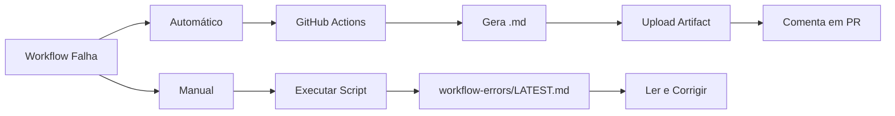

# 🚀 Guia Rápido: Receber Logs de Erros em Arquivo .md

**Objetivo:** Receber TODOS os logs de erros de workflows do GitHub Actions consolidados em um único arquivo `.md`

---

## ⚡ Setup Inicial (Uma Vez)

```bash
# 1. Instalar GitHub CLI
sudo apt install gh

# 2. Autenticar
gh auth login

# 3. Verificar instalação
gh auth status
```

✅ **Pronto!** Agora você pode usar o sistema.

---

## 📊 Uso Diário

### **Opção 1: Relatório Individual (Recomendado)**

```bash
# Gerar relatório com últimas 10 falhas
bash scripts/github/collect-workflow-errors.sh

# Ver relatório
cat workflow-errors/LATEST.md
```

**Output:** Um arquivo `.md` completo com:
- ✅ Resumo executivo (tabela)
- ✅ Logs de erro de cada workflow
- ✅ Comandos para reproduzir
- ✅ Soluções sugeridas
- ✅ Links para documentação

---

### **Opção 2: Relatório Consolidado (Análise de Tendências)**

```bash
# Consolidar múltiplos relatórios
bash scripts/github/consolidate-error-reports.sh

# Ver consolidado
cat workflow-errors/CONSOLIDATED-LATEST.md
```

**Output:** Um arquivo `.md` com:
- ✅ Estatísticas de workflows que mais falharam
- ✅ Erros mais comuns
- ✅ Todos os relatórios em collapsible sections
- ✅ Recomendações de ação

---

### **Opção 3: Automático (GitHub Actions)**

**NADA A FAZER!** O sistema já está configurado para:

1. ✅ Gerar relatório automaticamente quando workflow falha
2. ✅ Upload como artifact (disponível por 90 dias)
3. ✅ Comentar em PRs com resumo de erros
4. ✅ Criar issue se houver > 5 falhas recentes

**Download do artifact:**
```
GitHub → Actions → Error Report Generator → Artifacts → Download
```

---

## 📁 Onde Ficam os Relatórios?

```
workflow-errors/
├── ERROR-REPORT-20250108-143052.md    # ← Seu relatório aqui
├── LATEST.md                          # ← Link para último
└── CONSOLIDATED-LATEST.md             # ← Consolidado
```

**Ver último relatório:**
```bash
cat workflow-errors/LATEST.md
```

**Abrir no editor:**
```bash
code workflow-errors/LATEST.md
```

---

## 🎯 Exemplo de Relatório Gerado

```markdown
# 🚨 GitHub Actions - Relatório de Erros

**Gerado em:** 2025-01-08 14:30:52
**Total de Falhas:** 3

## 📊 Resumo Executivo

| Workflow      | Branch | Status |
|---------------|--------|--------|
| Code Quality  | main   | ❌     |
| Bundle Size   | main   | ❌     |
| Tests         | PR#42  | ❌     |

## 🔍 Detalhes dos Erros

### 🔴 Code Quality

**Run ID:** `1234567890`
**Commit:** `abc1234`

#### 📋 Logs de Erro:
```
error TS2304: Cannot find name 'useAgentsData'
  at AgentsCatalogView.tsx:45:23
```

#### 🔧 Comandos para Reproduzir:
```bash
gh run view 1234567890 --log
npm run lint
```

#### 💡 Possíveis Soluções:
- Executar linting: `npm run lint -- --fix`
- Verificar TypeScript: `npm run type-check`
```

---

## 🔄 Fluxo Completo



---

## 📋 Cheat Sheet

| Ação | Comando |
|------|---------|
| **Gerar relatório** | `bash scripts/github/collect-workflow-errors.sh` |
| **Ver último** | `cat workflow-errors/LATEST.md` |
| **Consolidar** | `bash scripts/github/consolidate-error-reports.sh` |
| **Monitorar** | `bash scripts/github/monitor-workflows.sh 30` |
| **Listar falhas** | `bash scripts/github/check-workflows.sh failures` |
| **Ver logs** | `bash scripts/github/check-workflows.sh logs <id>` |
| **Re-executar** | `bash scripts/github/check-workflows.sh rerun <id>` |

---

## 🎁 Bônus: Notificações

### **Email (GitHub Nativo)**
1. GitHub → Settings → Notifications
2. Ativar: "Send notifications for failed workflows"

### **Telegram (Opcional)**
1. Criar bot: [@BotFather](https://t.me/botfather)
2. Adicionar secrets no GitHub:
   - `TELEGRAM_BOT_TOKEN`
   - `TELEGRAM_CHAT_ID`
3. Workflow `notify-on-failure.yml` já está configurado!

---

## ❓ FAQ

**P: Os relatórios são commitados no repositório?**
R: Não! Eles ficam em `workflow-errors/` que está no `.gitignore`

**P: Por quanto tempo os relatórios ficam disponíveis?**
R: Locais: 30 dias (configurável). Artifacts no GitHub: 90 dias.

**P: Posso compartilhar o relatório com a equipe?**
R: Sim! É um arquivo Markdown normal. Você pode:
- Copiar e colar
- Fazer upload em Notion/Confluence
- Enviar por email
- Commitar em branch específica (se quiser)

**P: E se eu quiser apenas os erros de um workflow específico?**
R: Use `grep` no relatório:
```bash
cat workflow-errors/LATEST.md | grep -A 20 "Code Quality"
```

---

## 🆘 Problemas?

**Erro: "gh: command not found"**
```bash
sudo apt install gh
gh auth login
```

**Erro: "No failures found"**
- Ótimo! Não há falhas recentes 🎉
- Para testar, force uma falha temporária

**Relatório vazio ou incompleto**
```bash
# Re-gerar com mais falhas
bash scripts/github/collect-workflow-errors.sh 20
```

---

## 📚 Documentação Completa

**Ver:** `scripts/github/README.md`

---

**Criado em:** 2025-01-08
**Mantido por:** DevOps Team
**Última atualização:** 2025-01-08
