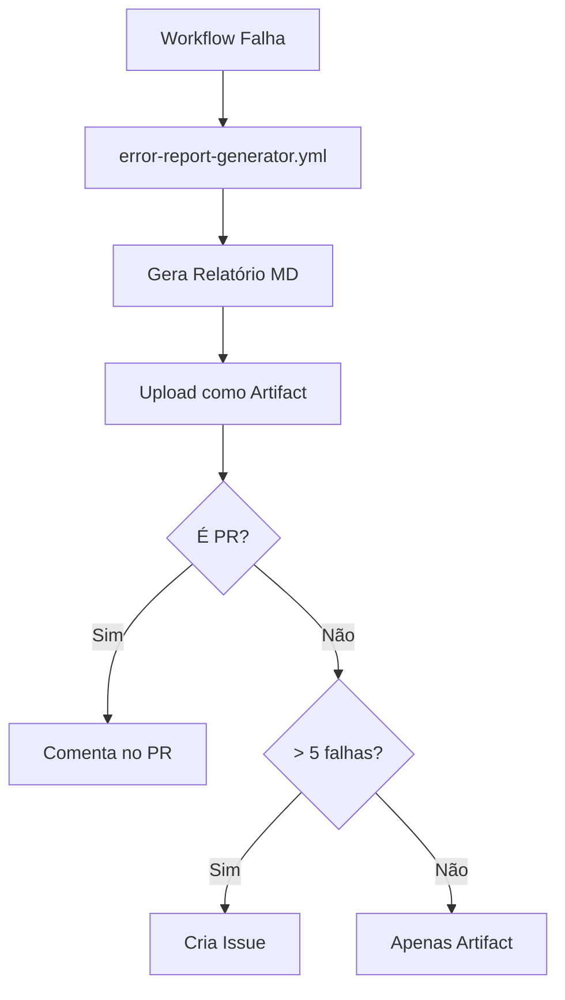

# 📊 GitHub Actions Error Reporting System

Sistema completo para coletar, consolidar e analisar logs de erros de workflows do GitHub Actions em um único arquivo Markdown.

---

## 🎯 Objetivo

Centralizar todos os logs de erros de workflows em **um único arquivo .md** para facilitar:

- ✅ Análise de falhas em um só lugar
- ✅ Identificação de padrões de erro
- ✅ Documentação de problemas
- ✅ Rastreamento de correções
- ✅ Compartilhamento com equipe

---

## 🚀 Quick Start

### 1. **Gerar Relatório de Erros (Manual)**

```bash
# Coletar últimas 10 falhas
bash scripts/github/collect-workflow-errors.sh

# Coletar últimas 20 falhas
bash scripts/github/collect-workflow-errors.sh 20

# Ver relatório gerado
cat workflow-errors/LATEST.md
```

**Saída:** `workflow-errors/ERROR-REPORT-YYYYMMDD-HHMMSS.md`

---

### 2. **Consolidar Múltiplos Relatórios**

```bash
# Consolidar todos os relatórios em um único arquivo
bash scripts/github/consolidate-error-reports.sh

# Ver consolidado
cat workflow-errors/CONSOLIDATED-LATEST.md
```

**Saída:** `workflow-errors/CONSOLIDATED-REPORT-YYYYMMDD-HHMMSS.md`

---

### 3. **Monitoramento Contínuo**

```bash
# Monitorar workflows em tempo real (atualiza a cada 30s)
bash scripts/github/monitor-workflows.sh 30
```

---

## 📁 Estrutura de Arquivos

```
workflow-errors/
├── ERROR-REPORT-20250108-143052.md    # Relatório individual
├── ERROR-REPORT-20250108-150234.md    # Outro relatório
├── CONSOLIDATED-REPORT-20250108.md    # Consolidado
├── LATEST.md                          # Link para último individual
└── CONSOLIDATED-LATEST.md             # Link para último consolidado
```

---

## 📋 Conteúdo do Relatório

Cada relatório `.md` contém:

### 1. **Resumo Executivo**

```markdown
## 📊 Resumo Executivo

| Workflow | Branch | Data | Status |
|----------|--------|------|--------|
| Code Quality | main | 2025-01-08 | ❌ Failed |
| Bundle Size | PR#42 | 2025-01-08 | ❌ Failed |
```

### 2. **Detalhes dos Erros**

Para cada workflow com falha:

```markdown
### 🔴 Code Quality

**Run ID:** `1234567890`
**Branch:** `main`
**Commit:** `abc1234`
**URL:** [Link para logs]

#### 📋 Logs de Erro:
```
error TS2304: Cannot find name 'foo'
eslint: Unexpected console statement
```

#### 🔧 Comandos para Reproduzir:
```bash
gh run view 1234567890 --log
npm run lint -- --fix
```

#### 💡 Possíveis Soluções:
- Executar linting: `npm run lint -- --fix`
- Verificar TypeScript: `npm run type-check`
```

### 3. **Recursos e Scripts**

- Links para documentação relevante
- Scripts de diagnóstico
- Fluxo de correção recomendado

---

## 🔄 Fluxo Automático

O sistema funciona automaticamente via GitHub Actions:



### **Workflow Automático** (`.github/workflows/error-report-generator.yml`)

**Triggers:**
- ✅ Após qualquer workflow falhar
- ✅ Manualmente via workflow_dispatch

**Ações:**
1. Coleta logs de erros
2. Gera relatório `.md`
3. Upload como artifact (90 dias retenção)
4. Comenta em PR (se aplicável)
5. Cria issue se > 5 falhas recentes

---

## 🛠️ Scripts Disponíveis

### 1. `collect-workflow-errors.sh`

**Função:** Coleta logs de workflows com falha e gera relatório individual

**Uso:**
```bash
bash scripts/github/collect-workflow-errors.sh [LIMIT]

# Exemplos:
bash scripts/github/collect-workflow-errors.sh      # Últimas 10 falhas
bash scripts/github/collect-workflow-errors.sh 20   # Últimas 20 falhas
```

**Saída:**
- `workflow-errors/ERROR-REPORT-YYYYMMDD-HHMMSS.md`
- `workflow-errors/LATEST.md` (link simbólico)

---

### 2. `consolidate-error-reports.sh`

**Função:** Consolida múltiplos relatórios em um único arquivo

**Uso:**
```bash
bash scripts/github/consolidate-error-reports.sh
```

**Saída:**
- `workflow-errors/CONSOLIDATED-REPORT-YYYYMMDD-HHMMSS.md`
- Estatísticas de workflows que mais falharam
- Erros mais comuns
- Todos os relatórios individuais em collapsible sections

---

### 3. `check-workflows.sh`

**Função:** Utilitário de linha de comando para gerenciar workflows

**Uso:**
```bash
bash scripts/github/check-workflows.sh <comando> [args]

# Comandos:
list          # Listar últimas execuções
failures      # Apenas falhas
status        # Resumo geral
logs <id>     # Ver logs de workflow
rerun <id>    # Re-executar workflow
watch <id>    # Acompanhar em tempo real
download <id> # Baixar artifacts
pr <number>   # Status de workflows em PR
```

---

### 4. `monitor-workflows.sh`

**Função:** Monitor em tempo real com auto-refresh

**Uso:**
```bash
bash scripts/github/monitor-workflows.sh [INTERVAL]

# Exemplos:
bash scripts/github/monitor-workflows.sh     # Atualiza a cada 30s (padrão)
bash scripts/github/monitor-workflows.sh 60  # Atualiza a cada 60s
```

**Features:**
- ✅ Auto-refresh configurável
- ✅ Notificações desktop (Linux)
- ✅ Beep em novas falhas
- ✅ Cores e formatação clara

---

## 📦 Artifacts no GitHub Actions

Cada relatório gerado automaticamente é armazenado como **artifact**:

**Localização:**
```
GitHub → Actions → Error Report Generator → Artifacts
```

**Retenção:** 90 dias

**Download:**
```bash
# Via GitHub CLI
bash scripts/github/check-workflows.sh download <run-id>

# Via UI
GitHub → Actions → <workflow> → Artifacts → Download
```

---

## 🔔 Notificações

### **Comentários em PRs**

Quando um workflow falha em um PR, o sistema:
1. Gera relatório de erros
2. Posta comentário no PR com:
   - Resumo de erros
   - Logs principais
   - Link para artifact completo
   - Comandos de correção

### **Issues Automáticas**

Se houver **> 5 falhas recentes**:
1. Cria issue automaticamente
2. Marca com labels: `ci/cd`, `bug`, `high-priority`
3. Inclui estatísticas e links

---

## 🎯 Casos de Uso

### **Caso 1: Falha Única**

```bash
# 1. Ver último relatório
cat workflow-errors/LATEST.md

# 2. Identificar erro
# 3. Reproduzir localmente (comandos no relatório)
# 4. Corrigir e commitar
```

### **Caso 2: Múltiplas Falhas**

```bash
# 1. Gerar relatório consolidado
bash scripts/github/consolidate-error-reports.sh

# 2. Ver padrões
cat workflow-errors/CONSOLIDATED-LATEST.md

# 3. Identificar erros recorrentes
# 4. Aplicar correções em lote
```

### **Caso 3: Análise de Tendências**

```bash
# 1. Coletar dados ao longo do tempo
bash scripts/github/collect-workflow-errors.sh 50

# 2. Consolidar
bash scripts/github/consolidate-error-reports.sh

# 3. Analisar seção "Estatísticas Gerais"
# 4. Identificar workflows problemáticos
```

---

## 🔧 Configuração

### **Pré-requisitos**

1. **GitHub CLI instalado:**
   ```bash
   sudo apt install gh
   gh auth login
   ```

2. **jq instalado** (para parsing JSON):
   ```bash
   sudo apt install jq
   ```

### **Permissões**

O GitHub token precisa de:
- ✅ `repo` - Acesso ao repositório
- ✅ `workflow` - Acesso a workflows

---

## 📊 Exemplo de Relatório

```markdown
# 🚨 GitHub Actions - Relatório de Erros

**Gerado em:** 2025-01-08 14:30:52
**Total de Falhas:** 3

---

## 📊 Resumo Executivo

| Workflow | Branch | Status |
|----------|--------|--------|
| Code Quality | main | ❌ |
| Bundle Size | main | ❌ |
| Tests | PR#42 | ❌ |

---

## 🔍 Detalhes dos Erros

### 🔴 Code Quality

**Run ID:** `1234567890`
**Commit:** `abc1234`

#### 📋 Logs de Erro:
```
error TS2304: Cannot find name 'useAgentsData'
  at AgentsCatalogView.tsx:45:23
```

#### 🔧 Comandos:
```bash
npm run lint -- --fix
npm run type-check
```

#### 💡 Soluções:
- Importar hook: `import { useAgentsData } from '@/hooks/useAgentsData'`
- Ver: `src/hooks/useAgentsData.ts`
```

---

## 🗑️ Limpeza de Relatórios Antigos

```bash
# Remover relatórios com > 30 dias
find workflow-errors -name "*.md" -mtime +30 -delete

# Manter apenas últimos 10 relatórios
ls -t workflow-errors/ERROR-REPORT-*.md | tail -n +11 | xargs rm -f
```

---

## 📚 Documentação Relacionada

- **Workflows README**: `.github/workflows/README.md`
- **Bundle Optimization**: `frontend/dashboard/BUNDLE-OPTIMIZATION.md`
- **Environment Guide**: `docs/content/tools/security-config/env.mdx`

---

## 🤝 Contribuindo

Para melhorar o sistema de relatórios:

1. **Adicionar novos workflows** em `error-report-generator.yml`
2. **Customizar soluções** em `collect-workflow-errors.sh` (case statement)
3. **Ajustar retenção** de artifacts (padrão: 90 dias)

---

**Última atualização:** 2025-01-08
**Mantido por:** DevOps Team
