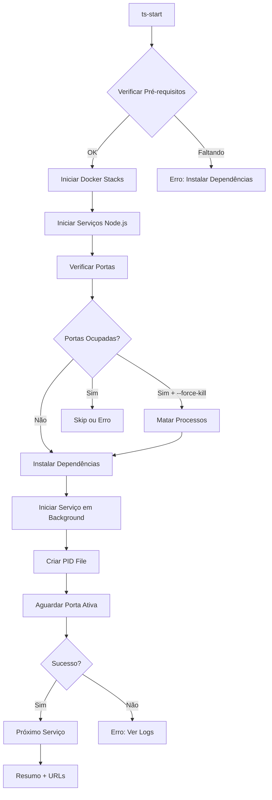

# TradingSystem - Universal Startup

## 📚 Visão Geral

Este diretório contém scripts para startup completo e automatizado do TradingSystem. O comando universal `start-tradingsystem-full.sh` orquestra todos os serviços (Docker + Node.js) necessários para executar a plataforma.

## 🚀 Uso Rápido

### Comando Universal (Recomendado)

Adicione ao seu `~/.bashrc` ou `~/.zshrc`:

```bash
# TradingSystem - Universal Startup
alias ts-start='bash /home/marce/projetos/TradingSystem/start-tradingsystem'
alias ts-start-docker='bash /home/marce/projetos/TradingSystem/start-tradingsystem --docker'
alias ts-start-services='bash /home/marce/projetos/TradingSystem/start-tradingsystem --services'
alias ts-start-minimal='bash /home/marce/projetos/TradingSystem/start-tradingsystem --minimal'
alias ts-stop='bash /home/marce/projetos/TradingSystem/scripts/services/stop-all.sh && bash /home/marce/projetos/TradingSystem/scripts/docker/stop-stacks.sh'
alias ts-status='bash /home/marce/projetos/TradingSystem/scripts/services/status.sh'
alias ts-health='bash /home/marce/projetos/TradingSystem/scripts/maintenance/health-check-all.sh'

# Aliases curtos
alias tss='ts-start'
alias tst='ts-stop'
alias tsst='ts-status'
```

Depois recarregue o shell:

```bash
source ~/.bashrc  # ou source ~/.zshrc
```

### Uso de Qualquer Lugar

Depois de configurar os aliases, você pode executar de **qualquer diretório**:

```bash
# Startup completo
ts-start

# Ou versão curta
tss

# Apenas containers Docker
ts-start-docker

# Apenas serviços Node.js
ts-start-services

# Modo mínimo (essenciais)
ts-start-minimal

# Parar tudo
ts-stop  # ou tst

# Ver status
ts-status  # ou tsst

# Health check completo
ts-health
```

## 📋 Comandos Disponíveis

### 1. Startup Completo

```bash
ts-start
# ou
bash /home/marce/projetos/TradingSystem/start-tradingsystem
```

**O que faz:**

-   ✅ Inicia todos os containers Docker (infraestrutura, dados, monitoramento)
-   ✅ Inicia todos os serviços Node.js (APIs, Dashboard, Docusaurus)
-   ✅ Verifica pré-requisitos
-   ✅ Exibe resumo com URLs de acesso

### 2. Apenas Docker

```bash
ts-start-docker
# ou
bash /home/marce/projetos/TradingSystem/start-tradingsystem --docker
```

**O que faz:**

-   ✅ QuestDB + TimescaleDB
-   ✅ pgAdmin, pgweb, Adminer
-   ✅ Prometheus + Grafana
-   ✅ Qdrant, Redis
-   ✅ Documentation API
-   ✅ LangGraph Development

### 3. Apenas Serviços Node.js

```bash
ts-start-services
# ou
bash /home/marce/projetos/TradingSystem/start-tradingsystem --services
```

**O que faz:**

-   ✅ Dashboard (React + Vite) - Port 3103
-   ✅ Workspace API - Port 3200
-   ✅ TP Capital API - Port 3200
-   ✅ B3 Market Data - Port 3302
-   ✅ Docusaurus - Port 3004
-   ✅ Service Launcher - Port 3500
-   ✅ Firecrawl Proxy - Port 3600
-   ✅ WebScraper API - Port 3700

### 4. Modo Mínimo

```bash
ts-start-minimal
# ou
bash /home/marce/projetos/TradingSystem/start-tradingsystem --minimal
```

**O que faz:**

-   ✅ Dashboard
-   ✅ Workspace API
-   ✅ Docusaurus
-   ✅ Documentation API (Docker)

Ideal para desenvolvimento focado no frontend.

### 5. Opções Avançadas

```bash
# Força restart matando processos em portas ocupadas
ts-start --force-kill

# Pula frontend
ts-start --skip-frontend

# Pula backend
ts-start --skip-backend

# Pula documentação
ts-start --skip-docs

# Ajuda completa
ts-start --help
```

## 📊 URLs de Acesso

Após o startup completo, os serviços estarão disponíveis em:

### Interface Principal

-   **Dashboard**: http://localhost:3103
-   **Documentação**: http://localhost:3004

### APIs Backend

-   **Workspace API**: http://localhost:3200
-   **B3 Market Data**: http://localhost:3302
-   **Documentation API**: http://localhost:3400
-   **Service Launcher**: http://localhost:3500
-   **Firecrawl Proxy**: http://localhost:3600
-   **WebScraper API**: http://localhost:3700

### Infraestrutura

-   **QuestDB UI**: http://localhost:9009
-   **QuestDB API**: http://localhost:9000
-   **pgAdmin**: http://localhost:5050
-   **pgweb**: http://localhost:8081
-   **Prometheus**: http://localhost:9090
-   **Grafana**: http://localhost:3000
-   **Qdrant**: http://localhost:6333
-   **LangGraph Dev**: http://localhost:8112

## 🔧 Manutenção

### Ver Status dos Serviços

```bash
ts-status
# ou
bash /home/marce/projetos/TradingSystem/scripts/services/status.sh
```

### Parar Todos os Serviços

```bash
ts-stop
# ou
bash /home/marce/projetos/TradingSystem/scripts/services/stop-all.sh
bash /home/marce/projetos/TradingSystem/scripts/docker/stop-stacks.sh
```

### Health Check Completo

```bash
ts-health
# ou
bash /home/marce/projetos/TradingSystem/scripts/maintenance/health-check-all.sh
```

### Ver Logs

```bash
# Logs de todos os serviços Node.js
ts-logs
# ou
tail -f /tmp/tradingsystem-logs/*.log

# Log específico
tail -f /tmp/tradingsystem-logs/workspace-api.log

# Logs Docker
docker logs -f <container_name>

# Todos os containers
docker compose logs -f
```

## 📁 Estrutura de Arquivos

```
scripts/startup/
├── README.md                        # Este arquivo
├── start-tradingsystem-full.sh      # Script principal (completo)
├── start-trading-system-dev.sh      # Script legado (em nova aba do terminal)
├── start-service-launcher.sh        # Inicia Service Launcher
├── launch-service.sh                # Helper para lançamento individual
└── welcome-message.sh               # Mensagem de boas-vindas
```

## 🔄 Fluxo de Execução



## 🐛 Troubleshooting

### Porta Ocupada

**Problema**: `Port 3103 already in use`

**Solução**:

```bash
# Opção 1: Force restart
ts-start --force-kill

# Opção 2: Matar processo manualmente
lsof -ti:3103 | xargs kill -9

# Opção 3: Ver quem está usando
lsof -i:3103
```

### Serviço Não Inicia

**Problema**: Serviço falha ao iniciar

**Solução**:

```bash
# Ver logs do serviço
tail -n 50 /tmp/tradingsystem-logs/<service-name>.log

# Verificar dependências
cd /home/marce/projetos/TradingSystem/<service-path>
npm install

# Testar manualmente
npm run dev
```

### Docker Não Responde

**Problema**: Containers não sobem

**Solução**:

```bash
# Verificar Docker
docker ps
docker info

# Restart Docker daemon
sudo systemctl restart docker

# Limpar recursos
docker system prune -a --volumes
```

### Falta de Memória

**Problema**: Serviços travam ou crasheam

**Solução**:

```bash
# Usar modo mínimo
ts-start-minimal

# Parar serviços não utilizados
ts-stop
ts-start-services --skip-backend

# Ver uso de recursos
docker stats
htop
```

## 📝 Logs e Debug

### Localização dos Logs

-   **Serviços Node.js**: `/tmp/tradingsystem-logs/<service-name>.log`
-   **PID Files**: `/tmp/tradingsystem-logs/<service-name>.pid`
-   **Docker Logs**: `docker logs <container_name>`

### Debug Mode

Para habilitar logs detalhados:

```bash
# No script
LOG_LEVEL=debug ts-start

# Ver logs em tempo real
watch -n 1 'tail -n 20 /tmp/tradingsystem-logs/*.log'
```

## 🔐 Segurança

### Variáveis de Ambiente

O script usa o arquivo `.env` centralizado:

```bash
# Localização
/home/marce/projetos/TradingSystem/.env

# Validar configuração
bash /home/marce/projetos/TradingSystem/scripts/env/validate-env.sh
```

### Credenciais

-   ❌ **Nunca commitar** `.env` com credenciais
-   ✅ **Usar** `.env.example` como template
-   ✅ **Documentar** variáveis necessárias

## 🚀 Performance

### Tempo de Startup

-   **Completo**: ~60-90 segundos
-   **Docker Only**: ~30-45 segundos
-   **Services Only**: ~20-30 segundos
-   **Minimal**: ~15-20 segundos

### Otimizações

1. **Pre-build Docker Images**: Reduz tempo de build
2. **Keep Dependencies Updated**: `npm ci` é mais rápido
3. **Use SSD**: Disco rápido melhora I/O
4. **Parallel Startup**: Serviços iniciam em paralelo

## 📚 Documentação Relacionada

-   **[Service Startup Guide](../../docs/context/ops/service-startup-guide.md)** - Guia detalhado de inicialização
-   **[Health Monitoring](../../docs/context/ops/health-monitoring.md)** - Monitoramento de saúde
-   **[Environment Configuration](../../docs/context/ops/ENVIRONMENT-CONFIGURATION.md)** - Configuração de ambiente
-   **[Docker Compose Guide](../docker/README.md)** - Gestão de containers

## 🤝 Contribuindo

Ao adicionar novos serviços:

1. Adicionar ao array `SERVICES` em `scripts/services/start-all.sh`
2. Atualizar documentação de portas
3. Adicionar health check em `scripts/maintenance/health-check-all.sh`
4. Testar startup completo

## 📄 Licença

Este projeto é parte do TradingSystem - Sistema Local de Trading.

