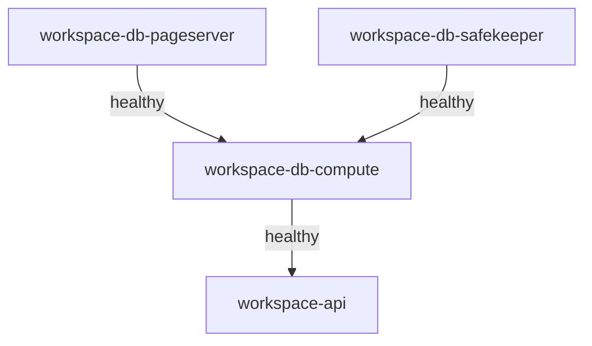

# Workspace Stack - Unified Container Orchestration

**Status**: ✅ Ready for deployment  
**Containers**: 4 (Neon DB: 3 + Workspace API: 1)  
**Management**: Single Docker Compose file

---

## Overview

The Workspace Stack is a **self-contained, unified deployment** of all Workspace-related containers:

### Stack Components

```
workspace-stack (4 containers)
├── workspace-db-pageserver  (Neon Storage Layer)
├── workspace-db-safekeeper  (Neon WAL Service)
├── workspace-db-compute     (Neon PostgreSQL Endpoint)
└── workspace-api            (Express REST API)
```

### Why Unified Stack?

- ✅ **Single Command**: `docker compose up -d` starts everything
- ✅ **Clear Dependencies**: API waits for database to be healthy
- ✅ **Isolated Network**: `workspace_network` dedicated to this stack
- ✅ **Atomic Operations**: Start/stop/restart entire stack as unit
- ✅ **Easy Troubleshooting**: All logs in one place
- ✅ **Scalability**: Can scale API independently: `--scale workspace-api=3`

---

## Quick Start

### 1. Build Neon Image (First Time Only)

```bash
# Build Neon from source (~30 minutes)
bash scripts/database/build-neon-from-source.sh
```

### 2. Start Stack

```bash
# Using helper script (recommended)
bash scripts/docker/start-workspace-stack.sh

# Or directly with Docker Compose
docker compose -f tools/compose/docker-compose.workspace-stack.yml up -d
```

### 3. Initialize Database

```bash
# Create workspace database and schema
bash scripts/database/init-neon-workspace.sh
```

### 4. Verify

```bash
# Check all 4 containers are running
docker compose -f tools/compose/docker-compose.workspace-stack.yml ps

# Test API
curl http://localhost:3200/health

# Test Database
bash scripts/database/test-neon-connection.sh
```

---

## Stack Management

### Start Stack

```bash
# Start in background
bash scripts/docker/start-workspace-stack.sh

# Start with rebuild
bash scripts/docker/start-workspace-stack.sh --build

# Start and follow logs
bash scripts/docker/start-workspace-stack.sh --logs
```

### Stop Stack

```bash
# Graceful shutdown (preserves data)
bash scripts/docker/stop-workspace-stack.sh

# Force stop
bash scripts/docker/stop-workspace-stack.sh --force

# Stop and DELETE ALL DATA (⚠️ CAUTION!)
bash scripts/docker/stop-workspace-stack.sh --remove-volumes
```

### Restart Stack

```bash
# Restart all containers
docker compose -f tools/compose/docker-compose.workspace-stack.yml restart

# Restart specific service
docker compose -f tools/compose/docker-compose.workspace-stack.yml restart workspace-api
```

### View Logs

```bash
# All services
docker compose -f tools/compose/docker-compose.workspace-stack.yml logs -f

# Specific service
docker compose -f tools/compose/docker-compose.workspace-stack.yml logs -f workspace-api
docker compose -f tools/compose/docker-compose.workspace-stack.yml logs -f workspace-db-compute

# Last 100 lines
docker compose -f tools/compose/docker-compose.workspace-stack.yml logs --tail=100
```

### Check Status

```bash
# Container status
docker compose -f tools/compose/docker-compose.workspace-stack.yml ps

# Health checks
docker compose -f tools/compose/docker-compose.workspace-stack.yml ps --format json | jq '.[].Health'

# Resource usage
docker stats --no-stream | grep workspace
```

---

## Architecture

### Container Topology

```
┌─────────────────────────────────────────┐
│ Workspace Stack (workspace_network)     │
│                                         │
│  ┌─────────────────────────────────┐   │
│  │ workspace-api (Port 3200)       │   │
│  │ - Express REST API              │   │
│  │ - NeonClient connection pool    │   │
│  └────────────┬────────────────────┘   │
│               │ pg protocol             │
│               ↓                         │
│  ┌─────────────────────────────────┐   │
│  │ workspace-db-compute (Port 5433)│   │
│  │ - PostgreSQL 17 endpoint        │   │
│  └──┬──────────────────┬───────────┘   │
│     │                  │                │
│  ┌──┘                  └──┐            │
│  ↓                        ↓             │
│ ┌───────────────┐  ┌──────────────┐   │
│ │ pageserver    │  │ safekeeper   │   │
│ │ (Storage)     │  │ (WAL)        │   │
│ └───────────────┘  └──────────────┘   │
└─────────────────────────────────────────┘
          │
          │ Bridge to
          ↓
┌─────────────────────────────────────────┐
│ tradingsystem_backend (external)        │
│ - Dashboard (port 3103)                 │
│ - Other services                        │
└─────────────────────────────────────────┘
```

### Network Configuration

**workspace_network** (Internal - 172.25.0.0/16):
- workspace-db-pageserver
- workspace-db-safekeeper
- workspace-db-compute
- workspace-api

**tradingsystem_backend** (External):
- workspace-api (bridge connection for Dashboard access)

### Port Mapping

| Container | Internal Port | External Port | Protocol |
|-----------|---------------|---------------|----------|
| workspace-api | 3200 | 3200 | HTTP |
| workspace-db-compute | 55432 | 5433 | PostgreSQL |
| workspace-db-pageserver | 6400 | 6400 | PostgreSQL |
| workspace-db-pageserver | 9898 | 9898 | HTTP (metrics) |
| workspace-db-safekeeper | 5454 | 5454 | PostgreSQL |
| workspace-db-safekeeper | 7676 | 7676 | HTTP (metrics) |

---

## Advanced Usage

### Scale API Horizontally

```bash
# Scale to 3 API instances
docker compose -f tools/compose/docker-compose.workspace-stack.yml up -d --scale workspace-api=3

# With load balancer (future)
# Add nginx/traefik to distribute load across instances
```

### Access Database Directly

```bash
# Via Docker exec
docker compose -f tools/compose/docker-compose.workspace-stack.yml exec workspace-db-compute \
  psql -U postgres -d workspace

# From host (if psql installed)
PGPASSWORD=neon_secure_pass psql -h localhost -p 5433 -U postgres -d workspace
```

### Execute Commands in API Container

```bash
# Run npm command
docker compose -f tools/compose/docker-compose.workspace-stack.yml exec workspace-api \
  npm test

# Open shell
docker compose -f tools/compose/docker-compose.workspace-stack.yml exec workspace-api bash
```

### Inspect Metrics

```bash
# Neon Pageserver metrics
curl http://localhost:9898/metrics

# Neon Safekeeper metrics
curl http://localhost:7676/metrics

# Workspace API metrics
curl http://localhost:3200/metrics
```

---

## Environment Variables

### Stack-wide Variables (from .env)

```env
# Database Strategy (locked to neon in this stack)
LIBRARY_DB_STRATEGY=neon

# Neon Configuration
NEON_PASSWORD=neon_secure_pass
NEON_DATABASE=workspace
NEON_USER=postgres
NEON_LOG_LEVEL=info

# API Configuration
WORKSPACE_EXTERNAL_PORT=3200
NODE_ENV=development
LOG_LEVEL=info

# CORS
CORS_ORIGIN=http://localhost:3103,http://localhost:3400
```

### Override at Runtime

```bash
# Change external port
WORKSPACE_EXTERNAL_PORT=3201 docker compose -f tools/compose/docker-compose.workspace-stack.yml up -d

# Enable debug logging
NEON_LOG_LEVEL=debug LOG_LEVEL=debug docker compose -f tools/compose/docker-compose.workspace-stack.yml up -d
```

---

## Monitoring

### Health Checks

```bash
# Quick health check (all services)
docker compose -f tools/compose/docker-compose.workspace-stack.yml ps

# Detailed health with script
bash scripts/database/test-neon-connection.sh
```

### Expected Output (Healthy Stack)

```
NAME                        STATUS              PORTS
workspace-api               Up (healthy)        0.0.0.0:3200->3200/tcp
workspace-db-compute        Up (healthy)        0.0.0.0:5433->55432/tcp
workspace-db-pageserver     Up (healthy)        0.0.0.0:6400->6400/tcp, 0.0.0.0:9898->9898/tcp
workspace-db-safekeeper     Up (healthy)        0.0.0.0:5454->5454/tcp, 0.0.0.0:7676->7676/tcp
```

### Container Dependencies



**Startup Order**:
1. Pageserver & Safekeeper start in parallel
2. Wait for both to be healthy
3. Compute starts and connects to pageserver/safekeeper
4. Wait for compute to be healthy
5. API starts and connects to compute

---

## Troubleshooting

### Stack Won't Start

```bash
# Check logs
docker compose -f tools/compose/docker-compose.workspace-stack.yml logs

# Check specific container
docker logs workspace-db-compute -f

# Rebuild if needed
docker compose -f tools/compose/docker-compose.workspace-stack.yml up -d --build
```

### API Can't Connect to Database

```bash
# Verify compute is healthy
docker ps | grep workspace-db-compute

# Test database connection
docker exec workspace-db-compute pg_isready -U postgres

# Check network
docker network inspect workspace_network
```

### Containers Keep Restarting

```bash
# Check restart count
docker ps -a | grep workspace

# View last 50 lines of logs
docker logs workspace-db-compute --tail=50

# Check resource limits
docker stats --no-stream | grep workspace
```

---

## Backup & Recovery

### Backup Entire Stack

```bash
# Export data
docker compose -f tools/compose/docker-compose.workspace-stack.yml exec workspace-db-compute \
  pg_dump -U postgres -d workspace > backup-workspace-$(date +%Y%m%d).sql

# Backup volumes
docker run --rm -v workspace-db-compute-data:/data -v $(pwd):/backup alpine \
  tar czf /backup/workspace-volumes-$(date +%Y%m%d).tar.gz /data
```

### Restore from Backup

```bash
# Restore database
docker compose -f tools/compose/docker-compose.workspace-stack.yml exec -T workspace-db-compute \
  psql -U postgres -d workspace < backup-workspace-20251103.sql

# Restore volumes
docker run --rm -v workspace-db-compute-data:/data -v $(pwd):/backup alpine \
  tar xzf /backup/workspace-volumes-20251103.tar.gz -C /
```

---

## Production Considerations

### Resource Limits

Add to `docker-compose.workspace-stack.yml`:

```yaml
workspace-api:
  deploy:
    resources:
      limits:
        cpus: '1.0'
        memory: 512M
      reservations:
        cpus: '0.25'
        memory: 128M
```

### Security

```bash
# Use secrets for passwords
docker secret create neon_password ./neon_password.txt

# Reference in compose
environment:
  - NEON_PASSWORD_FILE=/run/secrets/neon_password
secrets:
  - neon_password
```

### High Availability

For production, consider:
- Multiple safekeeper instances (quorum)
- Read replicas (scale reads)
- External volumes (EBS, NFS)
- Load balancer for API (nginx, traefik)

---

## Migration from Previous Setup

### If Running Neon Separately

```bash
# Stop old setup
docker compose -f tools/compose/docker-compose.neon.yml down
docker compose -f tools/compose/docker-compose.apps.yml stop workspace

# Start unified stack
bash scripts/docker/start-workspace-stack.sh
```

### Data Migration

Data is **automatically preserved** if you:
1. Stop old containers (don't use `-v` flag)
2. Volumes are named the same in new stack
3. Docker reuses existing volumes

---

## Comparison: Old vs New

| Aspect | OLD (Separated) | NEW (Unified Stack) |
|--------|-----------------|---------------------|
| **Compose Files** | 2 files | 1 file ✅ |
| **Start Command** | 2 commands | 1 command ✅ |
| **Dependencies** | Manual ordering | Automatic ✅ |
| **Network** | Shared | Dedicated ✅ |
| **Logs** | Fragmented | Centralized ✅ |
| **Scaling** | Complex | Simple ✅ |
| **Troubleshooting** | Difficult | Easy ✅ |

---

## Stack Lifecycle

### Daily Operations

```bash
# Morning: Start stack
bash scripts/docker/start-workspace-stack.sh

# Evening: Stop stack (preserves data)
bash scripts/docker/stop-workspace-stack.sh

# Weekly: Restart for updates
docker compose -f tools/compose/docker-compose.workspace-stack.yml restart
```

### Maintenance

```bash
# Update Neon image
bash scripts/database/build-neon-from-source.sh --no-cache
docker compose -f tools/compose/docker-compose.workspace-stack.yml up -d

# Update API image
docker compose -f tools/compose/docker-compose.workspace-stack.yml build workspace-api
docker compose -f tools/compose/docker-compose.workspace-stack.yml up -d workspace-api

# Clean old images
docker image prune -a
```

---

## Integration with TradingSystem

### Startup Scripts

Add to global startup script:

```bash
# start-all-services.sh
echo "Starting Workspace stack..."
bash scripts/docker/start-workspace-stack.sh

# Or include in docker-compose meta stack
```

### Health Monitoring

Integrate with `scripts/maintenance/health-check-all.sh`:

```bash
# Check Workspace stack
if docker ps | grep -q "workspace-api"; then
  check_service "Workspace API" "http://localhost:3200/health"
fi
```

---

## Resources

- **Docker Compose File**: `tools/compose/docker-compose.workspace-stack.yml`
- **Start Script**: `scripts/docker/start-workspace-stack.sh`
- **Stop Script**: `scripts/docker/stop-workspace-stack.sh`
- **Setup Guide**: `docs/content/database/neon-setup.mdx`
- **ADR**: `docs/content/reference/adrs/007-workspace-neon-migration.md`

---

## Support

For issues:
1. Check this guide
2. Review logs: `docker compose -f tools/compose/docker-compose.workspace-stack.yml logs`
3. Run diagnostics: `bash scripts/database/test-neon-connection.sh`
4. Check Neon GitHub issues: https://github.com/neondatabase/neon/issues

---

**Last Updated**: 2025-11-03  
**Maintained By**: TradingSystem DevOps Team


