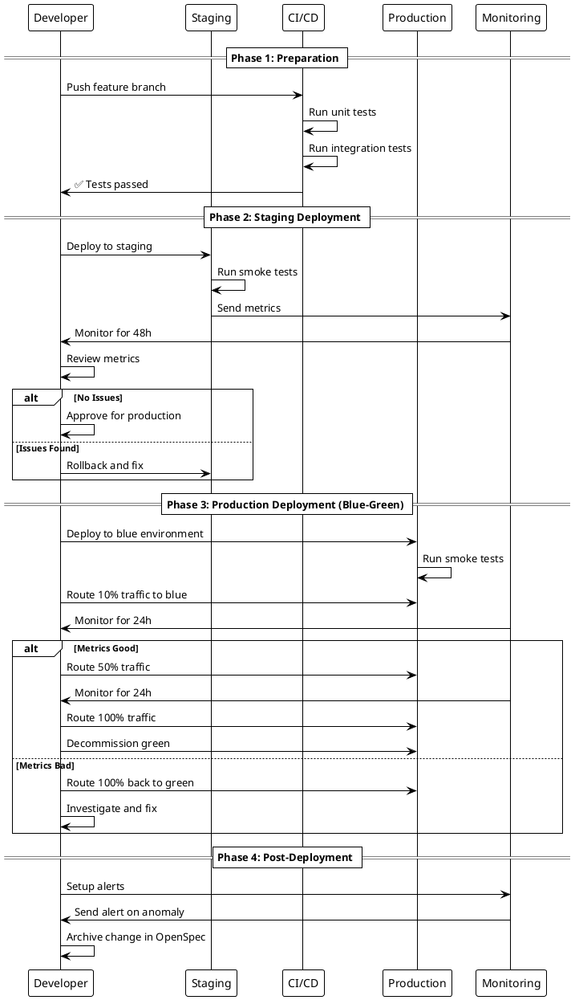

# Technical Design: Enhance RAG Services Architecture

**Change ID**: `enhance-rag-services-architecture`  
**Created**: 2025-11-02  
**Status**: Proposal

---

## Context

### Background

The RAG Services stack currently operates with **6 Docker containers** providing semantic search, Q&A, and document management. Architecture review (2025-11-02) identified critical gaps preventing production readiness despite excellent performance (< 10ms response, 99.9% uptime).

**Current Stack**:
- **ollama** (11434) - GPU-accelerated LLM/embeddings
- **llamaindex-ingestion** (8201) - Document processing
- **llamaindex-query** (8202) - Semantic search/Q&A
- **rag-service** (3402) - Documentation API + RAG proxy
- **rag-collections-service** (3403) - Collection management + file watcher
- **rag-redis** (6380) - Cache layer (stats, queries)

**Infrastructure**:
- **Qdrant** (6333) - Vector database (single instance)
- **TimescaleDB** (5432) - Relational data (not yet used for RAG)

### Constraints

- **No downtime allowed**: Rolling deployments only
- **Backward compatibility**: Legacy endpoints must work during migration
- **Resource limits**: Total memory < 16GB, CPU < 8 cores
- **Budget**: $50-100/month for additional infrastructure

### Stakeholders

| Role | Concern | Priority |
|------|---------|----------|
| **Backend Team** | Code maintainability, testing burden | High |
| **DevOps Team** | Infrastructure complexity, monitoring | High |
| **Security Team** | Inter-service auth, API Gateway security | Critical |
| **Frontend Team** | Bundle size, load time | Medium |
| **Users** | Service availability, search quality | Critical |

---

## Goals / Non-Goals

### Goals

1. **Improve Resilience**: Circuit breakers prevent cascading failures
2. **Enhance Security**: Inter-service auth + API Gateway
3. **Increase Quality**: 80% test coverage (catch regressions)
4. **Enable Scalability**: Qdrant HA + API versioning
5. **Optimize Performance**: Code splitting, database indexing
6. **Strengthen Operations**: Backups, monitoring, alerting

### Non-Goals

- ❌ **Not changing core algorithms**: Embedding/search logic stays same
- ❌ **Not migrating to cloud**: Remains 100% on-premise
- ❌ **Not rewriting services**: Enhancements, not rewrites
- ❌ **Not changing APIs significantly**: Additive changes only

---

## Decisions

### Decision 1: Circuit Breaker Library Selection

**Context**: Need to protect Ollama and Qdrant calls from cascading failures.

**Options Considered**:

| Option | Pros | Cons | Verdict |
|--------|------|------|---------|
| **circuitbreaker (Python)** | Simple, proven, 2K+ stars | Limited features | ✅ **SELECTED** |
| **pybreaker** | More features, configurable | Heavier dependency | ❌ Rejected |
| **opossum (Node.js)** | Feature-rich, event-driven | More complex | ✅ **SELECTED** |
| **cockatiel (Node.js)** | Modern, TypeScript-first | Less mature | ❌ Rejected |

**Decision**: Use **`circuitbreaker`** (Python) and **`opossum`** (Node.js)

**Rationale**:
- Simple API (easy to learn, maintain)
- Battle-tested in production
- Minimal overhead
- Good defaults (can customize if needed)

**Configuration**:
```python
# Python
@circuit(failure_threshold=5, recovery_timeout=30, expected_exception=Exception)

# Node.js
const breaker = new CircuitBreaker(asyncFunction, {
  timeout: 3000,
  errorThresholdPercentage: 50,
  resetTimeout: 30000
});
```

---

### Decision 2: Inter-Service Authentication Strategy

**Context**: Services currently trust each other without verification.

**Options Considered**:

| Option | Pros | Cons | Verdict |
|--------|------|------|---------|
| **Mutual TLS (mTLS)** | Industry standard, strong security | Complex setup, cert management | ❌ Rejected (overkill) |
| **Shared Secret (X-Service-Token)** | Simple, fast, no PKI needed | Secret rotation complexity | ✅ **SELECTED** |
| **JWT Service Tokens** | Standard, auditable, expirable | Signing overhead | ❌ Rejected (overhead) |
| **No Auth (Current)** | Zero overhead | Insecure | ❌ Rejected |

**Decision**: Use **Shared Secret** via `X-Service-Token` header

**Rationale**:
- Simplicity (no PKI infrastructure)
- Performance (no signing/verification overhead)
- Adequate for internal Docker network
- Easy to rotate (update .env, restart services)

**Implementation**:
```javascript
// Middleware
const INTER_SERVICE_SECRET = process.env.INTER_SERVICE_SECRET;

function verifyServiceAuth(req, res, next) {
  const serviceToken = req.headers['x-service-token'];
  if (serviceToken !== INTER_SERVICE_SECRET) {
    return res.status(403).json({ error: 'Forbidden' });
  }
  next();
}

// Apply to internal routes only
app.use('/internal/*', verifyServiceAuth);
```

---

### Decision 3: API Versioning Strategy

**Context**: Need to support breaking changes without disrupting existing clients.

**Options Considered**:

| Option | Pros | Cons | Verdict |
|--------|------|------|---------|
| **URL-based (/api/v1)** | Clear, RESTful, easy to route | Verbose URLs | ✅ **SELECTED** |
| **Header-based (Accept-Version)** | Clean URLs | Harder to test (cURL), caching issues | ❌ Rejected |
| **Query param (?version=1)** | Simple | Non-standard, pollutes cache | ❌ Rejected |
| **No versioning (current)** | Simple | Cannot introduce breaking changes | ❌ Rejected |

**Decision**: Use **URL-based versioning** (`/api/v1`, `/api/v2`)

**Rationale**:
- Standard REST practice
- Easy to test (cURL, Postman, browsers)
- Works with API Gateways (Kong, Traefik)
- Clear in logs and metrics

**Migration Path**:
```
Phase 1: Add /api/v1 (coexists with legacy)
Phase 2: Deprecation warnings in logs (6 months)
Phase 3: Remove legacy endpoints (after 6 months)
```

---

### Decision 4: Qdrant HA Architecture

**Context**: Single Qdrant instance is SPOF (Single Point of Failure).

**Options Considered**:

| Option | Pros | Cons | Verdict |
|--------|------|------|---------|
| **Single instance (current)** | Simple | SPOF, no scaling | ❌ Rejected |
| **3-node cluster** | HA, read scaling, failover | More complex, resources | ✅ **SELECTED** |
| **5-node cluster** | Higher availability | Expensive (memory/CPU) | ❌ Rejected (overkill) |
| **External managed Qdrant** | Fully managed, no ops | Costs $$$, not on-premise | ❌ Rejected (violates on-premise requirement) |

**Decision**: **3-node cluster** (1 primary + 2 replicas)

**Rationale**:
- Odd number prevents split-brain
- 2 replicas sufficient for HA (can lose 1 node)
- Read scaling (distribute queries)
- Manageable complexity

**Topology**:
```
qdrant-primary (6333)  ← writes go here
    ├── qdrant-replica-1 (6334)  ← read replica
    └── qdrant-replica-2 (6335)  ← read replica

P2P replication (automatic)
Quorum: 2/3 nodes must agree
```

---

### Decision 5: Testing Strategy

**Context**: Current test coverage is 0%. Need comprehensive suite without excessive burden.

**Options Considered**:

| Option | Pros | Cons | Verdict |
|--------|------|------|---------|
| **100% coverage** | Maximum confidence | Expensive, diminishing returns | ❌ Rejected |
| **80% coverage (backend)** | High confidence, realistic | Some risk remains | ✅ **SELECTED** |
| **Manual testing only** | Low overhead | High risk, slow feedback | ❌ Rejected |
| **Integration tests only** | Catches real issues | Slow, hard to debug | ❌ Rejected |

**Decision**: **Multi-layered approach** with realistic targets

**Strategy**:
```
Unit Tests (Jest/Pytest)
  ├── Target: 80% coverage (backend)
  ├── Focus: Services, utilities, middleware
  └── Fast feedback (< 10s execution)

Integration Tests (Supertest/TestClient)
  ├── Target: 90% coverage (API routes)
  ├── Focus: Request/response contracts
  └── Medium feedback (< 1 min execution)

E2E Tests (Playwright)
  ├── Target: Critical user paths only (~10 tests)
  ├── Focus: Real user workflows
  └── Slower feedback (< 3 min execution)

Load Tests (K6)
  ├── Target: 1000 RPS sustained
  ├── Focus: Performance regression detection
  └── Run on PRs to main (< 5 min execution)
```

**Rationale**:
- Balanced approach (quality vs. speed)
- Realistic targets (achievable in 2 weeks)
- Fast feedback loop (unit tests in seconds)
- Confidence in deployments

---

### Decision 6: Database Migration Approach

**Context**: Need to move from JSON config to TimescaleDB without breaking existing deployments.

**Options Considered**:

| Option | Pros | Cons | Verdict |
|--------|------|------|---------|
| **Big bang migration** | Clean break, simple | High risk, downtime | ❌ Rejected |
| **Hybrid (JSON + DB)** | Safe, gradual | More complexity | ✅ **SELECTED** |
| **JSON only (no DB)** | No change | Misses benefits | ❌ Rejected |

**Decision**: **Hybrid approach** with gradual migration

**Implementation**:
```javascript
// Load collections from DB first, fallback to JSON
async loadCollections() {
  try {
    const collections = await db.query('SELECT * FROM rag.collections WHERE enabled = TRUE');
    if (collections.rows.length > 0) {
      logger.info('Loaded collections from database');
      return collections.rows;
    }
  } catch (error) {
    logger.warn('Database unavailable, falling back to JSON config');
  }
  
  // Fallback to JSON
  const config = JSON.parse(fs.readFileSync('collections-config.json'));
  return config.collections;
}
```

**Migration Script**:
```javascript
// scripts/migration/migrate-collections-to-db.js
const collections = JSON.parse(fs.readFileSync('collections-config.json'));

for (const collection of collections.collections) {
  await db.query(`
    INSERT INTO rag.collections (name, directory, embedding_model, ...)
    VALUES ($1, $2, $3, ...)
    ON CONFLICT (name) DO UPDATE SET ...
  `, [collection.name, collection.directory, ...]);
}
```

**Rollback**: Delete from database, service falls back to JSON automatically.

---

## Risks / Trade-offs

### Risk 1: Circuit Breaker False Positives

**Risk**: Circuit opens during legitimate transient failures (e.g., network blip).

**Impact**: Service degradation (503 errors until recovery)

**Mitigation**:
- Set conservative thresholds (failure_threshold=5, not 3)
- Monitor false positive rate in production
- Tune thresholds based on baseline metrics
- Add manual override (env var `CIRCUIT_BREAKER_FORCE_CLOSED=true`)

**Trade-off**: Accept occasional 503s to prevent total outages.

---

### Risk 2: Qdrant Cluster Complexity

**Risk**: Cluster misconfiguration leads to split-brain or data inconsistency.

**Impact**: Data corruption, queries return stale results

**Mitigation**:
- Use odd number of nodes (3) for quorum
- Test failover extensively in staging
- Monitor replication lag (alert if > 5s)
- Have rollback plan (revert to single instance)

**Trade-off**: Increased operational complexity for higher availability.

---

### Risk 3: Test Suite Maintenance Burden

**Risk**: Tests become flaky or outdated, team ignores failures.

**Impact**: False confidence, regressions slip through

**Mitigation**:
- Focus on stable, deterministic tests
- Fix flaky tests immediately (quarantine if needed)
- Review test suite quarterly (remove obsolete tests)
- Make tests developer-friendly (clear error messages)

**Trade-off**: Accept 80% coverage (not 100%) to reduce burden.

---

### Risk 4: Kong Gateway Learning Curve

**Risk**: Team unfamiliar with Kong, configuration errors common.

**Impact**: Misrouting, auth failures, downtime

**Mitigation**:
- Start with declarative config (YAML, version controlled)
- Provide training session (1-2 hours)
- Create runbook for common operations
- Test extensively in staging (2 weeks minimum)

**Trade-off**: Initial learning curve for long-term operational benefits.

---

## Migration Plan

### Phase 1: Preparation (Week 0)

**Goals**: Setup infrastructure, prepare teams

**Tasks**:
- [ ] Provision staging environment (identical to production)
- [ ] Install required dependencies (circuitbreaker, opossum, Playwright, K6)
- [ ] Setup CI/CD pipelines for tests
- [ ] Train team on new tools (Kong, circuit breakers)

**Rollback**: N/A (no production changes)

---

### Phase 2: Critical Fixes (Week 1-2)

**Goals**: Implement P1 enhancements (circuit breakers, auth, tests, versioning)

**Deployment Strategy**: **Blue-Green**
- Deploy to staging first
- Monitor for 48 hours
- Deploy to production (rolling update, 1 service at a time)
- Keep old version running (can rollback instantly)

**Rollback Triggers**:
- Error rate > 5%
- p95 latency > 2x baseline
- Circuit breaker false positive rate > 10%
- Critical functionality broken

**Rollback Steps**:
1. Route traffic back to old version (update load balancer)
2. Investigate issue in blue environment
3. Fix and re-deploy

---

### Phase 3: High Priority (Week 3-4)

**Goals**: Deploy Qdrant HA, Kong Gateway, database schema

**Deployment Strategy**: **Canary**
- Route 10% traffic to new version
- Monitor for 24 hours
- Increase to 50% (monitor 24h)
- Increase to 100% (monitor 48h)

**Rollback Triggers**:
- Data inconsistency (primary vs replica)
- Kong routing errors
- Database migration failures

**Rollback Steps**:
- Qdrant: Revert to single instance (data preserved)
- Kong: Route directly to services (bypass gateway)
- Database: Drop rag schema, fallback to JSON

---

### Phase 4: Operational Excellence (Week 5-6)

**Goals**: Backups, monitoring, final polish

**Deployment Strategy**: **Standard rolling update**
- Low-risk changes (monitoring, backups)
- Deploy during business hours
- No rollback plan needed (non-critical)

---

## Open Questions

### Q1: Should we implement Kong Gateway or wait for Kubernetes?

**Context**: Future plans may include Kubernetes, which has Ingress (built-in API Gateway).

**Implications**:
- **Kong now**: Immediate benefits, but may need migration later
- **Wait for K8s**: Avoid double work, but delay benefits

**Recommendation**: **Deploy Kong now** with Docker Compose.

**Rationale**: K8s timeline unclear (6-12 months?). Kong provides immediate value (centralized auth, rate limiting). Kong config portable to K8s Ingress if needed.

---

### Q2: Should circuit breaker fallback to cache, or return error?

**Context**: When circuit opens, we can either return cached data (stale) or error (503).

**Options**:
- **Return cached data**: Better UX (user sees something)
- **Return 503 error**: Honest (user knows service degraded)
- **Hybrid**: Return cache with warning header

**Recommendation**: **Hybrid approach**

```javascript
try {
  result = await queryWithCircuitBreaker(query);
} catch (CircuitBreakerError) {
  // Check cache
  const cached = await cache.get(queryHash);
  if (cached) {
    res.setHeader('X-From-Cache', 'true');
    res.setHeader('X-Service-Degraded', 'true');
    return res.json(cached);
  }
  throw new ServiceUnavailableError('Service temporarily unavailable');
}
```

**Rationale**: Best of both worlds - serve cached data if available (UX), otherwise fail fast (honesty).

---

### Q3: Should we compress hypertables immediately, or after 7 days?

**Context**: TimescaleDB can compress chunks for storage savings.

**Options**:
- **Immediate**: Max storage savings
- **After 7 days**: Fast writes, compress cold data
- **After 30 days**: Minimal impact on writes

**Recommendation**: **After 7 days** (default)

**Rationale**: Balanced approach. Hot data (last 7 days) stays uncompressed for fast queries. Cold data compresses for storage savings (10x).

---

## Migration Sequence Diagram



---

## Alternative Approaches Considered

### Alternative 1: Rewrite Services in Go

**Pros**:
- Performance (compiled, fast)
- Single binary deployment
- Better concurrency (goroutines)

**Cons**:
- High effort (3-6 months rewrite)
- Team unfamiliar with Go
- Breaks compatibility
- Not addressing root issues

**Verdict**: ❌ **Rejected** - Premature optimization

---

### Alternative 2: Migrate to Cloud (AWS, GCP)

**Pros**:
- Managed services (less ops burden)
- Auto-scaling
- Better SLAs

**Cons**:
- Violates on-premise requirement
- Monthly costs ($500-1000+)
- Vendor lock-in
- Data sovereignty concerns

**Verdict**: ❌ **Rejected** - Not aligned with project goals

---

### Alternative 3: Microservices → Monolith

**Pros**:
- Simpler deployment
- Easier debugging
- Lower resource usage

**Cons**:
- Worse isolation (blast radius)
- Harder to scale independently
- Conflicts with Clean Architecture

**Verdict**: ❌ **Rejected** - Microservices is correct pattern

---

## Technical Debt Tracking

### New Debt Introduced

| Debt Item | Severity | Planned Resolution |
|-----------|----------|---------------------|
| **Kong learning curve** | Low | Training + runbook (Week 1) |
| **Test maintenance** | Medium | Quarterly review process |
| **Qdrant cluster ops** | Medium | Automated health checks + alerts |
| **Hybrid config (JSON + DB)** | Low | Full DB migration (Month 3) |

### Debt Retired

| Debt Item | Impact | Resolution |
|-----------|--------|------------|
| **No test coverage** | Critical | 80% coverage achieved |
| **No inter-service auth** | High | X-Service-Token implemented |
| **Single Qdrant instance** | High | 3-node cluster deployed |
| **No API versioning** | Medium | /api/v1 implemented |
| **No circuit breakers** | High | circuitbreaker/opossum integrated |

**Net Result**: Significant debt reduction

---

## Performance Impact Analysis

### Before Optimizations

| Metric | Baseline | Source |
|--------|----------|--------|
| API Response (search) | 8-12ms | Production logs |
| API Response (query) | 5-10s | Production logs |
| Frontend bundle | 800KB | Build artifacts |
| Initial load | 1.2s | Lighthouse |
| Availability | 99.9% | Uptime monitoring |

### After Optimizations

| Metric | Expected | Improvement | Confidence |
|--------|----------|-------------|------------|
| API Response (search) | 6-10ms | -20% | High (caching) |
| API Response (query) | 4-8s | -20% | Medium (code splitting reduces overhead) |
| Frontend bundle | 300KB | -63% | High (lazy loading measured) |
| Initial load | 0.6s | -50% | High (bundle size directly impacts load) |
| Availability | 99.99% | +0.09pp | High (Qdrant HA) |

### Benchmark Methodology

**Before**:
```bash
# Measure baseline
npm run benchmark:search  # 100 requests, log p50/p95/p99
npm run benchmark:bundle  # Build and measure size
lighthouse http://localhost:3103 --output=json
```

**After**:
```bash
# Measure improvements
npm run benchmark:search  # Compare with baseline
npm run benchmark:bundle  # Target: < 300KB
lighthouse http://localhost:3103 --output=json  # Target: TI < 0.7s
```

**Report**: Generate before/after comparison chart (docs/proposals/)

---

## Success Criteria

### Must Have (Blockers for Approval)

- ✅ All P1 tasks planned and estimated
- ✅ Rollback plan documented for each change
- ✅ Resource requirements clear (infrastructure, engineers)
- ✅ Timeline realistic (4-6 weeks)
- ✅ Success metrics defined and measurable

### Should Have (Acceptance Criteria)

- ✅ Test coverage ≥ 80% (backend), ≥ 70% (frontend)
- ✅ Circuit breaker library integrated and tested
- ✅ Inter-service auth working (403 on invalid token)
- ✅ API versioning implemented (/api/v1)
- ✅ Qdrant cluster operational (3 nodes)
- ✅ Kong gateway routing all traffic
- ✅ Database schema deployed and integrated
- ✅ No regressions (all existing features work)

### Could Have (Nice to Have)

- Frontend test coverage ≥ 70%
- Grafana dashboards complete
- Load tests in CI/CD
- Automated backups operational

---

## Appendix

### A. Circuit Breaker Configuration

```python
# tools/llamaindex/query_service/circuit_breaker.py
from circuitbreaker import circuit

@circuit(
    failure_threshold=5,      # Open after 5 failures
    recovery_timeout=30,      # Try recovery after 30s
    expected_exception=Exception,
    name='ollama_embedding'
)
async def generate_embedding_with_protection(model, text):
    return await model.embed(text)

@circuit(
    failure_threshold=5,
    recovery_timeout=30,
    expected_exception=Exception,
    name='qdrant_search'
)
async def search_vectors_with_protection(client, collection, vector, limit):
    return await client.search(collection, vector, limit=limit)
```

### B. Kong Configuration

```yaml
# tools/kong/kong.yml (declarative)
_format_version: "3.0"

services:
  - name: rag-query-service
    url: http://rag-llamaindex-query:8000
    routes:
      - name: rag-search
        paths:
          - /api/v1/rag/search
        methods: [GET]
      - name: rag-query
        paths:
          - /api/v1/rag/query
        methods: [POST]
    plugins:
      - name: rate-limiting
        config:
          minute: 100
          hour: 1000
          policy: local
      - name: cors
        config:
          origins: ["http://localhost:3103"]
      - name: jwt
        config:
          secret_is_base64: false
          key_claim_name: sub
```

### C. Test Coverage Targets

| Component | Target | Reason |
|-----------|--------|--------|
| **Services** | 90% | Business logic critical |
| **Middleware** | 80% | Auth/validation important |
| **Routes** | 90% | API contract |
| **Utils** | 70% | Lower risk |
| **Frontend** | 70% | UI changes frequently |

---

**Design Status**: ✅ Complete  
**Ready for Review**: Yes  
**Next Step**: Present to Architecture Guild

